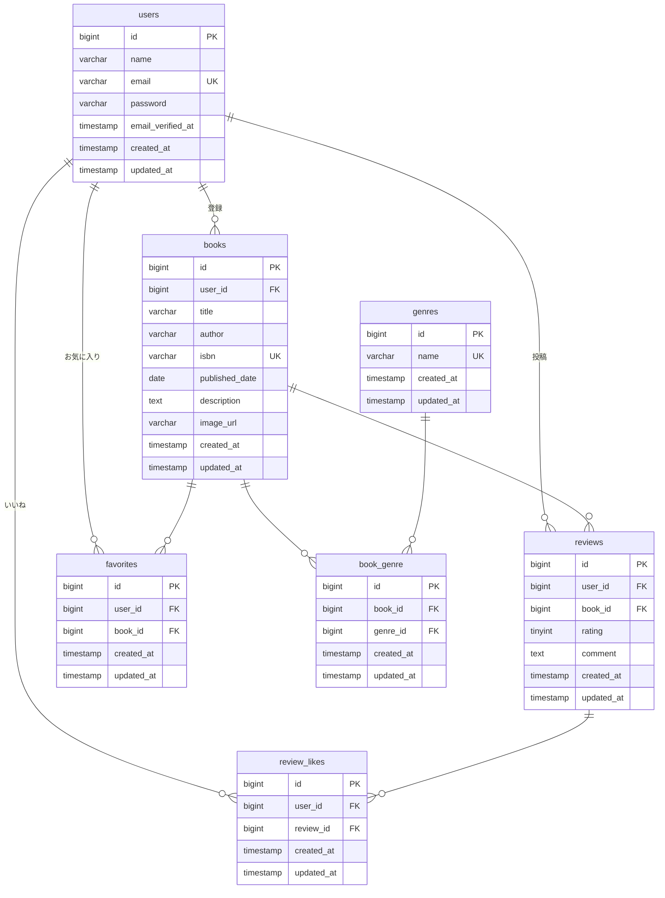

# 書籍レビューシステム (応用編) - BookShelf

このリポジトリは、書籍レビューシステムの応用機能（基本機能＋高度な検索、ISBN（Google Books API）連携、マイ読書レポート、公開API への Sanctum 認証追加）を実装したLaravelプロジェクトです。

## 動作環境

- Docker
- Docker Compose

※ Windowsの場合はWSL2の利用を推奨します。

※ Apple Silicon（M1/M2/M3）Mac をお使いの場合、`docker-compose.yml` のサービスに `platform: linux/amd64` の指定が必要になる場合があります。

## 環境構築手順

1. **リポジトリをクローン**

   ```bash
   git clone https://github.com/coachtech-material/ExampleAnswer-mockcase-BookShelf.git
   cd ExampleAnswer-mockcase-BookShelf
   git checkout advanced
   ```

2. **.envファイルの準備**

   `.env.example` をコピーして `.env` を作成します。

   ```bash
   cp .env.example .env
   ```

   `.env` ファイル内の以下のDB接続情報を確認・設定します。デフォルトではLaravel Sailの標準設定になっています。

   ```ini
   DB_CONNECTION=mysql
   DB_HOST=mysql
   DB_PORT=3306
   DB_DATABASE=bookshelf
   DB_USERNAME=sail
   DB_PASSWORD=password
   ```

3. **Google Books APIキーの設定（ISBN検索機能を利用する場合は必須）**

   書籍のISBN検索機能（応用機能）は Google Books API を呼び出します。
   APIキーは技術的には任意ですが、**未設定だと匿名共有クォータが常時枯渇しており、
   ISBN検索が「Google Books API のクォータを超過しました。」エラーで失敗します**。実質必須です。

   ### APIキー取得手順（無料・5分程度）

   前提: Google アカウント（Gmail 等）が必要。**課金は不要**。

   1. **Google Cloud Console にアクセス**
      [https://console.cloud.google.com/](https://console.cloud.google.com/) を開き Google アカウントでログイン。
      初回は利用規約に同意。

   2. **プロジェクトを作成**
      画面上部のプロジェクト選択ドロップダウン（"プロジェクトの選択"）→ 右上「新しいプロジェクト」。
      - プロジェクト名: `bookshelf-isbn` など任意
      - 組織: 「組織なし」のまま
      - 「作成」→ 作成後、上部ドロップダウンで該当プロジェクトを選択

   3. **Books API を有効化**
      左メニュー（≡）→「APIs & Services」→「ライブラリ」
      → 検索ボックスに `Books API` と入力
      → 表示された「Books API」をクリック
      → 「有効にする」ボタンをクリック

   4. **API キーを発行**
      左メニュー →「APIs & Services」→「認証情報」
      → 上部「+ 認証情報を作成」をクリック
      → ウィザード画面が開く

      **ウィザードでの選択:**
      - 「使用する API」: **Books API**（既定で選択済みのはず）
      - 「アクセスするデータの種類」: **「一般公開データ」を選択**
        - ※「ユーザーデータ」を選ぶと OAuth 同意画面の設定が必要になり手順が増えます
      - 「次へ」をクリック
      - すぐに `AIzaSy...` で始まる API キーが表示されるので、コピーアイコンでコピー
      - 「完了」をクリック

   5. **`.env` に追記**

      ```ini
      GOOGLE_BOOKS_API_KEY=AIzaSy...（コピーしたキー）
      ```

   6. **設定キャッシュをクリア**

      ※ `sail up -d` 実行後に行ってください

      ```bash
      sail artisan config:clear
      ```

   7. **動作確認**
      `http://localhost/books/create` を開き、ISBN（例: `9784101010014`）を入力して「検索」
      → 書籍情報が自動入力されれば OK

   > **採点者向け補足**: ISBN検索機能の動作確認には上記APIキーの設定が必要です。
   > 設定せずに ISBN を入力した場合、Google 側のクォータ超過により
   > 「Google Books API のクォータを超過しました。.env に GOOGLE_BOOKS_API_KEY を設定してください。」
   > が表示されますが、実装ロジック自体は正しく、`Http::fake()` を用いた Feature Test で検証済みです。
   > 採点時に手間を避けたい場合は、ISBN検索の動作確認をスキップし、テストの PASS をもって機能担保と
   > 判断していただいても構いません。

4. **Composer依存パッケージのインストール**

   プロジェクトの初回セットアップ時は、`vendor` ディレクトリが存在しないため `sail` コマンドを使用できません。
   以下のDockerコマンドを実行して、コンテナ内で `composer install` を実行します。

   ```bash
   docker run --rm \
       -u "$(id -u):$(id -g)" \
       -v "$(pwd):/var/www/html" \
       -w /var/www/html \
       laravelsail/php82-composer:latest \
       composer install --ignore-platform-reqs
   ```

5. **Laravel Sailの起動**

   以下のコマンドでDockerコンテナを起動します。

   ```bash
   ./vendor/bin/sail up -d
   ```

   > **エイリアスの設定（推奨）**
   > 
   > 毎回 `./vendor/bin/sail` と入力するのは手間なので、エイリアスを設定すると便利です。
   > 
   > ```bash
   > alias sail='[ -f sail ] && bash sail || bash vendor/bin/sail'
   > ```

6. **アプリケーションキーの生成**

   ```bash
   sail artisan key:generate
   ```

7. **データベースのマイグレーションと初期データ投入**

   以下のコマンドでテーブルを作成し、ダミーデータを投入します。

   ```bash
   sail artisan migrate:fresh --seed
   ```

8. **フロントエンドのビルド**

   ```bash
   sail npm install
   sail npm run dev
   ```

   `npm run dev` は開発中は起動したままにしてください。

9. **アプリケーションへのアクセス**

   ブラウザで [http://localhost](http://localhost) にアクセスします。

## 開発環境URL

- アプリケーション: http://localhost
- phpMyAdmin: http://localhost:8080

## 機能一覧

### 基本機能

- ユーザー認証（登録、ログイン、ログアウト）
- 書籍のCRUD（登録、一覧、詳細、更新、削除）
- 書籍レビュー投稿・編集・削除
- お気に入り登録・解除
- レビューへのいいね登録・解除
- ランキング表示（レビュー平均評価 TOP10）
- 公開API（書籍 CRUD — RESTful JSON API）

### 応用機能

- **高度な書籍検索**: キーワード、ジャンル、並び順での絞り込み
- **ISBN検索**: Google Books APIを利用して書籍情報を自動入力
- **マイ読書レポート**: ログインユーザーの読書統計を表示
- **公開API の Sanctum 認証**: 書き込み系（POST/PUT/DELETE）にトークン認証を追加

## テスト実行

```bash
sail artisan test
```

## Sanctum認証の導入（応用機能）

```bash
sail composer require laravel/sanctum
sail artisan vendor:publish --provider="Laravel\Sanctum\SanctumServiceProvider"
sail artisan migrate
```

## APIエンドポイント一覧

| メソッド | URI | 説明 |
|----------|-----|------|
| GET | /api/v1/books | 書籍一覧取得 |
| GET | /api/v1/books/{id} | 書籍詳細取得 |
| POST | /api/v1/books | 書籍登録 |
| PUT | /api/v1/books/{id} | 書籍更新 |
| DELETE | /api/v1/books/{id} | 書籍削除 |

## 使用技術

- **PHP**: 8.5
- **Laravel**: 10.x
- **MySQL**: 8.4
- **Docker / Laravel Sail**: 開発環境コンテナ化
- **Tailwind CSS**: 3.4.x（フロントエンドスタイリング）
- **Vite**: フロントエンドビルド
- **Laravel Fortify**: 認証機能
- **Laravel Sanctum**: API トークン認証（応用機能）
- **phpMyAdmin**: DB管理ツール

## ER図



## 作成者

氏名（受講生名をここに記載してください）
