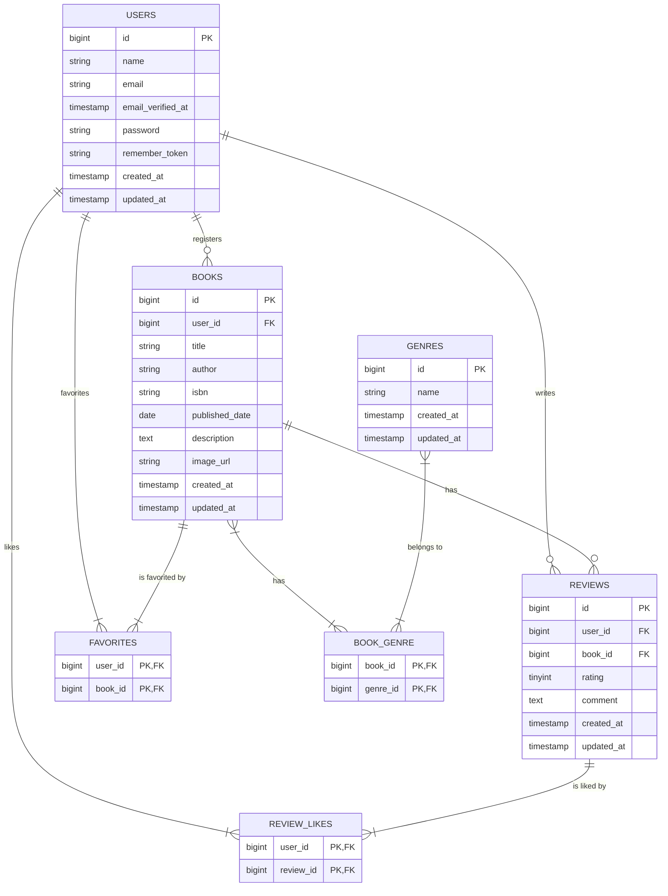

# 書籍レビューアプリ 要件定義書・基本設計書（基本機能編）

## 1. はじめに

### 1.1. 本書の目的

本書は、書籍レビューアプリケーションの「基本機能編」開発における要件と設計を定義するものである。本書を読むことで、学習者は完成形となるアプリケーションの全体像と技術的仕様を正確に把握し、手順書に従って実装を進めることができる。

### 1.2. 前提条件

- 開発言語・フレームワークは PHP / Laravel (Laravel 10.x) を使用する。
- フロントエンドのBladeテンプレートは `coachtech-material/Preparedblade-mockcase-BookShelf` リポジトリの `basic` ブランチで提供される。
- データベースは MySQL を使用する。
- 開発環境は Docker および Laravel Sail を使用する。

## 2. 環境構築手順

### 2.1. Laravelプロジェクトの作成 (Laravel 10.x)

以下のDockerコマンドを実行して、Laravel 10.xを明示的に指定してプロジェクトを作成します。

```bash
docker run --rm \
    -u "$(id -u):$(id -g)" \
    -v "$(pwd):/var/www/html" \
    -w /var/www/html \
    -e COMPOSER_CACHE_DIR=/tmp/composer_cache \
    laravelsail/php82-composer:latest \
    composer create-project laravel/laravel:^10.0 book-review-app
```

### 2.2. Laravel Sailのインストール

プロジェクト作成後、`book-review-app` ディレクトリに移動し、Laravel Sailをインストールします。

```bash
# プロジェクトディレクトリに移動
cd book-review-app

# Laravel Sailをインストール
docker run --rm \
    -u "$(id -u):$(id -g)" \
    -v "$(pwd):/var/www/html" \
    -w /var/www/html \
    -e COMPOSER_CACHE_DIR=/tmp/composer_cache \
    laravelsail/php82-composer:latest \
    composer require laravel/sail --dev

# Sailの設定ファイルをパブリッシュ（MySQLを選択）
docker run --rm \
    -u "$(id -u):$(id -g)" \
    -v "$(pwd):/var/www/html" \
    -w /var/www/html \
    -e COMPOSER_CACHE_DIR=/tmp/composer_cache \
    laravelsail/php82-composer:latest \
    php artisan sail:install --with=mysql
```

### 2.3. フロントエンドのセットアップ (Vite & Tailwind CSS)

1.  **NPM依存パッケージのインストール**
    ```bash
    sail npm install
    ```

2.  **Tailwind CSSのインストール**
    ```bash
    sail npm install -D tailwindcss@^3.4.0 postcss autoprefixer
    ```

3.  **設定ファイルの生成**
    ```bash
    sail npx tailwindcss init -p
    ```

4.  **Tailwind CSSのテンプレートパス設定**
    `tailwind.config.js` を開き、`content`プロパティを以下のように設定します。
    ```javascript
    /** @type {import(\'tailwindcss\').Config} */
    export default {
      content: [
        "./resources/**/*.blade.php",
        "./resources/**/*.js",
        "./resources/**/*.vue",
      ],
      theme: {
        extend: {},
      },
      plugins: [],
    }
    ```

5.  **CSSファイルにTailwindディレクティブを追加**
    `resources/css/app.css` の中身を以下の3行に置き換えます。
    ```css
    @tailwind base;
    @tailwind components;
    @tailwind utilities;
    ```

6.  **Vite開発サーバーの起動**
    新しいターミナルを開いて実行します。このコマンドは開発中、常に実行したままにしてください。
    ```bash
    sail npm run dev
    ```

### 2.4. .env ファイルとphpMyAdminの設定

1.  **.env ファイルの確認**
    `.env` ファイルを開き、データベース接続情報が以下と一致していることを確認します。
    ```ini
    DB_CONNECTION=mysql
    DB_HOST=mysql
    DB_PORT=3306
    DB_DATABASE=laravel
    DB_USERNAME=sail
    DB_PASSWORD=password
    ```

2.  **phpMyAdminの追加**
    `compose.yaml` を開き、`mysql` サービスの後に以下の設定を追加します。
    ```yaml
        phpmyadmin:
            image: \'phpmyadmin:latest\'
            ports:
                - \'${FORWARD_PHPMYADMIN_PORT:-8080}:80\'
            environment:
                PMA_HOST: mysql
                PMA_USER: \'${DB_USERNAME}\
                PMA_PASSWORD: \'${DB_PASSWORD}\
            networks:
                - sail
            depends_on:
                - mysql
    ```

### 2.5. Sailの起動とエイリアス設定

1.  **Sailの起動**
    ```bash
    ./vendor/bin/sail up -d
    ```

2.  **エイリアス設定**
    ```bash
    echo "alias sail=\'[ -f sail ] && bash sail || bash vendor/bin/sail\'" >> ~/.zshrc
    # または bash の場合
    # echo "alias sail=\'[ -f sail ] && bash sail || bash vendor/bin/sail\'" >> ~/.bashrc
    
    # シェルを再起動
    exec $SHELL
    ```

3.  **アプリケーションキーの生成**
    ```bash
    sail artisan key:generate
    ```


## 3. 機能要件

| 大機能 | 中機能 | 機能概要 |
|---|---|---|
| **認証** | 会員登録 | メールアドレス、パスワード、名前でユーザー登録できる。 |
| | ログイン | メールアドレスとパスワードでログインできる。 |
| | ログアウト | ログイン状態からログアウトできる。 |
| **書籍管理** | 書籍一覧表示 | 登録されている書籍を10件ずつのページネーションで一覧表示する。 |
| | 書籍詳細表示 | 特定の書籍の詳細情報と、その書籍に紐付くレビューの一覧を表示する。 |
| | 書籍登録 | 書籍のタイトル、著者、ISBN、出版日、概要、画像URL、ジャンルを登録できる。 |
| | 書籍編集 | 自分が登録した書籍の情報を編集できる。 |
| | 書籍削除 | 自分が登録した書籍を削除できる。 |
| **レビュー管理** | レビュー投稿 | 書籍詳細ページから、5段階評価とコメントでレビューを投稿できる。 |
| | レビュー編集 | 自分が投稿したレビューを編集できる。 |
| | レビュー削除 | 自分が投稿したレビューを削除できる。 |
| **お気に入り機能** | お気に入り登録/解除 | 書籍をお気に入りに登録、またはお気に入りから解除できる。 |
| | お気に入り一覧 | 自分がお気に入りに登録した書籍を一覧表示できる。 |
| **いいね機能** | いいね登録/解除 | 他のユーザーのレビューに「いいね」を登録、または解除できる。 |
| **ジャンル管理** | ジャンル一覧表示 | 登録されているジャンルを、紐付く書籍数と共に一覧表示する。 |
| | ジャンル別書籍一覧 | 特定のジャンルに紐付く書籍を一覧表示する。 |
| | ジャンル登録 | 新しいジャンル名を登録できる。 |
| | ジャンル編集 | 既存のジャンル名を編集できる。 |
| | ジャンル削除 | 紐付く書籍がない場合に限り、ジャンルを削除できる。 |
| **ランキング機能** | ランキング表示 | レビューの平均評価が高い順に書籍トップ10をランキング形式で表示する。 |

## 4. 非機能要件

| 項目 | 要件 |
|---|---|
| **コーディングスタイル** | - PHPのコーディング規約はPSR-12に準拠する。<br>- メソッドの引数・戻り値に**型宣言は原則として使用しない**。<br>- モデルのリレーションメソッドにも**戻り値型は指定しない**。 |
| **パフォーマンス** | - N+1問題が発生しないよう、`with()` を使用して適切なEager Loadingを実装する。<br>- 書籍一覧やレビュー一覧など、一覧表示機能には必ずページネーションを実装する（10件/ページ）。 |
| **セキュリティ** | - 認証が必要なルートには `auth` ミドルウェアを適用する。<br>- 編集・削除機能は、`Policy` を使用して本人しか操作できないように制御する。<br>- SQLインジェクション対策として、Eloquent ORMを使用し、`DB::raw()` の安易な使用を避ける。<br>- CSRF対策として、POST/PUT/DELETEリクエストにはCSRFトークンを必須とする。 |

## 5. 基本設計

### 5.1. データベース設計 (ER図)



### 5.2. ルーティング設計

`routes/web.php`

| HTTPメソッド | URI | ルート名 | コントローラ@メソッド | ミドルウェア |
|---|---|---|---|---|
| GET | / | - | BookController@index | `auth` |
| GET | /dashboard | dashboard | (Closure) | `auth`, `verified` |
| GET | /profile | profile.edit | ProfileController@edit | `auth` |
| PATCH | /profile | profile.update | ProfileController@update | `auth` |
| DELETE | /profile | profile.destroy | ProfileController@destroy | `auth` |
| GET | /books | books.index | BookController@index | `auth` |
| GET | /books/create | books.create | BookController@create | `auth` |
| POST | /books | books.store | BookController@store | `auth` |
| GET | /books/{book} | books.show | BookController@show | `auth` |
| GET | /books/{book}/edit | books.edit | BookController@edit | `auth` |
| PUT | /books/{book} | books.update | BookController@update | `auth` |
| DELETE | /books/{book} | books.destroy | BookController@destroy | `auth` |
| POST | /books/{book}/reviews | reviews.store | ReviewController@store | `auth` |
| GET | /reviews/{review}/edit | reviews.edit | ReviewController@edit | `auth` |
| PUT | /reviews/{review} | reviews.update | ReviewController@update | `auth` |
| DELETE | /reviews/{review} | reviews.destroy | ReviewController@destroy | `auth` |
| GET | /favorites | favorites.index | FavoriteController@index | `auth` |
| POST | /favorites/{book}/toggle | favorites.toggle | FavoriteController@toggle | `auth` |
| POST | /reviews/{review}/like | reviews.like | ReviewLikeController@toggle | `auth` |
| GET | /genres | genres.index | GenreController@index | `auth` |
| GET | /genres/create | genres.create | GenreController@create | `auth` |
| POST | /genres | genres.store | GenreController@store | `auth` |
| GET | /genres/{genre} | genres.show | GenreController@show | `auth` |
| GET | /genres/{genre}/edit | genres.edit | GenreController@edit | `auth` |
| PUT | /genres/{genre} | genres.update | GenreController@update | `auth` |
| DELETE | /genres/{genre} | genres.destroy | GenreController@destroy | `auth` |
| GET | /ranking | ranking.index | RankingController@index | `auth` |

### 5.3. コントローラ設計

| コントローラ | メソッド | 処理概要 |
|---|---|---|
| **BookController** | `index` | `Book::with("genres")->latest()->paginate(10)` で書籍一覧を取得し、`books.index` ビューを返す。 |
| | `create` | `Genre::all()` で全ジャンルを取得し、`books.create` ビューを返す。 |
| | `store` | `StoreBookRequest` でバリデーション後、書籍を登録し、ジャンルを紐付ける (`attach`)。`books.show` へリダイレクト。 |
| | `show` | `load(["reviews.user", "reviews.likedByUsers", "genres"])` で関連情報をEager Loadし、`books.show` ビューを返す。 |
| | `edit` | `BookPolicy` で認可後、`Genre::all()` と共に `books.edit` ビューを返す。 |
| | `update` | `UpdateBookRequest` でバリデーションと認可後、書籍情報を更新し、ジャンルを再同期 (`sync`)。`books.show` へリダイレクト。 |
| | `destroy` | `BookPolicy` で認可後、書籍を削除。`books.index` へリダイレクト。 |
| **ReviewController** | `store` | `StoreReviewRequest` でバリデーション後、レビューを登録。`books.show` へリダイレクト。 |
| | `edit` | `ReviewPolicy` で認可後、`reviews.edit` ビューを返す。 |
| | `update` | `UpdateReviewRequest` でバリデーションと認可後、レビューを更新。`books.show` へリダイレクト。 |
| | `destroy` | `ReviewPolicy` で認可後、レビューを削除。`books.show` へリダイレクト。 |
| **FavoriteController** | `index` | `Auth::user()->favoriteBooks()->paginate(10)` でお気に入り書籍一覧を取得し、`favorites.index` ビューを返す。 |
| | `toggle` | ユーザーのお気に入り状態を判定し、登録 (`attach`) または解除 (`detach`) を切り替える。元のページへリダイレクト。 |
| **ReviewLikeController** | `toggle` | ユーザーのいいね状態を判定し、登録 (`attach`) または解除 (`detach`) を切り替える。元のページへリダイレクト。 |
| **GenreController** | `index` | `Genre::withCount(\'books\')` で書籍数を取得し、`genres.index` ビューを返す。 |
| | `create` | `genres.create` ビューを返す。 |
| | `store` | `StoreGenreRequest` でバリデーション後、ジャンルを登録。`genres.index` へリダイレクト。 |
| | `show` | `genre->books()->with(\'genres\')->paginate(10)` でジャンル別書籍一覧を取得し、`genres.show` ビューを返す。 |
| | `edit` | `genres.edit` ビューを返す。 |
| | `update` | `UpdateGenreRequest` でバリデーション後、ジャンルを更新。`genres.index` へリダイレクト。 |
| | `destroy` | 紐付く書籍がなければ (`books()->count() == 0`) 削除。`genres.index` へリダイレクト。 |
| **RankingController** | `index` | `DB::raw()` を使用してレビューの平均評価と件数を算出し、平均評価順でトップ10を取得。`ranking.index` ビューを返す。 |

### 5.4. バリデーション設計 (FormRequest)

| FormRequest | 項目 | ルール |
|---|---|---|
| **StoreBookRequest** | `title` | `required`, `string`, `max:255` |
| | `author` | `required`, `string`, `max:255` |
| | `isbn` | `required`, `string`, `size:13`, `unique:books,isbn` |
| | `published_date` | `required`, `date` |
| | `description` | `nullable`, `string` |
| | `image_url` | `nullable`, `url` |
| | `genres` | `required`, `array` |
| | `genres.*` | `exists:genres,id` |
| **UpdateBookRequest** | `isbn` | `required`, `string`, `size:13`, `Rule::unique(\'books\')->ignore($this->book)` |
| | (他はStoreと同様) | - |
| **StoreReviewRequest** | `rating` | `required`, `integer`, `min:1`, `max:5` |
| | `comment` | `nullable`, `string`, `max:1000` |
| **UpdateReviewRequest** | (Storeと同様) | - |
| **StoreGenreRequest** | `name` | `required`, `string`, `max:255`, `unique:genres,name` |
| **UpdateGenreRequest** | `name` | `required`, `string`, `max:255`, `Rule::unique(\'genres\')->ignore($this->genre)` |

### 5.5. 認可設計 (Policy)

| Policy | メソッド | 認可ロジック | 説明 |
|---|---|---|---|
| **BookPolicy** | `update` | `return $user->id === $book->user_id;` | ログインユーザーIDと書籍を登録したユーザーIDが一致する場合のみ許可。 |
| | `delete` | `return $user->id === $book->user_id;` | ログインユーザーIDと書籍を登録したユーザーIDが一致する場合のみ許可。 |
| **ReviewPolicy** | `update` | `return $user->id === $review->user_id;` | ログインユーザーIDとレビューを投稿したユーザーIDが一致する場合のみ許可。 |
| | `delete` | `return $user->id === $review->user_id;` | ログインユーザーIDとレビューを投稿したユーザーIDが一致する場合のみ許可。 |


### 4.5. テスト要件

| 項目 | 要件 |
|---|---|
| **テストの種類** | - **Featureテスト**: 主要な機能（HTTPリクエストを通じた一連の動作）が正しく動作することを確認する。<br>- **Unitテスト**: 必要に応じて、複雑なロジックを持つクラスやメソッドを単体でテストする。 |
| **テスト対象** | - 認証（ログイン、ログアウト）<br>- 書籍CRUD<br>- レビューCRUD<br>- バリデーション（FormRequest）<br>- 認可（Policy） |
| **テストの実行** | `sail artisan test` コマンドで全てのテストが成功すること。 |
| **テストカバレッジ** | コードカバレッジが **60%** 以上であることを目標とする。`sail artisan test --coverage` で確認できる。 |
