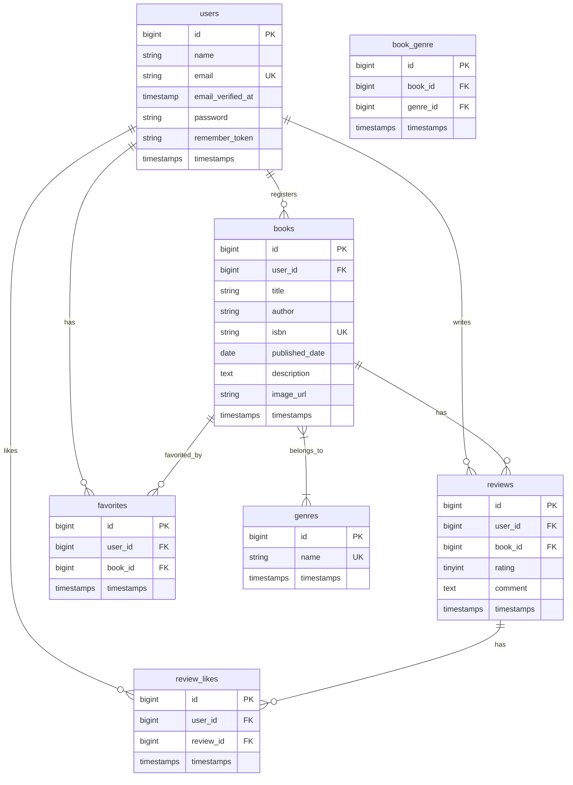

# 書籍レビュー管理システム (BookShelf) - 応用機能編（宣言的記述版）

---

## はじめに

このドキュメントは、プログラミング初学者が300時間程度の学習を終えた段階で、実務に近い開発プロセスを体験し、教材で学んだ知識を総合的にアウトプットすることを目指す模擬案件の要件定義書および実装手順書です。

**応用機能編（宣言的記述版）:** この教材では、書籍レビューシステムのすべての機能（基本機能＋応用機能）を、最初から**宣言的記述**や**型宣言**といった品質の高いコーディングスタイルで実装します。実務で求められるレベルのコードをゼロから構築することを目指します。

**重要:** この教材は「ゼロからプロジェクトを作成する」前提で構成されています。すべてのファイルは手順に従って作成していきます。

---

# Part 1: 要件定義書

## 1. システム概要書

### 1.1. プロジェクト概要

- **プロジェクト名:** 書籍レビュー管理システム (BookShelf)
- **目的:** ユーザーがお気に入りの書籍を登録し、レビューを投稿・閲覧できるWebアプリケーションを開発する。本プロジェクトを通じて、Laravelを用いたWebアプリケーション開発の一連のフロー（設計、実装、テスト）を体系的に学習し、実践的なスキルを習得する。
- **背景:** 約300時間の教材学習内容を網羅し、学習者の理解度と応用力を測るための総合演習として位置づける。実務に近い要件と応用的な課題（外部API連携、非同期処理など）を含めることで、ポートフォリオとしても価値のある成果物を作成する。

### 1.2. 技術スタック

| カテゴリ | 技術 | バージョン |
|---|---|---|
| サーバーサイド | PHP | 8.2 |
| フレームワーク | Laravel | 10.x |
| データベース | MySQL | 8.0 |
| Webサーバー | Nginx | stable |
| パッケージ管理 | Composer | 最新版 |
| 開発環境 | Docker / Docker Compose | 最新版 |
| フロントエンド | Blade, Tailwind CSS, Alpine.js | Laravel標準 |
| テスト | PHPUnit | Laravel標準 |

### 1.3. 主要機能一覧

- **ユーザー管理:** 会員登録、ログイン、ログアウト
- **ジャンル管理:** マスタデータとしてのジャンルCRUD
- **書籍管理:** CRUD（ジャンル紐付け含む）
- **レビュー管理:** CRUD
- **検索機能:** 書籍のタイトル・著者名検索
- **【応用】外部API連携:** Google Books APIによる書籍情報自動取得
- **【応用】お気に入り機能:** Ajaxによる非同期お気に入り登録・解除
- **【応用】いいね機能:** Ajaxによるレビューへの「参考になった」投票
- **【応用】ランキング機能:** 平均評価点に基づく書籍ランキング
- **【応用】CSVエクスポート:** 検索条件を維持したCSVダウンロード
- **【応用】公開用API:** RESTful APIの実装
- **【応用】テスト:** 機能テスト、単体テスト、ポリシーテスト

### 1.4. 想定開発期間

- **基本機能:** 約2週間（40時間）
- **応用機能:** 約1週間（20時間）
- **テスト・リファクタリング:** 約1週間（20時間）

---

## 2. 機能要件

### 2.1. ユーザー管理

| 機能ID | 機能名 | 説明 |
|---|---|---|
| U-01 | 会員登録 | 名前、メールアドレス、パスワードで新規登録 |
| U-02 | ログイン | メールアドレスとパスワードで認証 |
| U-03 | ログアウト | セッションを破棄してログアウト |

### 2.2. ジャンル管理

| 機能ID | 機能名 | 説明 |
|---|---|---|
| G-01 | ジャンル一覧 | 登録済みジャンルの一覧表示 |
| G-02 | ジャンル登録 | 新規ジャンルの登録（管理者向け） |
| G-03 | ジャンル編集 | 既存ジャンルの編集 |
| G-04 | ジャンル削除 | ジャンルの削除 |
| G-05 | ジャンル別書籍一覧 | 特定ジャンルに属する書籍の一覧表示 |

### 2.3. 書籍管理

| 機能ID | 機能名 | 説明 |
|---|---|---|
| B-01 | 書籍一覧 | 登録済み書籍の一覧表示（ページネーション付き） |
| B-02 | 書籍詳細 | 書籍の詳細情報とレビュー一覧の表示 |
| B-03 | 書籍登録 | 新規書籍の登録（ジャンル選択含む） |
| B-04 | 書籍編集 | 既存書籍情報の編集（登録者のみ） |
| B-05 | 書籍削除 | 書籍の削除（登録者のみ） |
| B-06 | 書籍検索 | タイトル・著者名による検索 |
| B-07 | ISBN自動取得 | Google Books APIによる書籍情報の自動入力 |
| B-08 | CSVエクスポート | 書籍一覧のCSVダウンロード |

### 2.4. レビュー管理

| 機能ID | 機能名 | 説明 |
|---|---|---|
| R-01 | レビュー投稿 | 書籍に対するレビュー（評価1〜5、コメント）の投稿 |
| R-02 | レビュー編集 | 自分のレビューの編集 |
| R-03 | レビュー削除 | 自分のレビューの削除 |
| R-04 | いいね | レビューへの「参考になった」投票 |

### 2.5. お気に入り機能

| 機能ID | 機能名 | 説明 |
|---|---|---|
| F-01 | お気に入り登録 | 書籍をお気に入りに追加 |
| F-02 | お気に入り解除 | お気に入りから削除 |
| F-03 | お気に入り一覧 | 自分のお気に入り書籍一覧 |

### 2.6. ランキング機能

| 機能ID | 機能名 | 説明 |
|---|---|---|
| RK-01 | 評価ランキング | 平均評価点の高い書籍TOP10を表示 |

---

## 3. 画面設計

### 3.1. 画面一覧

| 画面ID | 画面名 | URL | 認証 |
|---|---|---|---|
| SC-01 | トップページ（書籍一覧） | / | 不要 |
| SC-02 | 書籍詳細 | /books/{id} | 不要 |
| SC-03 | 書籍登録 | /books/create | 必要 |
| SC-04 | 書籍編集 | /books/{id}/edit | 必要 |
| SC-05 | 書籍検索結果 | /books/search | 不要 |
| SC-06 | ジャンル一覧 | /genres | 必要 |
| SC-07 | ジャンル登録 | /genres/create | 必要 |
| SC-08 | ジャンル編集 | /genres/{id}/edit | 必要 |
| SC-09 | ジャンル別書籍一覧 | /genres/{id} | 不要 |
| SC-10 | お気に入り一覧 | /favorites | 必要 |
| SC-11 | ランキング | /ranking | 不要 |
| SC-12 | 会員登録 | /register | 不要 |
| SC-13 | ログイン | /login | 不要 |

---

## 4. データベース設計

### 4.1. ER図



### 4.2. テーブル定義

#### users テーブル

| カラム名 | 型 | 制約 | 説明 |
|---|---|---|---|
| id | bigint | PK, AUTO_INCREMENT | ユーザーID |
| name | varchar(255) | NOT NULL | ユーザー名 |
| email | varchar(255) | NOT NULL, UNIQUE | メールアドレス |
| email_verified_at | timestamp | NULLABLE | メール認証日時 |
| password | varchar(255) | NOT NULL | パスワード（ハッシュ化） |
| remember_token | varchar(100) | NULLABLE | ログイン保持トークン |
| created_at | timestamp | NULLABLE | 作成日時 |
| updated_at | timestamp | NULLABLE | 更新日時 |

#### books テーブル

| カラム名 | 型 | 制約 | 説明 |
|---|---|---|---|
| id | bigint | PK, AUTO_INCREMENT | 書籍ID |
| user_id | bigint | FK (users.id), NOT NULL | 登録者ID |
| title | varchar(255) | NOT NULL | タイトル |
| author | varchar(255) | NOT NULL | 著者 |
| isbn | varchar(13) | UNIQUE, NULLABLE | ISBN |
| published_date | date | NULLABLE | 出版日 |
| description | text | NULLABLE | 説明 |
| image_url | varchar(255) | NULLABLE | 画像URL |
| created_at | timestamp | NULLABLE | 作成日時 |
| updated_at | timestamp | NULLABLE | 更新日時 |

#### genres テーブル

| カラム名 | 型 | 制約 | 説明 |
|---|---|---|---|
| id | bigint | PK, AUTO_INCREMENT | ジャンルID |
| name | varchar(255) | NOT NULL, UNIQUE | ジャンル名 |
| created_at | timestamp | NULLABLE | 作成日時 |
| updated_at | timestamp | NULLABLE | 更新日時 |

#### book_genre テーブル（中間テーブル）

| カラム名 | 型 | 制約 | 説明 |
|---|---|---|---|
| id | bigint | PK, AUTO_INCREMENT | ID |
| book_id | bigint | FK (books.id), NOT NULL | 書籍ID |
| genre_id | bigint | FK (genres.id), NOT NULL | ジャンルID |
| created_at | timestamp | NULLABLE | 作成日時 |
| updated_at | timestamp | NULLABLE | 更新日時 |

#### reviews テーブル

| カラム名 | 型 | 制約 | 説明 |
|---|---|---|---|
| id | bigint | PK, AUTO_INCREMENT | レビューID |
| user_id | bigint | FK (users.id), NOT NULL | 投稿者ID |
| book_id | bigint | FK (books.id), NOT NULL | 書籍ID |
| rating | tinyint | NOT NULL, CHECK (1-5) | 評価（1〜5） |
| comment | text | NULLABLE | コメント |
| created_at | timestamp | NULLABLE | 作成日時 |
| updated_at | timestamp | NULLABLE | 更新日時 |

#### favorites テーブル

| カラム名 | 型 | 制約 | 説明 |
|---|---|---|---|
| id | bigint | PK, AUTO_INCREMENT | ID |
| user_id | bigint | FK (users.id), NOT NULL | ユーザーID |
| book_id | bigint | FK (books.id), NOT NULL | 書籍ID |
| created_at | timestamp | NULLABLE | 作成日時 |
| updated_at | timestamp | NULLABLE | 更新日時 |

#### review_likes テーブル

| カラム名 | 型 | 制約 | 説明 |
|---|---|---|---|
| id | bigint | PK, AUTO_INCREMENT | ID |
| user_id | bigint | FK (users.id), NOT NULL | ユーザーID |
| review_id | bigint | FK (reviews.id), NOT NULL | レビューID |
| created_at | timestamp | NULLABLE | 作成日時 |
| updated_at | timestamp | NULLABLE | 更新日時 |

---

# Part 2: 実装手順書

## Step 1: 環境構築とプロジェクト作成

### 1.1. Laravelプロジェクトの作成

Dockerを使用してLaravelプロジェクトを作成します。

```bash
docker run --rm \
    -u "$(id -u):$(id -g)" \
    -v "$(pwd):/var/www/html" \
    -w /var/www/html \
    -e COMPOSER_CACHE_DIR=/tmp/composer_cache \
    laravelsail/php82-composer:latest \
    composer create-project laravel/laravel:^10.0 bookshelf
```

作成されたディレクトリに移動します。

```bash
cd bookshelf
```

### 1.2. Laravel Sailのインストール

Laravel Sailをインストールします。

```bash
docker run --rm \
    -u "$(id -u):$(id -g)" \
    -v "$(pwd):/var/www/html" \
    -w /var/www/html \
    -e COMPOSER_CACHE_DIR=/tmp/composer_cache \
    laravelsail/php82-composer:latest \
    composer require laravel/sail --dev
```

Sailの設定ファイルを生成します。

```bash
docker run --rm \
    -u "$(id -u):$(id -g)" \
    -v "$(pwd):/var/www/html" \
    -w /var/www/html \
    -e COMPOSER_CACHE_DIR=/tmp/composer_cache \
    laravelsail/php82-composer:latest \
    php artisan sail:install --with=mysql
```

### 1.3. Docker環境の起動

```bash
./vendor/bin/sail up -d
```

以降、`sail` コマンドを使用するため、エイリアスを設定します。

```bash
alias sail='./vendor/bin/sail'
```

### 1.4. 動作確認

ブラウザで `http://localhost` にアクセスし、Laravelのウェルカムページが表示されることを確認します。

### 1.5. 追加パッケージのインストール

```bash
# Laravel Breeze（認証機能）
sail composer require laravel/breeze --dev
sail artisan breeze:install blade

# フロントエンドのビルド
sail npm install
sail npm run build
```

### 1.6. 環境設定

`.env` ファイルを編集し、アプリケーション名とタイムゾーンを設定します。

```dotenv
APP_NAME=BookShelf
APP_TIMEZONE=Asia/Tokyo
```

`config/app.php` のタイムゾーンとロケールも確認・修正します。

```php
'timezone' => env('APP_TIMEZONE', 'UTC'),
'locale' => 'ja',
```

### 1.7. ログイン後のリダイレクト先設定

`app/Providers/RouteServiceProvider.php` を編集し、ログイン後のリダイレクト先をトップページに変更します。

```php
public const HOME = '/';
```

---

## Step 2: データベース設計とマイグレーション

### 2.1. マイグレーションファイルの作成

以下のコマンドで各テーブルのマイグレーションファイルを作成します。

> **重要: マイグレーションの実行順序について**
>
> Laravelのマイグレーションは、ファイル名のタイムスタンプ順に実行されます。外部キー制約（Foreign Key）を持つテーブルは、参照先のテーブルが先に作成されていないとエラーになります。
>
> 例えば、`book_genre` テーブルは `books` テーブルを参照するため、`books` テーブルが先に作成されている必要があります。タイムスタンプが同じ場合はアルファベット順で実行されるため、`book_genre` が `books` より先に実行されてエラーになります。

**正しい実行順序:**

| 順番 | テーブル | 参照先 | 説明 |
|------|----------|---------|------|
| 1 | genres | なし | 独立テーブル |
| 2 | books | users | ユーザーが書籍を登録 |
| 3 | book_genre | books, genres | 書籍とジャンルの中間テーブル |
| 4 | reviews | users, books | ユーザーが書籍にレビューを投稿 |
| 5 | favorites | users, books | ユーザーのお気に入り書籍 |
| 6 | review_likes | users, reviews | レビューへのいいね |

以下のコマンドを実行してマイグレーションファイルを作成します。`sleep 1` によりタイムスタンプが確実に異なるようにしています。

```bash
sail artisan make:migration create_genres_table && sleep 1 && \
sail artisan make:migration create_books_table && sleep 1 && \
sail artisan make:migration create_book_genre_table && sleep 1 && \
sail artisan make:migration create_reviews_table && sleep 1 && \
sail artisan make:migration create_favorites_table && sleep 1 && \
sail artisan make:migration create_review_likes_table
```

#### マイグレーションの実行順序の確認

マイグレーションファイルを作成したら、実行順序を確認します。

```bash
ls -la database/migrations/
```

タイムスタンプが正しい順序になっていることを確認してください。

**エラーが発生した場合の修正手順:**

もしタイムスタンプが同じになってしまった場合は、ファイル名をリネームして順序を修正します。

```bash
# 例: booksとbook_genreが同じタイムスタンプの場合
# booksをbook_genreより前のタイムスタンプに変更
mv database/migrations/2026_01_01_054615_create_books_table.php \
   database/migrations/2026_01_01_054614_create_books_table.php

# データベースをリセットして再実行
sail artisan migrate:fresh
```

### 2.2. マイグレーションファイルの実装

#### `database/migrations/xxxx_xx_xx_create_genres_table.php`

```php
<?php

use Illuminate\Database\Migrations\Migration;
use Illuminate\Database\Schema\Blueprint;
use Illuminate\Support\Facades\Schema;

return new class extends Migration
{
    public function up(): void
    {
        Schema::create('genres', function (Blueprint $table): void {
            $table->id();
            $table->string('name')->unique();
            $table->timestamps();
        });
    }

    public function down(): void
    {
        Schema::dropIfExists('genres');
    }
};
```

#### `database/migrations/xxxx_xx_xx_create_books_table.php`

```php
<?php

use Illuminate\Database\Migrations\Migration;
use Illuminate\Database\Schema\Blueprint;
use Illuminate\Support\Facades\Schema;

return new class extends Migration
{
    public function up(): void
    {
        Schema::create('books', function (Blueprint $table): void {
            $table->id();
            $table->foreignId('user_id')->constrained()->cascadeOnDelete();
            $table->string('title');
            $table->string('author');
            $table->string('isbn', 13)->nullable()->unique();
            $table->date('published_date')->nullable();
            $table->text('description')->nullable();
            $table->string('image_url')->nullable();
            $table->timestamps();
        });
    }

    public function down(): void
    {
        Schema::dropIfExists('books');
    }
};
```

#### `database/migrations/xxxx_xx_xx_create_book_genre_table.php`

```php
<?php

use Illuminate\Database\Migrations\Migration;
use Illuminate\Database\Schema\Blueprint;
use Illuminate\Support\Facades\Schema;

return new class extends Migration
{
    public function up(): void
    {
        Schema::create('book_genre', function (Blueprint $table): void {
            $table->id();
            $table->foreignId('book_id')->constrained()->cascadeOnDelete();
            $table->foreignId('genre_id')->constrained()->cascadeOnDelete();
            $table->timestamps();

            $table->unique(['book_id', 'genre_id']);
        });
    }

    public function down(): void
    {
        Schema::dropIfExists('book_genre');
    }
};
```

#### `database/migrations/xxxx_xx_xx_create_reviews_table.php`

```php
<?php

use Illuminate\Database\Migrations\Migration;
use Illuminate\Database\Schema\Blueprint;
use Illuminate\Support\Facades\Schema;

return new class extends Migration
{
    public function up(): void
    {
        Schema::create('reviews', function (Blueprint $table): void {
            $table->id();
            $table->foreignId('user_id')->constrained()->cascadeOnDelete();
            $table->foreignId('book_id')->constrained()->cascadeOnDelete();
            $table->tinyInteger('rating');
            $table->text('comment')->nullable();
            $table->timestamps();

            $table->unique(['user_id', 'book_id']);
        });
    }

    public function down(): void
    {
        Schema::dropIfExists('reviews');
    }
};
```

#### `database/migrations/xxxx_xx_xx_create_favorites_table.php`

```php
<?php

use Illuminate\Database\Migrations\Migration;
use Illuminate\Database\Schema\Blueprint;
use Illuminate\Support\Facades\Schema;

return new class extends Migration
{
    public function up(): void
    {
        Schema::create('favorites', function (Blueprint $table): void {
            $table->id();
            $table->foreignId('user_id')->constrained()->cascadeOnDelete();
            $table->foreignId('book_id')->constrained()->cascadeOnDelete();
            $table->timestamps();

            $table->unique(['user_id', 'book_id']);
        });
    }

    public function down(): void
    {
        Schema::dropIfExists('favorites');
    }
};
```

#### `database/migrations/xxxx_xx_xx_create_review_likes_table.php`

```php
<?php

use Illuminate\Database\Migrations\Migration;
use Illuminate\Database\Schema\Blueprint;
use Illuminate\Support\Facades\Schema;

return new class extends Migration
{
    public function up(): void
    {
        Schema::create('review_likes', function (Blueprint $table): void {
            $table->id();
            $table->foreignId('user_id')->constrained()->cascadeOnDelete();
            $table->foreignId('review_id')->constrained()->cascadeOnDelete();
            $table->timestamps();

            $table->unique(['user_id', 'review_id']);
        });
    }

    public function down(): void
    {
        Schema::dropIfExists('review_likes');
    }
};
```

### 2.3. マイグレーションの実行

```bash
sail artisan migrate
```

---

## Step 3: モデルとリレーションシップ

### 3.1. モデルの作成

```bash
sail artisan make:model Genre
sail artisan make:model Book
sail artisan make:model Review
sail artisan make:model Favorite
sail artisan make:model ReviewLike
```

### 3.2. モデルの実装

#### `app/Models/User.php`

```php
<?php

namespace App\Models;

use Illuminate\Database\Eloquent\Factories\HasFactory;
use Illuminate\Database\Eloquent\Relations\BelongsToMany;
use Illuminate\Database\Eloquent\Relations\HasMany;
use Illuminate\Foundation\Auth\User as Authenticatable;
use Illuminate\Notifications\Notifiable;
use Laravel\Sanctum\HasApiTokens;

class User extends Authenticatable
{
    use HasApiTokens, HasFactory, Notifiable;

    protected $fillable = [
        'name',
        'email',
        'password',
    ];

    protected $hidden = [
        'password',
        'remember_token',
    ];

        /**
     * Get the attributes that should be cast.
     *
     * @return array<string, string>
     */
    protected function casts(): array
    {
        return [
            'email_verified_at' => 'datetime',
            'password' => 'hashed',
        ];
    }

    public function books(): HasMany
    {
        return $this->hasMany(Book::class);
    }

    public function reviews(): HasMany
    {
        return $this->hasMany(Review::class);
    }

    public function favoriteBooks(): BelongsToMany
    {
        return $this->belongsToMany(Book::class, 'favorites')->withTimestamps();
    }

    public function likedReviews(): BelongsToMany
    {
        return $this->belongsToMany(Review::class, 'review_likes')->withTimestamps();
    }
}
```

#### `app/Models/Genre.php`

```php
<?php

namespace App\Models;

use Illuminate\Database\Eloquent\Factories\HasFactory;
use Illuminate\Database\Eloquent\Model;
use Illuminate\Database\Eloquent\Relations\BelongsToMany;

class Genre extends Model
{
    use HasFactory;

    protected $fillable = [
        'name',
    ];

    public function books(): BelongsToMany
    {
        return $this->belongsToMany(Book::class)->withTimestamps();
    }
}
```

#### `app/Models/Book.php`

```php
<?php

namespace App\Models;

use Illuminate\Database\Eloquent\Factories\HasFactory;
use Illuminate\Database\Eloquent\Model;
use Illuminate\Database\Eloquent\Relations\BelongsTo;
use Illuminate\Database\Eloquent\Relations\BelongsToMany;
use Illuminate\Database\Eloquent\Relations\HasMany;

class Book extends Model
{
    use HasFactory;

    /**
     * The attributes that are mass assignable.
     *
     * @var array<int, string>
     */
    protected $fillable = [
        'user_id',
        'title',
        'author',
        'isbn',
        'published_date',
        'description',
        'image_url',
    ];

    /**
     * Get the attributes that should be cast.
     *
     * @return array<string, string>
     */
    protected function casts(): array
    {
        return [
            'published_date' => 'date',
        ];
    }

    /**
     * 書籍を登録したユーザー
     */
    public function user(): BelongsTo
    {
        return $this->belongsTo(User::class);
    }

    /**
     * 書籍に対するレビュー
     */
    public function reviews(): HasMany
    {
        return $this->hasMany(Review::class);
    }

    /**
     * 書籍のジャンル
     */
    public function genres(): BelongsToMany
    {
        return $this->belongsToMany(Genre::class)->withTimestamps();
    }

    /**
     * 書籍をお気に入りに登録したユーザー
     */
    public function favoritedByUsers(): BelongsToMany
    {
        return $this->belongsToMany(User::class, 'favorites')->withTimestamps();
    }
}
```

#### `app/Models/Review.php`

```php
<?php

namespace App\Models;

use Illuminate\Database\Eloquent\Factories\HasFactory;
use Illuminate\Database\Eloquent\Model;
use Illuminate\Database\Eloquent\Relations\BelongsTo;
use Illuminate\Database\Eloquent\Relations\BelongsToMany;

class Review extends Model
{
    use HasFactory;

    /**
     * The attributes that are mass assignable.
     *
     * @var array<int, string>
     */
    protected $fillable = [
        'user_id',
        'book_id',
        'rating',
        'comment',
    ];

    /**
     * レビューを投稿したユーザー
     */
    public function user(): BelongsTo
    {
        return $this->belongsTo(User::class);
    }

    /**
     * レビュー対象の書籍
     */
    public function book(): BelongsTo
    {
        return $this->belongsTo(Book::class);
    }

    /**
     * レビューにいいねしたユーザー
     */
    public function likedByUsers(): BelongsToMany
    {
        return $this->belongsToMany(User::class, 'review_likes')->withTimestamps();
    }
}
```

#### `app/Models/Favorite.php`

```php
<?php

namespace App\Models;

use Illuminate\Database\Eloquent\Model;
use Illuminate\Database\Eloquent\Relations\BelongsTo;

class Favorite extends Model
{
    /**
     * The attributes that are mass assignable.
     *
     * @var array<int, string>
     */
    protected $fillable = [
        'user_id',
        'book_id',
    ];

    /**
     * お気に入りを登録したユーザー
     */
    public function user(): BelongsTo
    {
        return $this->belongsTo(User::class);
    }

    /**
     * お気に入りに登録された書籍
     */
    public function book(): BelongsTo
    {
        return $this->belongsTo(Book::class);
    }
}
```

#### `app/Models/ReviewLike.php`

```php
<?php

namespace App\Models;

use Illuminate\Database\Eloquent\Model;
use Illuminate\Database\Eloquent\Relations\BelongsTo;

class ReviewLike extends Model
{
    /**
     * The attributes that are mass assignable.
     *
     * @var array<int, string>
     */
    protected $fillable = [
        'user_id',
        'review_id',
    ];

    /**
     * いいねしたユーザー
     */
    public function user(): BelongsTo
    {
        return $this->belongsTo(User::class);
    }

    /**
     * いいねされたレビュー
     */
    public function review(): BelongsTo
    {
        return $this->belongsTo(Review::class);
    }
}
```

---

## Step 4: ジャンル管理（マスタデータ）の実装

> **重要:** 書籍登録にはジャンル選択が必要なため、先にジャンルのマスタデータを準備します。

### 4.1. GenreControllerの作成

```bash
sail artisan make:controller GenreController --resource
```

#### `app/Http/Controllers/GenreController.php`

```php
<?php

namespace App\Http\Controllers;

use App\Http\Requests\StoreGenreRequest;
use App\Http\Requests\UpdateGenreRequest;
use App\Models\Genre;
use Illuminate\Http\RedirectResponse;
use Illuminate\View\View;

class GenreController extends Controller
{
    /**
     * Display a listing of the resource.
     */
    public function index(): View
    {
        $genres = Genre::withCount('books')->orderBy('name')->get();

        return view('genres.index', compact('genres'));
    }

    /**
     * Show the form for creating a new resource.
     */
    public function create(): View
    {
        return view('genres.create');
    }

    /**
     * Store a newly created resource in storage.
     */
    public function store(StoreGenreRequest $request): RedirectResponse
    {
        Genre::create($request->validated());

        return redirect()->route('genres.index')->with('success', 'ジャンルを登録しました。');
    }

    /**
     * Display the specified resource.
     */
    public function show(Genre $genre): View
    {
        $books = $genre->books()->with('genres')->latest()->paginate(10);

        return view('genres.show', compact('genre', 'books'));
    }

    /**
     * Show the form for editing the specified resource.
     */
    public function edit(Genre $genre): View
    {
        return view('genres.edit', compact('genre'));
    }

    /**
     * Update the specified resource in storage.
     */
    public function update(UpdateGenreRequest $request, Genre $genre): RedirectResponse
    {
        $genre->update($request->validated());

        return redirect()->route('genres.index')->with('success', 'ジャンルを更新しました。');
    }

    /**
     * Remove the specified resource from storage.
     */
    public function destroy(Genre $genre): RedirectResponse
    {
        // 紐づく書籍がある場合は削除させない
        if ($genre->books()->exists()) {
            return redirect()->route('genres.index')
                ->with('error', 'このジャンルは書籍に使用されているため削除できません。');
        }

        $genre->delete();

        return redirect()->route('genres.index')->with('success', 'ジャンルを削除しました。');
    }
}
```

### 4.2. ルートの定義

`routes/web.php` を編集します。

```php
<?php

use App\Http\Controllers\GenreController;
use Illuminate\Support\Facades\Route;

Route::get('/', function () {
    return view('welcome');
})->name('home');

// ジャンル別書籍一覧（認証不要）
Route::get('/genres/{genre}', [GenreController::class, 'show'])->name('genres.show');

// ジャンル管理（認証必要）
Route::middleware('auth')->group(function () {
    Route::resource('genres', GenreController::class)->except(['show']);
});

require __DIR__.'/auth.php';
```

### 4.3. ジャンルビューの作成

#### `resources/views/genres/index.blade.php`

```html
<x-app-layout>
    <x-slot name="header">
        <h2 class="font-semibold text-xl text-gray-800 leading-tight">
            ジャンル管理
        </h2>
    </x-slot>

    <div class="py-12">
        <div class="max-w-7xl mx-auto sm:px-6 lg:px-8">
            <div class="mb-4">
                <a href="{{ route('genres.create') }}" class="bg-blue-500 hover:bg-blue-700 text-white font-bold py-2 px-4 rounded">
                    新規登録
                </a>
            </div>

            @if(session('success'))
                <div class="bg-green-100 border border-green-400 text-green-700 px-4 py-3 rounded mb-4">
                    {{ session('success') }}
                </div>
            @endif

            @if(session('error'))
                <div class="bg-red-100 border border-red-400 text-red-700 px-4 py-3 rounded mb-4">
                    {{ session('error') }}
                </div>
            @endif

            <div class="bg-white overflow-hidden shadow-sm sm:rounded-lg">
                <div class="p-6 text-gray-900">
                    @if($genres->isEmpty())
                        <p>ジャンルが登録されていません。</p>
                    @else
                        <table class="min-w-full divide-y divide-gray-200">
                            <thead class="bg-gray-50">
                                <tr>
                                    <th class="px-6 py-3 text-left text-xs font-medium text-gray-500 uppercase tracking-wider">ジャンル名</th>
                                    <th class="px-6 py-3 text-left text-xs font-medium text-gray-500 uppercase tracking-wider">書籍数</th>
                                    <th class="px-6 py-3 text-left text-xs font-medium text-gray-500 uppercase tracking-wider">操作</th>
                                </tr>
                            </thead>
                            <tbody class="bg-white divide-y divide-gray-200">
                                @foreach($genres as $genre)
                                    <tr>
                                        <td class="px-6 py-4 whitespace-nowrap">
                                            <a href="{{ route('genres.show', $genre) }}" class="text-blue-600 hover:text-blue-800">
                                                {{ $genre->name }}
                                            </a>
                                        </td>
                                        <td class="px-6 py-4 whitespace-nowrap">{{ $genre->books_count }}冊</td>
                                        <td class="px-6 py-4 whitespace-nowrap text-sm">
                                            <a href="{{ route('genres.edit', $genre) }}" class="text-indigo-600 hover:text-indigo-900 mr-3">編集</a>
                                            <form action="{{ route('genres.destroy', $genre) }}" method="POST" class="inline" onsubmit="return confirm('本当に削除しますか？');">
                                                @csrf
                                                @method('DELETE')
                                                <button type="submit" class="text-red-600 hover:text-red-900">削除</button>
                                            </form>
                                        </td>
                                    </tr>
                                @endforeach
                            </tbody>
                        </table>
                    @endif
                </div>
            </div>
        </div>
    </div>
</x-app-layout>
```

#### `resources/views/genres/create.blade.php`

```html
<x-app-layout>
    <x-slot name="header">
        <h2 class="font-semibold text-xl text-gray-800 leading-tight">
            ジャンル登録
        </h2>
    </x-slot>

    <div class="py-12">
        <div class="max-w-2xl mx-auto sm:px-6 lg:px-8">
            <div class="bg-white overflow-hidden shadow-sm sm:rounded-lg">
                <div class="p-6 text-gray-900">
                    <form action="{{ route('genres.store') }}" method="POST">
                        @csrf
                        <div class="mb-4">
                            <label for="name" class="block text-sm font-medium text-gray-700">ジャンル名 <span class="text-red-500">*</span></label>
                            <input type="text" name="name" id="name" value="{{ old('name') }}" 
                                   class="mt-1 block w-full rounded-md border-gray-300 shadow-sm focus:border-indigo-500 focus:ring-indigo-500" required>
                            @error('name')
                                <p class="mt-1 text-sm text-red-600">{{ $message }}</p>
                            @enderror
                        </div>

                        <div class="flex items-center justify-end">
                            <a href="{{ route('genres.index') }}" class="text-gray-600 hover:text-gray-900 mr-4">キャンセル</a>
                            <button type="submit" class="bg-blue-500 hover:bg-blue-700 text-white font-bold py-2 px-4 rounded">
                                登録する
                            </button>
                        </div>
                    </form>
                </div>
            </div>
        </div>
    </div>
</x-app-layout>
```

#### `resources/views/genres/edit.blade.php`

```html
<x-app-layout>
    <x-slot name="header">
        <h2 class="font-semibold text-xl text-gray-800 leading-tight">
            ジャンル編集
        </h2>
    </x-slot>

    <div class="py-12">
        <div class="max-w-2xl mx-auto sm:px-6 lg:px-8">
            <div class="bg-white overflow-hidden shadow-sm sm:rounded-lg">
                <div class="p-6 text-gray-900">
                    <form action="{{ route('genres.update', $genre) }}" method="POST">
                        @csrf
                        @method('PUT')
                        <div class="mb-4">
                            <label for="name" class="block text-sm font-medium text-gray-700">ジャンル名 <span class="text-red-500">*</span></label>
                            <input type="text" name="name" id="name" value="{{ old('name', $genre->name) }}" 
                                   class="mt-1 block w-full rounded-md border-gray-300 shadow-sm focus:border-indigo-500 focus:ring-indigo-500" required>
                            @error('name')
                                <p class="mt-1 text-sm text-red-600">{{ $message }}</p>
                            @enderror
                        </div>

                        <div class="flex items-center justify-end">
                            <a href="{{ route('genres.index') }}" class="text-gray-600 hover:text-gray-900 mr-4">キャンセル</a>
                            <button type="submit" class="bg-blue-500 hover:bg-blue-700 text-white font-bold py-2 px-4 rounded">
                                更新する
                            </button>
                        </div>
                    </form>
                </div>
            </div>
        </div>
    </div>
</x-app-layout>
```

#### `resources/views/genres/show.blade.php`

```html
<x-app-layout>
    <x-slot name="header">
        <h2 class="font-semibold text-xl text-gray-800 leading-tight">
            ジャンル: {{ $genre->name }}
        </h2>
    </x-slot>

    <div class="py-12">
        <div class="max-w-7xl mx-auto sm:px-6 lg:px-8">
            <div class="mb-4">
                <a href="{{ route('books.index') }}" class="text-blue-600 hover:text-blue-800">← 書籍一覧に戻る</a>
            </div>

            <div class="bg-white overflow-hidden shadow-sm sm:rounded-lg">
                <div class="p-6 text-gray-900">
                    @if($books->isEmpty())
                        <p>このジャンルの書籍はまだ登録されていません。</p>
                    @else
                        <div class="grid grid-cols-1 md:grid-cols-2 lg:grid-cols-3 gap-6">
                            @foreach($books as $book)
                                <a href="{{ route('books.show', $book) }}" class="block border rounded-lg p-4 shadow hover:shadow-lg transition">
                                    @if($book->image_url)
                                        image_url }}" alt="{{ $book->title }}" class="w-full h-48 object-cover mb-4 rounded">
                                    @else
                                        <div class="w-full h-48 bg-gray-200 flex items-center justify-center mb-4 rounded">
                                            <span class="text-gray-500">画像なし</span>
                                        </div>
                                    @endif
                                    <h3 class="font-bold text-lg mb-2 text-blue-600">{{ $book->title }}</h3>
                                    <p class="text-gray-600 text-sm mb-2">{{ $book->author }}</p>
                                    <div class="flex flex-wrap gap-1">
                                        @foreach($book->genres as $g)
                                            <span class="bg-gray-200 text-gray-700 text-xs px-2 py-1 rounded {{ $g->id === $genre->id ? 'bg-blue-200 text-blue-700' : '' }}">
                                                {{ $g->name }}
                                            </span>
                                        @endforeach
                                    </div>
                                </a>
                            @endforeach
                        </div>

                        <div class="mt-6">
                            {{ $books->links() }}
                        </div>
                    @endif
                </div>
            </div>
        </div>
    </div>
</x-app-layout>
```

### 4.4. GenreSeederの作成と実行

初期データとしてジャンルを登録します。

```bash
sail artisan make:seeder GenreSeeder
```

#### `database/seeders/GenreSeeder.php`

```php
<?php

namespace Database\Seeders;

use App\Models\Genre;
use Illuminate\Database\Seeder;

class GenreSeeder extends Seeder
{
    public function run(): void
    {
        $genres = [
            '文学・小説',
            'ビジネス・経済',
            '自己啓発',
            'コンピュータ・IT',
            '科学・テクノロジー',
            '歴史・地理',
            '芸術・エンターテインメント',
            '健康・医学',
            '料理・グルメ',
            '旅行・ガイド',
        ];

        foreach ($genres as $name) {
            Genre::create(['name' => $name]);
        }
    }
}
```

#### `database/seeders/DatabaseSeeder.php`

```php
<?php

namespace Database\Seeders;

use Illuminate\Database\Seeder;

class DatabaseSeeder extends Seeder
{
    public function run(): void
    {
        $this->call([
            GenreSeeder::class,
        ]);
    }
}
```

Seederを実行します。

```bash
sail artisan db:seed
```

これでジャンルのマスタデータが準備できました。

---

## Step 5: 書籍管理（CRUD）の実装

### 5.1. FormRequestの作成

バリデーションロジックをコントローラーから分離するため、FormRequestを作成します。

```bash
sail artisan make:request StoreBookRequest
sail artisan make:request UpdateBookRequest
```

#### `app/Http/Requests/StoreBookRequest.php`

```php
<?php

namespace App\Http\Requests;

use Illuminate\Foundation\Http\FormRequest;

class StoreBookRequest extends FormRequest
{
    public function authorize(): bool
    {
        return true;
    }

    public function rules(): array
    {
        return [
            'title' => ['required', 'string', 'max:255'],
            'author' => ['required', 'string', 'max:255'],
            'isbn' => ['nullable', 'string', 'size:13', 'unique:books'],
            'published_date' => ['nullable', 'date'],
            'description' => ['nullable', 'string'],
            'image_url' => ['nullable', 'url', 'max:255'],
            'genres' => ['required', 'array', 'min:1'],
            'genres.*' => ['exists:genres,id'],
        ];
    }

    public function messages(): array
    {
        return [
            'title.required' => 'タイトルは必須です。',
            'author.required' => '著者は必須です。',
            'isbn.size' => 'ISBNは13桁で入力してください。',
            'isbn.unique' => 'このISBNは既に登録されています。',
            'genres.required' => 'ジャンルを1つ以上選択してください。',
            'genres.min' => 'ジャンルを1つ以上選択してください。',
        ];
    }
}
```

#### `app/Http/Requests/UpdateBookRequest.php`

```php
<?php

namespace App\Http\Requests;

use Illuminate\Foundation\Http\FormRequest;
use Illuminate\Validation\Rule;

class UpdateBookRequest extends FormRequest
{
    public function authorize(): bool
    {
        return true;
    }

    public function rules(): array
    {
        return [
            'title' => ['required', 'string', 'max:255'],
            'author' => ['required', 'string', 'max:255'],
            'isbn' => ['nullable', 'string', 'size:13', Rule::unique('books')->ignore($this->book)],
            'published_date' => ['nullable', 'date'],
            'description' => ['nullable', 'string'],
            'image_url' => ['nullable', 'url', 'max:255'],
            'genres' => ['required', 'array', 'min:1'],
            'genres.*' => ['exists:genres,id'],
        ];
    }

    public function messages(): array
    {
        return [
            'title.required' => 'タイトルは必須です。',
            'author.required' => '著者は必須です。',
            'isbn.size' => 'ISBNは13桁で入力してください。',
            'isbn.unique' => 'このISBNは既に登録されています。',
            'genres.required' => 'ジャンルを1つ以上選択してください。',
            'genres.min' => 'ジャンルを1つ以上選択してください。',
        ];
    }
}
```

### 5.2. BookPolicyの作成

書籍の編集・削除権限を制御するPolicyを作成します。

```bash
sail artisan make:policy BookPolicy --model=Book
```

#### `app/Policies/BookPolicy.php`

```php
<?php

namespace App\Policies;

use App\Models\Book;
use App\Models\User;

class BookPolicy
{
    public function update(User $user, Book $book): bool
    {
        return $user->id === $book->user_id;
    }

    public function delete(User $user, Book $book): bool
    {
        return $user->id === $book->user_id;
    }
}
```

### 5.3. BookControllerの作成

> **ポイント:** このコントローラーは最初から「完成形」で実装します。N+1問題対策（Eager Loading）とトランザクションを含んでいます。

```bash
sail artisan make:controller BookController --resource
```

#### `app/Http/Controllers/BookController.php`

```php
<?php

namespace App\Http\Controllers;

use App\Http\Requests\StoreBookRequest;
use App\Http\Requests\UpdateBookRequest;
use App\Models\Book;
use App\Models\Genre;
use Illuminate\Http\JsonResponse;
use Illuminate\Http\RedirectResponse;
use Illuminate\Http\Request;
use Illuminate\Support\Facades\Http;
use Illuminate\View\View;
use Symfony\Component\HttpFoundation\StreamedResponse;

class BookController extends Controller
{
    /**
     * 書籍一覧を表示
     */
    public function index(Request $request): View
    {
        $query = Book::with('genres');

        // キーワード検索（応用機能）
        if ($keyword = $request->input('keyword')) {
            $query->where(function ($q) use ($keyword): void {
                $q->where('title', 'like', "%{$keyword}%")
                  ->orWhere('author', 'like', "%{$keyword}%");
            });
        }

        // ジャンル絞り込み（応用機能）
        if ($genreId = $request->input('genre')) {
            $query->whereHas('genres', function ($q) use ($genreId): void {
                $q->where('genres.id', $genreId);
            });
        }

        // 並び順（応用機能）
        switch ($request->input('sort')) {
            case 'oldest':
                $query->oldest();
                break;
            case 'title':
                $query->orderBy('title');
                break;
            case 'rating':
                $query->withAvg('reviews', 'rating')->orderByDesc('reviews_avg_rating');
                break;
            default:
                $query->latest();
                break;
        }

        $books = $query->paginate(10)->withQueryString();
        $genres = Genre::orderBy('name')->get();

        return view('books.index', compact('books', 'genres'));
    }

    /**
     * 書籍登録フォームを表示
     */
    public function create(): View
    {
        $genres = Genre::orderBy('name')->get();

        return view('books.create', compact('genres'));
    }

    /**
     * 書籍を登録
     */
    public function store(StoreBookRequest $request): RedirectResponse
    {
        $validated = $request->validated();
        $bookData = collect($validated)->except('genres')->toArray();

        $book = $request->user()->books()->create($bookData);
        $book->genres()->attach($validated['genres']);

        return redirect()->route('books.index')->with('success', '書籍を登録しました。');
    }

    /**
     * 書籍詳細を表示
     */
    public function show(Book $book): View
    {
        $book->load(['genres', 'reviews.user', 'reviews.likedByUsers']);

        return view('books.show', compact('book'));
    }

    /**
     * 書籍編集フォームを表示
     */
    public function edit(Book $book): View
    {
        $this->authorize('update', $book);
        $genres = Genre::orderBy('name')->get();

        return view('books.edit', compact('book', 'genres'));
    }

    /**
     * 書籍を更新
     */
    public function update(UpdateBookRequest $request, Book $book): RedirectResponse
    {
        $this->authorize('update', $book);

        $validated = $request->validated();
        $bookData = collect($validated)->except('genres')->toArray();

        $book->update($bookData);
        $book->genres()->sync($validated['genres']);

        return redirect()->route('books.show', $book)->with('success', '書籍情報を更新しました。');
    }

    /**
     * 書籍を削除
     */
    public function destroy(Book $book): RedirectResponse
    {
        $this->authorize('delete', $book);
        $book->delete();

        return redirect()->route('books.index')->with('success', '書籍を削除しました。');
    }
}
```

### 5.4. ルートの追加

`routes/web.php` を編集し、書籍管理のルートを追加します。

```php
<?php

use App\Http\Controllers\BookController;
use App\Http\Controllers\GenreController;
use Illuminate\Support\Facades\Route;

// トップページ（書籍一覧）
Route::get('/', [BookController::class, 'index'])->name('home');

// 書籍関連（認証不要）
Route::get('/books', [BookController::class, 'index'])->name('books.index');
Route::get('/books/search', [BookController::class, 'search'])->name('books.search');
Route::get('/books/{book}', [BookController::class, 'show'])->name('books.show');

// ジャンル別書籍一覧（認証不要）
Route::get('/genres/{genre}', [GenreController::class, 'show'])->name('genres.show');

// 認証が必要なルート
Route::middleware('auth')->group(function () {
    // ジャンル管理
    Route::resource('genres', GenreController::class)->except(['show']);

    // 書籍管理
    Route::get('/books/create', [BookController::class, 'create'])->name('books.create');
    Route::post('/books', [BookController::class, 'store'])->name('books.store');
    Route::get('/books/{book}/edit', [BookController::class, 'edit'])->name('books.edit');
    Route::put('/books/{book}', [BookController::class, 'update'])->name('books.update');
    Route::delete('/books/{book}', [BookController::class, 'destroy'])->name('books.destroy');
});

require __DIR__.'/auth.php';
```

> **注意:** `/books/create` は `/books/{book}` より先に定義する必要があります。そうしないと、`create` が `{book}` パラメータとして解釈されてしまいます。

### 5.5. 書籍ビューの作成

#### `resources/views/books/index.blade.php`

```html
<x-app-layout>
    <x-slot name="header">書籍一覧</x-slot>

    <div class="py-12">
        <div class="max-w-7xl mx-auto sm:px-6 lg:px-8">
            <!-- 検索フォーム -->
            <form action="{{ route('books.index') }}" method="GET" class="mb-6">
                <div class="flex">
                    <input type="text" name="query" placeholder="タイトルや著者名で検索..." 
                           class="flex-1 rounded-l-md border-gray-300 shadow-sm focus:border-indigo-500 focus:ring-indigo-500" 
                           value="{{ request('query') }}">
                    <button type="submit" class="py-2 px-4 bg-gray-800 text-white rounded-r-md hover:bg-gray-700">
                        検索
                    </button>
                </div>
            </form>

            @auth
            <div class="mb-4 flex gap-2">
                <a href="{{ route('books.create') }}" class="bg-blue-500 hover:bg-blue-700 text-white font-bold py-2 px-4 rounded">
                    新規登録
                </a>
                <a href="{{ route('books.export') }}" class="bg-green-500 hover:bg-green-700 text-white font-bold py-2 px-4 rounded">
                    CSVエクスポート
                </a>
            </div>
            @endauth

            @if(session('success'))
                <div class="bg-green-100 border border-green-400 text-green-700 px-4 py-3 rounded mb-4">
                    {{ session('success') }}
                </div>
            @endif

            @if(request('query'))
                <div class="mb-4 text-gray-600">
                    「{{ request('query') }}」の検索結果: {{ $books->total() }}件
                </div>
            @endif

            <div class="bg-white overflow-hidden shadow-sm sm:rounded-lg">
                <div class="p-6 text-gray-900">
                    @if($books->isEmpty())
                        <p>書籍が登録されていません。</p>
                    @else
                        <div class="grid grid-cols-1 md:grid-cols-2 lg:grid-cols-3 gap-6">
                            @foreach($books as $book)
                                <a href="{{ route('books.show', $book) }}" class="block border rounded-lg p-4 shadow hover:shadow-lg transition cursor-pointer">
                                    @if($book->image_url)
                                        image_url }}" alt="{{ $book->title }}" class="w-full h-48 object-cover mb-4 rounded">
                                    @else
                                        <div class="w-full h-48 bg-gray-200 flex items-center justify-center mb-4 rounded">
                                            <span class="text-gray-500">画像なし</span>
                                        </div>
                                    @endif
                                    <h3 class="font-bold text-lg mb-2 text-blue-600 hover:text-blue-800">
                                        {{ $book->title }}
                                    </h3>
                                    <p class="text-gray-600 text-sm mb-2">{{ $book->author }}</p>
                                    <div class="flex flex-wrap gap-1 mb-2">
                                        @foreach($book->genres as $genre)
                                            <span class="bg-gray-200 text-gray-700 text-xs px-2 py-1 rounded">{{ $genre->name }}</span>
                                        @endforeach
                                    </div>
                                </a>
                            @endforeach
                        </div>

                        <div class="mt-6">
                            {{ $books->links() }}
                        </div>
                    @endif
                </div>
            </div>
        </div>
    </div>
</x-app-layout>
```

#### `resources/views/books/_form.blade.php`

```html
@csrf
<div class="space-y-6">
    <div>
        <label for="title" class="block text-sm font-medium text-gray-700">タイトル <span class="text-red-500">*</span></label>
        <input type="text" name="title" id="title" value="{{ old('title', $book->title ?? '') }}" 
               class="mt-1 block w-full rounded-md border-gray-300 shadow-sm focus:border-indigo-500 focus:ring-indigo-500"
               placeholder="例: 吾輩は猫である" required>
        @error('title')
            <p class="mt-1 text-sm text-red-600">{{ $message }}</p>
        @enderror
    </div>

    <div>
        <label for="author" class="block text-sm font-medium text-gray-700">著者 <span class="text-red-500">*</span></label>
        <input type="text" name="author" id="author" value="{{ old('author', $book->author ?? '') }}" 
               class="mt-1 block w-full rounded-md border-gray-300 shadow-sm focus:border-indigo-500 focus:ring-indigo-500"
               placeholder="例: 夏目漱石" required>
        @error('author')
            <p class="mt-1 text-sm text-red-600">{{ $message }}</p>
        @enderror
    </div>

    <div>
        <label for="isbn" class="block text-sm font-medium text-gray-700">ISBN</label>
        <input type="text" name="isbn" id="isbn" value="{{ old('isbn', $book->isbn ?? '') }}" 
               class="mt-1 block w-full rounded-md border-gray-300 shadow-sm focus:border-indigo-500 focus:ring-indigo-500"
               placeholder="例: 9784101010014" maxlength="13">
        <p class="mt-1 text-xs text-gray-500">13桁のISBNを入力してください（ハイフンなし）</p>
        @error('isbn')
            <p class="mt-1 text-sm text-red-600">{{ $message }}</p>
        @enderror
    </div>

    <div>
        <label for="published_date" class="block text-sm font-medium text-gray-700">出版日</label>
        <input type="date" name="published_date" id="published_date" 
               value="{{ old('published_date', isset($book->published_date) ? $book->published_date->format('Y-m-d') : '') }}" 
               class="mt-1 block w-full rounded-md border-gray-300 shadow-sm focus:border-indigo-500 focus:ring-indigo-500">
        @error('published_date')
            <p class="mt-1 text-sm text-red-600">{{ $message }}</p>
        @enderror
    </div>

    <div>
        <label for="description" class="block text-sm font-medium text-gray-700">説明</label>
        <textarea name="description" id="description" rows="4" 
                  class="mt-1 block w-full rounded-md border-gray-300 shadow-sm focus:border-indigo-500 focus:ring-indigo-500"
                  placeholder="書籍の説明を入力してください">{{ old('description', $book->description ?? '') }}</textarea>
        @error('description')
            <p class="mt-1 text-sm text-red-600">{{ $message }}</p>
        @enderror
    </div>

    <div>
        <label for="image_url" class="block text-sm font-medium text-gray-700">画像URL</label>
        <input type="url" name="image_url" id="image_url" value="{{ old('image_url', $book->image_url ?? '') }}" 
               class="mt-1 block w-full rounded-md border-gray-300 shadow-sm focus:border-indigo-500 focus:ring-indigo-500"
               placeholder="例: https://example.com/image.jpg">
        <p class="mt-1 text-xs text-gray-500">書籍の表紙画像のURLを入力してください</p>
        @error('image_url')
            <p class="mt-1 text-sm text-red-600">{{ $message }}</p>
        @enderror
    </div>

    <div>
        <label class="block text-sm font-medium text-gray-700 mb-2">ジャンル <span class="text-red-500">*</span></label>
        <div class="grid grid-cols-2 md:grid-cols-3 gap-2">
            @foreach($genres as $genre)
                <label class="flex items-center p-2 bg-gray-50 rounded hover:bg-gray-100 cursor-pointer">
                    <input type="checkbox" name="genres[]" value="{{ $genre->id }}" 
                           class="rounded border-gray-300 text-indigo-600 shadow-sm focus:border-indigo-500 focus:ring-indigo-500"
                           {{ in_array($genre->id, old('genres', isset($book) ? $book->genres->pluck('id')->toArray() : [])) ? 'checked' : '' }}>
                    <span class="ml-2 text-sm text-gray-700">{{ $genre->name }}</span>
                </label>
            @endforeach
        </div>
        @error('genres')
            <p class="mt-1 text-sm text-red-600">{{ $message }}</p>
        @enderror
        @error('genres.*')
            <p class="mt-1 text-sm text-red-600">{{ $message }}</p>
        @enderror
    </div>
</div>
```

#### `resources/views/books/create.blade.php`

```html
<x-app-layout>
    <x-slot name="header">
        <h2 class="font-semibold text-xl text-gray-800 leading-tight">
            書籍の登録
        </h2>
    </x-slot>

    <div class="py-12">
        <div class="max-w-2xl mx-auto sm:px-6 lg:px-8">
            <div class="bg-white overflow-hidden shadow-sm sm:rounded-lg">
                <div class="p-6 text-gray-900">
                    <form action="{{ route('books.store') }}" method="POST">
                        @include('books._form')
                        
                        <div class="flex items-center justify-end mt-6 pt-6 border-t border-gray-200">
                            <a href="{{ route('books.index') }}" class="text-gray-600 hover:text-gray-900 mr-4">
                                キャンセル
                            </a>
                            <button type="submit" class="bg-blue-500 hover:bg-blue-700 text-white font-bold py-2 px-6 rounded">
                                登録する
                            </button>
                        </div>
                    </form>
                </div>
            </div>
        </div>
    </div>
</x-app-layout>
```

#### `resources/views/books/edit.blade.php`

```html
<x-app-layout>
    <x-slot name="header">
        <h2 class="font-semibold text-xl text-gray-800 leading-tight">
            書籍の編集
        </h2>
    </x-slot>

    <div class="py-12">
        <div class="max-w-2xl mx-auto sm:px-6 lg:px-8">
            <div class="bg-white overflow-hidden shadow-sm sm:rounded-lg">
                <div class="p-6 text-gray-900">
                    <form action="{{ route('books.update', $book) }}" method="POST">
                        @method('PUT')
                        @include('books._form')
                        
                        <div class="flex items-center justify-end mt-6 pt-6 border-t border-gray-200">
                            <a href="{{ route('books.show', $book) }}" class="text-gray-600 hover:text-gray-900 mr-4">
                                キャンセル
                            </a>
                            <button type="submit" class="bg-blue-500 hover:bg-blue-700 text-white font-bold py-2 px-6 rounded">
                                更新する
                            </button>
                        </div>
                    </form>
                </div>
            </div>
        </div>
    </div>
</x-app-layout>
```

#### `resources/views/books/show.blade.php`

```html
<x-app-layout>
    <x-slot name="header">
        <h2 class="font-semibold text-xl text-gray-800 leading-tight">
            {{ $book->title }}
        </h2>
    </x-slot>

    <div class="py-12">
        <div class="max-w-4xl mx-auto sm:px-6 lg:px-8">
            @if(session('success'))
                <div class="bg-green-100 border border-green-400 text-green-700 px-4 py-3 rounded mb-4">
                    {{ session('success') }}
                </div>
            @endif

            <div class="bg-white overflow-hidden shadow-sm sm:rounded-lg mb-6">
                <div class="p-6 text-gray-900">
                    <div class="flex flex-col md:flex-row gap-6">
                        <!-- 書籍画像 -->
                        <div class="md:w-1/3">
                            @if($book->image_url)
                                image_url }}" alt="{{ $book->title }}" class="w-full rounded shadow">
                            @else
                                <div class="w-full h-64 bg-gray-200 flex items-center justify-center rounded">
                                    <span class="text-gray-500">画像なし</span>
                                </div>
                            @endif
                        </div>

                        <!-- 書籍情報 -->
                        <div class="md:w-2/3">
                            <h1 class="text-2xl font-bold mb-2">{{ $book->title }}</h1>
                            <p class="text-gray-600 mb-4">{{ $book->author }}</p>

                            <div class="flex flex-wrap gap-2 mb-4">
                                @foreach($book->genres as $genre)
                                    <a href="{{ route('genres.show', $genre) }}" class="bg-blue-100 text-blue-800 text-sm px-3 py-1 rounded hover:bg-blue-200">
                                        {{ $genre->name }}
                                    </a>
                                @endforeach
                            </div>

                            <table class="text-sm mb-4">
                                @if($book->isbn)
                                    <tr>
                                        <td class="pr-4 py-1 text-gray-500">ISBN:</td>
                                        <td>{{ $book->isbn }}</td>
                                    </tr>
                                @endif
                                @if($book->published_date)
                                    <tr>
                                        <td class="pr-4 py-1 text-gray-500">出版日:</td>
                                        <td>{{ $book->published_date->format('Y年m月d日') }}</td>
                                    </tr>
                                @endif
                            </table>

                            @if($book->description)
                                <div class="mt-4">
                                    <h3 class="font-semibold mb-2">説明</h3>
                                    <p class="text-gray-700 whitespace-pre-line">{{ $book->description }}</p>
                                </div>
                            @endif

                            @can('update', $book)
                                <div class="mt-6 flex gap-2">
                                    <a href="{{ route('books.edit', $book) }}" class="bg-gray-500 hover:bg-gray-700 text-white font-bold py-2 px-4 rounded text-sm">
                                        編集
                                    </a>
                                <form action="{{ route(\'favorites.toggle\', $book) }}" method="POST">
                                        @csrf
                                        <button type="submit" class="bg-red-500 hover:bg-red-700 text-white font-bold py-2 px-4 rounded text-sm">
                                            削除
                                        </button>
                                    </form>
                                </div>
                            @endcan
                        </div>
                    </div>
                </div>
            </div>

            <!-- レビューセクション（Step 6で実装） -->
            <div class="bg-white overflow-hidden shadow-sm sm:rounded-lg">
                <div class="p-6 text-gray-900">
                    <h2 class="text-xl font-bold mb-4">レビュー</h2>
                    <p class="text-gray-500">レビュー機能はStep 6で実装します。</p>
                </div>
            </div>
        </div>
    </div>
</x-app-layout>
```

### 10.2. ナビゲーションの更新

`resources/views/layouts/navigation.blade.php` を編集し、ナビゲーションリンクを以下のように更新します。これにより、ランキング機能へのリンクが追加され、認証状態に応じてメニューが動的に表示されるようになります。

```html
<nav x-data="{ open: false }" class="bg-white border-b border-gray-100">
    <!-- Primary Navigation Menu -->
    <div class="max-w-7xl mx-auto px-4 sm:px-6 lg:px-8">
        <div class="flex justify-between h-16">
            <div class="flex">
                <!-- Logo -->
                <div class="shrink-0 flex items-center">
                    <a href="{{ route('books.index') }}">
                        <x-application-logo class="block h-9 w-auto fill-current text-gray-800" />
                    </a>
                </div>

                <!-- Navigation Links -->
                <div class="hidden space-x-8 sm:-my-px sm:ms-10 sm:flex">
                    <x-nav-link :href="route('books.index')" :active="request()->routeIs('books.index')">
                        {{ __('書籍一覧') }}
                    </x-nav-link>
                    @auth
                    <x-nav-link :href="route('books.create')" :active="request()->routeIs('books.create')">
                        {{ __('書籍登録') }}
                    </x-nav-link>
                    <x-nav-link :href="route('favorites.index')" :active="request()->routeIs('favorites.index')">
                        {{ __('お気に入り') }}
                    </x-nav-link>
                    @endauth
                    <x-nav-link :href="route('ranking.index')" :active="request()->routeIs('ranking.index')">
                        {{ __('ランキング') }}
                    </x-nav-link>
                </div>
            </div>

            <!-- Settings Dropdown -->
            <div class="hidden sm:flex sm:items-center sm:ms-6">
                @auth
                    <x-dropdown align="right" width="48">
                        <x-slot name="trigger">
                            <button class="inline-flex items-center px-3 py-2 border border-transparent text-sm leading-4 font-medium rounded-md text-gray-500 bg-white hover:text-gray-700 focus:outline-none transition ease-in-out duration-150">
                                <div>{{ Auth::user()->name }}</div>

                                <div class="ms-1">
                                    <svg class="fill-current h-4 w-4" xmlns="http://www.w3.org/2000/svg" viewBox="0 0 20 20">
                                        <path fill-rule="evenodd" d="M5.293 7.293a1 1 0 011.414 0L10 10.586l3.293-3.293a1 1 0 111.414 1.414l-4 4a1 1 0 01-1.414 0l-4-4a1 1 0 010-1.414z" clip-rule="evenodd" />
                                    </svg>
                                </div>
                            </button>
                        </x-slot>

                        <x-slot name="content">
                            <x-dropdown-link :href="route('profile.edit')">
                                {{ __('Profile') }}
                            </x-dropdown-link>

                            <!-- Authentication -->
                            <form method="POST" action="{{ route('logout') }}">
                                @csrf

                                <x-dropdown-link :href="route('logout')"
                                        onclick="event.preventDefault();
                                                    this.closest('form').submit();">
                                    {{ __('Log Out') }}
                                </x-dropdown-link>
                            </form>
                        </x-slot>
                    </x-dropdown>
                @else
                    <a href="{{ route('login') }}" class="text-sm text-gray-700 underline hover:text-gray-900">ログイン</a>
                    <a href="{{ route('register') }}" class="ml-4 text-sm text-gray-700 underline hover:text-gray-900">新規登録</a>
                @endauth
            </div>

            <!-- Hamburger -->
            <div class="-me-2 flex items-center sm:hidden">
                <button @click="open = ! open" class="inline-flex items-center justify-center p-2 rounded-md text-gray-400 hover:text-gray-500 hover:bg-gray-100 focus:outline-none focus:bg-gray-100 focus:text-gray-500 transition duration-150 ease-in-out">
                    <svg class="h-6 w-6" stroke="currentColor" fill="none" viewBox="0 0 24 24">
                        <path :class="{'hidden': open, 'inline-flex': ! open }" class="inline-flex" stroke-linecap="round" stroke-linejoin="round" stroke-width="2" d="M4 6h16M4 12h16M4 18h16" />
                        <path :class="{'hidden': ! open, 'inline-flex': open }" class="hidden" stroke-linecap="round" stroke-linejoin="round" stroke-width="2" d="M6 18L18 6M6 6l12 12" />
                    </svg>
                </button>
            </div>
        </div>
    </div>

    <!-- Responsive Navigation Menu -->
    <div :class="{'block': open, 'hidden': ! open}" class="hidden sm:hidden">
        <div class="pt-2 pb-3 space-y-1">
            <x-responsive-nav-link :href="route('books.index')" :active="request()->routeIs('books.index')">
                {{ __('書籍一覧') }}
            </x-responsive-nav-link>
            @auth
            <x-responsive-nav-link :href="route('books.create')" :active="request()->routeIs('books.create')">
                {{ __('書籍登録') }}
            </x-responsive-nav-link>
            <x-responsive-nav-link :href="route('favorites.index')" :active="request()->routeIs('favorites.index')">
                {{ __('お気に入り') }}
            </x-responsive-nav-link>
            @endauth
            <x-responsive-nav-link :href="route('ranking.index')" :active="request()->routeIs('ranking.index')">
                {{ __('ランキング') }}
            </x-responsive-nav-link>
        </div>

        <!-- Responsive Settings Options -->
        @auth
        <div class="pt-4 pb-1 border-t border-gray-200">
            <div class="px-4">
                <div class="font-medium text-base text-gray-800">{{ Auth::user()->name }}</div>
                <div class="font-medium text-sm text-gray-500">{{ Auth::user()->email }}</div>
            </div>

            <div class="mt-3 space-y-1">
                <x-responsive-nav-link :href="route('profile.edit')">
                    {{ __('Profile') }}
                </x-responsive-nav-link>

                <!-- Authentication -->
                <form method="POST" action="{{ route('logout') }}">
                    @csrf

                    <x-responsive-nav-link :href="route('logout')"
                            onclick="event.preventDefault();
                                        this.closest('form').submit();">
                        {{ __('Log Out') }}
                    </x-responsive-nav-link>
                </form>
            </div>
        </div>
        @endauth
    </div>
</nav>
```

```html
<!-- Navigation Links -->
<div class="hidden space-x-8 sm:-my-px sm:ml-10 sm:flex">
    <x-nav-link :href="route('books.index')" :active="request()->routeIs('books.*')">
        {{ __('書籍一覧') }}
    </x-nav-link>
    @auth
    <x-nav-link :href="route('genres.index')" :active="request()->routeIs('genres.index')">
        {{ __('ジャンル管理') }}
    </x-nav-link>
    @endauth
</div>
```

レスポンシブメニュー部分も同様に更新します。

```html
<!-- Responsive Navigation Menu -->
<div class="pt-2 pb-3 space-y-1">
    <x-responsive-nav-link :href="route('books.index')" :active="request()->routeIs('books.*')">
        {{ __('書籍一覧') }}
    </x-responsive-nav-link>
    @auth
    <x-responsive-nav-link :href="route('genres.index')" :active="request()->routeIs('genres.index')">
        {{ __('ジャンル管理') }}
    </x-responsive-nav-link>
    @endauth
</div>
```

---

## Step 6: レビュー管理の実装

### 6.1. ReviewPolicyの作成

```bash
sail artisan make:policy ReviewPolicy --model=Review
```

#### `app/Policies/ReviewPolicy.php`

```php
<?php

namespace App\Policies;

use App\Models\Review;
use App\Models\User;

class ReviewPolicy
{
    public function update(User $user, Review $review): bool
    {
        return $user->id === $review->user_id;
    }

    public function delete(User $user, Review $review): bool
    {
        return $user->id === $review->user_id;
    }
}
```

### 6.2. ReviewControllerの作成

```bash
sail artisan make:controller ReviewController
```

#### `app/Http/Controllers/ReviewController.php`

```php
<?php

namespace App\Http\Controllers;

use App\Http\Requests\StoreReviewRequest;
use App\Http\Requests\UpdateReviewRequest;
use App\Models\Book;
use App\Models\Review;
use Illuminate\Http\RedirectResponse;
use Illuminate\View\View;

class ReviewController extends Controller
{
    /**
     * Store a newly created resource in storage.
     */
    public function store(StoreReviewRequest $request, Book $book): RedirectResponse
    {
        $request->user()->reviews()->create(array_merge(
            $request->validated(),
            ["book_id" => $book->id]
        ));

        return redirect()->route("books.show", $book)->with("success", "レビューを投稿しました。");
    }

    /**
     * Show the form for editing the specified resource.
     */
    public function edit(Review $review): View
    {
        $this->authorize("update", $review);

        return view("reviews.edit", compact("review"));
    }

    /**
     * Update the specified resource in storage.
     */
    public function update(UpdateReviewRequest $request, Review $review): RedirectResponse
    {
        $this->authorize("update", $review);

        $review->update($request->validated());

        return redirect()->route("books.show", $review->book)->with("success", "レビューを更新しました。");
    }

    /**
     * Remove the specified resource from storage.
     */
    public function destroy(Review $review): RedirectResponse
    {
        $this->authorize("delete", $review);

        $book = $review->book; // 削除後に参照できなくなるため、先にとっておく
        $review->delete();

        return redirect()->route("books.show", $book)->with("success", "レビューを削除しました。");
    }
}
```

### 6.3. ルートの追加

`routes/web.php` の認証が必要なルートグループに以下を追加します。

```php
// レビュー管理
Route::post('/books/{book}/reviews', [ReviewController::class, 'store'])->name('reviews.store');
Route::get('/reviews/{review}/edit', [ReviewController::class, 'edit'])->name('reviews.edit');
Route::put('/reviews/{review}', [ReviewController::class, 'update'])->name('reviews.update');
Route::delete('/reviews/{review}', [ReviewController::class, 'destroy'])->name('reviews.destroy');
```

ファイル先頭のuse文に追加します。

```php
use App\Http\Controllers\ReviewController;
```

### 6.4. 書籍詳細ビューの更新（レビューセクション）

`resources/views/books/show.blade.php` のレビューセクションを以下に置き換えます。

```html
<!-- レビューセクション -->
<div class="bg-white overflow-hidden shadow-sm sm:rounded-lg">
    <div class="p-6 text-gray-900">
        <h2 class="text-xl font-bold mb-4">レビュー ({{ $book->reviews->count() }}件)</h2>

        <!-- レビュー投稿フォーム -->
        @auth
            @php
                $existingReview = $book->reviews->where('user_id', auth()->id())->first();
            @endphp
            @if(!$existingReview)
                <div class="mb-6 p-4 bg-gray-50 rounded-lg">
                    <h3 class="font-semibold mb-3">レビューを投稿</h3>
                    <form action="{{ route('reviews.store', $book) }}" method="POST">
                        @csrf
                        <div class="mb-4">
                            <label class="block text-sm font-medium text-gray-700 mb-2">評価 <span class="text-red-500">*</span></label>
                            <div class="flex gap-2">
                                @for($i = 1; $i <= 5; $i++)
                                    <label class="cursor-pointer">
                                        <input type="radio" name="rating" value="{{ $i }}" class="sr-only peer" {{ old('rating') == $i ? 'checked' : '' }} required>
                                        <span class="text-2xl peer-checked:text-yellow-400 text-gray-300 hover:text-yellow-400">★</span>
                                    </label>
                                @endfor
                            </div>
                            @error('rating')
                                <p class="mt-1 text-sm text-red-600">{{ $message }}</p>
                            @enderror
                        </div>
                        <div class="mb-4">
                            <label for="comment" class="block text-sm font-medium text-gray-700 mb-2">コメント</label>
                            <textarea name="comment" id="comment" rows="3" 
                                      class="w-full rounded-md border-gray-300 shadow-sm focus:border-indigo-500 focus:ring-indigo-500"
                                      placeholder="感想を書いてください...">{{ old('comment') }}</textarea>
                            @error('comment')
                                <p class="mt-1 text-sm text-red-600">{{ $message }}</p>
                            @enderror
                        </div>
                        <button type="submit" class="bg-blue-500 hover:bg-blue-700 text-white font-bold py-2 px-4 rounded">
                            投稿する
                        </button>
                    </form>
                </div>
            @endif
        @else
            <div class="mb-6 p-4 bg-gray-50 rounded-lg text-center">
                <p class="text-gray-600">レビューを投稿するには<a href="{{ route('login') }}" class="text-blue-600 hover:underline">ログイン</a>してください。</p>
            </div>
        @endauth

        <!-- レビュー一覧 -->
        @if($book->reviews->isEmpty())
            <p class="text-gray-500">まだレビューはありません。</p>
        @else
            <div class="space-y-4">
                @foreach($book->reviews->sortByDesc('created_at') as $review)
                    <div class="border-b pb-4 last:border-b-0">
                        <div class="flex items-center justify-between mb-2">
                            <div class="flex items-center gap-2">
                                <span class="font-semibold">{{ $review->user->name }}</span>
                                <span class="text-yellow-400">
                                    @for($i = 1; $i <= 5; $i++)
                                        {{ $i <= $review->rating ? '★' : '☆' }}
                                    @endfor
                                </span>
                                <span class="text-sm text-gray-500">{{ $review->created_at->format('Y/m/d') }}</span>
                            </div>
                        </div>
                        @if($review->comment)
                            <p class="text-gray-700 whitespace-pre-line">{{ $review->comment }}</p>
                        @endif
                        @can('update', $review)
                            <div class="mt-2 flex gap-2">
                                <a href="{{ route('reviews.edit', $review) }}" class="text-sm text-blue-600 hover:underline">編集</a>
                                <form action="{{ route('reviews.destroy', $review) }}" method="POST" class="inline" onsubmit="return confirm('本当に削除しますか？');">
                                    @csrf
                                    @method('DELETE')
                                    <button type="submit" class="text-sm text-red-600 hover:underline">削除</button>
                                </form>
                            </div>
                        @endcan
                    </div>
                @endforeach
            </div>
        @endif
    </div>
</div>
```

### 6.5. レビュー編集ビューの作成

#### `resources/views/reviews/edit.blade.php`

```html
<x-app-layout>
    <x-slot name="header">
        <h2 class="font-semibold text-xl text-gray-800 leading-tight">
            レビューの編集
        </h2>
    </x-slot>

    <div class="py-12">
        <div class="max-w-2xl mx-auto sm:px-6 lg:px-8">
            <div class="bg-white overflow-hidden shadow-sm sm:rounded-lg">
                <div class="p-6 text-gray-900">
                    <div class="mb-4">
                        <p class="text-gray-600">書籍: <span class="font-semibold">{{ $review->book->title }}</span></p>
                    </div>

                    <form action="{{ route('reviews.update', $review) }}" method="POST">
                        @csrf
                        @method('PUT')
                        
                        <div class="mb-4">
                            <label class="block text-sm font-medium text-gray-700 mb-2">評価 <span class="text-red-500">*</span></label>
                            <div class="flex gap-2">
                                @for($i = 1; $i <= 5; $i++)
                                    <label class="cursor-pointer">
                                        <input type="radio" name="rating" value="{{ $i }}" class="sr-only peer" 
                                               {{ old('rating', $review->rating) == $i ? 'checked' : '' }} required>
                                        <span class="text-2xl peer-checked:text-yellow-400 text-gray-300 hover:text-yellow-400">★</span>
                                    </label>
                                @endfor
                            </div>
                            @error('rating')
                                <p class="mt-1 text-sm text-red-600">{{ $message }}</p>
                            @enderror
                        </div>

                        <div class="mb-4">
                            <label for="comment" class="block text-sm font-medium text-gray-700 mb-2">コメント</label>
                            <textarea name="comment" id="comment" rows="4" 
                                      class="w-full rounded-md border-gray-300 shadow-sm focus:border-indigo-500 focus:ring-indigo-500">{{ old('comment', $review->comment) }}</textarea>
                            @error('comment')
                                <p class="mt-1 text-sm text-red-600">{{ $message }}</p>
                            @enderror
                        </div>

                        <div class="flex items-center justify-end">
                            <a href="{{ route('books.show', $review->book) }}" class="text-gray-600 hover:text-gray-900 mr-4">キャンセル</a>
                            <button type="submit" class="bg-blue-500 hover:bg-blue-700 text-white font-bold py-2 px-4 rounded">
                                更新する
                            </button>
                        </div>
                    </form>
                </div>
            </div>
        </div>
    </div>
</x-app-layout>
```

---

## Step 7: 応用機能の実装

### 7.1. お気に入り機能

#### FavoriteControllerの作成

```bash
sail artisan make:controller FavoriteController
```

#### `app/Http/Controllers/FavoriteController.php`

```php
<?php

namespace App\Http\Controllers;

use App\Models\Book;
use Illuminate\Http\RedirectResponse;
use Illuminate\Support\Facades\Auth;
use Illuminate\View\View;

class FavoriteController extends Controller
{
    /**
     * お気に入り一覧を表示
     */
    public function index(): View
    {
        $user = Auth::user();

        $favoriteBooks = $user->favoriteBooks()
            ->with("genres")
            ->latest("favorites.created_at") // 中間テーブルのcreated_atでソート
            ->paginate(10);

        return view("favorites.index", compact("favoriteBooks"));
    }

    /**
     * お気に入りを追加/削除（トグル）
     */
    public function toggle(Book $book): RedirectResponse
    {
        Auth::user()->favoriteBooks()->toggle($book->id);

        return back();
    }
}
```

#### ルートの追加

`routes/web.php` の認証が必要なルートグループに以下を追加します。

```php
// お気に入り
Route::get('/favorites', [FavoriteController::class, 'index'])->name('favorites.index');
Route::post('/books/{book}/favorite', [FavoriteController::class, 'toggle'])->name('favorites.toggle');
```

ファイル先頭のuse文に追加します。

```php
use App\Http\Controllers\FavoriteController;
```

#### お気に入り一覧ビューの作成

**`resources/views/favorites/index.blade.php`**

```html
<x-app-layout>
    <x-slot name="header">
        <h2 class="font-semibold text-xl text-gray-800 leading-tight">
            お気に入り一覧
        </h2>
    </x-slot>

    <div class="py-12">
        <div class="max-w-7xl mx-auto sm:px-6 lg:px-8">
            <div class="bg-white overflow-hidden shadow-sm sm:rounded-lg">
                <div class="p-6 text-gray-900">
                    @if($books->isEmpty())
                        <p class="text-gray-500">お気に入りに登録した書籍はありません。</p>
                    @else
                        <div class="grid grid-cols-1 md:grid-cols-2 lg:grid-cols-3 gap-6">
                            @foreach($books as $book)
                                <div class="border rounded-lg p-4 shadow relative">
                                    <button type="button" 
                                            class="favorite-btn absolute top-2 right-2 text-2xl text-red-500"
                                            data-book-id="{{ $book->id }}">
                                        ♥
                                    </button>
                                    <a href="{{ route('books.show', $book) }}" class="block">
                                        @if($book->image_url)
                                            image_url }}" alt="{{ $book->title }}" class="w-full h-48 object-cover mb-4 rounded">
                                        @else
                                            <div class="w-full h-48 bg-gray-200 flex items-center justify-center mb-4 rounded">
                                                <span class="text-gray-500">画像なし</span>
                                            </div>
                                        @endif
                                        <h3 class="font-bold text-lg mb-2 text-blue-600">{{ $book->title }}</h3>
                                        <p class="text-gray-600 text-sm mb-2">{{ $book->author }}</p>
                                        <div class="flex flex-wrap gap-1">
                                            @foreach($book->genres as $genre)
                                                <span class="bg-gray-200 text-gray-700 text-xs px-2 py-1 rounded">{{ $genre->name }}</span>
                                            @endforeach
                                        </div>
                                    </a>
                                </div>
                            @endforeach
                        </div>

                        <div class="mt-6">
                            {{ $books->links() }}
                        </div>
                    @endif
                </div>
            </div>
        </div>
    </div>

    @push('scripts')
    <script>
        document.querySelectorAll('.favorite-btn').forEach(btn => {
            btn.addEventListener('click', async function() {
                const bookId = this.dataset.bookId;
                const response = await fetch(`/books/${bookId}/favorite`, {
                    method: 'POST',
                    headers: {
                        'X-CSRF-TOKEN': document.querySelector('meta[name="csrf-token"]').content,
                        'Accept': 'application/json',
                    },
                });
                const data = await response.json();
                if (!data.is_favorited) {
                    this.closest('.border').remove();
                }
            });
        });
    </script>
    @endpush
</x-app-layout>
```

#### 書籍詳細ビューの更新

`resources/views/books/show.blade.php` を更新して、お気に入りボタンを追加します。

```php
<x-app-layout>
    <x-slot name="header">
        <h2 class="font-semibold text-xl text-gray-800 leading-tight">
            書籍詳細
        </h2>
    </x-slot>

    <div class="py-12">
        <div class="max-w-7xl mx-auto sm:px-6 lg:px-8">
            <div class="bg-white overflow-hidden shadow-sm sm:rounded-lg">
                <div class="p-6 bg-white border-b border-gray-200">
                    <div class="flex flex-col md:flex-row gap-8">
                        <div class="md:w-1/3">
                            cover_image }}" alt="{{ $book->title }}" class="w-full h-auto object-cover rounded-lg shadow-lg">
                        </div>
                        <div class="md:w-2/3">
                            <div class="flex items-center gap-4">
                                <h1 class="text-2xl font-bold">{{ $book->title }}</h1>
                                @auth
                                    <button type="button" 
                                            class="favorite-btn text-2xl {{ auth()->user()->favoriteBooks->contains($book->id) ? 'text-red-500' : 'text-gray-300' }}"
                                            data-book-id="{{ $book->id }}">
                                        {{ auth()->user()->favoriteBooks->contains($book->id) ? '♥' : '♡' }}
                                    </button>
                                @endauth
                            </div>
                            <p class="text-gray-600 mt-2">著者: {{ $book->author }}</p>
                            <p class="text-gray-600 mt-1">ISBN: {{ $book->isbn }}</p>
                            <div class="mt-4">
                                <span class="font-bold">ジャンル:</span>
                                @forelse ($book->genres as $genre)
                                    <span class="bg-gray-200 text-gray-800 text-sm font-medium mr-2 px-2.5 py-0.5 rounded">{{ $genre->name }}</span>
                                @empty
                                    <span>ジャンル未設定</span>
                                @endforelse
                            </div>
                            <div class="mt-4">
                                <p class="text-gray-700">{{ $book->description }}</p>
                            </div>
                        </div>
                    </div>

                    <!-- レビュー投稿フォーム -->
                    <div class="mt-8">
                        <h2 class="text-xl font-bold mb-4">レビューを投稿する</h2>
                        @auth
                            <form action="{{ route('reviews.store', $book) }}" method="POST">
                                @csrf
                                <div class="mb-4">
                                    <label for="rating" class="block text-sm font-medium text-gray-700">評価</label>
                                    <select name="rating" id="rating" class="mt-1 block w-full pl-3 pr-10 py-2 text-base border-gray-300 focus:outline-none focus:ring-indigo-500 focus:border-indigo-500 sm:text-sm rounded-md">
                                        <option value="1">★</option>
                                        <option value="2">★★</option>
                                        <option value="3">★★★</option>
                                        <option value="4">★★★★</option>
                                        <option value="5" selected>★★★★★</option>
                                    </select>
                                </div>
                                <div class="mb-4">
                                    <label for="comment" class="block text-sm font-medium text-gray-700">コメント</label>
                                    <textarea name="comment" id="comment" rows="4" class="mt-1 block w-full border border-gray-300 rounded-md shadow-sm focus:ring-indigo-500 focus:border-indigo-500 sm:text-sm"></textarea>
                                </div>
                                <button type="submit" class="inline-flex items-center px-4 py-2 bg-blue-600 border border-transparent rounded-md font-semibold text-xs text-white uppercase tracking-widest hover:bg-blue-700 active:bg-blue-900 focus:outline-none focus:border-blue-900 focus:ring ring-blue-300 disabled:opacity-25 transition ease-in-out duration-150">
                                    投稿する
                                </button>
                            </form>
                        @else
                            <p>レビューを投稿するには<a href="{{ route('login') }}" class="text-blue-600 hover:underline">ログイン</a>してください。</p>
                        @endauth
                    </div>

                    <!-- レビュー一覧 -->
                    <div class="mt-8">
                        <h2 class="text-xl font-bold mb-4">レビュー一覧</h2>
                        @forelse ($book->reviews as $review)
                            <div class="border-t border-gray-200 py-4">
                                <div class="flex items-center mb-2">
                                    <p class="font-semibold">{{ $review->user->name }}</p>
                                    <p class="text-gray-500 text-sm ml-4">{{ $review->created_at->format('Y/m/d') }}</p>
                                </div>
                                <div class="flex items-center">
                                    @for ($i = 0; $i < 5; $i++)
                                        <svg class="h-5 w-5 {{ $i < $review->rating ? 'text-yellow-400' : 'text-gray-300' }}" fill="currentColor" viewBox="0 0 20 20">
                                            <path d="M9.049 2.927c.3-.921 1.603-.921 1.902 0l1.286 3.957a1 1 0 00.95.69h4.162c.969 0 1.371 1.24.588 1.81l-3.368 2.448a1 1 0 00-.364 1.118l1.287 3.957c.3.921-.755 1.688-1.54 1.118l-3.368-2.448a1 1 0 00-1.175 0l-3.368 2.448c-.784.57-1.838-.197-1.539-1.118l1.287-3.957a1 1 0 00-.364-1.118L2.05 9.384c-.783-.57-.38-1.81.588-1.81h4.162a1 1 0 00.95-.69L9.049 2.927z" />
                                        </svg>
                                    @endfor
                                </div>
                                <p class="text-gray-700 mt-2">{{ $review->comment }}</p>
                            </div>
                        @empty
                            <p>まだレビューはありません。</p>
                        @endforelse
                    </div>
                </div>
            </div>
        </div>
    </div>

    @push('scripts')
    <script>
        document.querySelectorAll('.favorite-btn').forEach(btn => {
            btn.addEventListener('click', async function() {
                const bookId = this.dataset.bookId;
                const response = await fetch(`/books/${bookId}/favorite`, {
                    method: 'POST',
                    headers: {
                        'X-CSRF-TOKEN': document.querySelector('meta[name="csrf-token"]').content,
                        'Accept': 'application/json',
                    },
                });
                const data = await response.json();
                this.textContent = data.is_favorited ? '♥' : '♡';
                this.classList.toggle('text-red-500', data.is_favorited);
                this.classList.toggle('text-gray-300', !data.is_favorited);
            });
        });
    </script>
    @endpush
</x-app-layout>
```

#### レイアウトにscriptsスタックを追加

`resources/views/layouts/app.blade.php` を更新して、JavaScriptを読み込むための `scripts` スタックを追加します。

```php
<!DOCTYPE html>
<html lang="{{ str_replace('_', '-', app()->getLocale()) }}">
    <head>
        <meta charset="utf-8">
        <meta name="viewport" content="width=device-width, initial-scale=1">
        <meta name="csrf-token" content="{{ csrf_token() }}">

        <title>{{ config('app.name', 'Laravel') }}</title>

        <!-- Fonts -->
        <link rel="preconnect" href="https://fonts.bunny.net">
        <link href="https://fonts.bunny.net/css?family=figtree:400,500,600&display=swap" rel="stylesheet" />

        <!-- Scripts -->
        @vite(['resources/css/app.css', 'resources/js/app.js'])
    </head>
    <body class="font-sans antialiased">
        <div class="min-h-screen bg-gray-100">
            @include('layouts.navigation')

            <!-- Page Heading -->
            @if (isset($header))
                <header class="bg-white shadow">
                    <div class="max-w-7xl mx-auto py-6 px-4 sm:px-6 lg:px-8">
                        {{ $header }}
                    </div>
                </header>
            @endif

            <!-- Page Content -->
            <main>
                {{ $slot }}
            </main>
        </div>
        @stack('scripts')
    </body>
</html>
```

### 7.2. いいね機能

#### ReviewLikeControllerの作成

```bash
sail artisan make:controller ReviewLikeController
```

#### `app/Http/Controllers/ReviewLikeController.php`

```php
<?php

namespace App\Http\Controllers;

use App\Models\Review;
use Illuminate\Http\RedirectResponse;
use Illuminate\Support\Facades\Auth;

class ReviewLikeController extends Controller
{
    /**
     * いいねを登録/解除（トグル）
     */
    public function toggle(Review $review): RedirectResponse
    {
        Auth::user()->likedReviews()->toggle($review->id);

        return back();
    }
}
```

#### ルートの追加

```php
// いいね
Route::post('/reviews/{review}/like', [ReviewLikeController::class, 'toggle'])->name('reviews.like');
```

ファイル先頭のuse文に追加します。

```php
use App\Http\Controllers\ReviewLikeController;
```

#### 書籍詳細ビューの更新（いいね機能）

`resources/views/books/show.blade.php` を更新して、いいね機能を追加します。

```php
<x-app-layout>
    <x-slot name="header">
        <h2 class="font-semibold text-xl text-gray-800 leading-tight">
            書籍詳細
        </h2>
    </x-slot>

    <div class="py-12">
        <div class="max-w-7xl mx-auto sm:px-6 lg:px-8">
            <div class="bg-white overflow-hidden shadow-sm sm:rounded-lg">
                <div class="p-6 bg-white border-b border-gray-200">
                    <div class="flex flex-col md:flex-row gap-8">
                        <div class="md:w-1/3">
                            cover_image }}" alt="{{ $book->title }}" class="w-full h-auto object-cover rounded-lg shadow-lg">
                        </div>
                        <div class="md:w-2/3">
                            <div class="flex items-center gap-4">
                                <h1 class="text-2xl font-bold">{{ $book->title }}</h1>
                                @auth
                                    <button type="button" 
                                            class="favorite-btn text-2xl {{ auth()->user()->favoriteBooks->contains($book->id) ? 'text-red-500' : 'text-gray-300' }}"
                                            data-book-id="{{ $book->id }}">
                                        {{ auth()->user()->favoriteBooks->contains($book->id) ? '♥' : '♡' }}
                                    </button>
                                @endauth
                            </div>
                            <p class="text-gray-600 mt-2">著者: {{ $book->author }}</p>
                            <p class="text-gray-600 mt-1">ISBN: {{ $book->isbn }}</p>
                            <div class="mt-4">
                                <span class="font-bold">ジャンル:</span>
                                @forelse ($book->genres as $genre)
                                    <span class="bg-gray-200 text-gray-800 text-sm font-medium mr-2 px-2.5 py-0.5 rounded">{{ $genre->name }}</span>
                                @empty
                                    <span>ジャンル未設定</span>
                                @endforelse
                            </div>
                            <div class="mt-4">
                                <p class="text-gray-700">{{ $book->description }}</p>
                            </div>
                        </div>
                    </div>

                    <!-- レビュー投稿フォーム -->
                    <div class="mt-8">
                        <h2 class="text-xl font-bold mb-4">レビューを投稿する</h2>
                        @auth
                            <form action="{{ route('reviews.store', $book) }}" method="POST">
                                @csrf
                                <div class="mb-4">
                                    <label for="rating" class="block text-sm font-medium text-gray-700">評価</label>
                                    <select name="rating" id="rating" class="mt-1 block w-full pl-3 pr-10 py-2 text-base border-gray-300 focus:outline-none focus:ring-indigo-500 focus:border-indigo-500 sm:text-sm rounded-md">
                                        <option value="1">★</option>
                                        <option value="2">★★</option>
                                        <option value="3">★★★</option>
                                        <option value="4">★★★★</option>
                                        <option value="5" selected>★★★★★</option>
                                    </select>
                                </div>
                                <div class="mb-4">
                                    <label for="comment" class="block text-sm font-medium text-gray-700">コメント</label>
                                    <textarea name="comment" id="comment" rows="4" class="mt-1 block w-full border border-gray-300 rounded-md shadow-sm focus:ring-indigo-500 focus:border-indigo-500 sm:text-sm"></textarea>
                                </div>
                                <button type="submit" class="inline-flex items-center px-4 py-2 bg-blue-600 border border-transparent rounded-md font-semibold text-xs text-white uppercase tracking-widest hover:bg-blue-700 active:bg-blue-900 focus:outline-none focus:border-blue-900 focus:ring ring-blue-300 disabled:opacity-25 transition ease-in-out duration-150">
                                    投稿する
                                </button>
                            </form>
                        @else
                            <p>レビューを投稿するには<a href="{{ route('login') }}" class="text-blue-600 hover:underline">ログイン</a>してください。</p>
                        @endauth
                    </div>

                    <!-- レビュー一覧 -->
                    <div class="mt-8">
                        <h2 class="text-xl font-bold mb-4">レビュー一覧</h2>
                        @forelse ($book->reviews as $review)
                            <div class="border-t border-gray-200 py-4">
                                <div class="flex items-center mb-2">
                                    <p class="font-semibold">{{ $review->user->name }}</p>
                                    <p class="text-gray-500 text-sm ml-4">{{ $review->created_at->format('Y/m/d') }}</p>
                                </div>
                                <div class="flex items-center">
                                    @for ($i = 0; $i < 5; $i++)
                                        <svg class="h-5 w-5 {{ $i < $review->rating ? 'text-yellow-400' : 'text-gray-300' }}" fill="currentColor" viewBox="0 0 20 20">
                                            <path d="M9.049 2.927c.3-.921 1.603-.921 1.902 0l1.286 3.957a1 1 0 00.95.69h4.162c.969 0 1.371 1.24.588 1.81l-3.368 2.448a1 1 0 00-.364 1.118l1.287 3.957c.3.921-.755 1.688-1.54 1.118l-3.368-2.448a1 1 0 00-1.175 0l-3.368 2.448c-.784.57-1.838-.197-1.539-1.118l1.287-3.957a1 1 0 00-.364-1.118L2.05 9.384c-.783-.57-.38-1.81.588-1.81h4.162a1 1 0 00.95-.69L9.049 2.927z" />
                                        </svg>
                                    @endfor
                                </div>
                                <p class="text-gray-700 mt-2">{{ $review->comment }}</p>
                                <div class="mt-2 flex items-center gap-4">
                                    @auth
                                        <button type="button" 
                                                class="like-btn flex items-center gap-1 text-sm {{ $review->likedByUsers->contains(auth()->id()) ? 'text-pink-500' : 'text-gray-400' }}"
                                                data-review-id="{{ $review->id }}">
                                            <span class="like-icon">{{ $review->likedByUsers->contains(auth()->id()) ? '♥' : '♡' }}</span>
                                            <span class="like-count">{{ $review->likedByUsers->count() }}</span>
                                        </button>
                                    @else
                                        <span class="text-sm text-gray-400">
                                            ♥ {{ $review->likedByUsers->count() }}
                                        </span>
                                    @endauth
                                </div>
                            </div>
                        @empty
                            <p>まだレビューはありません。</p>
                        @endforelse
                    </div>
                </div>
            </div>
        </div>
    </div>

    @push('scripts')
    <script>
        // お気に入りボタン
        document.querySelectorAll('.favorite-btn').forEach(btn => {
            btn.addEventListener('click', async function() {
                const bookId = this.dataset.bookId;
                const response = await fetch(`/books/${bookId}/favorite`, {
                    method: 'POST',
                    headers: {
                        'X-CSRF-TOKEN': document.querySelector('meta[name="csrf-token"]').content,
                        'Accept': 'application/json',
                    },
                });
                const data = await response.json();
                this.textContent = data.is_favorited ? '♥' : '♡';
                this.classList.toggle('text-red-500', data.is_favorited);
                this.classList.toggle('text-gray-300', !data.is_favorited);
            });
        });

        // いいねボタン
        document.querySelectorAll('.like-btn').forEach(btn => {
            btn.addEventListener('click', async function() {
                const reviewId = this.dataset.reviewId;
                const response = await fetch(`/reviews/${reviewId}/like`, {
                    method: 'POST',
                    headers: {
                        'X-CSRF-TOKEN': document.querySelector('meta[name="csrf-token"]').content,
                        'Accept': 'application/json',
                    },
                });
                const data = await response.json();
                this.querySelector('.like-icon').textContent = data.is_liked ? '♥' : '♡';
                this.querySelector('.like-count').textContent = data.likes_count;
                this.classList.toggle('text-pink-500', data.is_liked);
                this.classList.toggle('text-gray-400', !data.is_liked);
            });
        });
    </script>
    @endpush
</x-app-layout>
```

### 7.3. ランキング機能

#### RankingControllerの作成

```bash
sail artisan make:controller RankingController
```

#### `app/Http/Controllers/RankingController.php`

```php
<?php

namespace App\Http\Controllers;

use App\Models\Book;
use Illuminate\View\View;

class RankingController extends Controller
{
    /**
     * 評価ランキングを表示
     */
    public function index(): View
    {
        $rankedBooks = Book::query()
            ->withAvg('reviews', 'rating')
            ->withCount('reviews')
            ->having('reviews_count', '>', 0)
            ->orderByDesc('reviews_avg_rating')
            ->take(10)
            ->get();

        return view('ranking.index', compact('rankedBooks'));
    }
}
```

#### ルートの追加

`routes/web.php` のトップレベル（認証不要）に以下を追加します。

```php
// ランキング（認証不要）
Route::get('/ranking', [RankingController::class, 'index'])->name('ranking.index');
```

ファイル先頭のuse文に追加します。

```php
use App\Http\Controllers\RankingController;
```

#### ランキングビューの作成

**`resources/views/ranking/index.blade.php`**

```html
<x-app-layout>
    <x-slot name="header">
        <h2 class="font-semibold text-xl text-gray-800 leading-tight">
            評価ランキング TOP 10
        </h2>
    </x-slot>

    <div class="py-12">
        <div class="max-w-4xl mx-auto sm:px-6 lg:px-8">
            <div class="bg-white overflow-hidden shadow-sm sm:rounded-lg">
                <div class="p-6 text-gray-900">
                    @if($books->isEmpty())
                        <p class="text-gray-500">レビューが投稿された書籍がまだありません。</p>
                    @else
                        <div class="space-y-4">
                            @foreach($books as $index => $book)
                                @php
                                    $rank = $index + 1;
                                    $rankClass = match($rank) {
                                        1 => 'bg-yellow-400 text-yellow-900',
                                        2 => 'bg-gray-300 text-gray-700',
                                        3 => 'bg-orange-300 text-orange-900',
                                        default => 'bg-gray-100 text-gray-600',
                                    };
                                    $borderClass = $rank <= 3 ? 'border-yellow-400 bg-yellow-50' : '';
                                @endphp
                                <a href="{{ route('books.show', $book) }}" 
                                   class="flex items-center gap-4 p-4 border rounded-lg hover:shadow-lg transition {{ $borderClass }}">
                                    <!-- 順位 -->
                                    <div class="flex-shrink-0 w-10 h-10 rounded-full flex items-center justify-center font-bold {{ $rankClass }}">
                                        {{ $rank }}
                                    </div>

                                    <!-- 書籍画像 -->
                                    @if($book->image_url)
                                        image_url }}" alt="{{ $book->title }}" class="w-16 h-20 object-cover rounded flex-shrink-0">
                                    @else
                                        <div class="w-16 h-20 bg-gray-200 flex items-center justify-center rounded flex-shrink-0">
                                            <span class="text-gray-400 text-xs">No Image</span>
                                        </div>
                                    @endif

                                    <!-- 書籍情報 -->
                                    <div class="flex-grow min-w-0">
                                        <h3 class="font-bold text-lg text-blue-600 truncate">{{ $book->title }}</h3>
                                        <p class="text-gray-600 text-sm">{{ $book->author }}</p>
                                        <p class="text-gray-500 text-xs">({{ $book->reviews_count }}件のレビュー)</p>
                                    </div>

                                    <!-- 平均評価 -->
                                    <div class="flex-shrink-0 text-right">
                                        <div class="text-2xl font-bold text-yellow-500">
                                            {{ number_format($book->reviews_avg_rating, 2) }}
                                        </div>
                                        <div class="text-yellow-400 text-sm">
                                            @for($i = 1; $i <= 5; $i++)
                                                {{ $i <= round($book->reviews_avg_rating) ? '★' : '☆' }}
                                            @endfor
                                        </div>
                                    </div>
                                </a>
                            @endforeach
                        </div>
                    @endif
                </div>
            </div>
        </div>
    </div>
</x-app-layout>
```

### 7.4. CSVエクスポート機能

#### BookControllerにexportCsvメソッドを追加

`app/Http/Controllers/BookController.php` に以下のメソッドを追加します。

```php
use Symfony\Component\HttpFoundation\StreamedResponse;

// ...

/**
 * 書籍一覧をCSVでエクスポート
 */
public function exportCsv(Request $request): StreamedResponse
{
    $query = $request->input('query');

    $books = Book::with('genres')
        ->when($query, function ($q, $query) {
            return $q->where('title', 'like', "%{$query}%")
                     ->orWhere('author', 'like', "%{$query}%");
        })
        ->get();

    $headers = [
        'Content-Type' => 'text/csv; charset=UTF-8',
        'Content-Disposition' => 'attachment; filename="books_' . date('Ymd_His') . '.csv"',
    ];

    return response()->stream(function () use ($books) {
        $handle = fopen('php://output', 'w');

        // BOM for Excel UTF-8
        fwrite($handle, "\xEF\xBB\xBF");

        // ヘッダー行
        fputcsv($handle, ['ID', 'タイトル', '著者', 'ISBN', '出版日', 'ジャンル', '登録日']);

        // データ行
        $books->each(function ($book) use ($handle) {
            fputcsv($handle, [
                $book->id,
                $book->title,
                $book->author,
                $book->isbn ?? '',
                $book->published_date?->format('Y-m-d') ?? '',
                $book->genres->pluck('name')->implode(', '),
                $book->created_at->format('Y-m-d H:i:s'),
            ]);
        });

        fclose($handle);
    }, 200, $headers);
}
```

#### ルートの追加

`routes/web.php` の認証が必要なルートグループに以下を追加します。

```php
// CSVエクスポート
Route::get('/books/export/csv', [BookController::class, 'exportCsv'])->name('books.export.csv');
```

> **注意:** このルートは `/books/{book}` より先に定義する必要があります。

#### 書籍一覧ビューにCSVダウンロードボタンを追加

`resources/views/books/index.blade.php` の検索フォームの後に以下を追加します。

```html
@auth
<div class="mb-4 flex gap-2">
    <a href="{{ route('books.create') }}" class="bg-blue-500 hover:bg-blue-700 text-white font-bold py-2 px-4 rounded">
        新規登録
    </a>
    <a href="{{ route('books.export.csv', ['query' => request('query')]) }}" class="bg-green-500 hover:bg-green-700 text-white font-bold py-2 px-4 rounded">
        CSVダウンロード
    </a>
</div>
@endauth
```

### 7.5. Google Books API連携

#### 環境設定

`.env` ファイルにGoogle Books APIキーを追加します。

```dotenv
GOOGLE_BOOKS_API_KEY=your_api_key_here
```

`config/services.php` に設定を追加します。

```php
'google' => [
    'books_api_key' => env('GOOGLE_BOOKS_API_KEY'),
],
```

#### BookControllerにfetchメソッドを追加

`app/Http/Controllers/BookController.php` に以下のメソッドを追加します。

```php
use Illuminate\Support\Facades\Http;

// ...

/**
 * Google Books APIから書籍情報を取得
 */
public function fetch(Request $request): JsonResponse
{
    $isbn = $request->input('isbn');

    if (!$isbn || strlen($isbn) !== 13) {
        return response()->json(['error' => 'ISBNは13桁で入力してください。'], 400);
    }

    $apiKey = config('services.google.books_api_key');
    $url = "https://www.googleapis.com/books/v1/volumes?q=isbn:{$isbn}";

    if ($apiKey) {
        $url .= "&key={$apiKey}";
    }

    try {
        $response = Http::get($url);
        $data = $response->json();

        if (!isset($data['items'][0])) {
            return response()->json(['error' => '書籍が見つかりませんでした。'], 404);
        }

        $volumeInfo = $data['items'][0]['volumeInfo'];

        return response()->json([
            'title' => $volumeInfo['title'] ?? '',
            'author' => isset($volumeInfo['authors']) ? implode(', ', $volumeInfo['authors']) : '',
            'published_date' => $volumeInfo['publishedDate'] ?? '',
            'description' => $volumeInfo['description'] ?? '',
            'image_url' => $volumeInfo['imageLinks']['thumbnail'] ?? '',
        ]);
    } catch (\Exception $e) {
        return response()->json(['error' => 'API通信エラーが発生しました。'], 500);
    }
}
```

use文を追加します。

```php
use Illuminate\Http\JsonResponse;
```

#### ルートの追加

`routes/web.php` の認証が必要なルートグループに以下を追加します。

```php
// Google Books API
Route::get('/books/fetch', [BookController::class, 'fetch'])->name('books.fetch');
```

> **注意:** このルートは `/books/{book}` より先に定義する必要があります。

#### 書籍登録フォームにISBN検索機能を追加

`resources/views/books/create.blade.php` を以下のように修正します。

```html
<x-app-layout>
    <x-slot name="header">
        <h2 class="font-semibold text-xl text-gray-800 leading-tight">
            書籍の登録
        </h2>
    </x-slot>

    <div class="py-12">
        <div class="max-w-2xl mx-auto sm:px-6 lg:px-8">
            <!-- ISBN検索 -->
            <div class="bg-blue-50 overflow-hidden shadow-sm sm:rounded-lg mb-6">
                <div class="p-6">
                    <h3 class="font-semibold text-lg mb-4">ISBNから書籍情報を自動入力</h3>
                    <div class="flex gap-2">
                        <input type="text" id="isbn-search" placeholder="13桁のISBNを入力" 
                               class="flex-1 rounded-md border-gray-300 shadow-sm focus:border-indigo-500 focus:ring-indigo-500"
                               maxlength="13">
                        <button type="button" id="fetch-btn" class="bg-blue-500 hover:bg-blue-700 text-white font-bold py-2 px-4 rounded">
                            検索
                        </button>
                    </div>
                    <p id="fetch-error" class="mt-2 text-sm text-red-600 hidden"></p>
                    <p id="fetch-success" class="mt-2 text-sm text-green-600 hidden"></p>
                </div>
            </div>

            <div class="bg-white overflow-hidden shadow-sm sm:rounded-lg">
                <div class="p-6 text-gray-900">
                    <form action="{{ route('books.store') }}" method="POST">
                        @include('books._form')
                        
                        <div class="flex items-center justify-end mt-6 pt-6 border-t border-gray-200">
                            <a href="{{ route('books.index') }}" class="text-gray-600 hover:text-gray-900 mr-4">
                                キャンセル
                            </a>
                            <button type="submit" class="bg-blue-500 hover:bg-blue-700 text-white font-bold py-2 px-6 rounded">
                                登録する
                            </button>
                        </div>
                    </form>
                </div>
            </div>
        </div>
    </div>

    @push('scripts')
    <script>
        document.getElementById('fetch-btn').addEventListener('click', async function() {
            const isbn = document.getElementById('isbn-search').value.trim();
            const errorEl = document.getElementById('fetch-error');
            const successEl = document.getElementById('fetch-success');

            errorEl.classList.add('hidden');
            successEl.classList.add('hidden');

            if (isbn.length !== 13) {
                errorEl.textContent = 'ISBNは13桁で入力してください。';
                errorEl.classList.remove('hidden');
                return;
            }

            this.disabled = true;
            this.textContent = '検索中...';

            try {
                const response = await fetch(`/books/fetch?isbn=${isbn}`, {
                    headers: {
                        'Accept': 'application/json',
                    },
                });
                const data = await response.json();

                if (data.error) {
                    errorEl.textContent = data.error;
                    errorEl.classList.remove('hidden');
                } else {
                    document.getElementById('title').value = data.title || '';
                    document.getElementById('author').value = data.author || '';
                    document.getElementById('isbn').value = isbn;
                    document.getElementById('description').value = data.description || '';
                    document.getElementById('image_url').value = data.image_url || '';

                    if (data.published_date) {
                        const date = new Date(data.published_date);
                        if (!isNaN(date)) {
                            document.getElementById('published_date').value = date.toISOString().split('T')[0];
                        }
                    }

                    successEl.textContent = '書籍情報を取得しました。';
                    successEl.classList.remove('hidden');
                }
            } catch (e) {
                errorEl.textContent = '通信エラーが発生しました。';
                errorEl.classList.remove('hidden');
            } finally {
                this.disabled = false;
                this.textContent = '検索';
            }
        });
    </script>
    @endpush
</x-app-layout>
```

### 7.6. ナビゲーションの更新

`resources/views/layouts/navigation.blade.php` を更新して、すべてのナビゲーションリンクを追加します。

```html
<nav x-data="{ open: false }" class="bg-white border-b border-gray-100">
    <!-- Primary Navigation Menu -->
    <div class="max-w-7xl mx-auto px-4 sm:px-6 lg:px-8">
        <div class="flex justify-between h-16">
            <div class="flex">
                <!-- Logo -->
                <div class="shrink-0 flex items-center">
                    <a href="{{ route('books.index') }}">
                        <x-application-logo class="block h-9 w-auto fill-current text-gray-800" />
                    </a>
                </div>

                <!-- Navigation Links -->
                <div class="hidden space-x-8 sm:-my-px sm:ms-10 sm:flex">
                    <x-nav-link :href="route('books.index')" :active="request()->routeIs('books.index')">
                        {{ __('書籍一覧') }}
                    </x-nav-link>
                    <x-nav-link :href="route('ranking.index')" :active="request()->routeIs('ranking.index')">
                        {{ __('ランキング') }}
                    </x-nav-link>
                    @auth
                    <x-nav-link :href="route('books.create')" :active="request()->routeIs('books.create')">
                        {{ __('書籍登録') }}
                    </x-nav-link>
                    <x-nav-link :href="route('favorites.index')" :active="request()->routeIs('favorites.index')">
                        {{ __('お気に入り') }}
                    </x-nav-link>
                    <x-nav-link :href="route('genres.index')" :active="request()->routeIs('genres.*')">
                        {{ __('ジャンル管理') }}
                    </x-nav-link>
                    @endauth
                </div>
            </div>

            <!-- Settings Dropdown -->
            <div class="hidden sm:flex sm:items-center sm:ms-6">
                @auth
                    <x-dropdown align="right" width="48">
                        <x-slot name="trigger">
                            <button class="inline-flex items-center px-3 py-2 border border-transparent text-sm leading-4 font-medium rounded-md text-gray-500 bg-white hover:text-gray-700 focus:outline-none transition ease-in-out duration-150">
                                <div>{{ Auth::user()->name }}</div>

                                <div class="ms-1">
                                    <svg class="fill-current h-4 w-4" xmlns="http://www.w3.org/2000/svg" viewBox="0 0 20 20">
                                        <path fill-rule="evenodd" d="M5.293 7.293a1 1 0 011.414 0L10 10.586l3.293-3.293a1 1 0 111.414 1.414l-4 4a1 1 0 01-1.414 0l-4-4a1 1 0 010-1.414z" clip-rule="evenodd" />
                                    </svg>
                                </div>
                            </button>
                        </x-slot>

                        <x-slot name="content">
                            <!-- Authentication -->
                            <form method="POST" action="{{ route('logout') }}">
                                @csrf
                                <x-dropdown-link :href="route('logout')"
                                        onclick="event.preventDefault();
                                                    this.closest('form').submit();">
                                    {{ __('ログアウト') }}
                                </x-dropdown-link>
                            </form>
                        </x-slot>
                    </x-dropdown>
                @else
                    <a href="{{ route('login') }}" class="text-sm text-gray-700 underline hover:text-gray-900">ログイン</a>
                    <a href="{{ route('register') }}" class="ml-4 text-sm text-gray-700 underline hover:text-gray-900">新規登録</a>
                @endauth
            </div>

            <!-- Hamburger -->
            <div class="-me-2 flex items-center sm:hidden">
                <button @click="open = ! open" class="inline-flex items-center justify-center p-2 rounded-md text-gray-400 hover:text-gray-500 hover:bg-gray-100 focus:outline-none focus:bg-gray-100 focus:text-gray-500 transition duration-150 ease-in-out">
                    <svg class="h-6 w-6" stroke="currentColor" fill="none" viewBox="0 0 24 24">
                        <path :class="{'hidden': open, 'inline-flex': ! open }" class="inline-flex" stroke-linecap="round" stroke-linejoin="round" stroke-width="2" d="M4 6h16M4 12h16M4 18h16" />
                        <path :class="{'hidden': ! open, 'inline-flex': open }" class="hidden" stroke-linecap="round" stroke-linejoin="round" stroke-width="2" d="M6 18L18 6M6 6l12 12" />
                    </svg>
                </button>
            </div>
        </div>
    </div>

    <!-- Responsive Navigation Menu -->
    <div :class="{'block': open, 'hidden': ! open}" class="hidden sm:hidden">
        <div class="pt-2 pb-3 space-y-1">
            <x-responsive-nav-link :href="route('books.index')" :active="request()->routeIs('books.index')">
                {{ __('書籍一覧') }}
            </x-responsive-nav-link>
            <x-responsive-nav-link :href="route('ranking.index')" :active="request()->routeIs('ranking.index')">
                {{ __('ランキング') }}
            </x-responsive-nav-link>
            @auth
            <x-responsive-nav-link :href="route('books.create')" :active="request()->routeIs('books.create')">
                {{ __('書籍登録') }}
            </x-responsive-nav-link>
            <x-responsive-nav-link :href="route('favorites.index')" :active="request()->routeIs('favorites.index')">
                {{ __('お気に入り') }}
            </x-responsive-nav-link>
            <x-responsive-nav-link :href="route('genres.index')" :active="request()->routeIs('genres.*')">
                {{ __('ジャンル管理') }}
            </x-responsive-nav-link>
            @endauth
        </div>

        <!-- Responsive Settings Options -->
        <div class="pt-4 pb-1 border-t border-gray-200">
            @auth
                <div class="px-4">
                    <div class="font-medium text-base text-gray-800">{{ Auth::user()->name }}</div>
                    <div class="font-medium text-sm text-gray-500">{{ Auth::user()->email }}</div>
                </div>

                <div class="mt-3 space-y-1">
                    <!-- Authentication -->
                    <form method="POST" action="{{ route('logout') }}">
                        @csrf
                        <x-responsive-nav-link :href="route('logout')"
                                onclick="event.preventDefault();
                                            this.closest('form').submit();">
                            {{ __('ログアウト') }}
                        </x-responsive-nav-link>
                    </form>
                </div>
            @else
                <div class="mt-3 space-y-1">
                    <x-responsive-nav-link :href="route('login')">
                        {{ __('ログイン') }}
                    </x-responsive-nav-link>
                    <x-responsive-nav-link :href="route('register')">
                        {{ __('新規登録') }}
                    </x-responsive-nav-link>
                </div>
            @endauth
        </div>
    </div>
</nav>
```

```html
<!-- Responsive Navigation Menu -->
<div class="pt-2 pb-3 space-y-1">
    <x-responsive-nav-link :href="route('books.index')" :active="request()->routeIs('books.*')">
        {{ __('書籍一覧') }}
    </x-responsive-nav-link>
    <x-responsive-nav-link :href="route('ranking.index')" :active="request()->routeIs('ranking.*')">
        {{ __('ランキング') }}
    </x-responsive-nav-link>
    @auth
    <x-responsive-nav-link :href="route('favorites.index')" :active="request()->routeIs('favorites.*')">
        {{ __('お気に入り') }}
    </x-responsive-nav-link>
    <x-responsive-nav-link :href="route('genres.index')" :active="request()->routeIs('genres.index')">
        {{ __('ジャンル管理') }}
    </x-responsive-nav-link>
    @endauth
</div>
```

---

## Step 8: テストデータ準備（FactoryとSeeder）

### 8.1. Factoryの作成

```bash
sail artisan make:factory GenreFactory --model=Genre
sail artisan make:factory BookFactory --model=Book
sail artisan make:factory ReviewFactory --model=Review

> **補足:** `UserFactory` は、`laravel/breeze` をインストールした時点で `database/factories/UserFactory.php` に自動的に生成されるため、個別に作成する必要はありません。
```

#### `database/factories/GenreFactory.php`

```php
<?php

namespace Database\Factories;

use Illuminate\Database\Eloquent\Factories\Factory;

class GenreFactory extends Factory
{
    public function definition(): array
    {
        return [
            'name' => fake()->unique()->word(),
        ];
    }
}
```

#### `database/factories/BookFactory.php`

```php
<?php

namespace Database\Factories;

use App\Models\User;
use Illuminate\Database\Eloquent\Factories\Factory;

class BookFactory extends Factory
{
    public function definition(): array
    {
        return [
            'user_id' => User::factory(),
            'title' => fake()->sentence(3),
            'author' => fake()->name(),
            'isbn' => fake()->unique()->numerify('#############'),
            'published_date' => fake()->date(),
            'description' => fake()->paragraph(),
            'image_url' => fake()->imageUrl(200, 300, 'books'),
        ];
    }
}
```

#### `database/factories/ReviewFactory.php`

```php
<?php

namespace Database\Factories;

use App\Models\Book;
use App\Models\User;
use Illuminate\Database\Eloquent\Factories\Factory;

class ReviewFactory extends Factory
{
    public function definition(): array
    {
        return [
            'user_id' => User::factory(),
            'book_id' => Book::factory(),
            'rating' => fake()->numberBetween(1, 5),
            'comment' => fake()->paragraph(),
        ];
    }
}
```

### 8.2. テストデータ用Seederの作成

#### `database/seeders/UserSeeder.php`

```bash
sail artisan make:seeder UserSeeder
```

> **注意:** 以前のバージョンで `database/factories/UserFactory.php` に誤ってSeederのコードを記述してしまう問題がありましたが、上記コマンドで正しいSeederファイルを作成してください。

```php
<?php

namespace Database\Seeders;

use App\Models\User;
use Illuminate\Database\Seeder;
use Illuminate\Support\Facades\Hash;

class UserSeeder extends Seeder
{
    public function run(): void
    {
        $users = [
            ['name' => '山田太郎', 'email' => 'yamada@example.com'],
            ['name' => '鈴木花子', 'email' => 'suzuki@example.com'],
            ['name' => '田中一郎', 'email' => 'tanaka@example.com'],
            ['name' => '佐藤美咲', 'email' => 'sato@example.com'],
            ['name' => '高橋健太', 'email' => 'takahashi@example.com'],
        ];

        foreach ($users as $userData) {
            User::create([
                'name' => $userData['name'],
                'email' => $userData['email'],
                'password' => Hash::make('password'),
            ]);
        }
    }
}
```

#### `database/seeders/BookSeeder.php`

```bash
sail artisan make:seeder BookSeeder
```

```php
<?php

namespace Database\Seeders;

use App\Models\Book;
use App\Models\Genre;
use App\Models\User;
use Illuminate\Database\Seeder;

class BookSeeder extends Seeder
{
    public function run(): void
    {
        $users = User::all();
        $genres = Genre::all();

        $books = [
            [
                'title' => '吾輩は猫である',
                'author' => '夏目漱石',
                'isbn' => '9784101010014',
                'published_date' => '1905-01-01',
                'description' => '中学校の英語教師である珍野苦沙弥先生の家に飼われている猫の視点から、人間社会を風刺的に描いた作品。',
                'genres' => ['文学・小説'],
            ],
            [
                'title' => '人を動かす',
                'author' => 'D・カーネギー',
                'isbn' => '9784422100524',
                'published_date' => '1936-10-01',
                'description' => '人間関係の古典として、あらゆる自己啓発本の原点となったベストセラー。',
                'genres' => ['ビジネス・経済', '自己啓発'],
            ],
            [
                'title' => 'リーダブルコード',
                'author' => 'Dustin Boswell',
                'isbn' => '9784873115658',
                'published_date' => '2012-06-23',
                'description' => 'より良いコードを書くためのシンプルで実践的なテクニックを紹介。',
                'genres' => ['コンピュータ・IT'],
            ],
            [
                'title' => '7つの習慣',
                'author' => 'スティーブン・R・コヴィー',
                'isbn' => '9784863940246',
                'published_date' => '1989-08-15',
                'description' => '人格主義の回復を訴え、真の成功を得るための7つの習慣を説く。',
                'genres' => ['ビジネス・経済', '自己啓発'],
            ],
            [
                'title' => '坊っちゃん',
                'author' => '夏目漱石',
                'isbn' => '9784101010021',
                'published_date' => '1906-04-01',
                'description' => '四国の中学校に赴任した江戸っ子の数学教師「坊っちゃん」の物語。',
                'genres' => ['文学・小説'],
            ],
            [
                'title' => 'サピエンス全史',
                'author' => 'ユヴァル・ノア・ハラリ',
                'isbn' => '9784309226712',
                'published_date' => '2011-01-01',
                'description' => 'なぜ人類だけが文明を築けたのか？その謎を解き明かす世界的ベストセラー。',
                'genres' => ['歴史・地理', '科学・テクノロジー'],
            ],
            [
                'title' => 'Clean Code',
                'author' => 'Robert C. Martin',
                'isbn' => '9784048930598',
                'published_date' => '2008-08-01',
                'description' => 'アジャイルソフトウェア達人の技。クリーンなコードを書くための実践的ガイド。',
                'genres' => ['コンピュータ・IT'],
            ],
            [
                'title' => '嫌われる勇気',
                'author' => '岸見一郎・古賀史健',
                'isbn' => '9784478025819',
                'published_date' => '2013-12-13',
                'description' => 'アドラー心理学を対話形式でわかりやすく解説した自己啓発書。',
                'genres' => ['自己啓発'],
            ],
            [
                'title' => '火花',
                'author' => '又吉直樹',
                'isbn' => '9784163902302',
                'published_date' => '2015-03-11',
                'description' => '芥川賞受賞作。売れない芸人の青春と友情を描いた純文学。',
                'genres' => ['文学・小説'],
            ],
            [
                'title' => 'FACTFULNESS',
                'author' => 'ハンス・ロスリング',
                'isbn' => '9784822289607',
                'published_date' => '2018-01-01',
                'description' => '10の思い込みを乗り越え、データを基に世界を正しく見る習慣。',
                'genres' => ['ビジネス・経済', '科学・テクノロジー'],
            ],
            [
                'title' => 'コンテナ物語',
                'author' => 'マルク・レビンソン',
                'isbn' => '9784822245566',
                'published_date' => '2007-01-18',
                'description' => '世界を変えたのは「箱」の発明だった。物流革命の歴史。',
                'genres' => ['ビジネス・経済', '歴史・地理'],
            ],
        ];

        foreach ($books as $bookData) {
            $book = Book::create([
                'user_id' => $users->random()->id,
                'title' => $bookData['title'],
                'author' => $bookData['author'],
                'isbn' => $bookData['isbn'],
                'published_date' => $bookData['published_date'],
                'description' => $bookData['description'],
            ]);

            $genreIds = $genres->whereIn('name', $bookData['genres'])->pluck('id');
            $book->genres()->attach($genreIds);
        }
    }
}
```

#### `database/seeders/ReviewSeeder.php`

```bash
sail artisan make:seeder ReviewSeeder
```

```php
<?php

namespace Database\Seeders;

use App\Models\Book;
use App\Models\Review;
use App\Models\User;
use Illuminate\Database\Seeder;

class ReviewSeeder extends Seeder
{
    public function run(): void
    {
        $users = User::all();
        $books = Book::all();

        $comments = [
            5 => ['素晴らしい本でした！', '人生が変わりました。', '何度も読み返しています。'],
            4 => ['とても参考になりました。', '読みやすくておすすめです。', '期待通りの内容でした。'],
            3 => ['普通でした。', '可もなく不可もなく。', '期待したほどではなかった。'],
            2 => ['少し期待外れでした。', '内容が薄い印象。', 'もう少し深掘りしてほしかった。'],
            1 => ['残念ながら合いませんでした。', '期待と違いました。'],
        ];

        foreach ($books as $book) {
            $reviewCount = rand(2, 4);
            $reviewers = $users->random($reviewCount);

            foreach ($reviewers as $user) {
                $rating = rand(1, 5);
                Review::create([
                    'user_id' => $user->id,
                    'book_id' => $book->id,
                    'rating' => $rating,
                    'comment' => $comments[$rating][array_rand($comments[$rating])],
                ]);
            }
        }
    }
}
```

#### `database/seeders/FavoriteSeeder.php`

```bash
sail artisan make:seeder FavoriteSeeder
```

```php
<?php

namespace Database\Seeders;

use App\Models\Book;
use App\Models\User;
use Illuminate\Database\Seeder;

class FavoriteSeeder extends Seeder
{
    public function run(): void
    {
        $users = User::all();
        $books = Book::all();

        foreach ($users as $user) {
            $favoriteCount = rand(3, 5);
            $favoriteBooks = $books->random($favoriteCount);
            $user->favoriteBooks()->attach($favoriteBooks->pluck('id'));
        }
    }
}
```

#### `database/seeders/ReviewLikeSeeder.php`

```bash
sail artisan make:seeder ReviewLikeSeeder
```

```php
<?php

namespace Database\Seeders;

use App\Models\Review;
use App\Models\User;
use Illuminate\Database\Seeder;

class ReviewLikeSeeder extends Seeder
{
    public function run(): void
    {
        $users = User::all();
        $reviews = Review::all();

        foreach ($reviews as $review) {
            $likeCount = rand(0, 3);
            if ($likeCount > 0) {
                $likers = $users->random($likeCount);
                $review->likedByUsers()->attach($likers->pluck('id'));
            }
        }
    }
}
```

#### `database/seeders/DatabaseSeeder.php`（更新）

```php
<?php

namespace Database\Seeders;

use Illuminate\Database\Seeder;

class DatabaseSeeder extends Seeder
{
    public function run(): void
    {
        $this->call([
            GenreSeeder::class,
            UserSeeder::class,
            BookSeeder::class,
            ReviewSeeder::class,
            FavoriteSeeder::class,
            ReviewLikeSeeder::class,
        ]);
    }
}
```

### 8.3. テストデータの投入

```bash
sail artisan migrate:fresh --seed
```

**テストユーザーのログイン情報:**
- メール: `yamada@example.com`（他のユーザーも同様の形式）
- パスワード: `password`

---

## Step 9: テストの実装

### 9.1. 機能テスト（Feature Test）

```bash
sail artisan make:test BookControllerTest
```

#### `tests/Feature/BookControllerTest.php`

```php
<?php

namespace Tests\Feature;

use App\Models\Book;
use App\Models\Genre;
use App\Models\User;
use Illuminate\Foundation\Testing\RefreshDatabase;
use Tests\TestCase;

class BookControllerTest extends TestCase
{
    use RefreshDatabase;

    public function test_書籍一覧ページが表示される(): void
    {
        $response = $this->get(route('books.index'));
        $response->assertStatus(200);
    }

    public function test_書籍詳細ページが表示される(): void
    {
        $user = User::factory()->create();
        $genre = Genre::factory()->create();
        $book = Book::factory()->create(['user_id' => $user->id]);
        $book->genres()->attach($genre->id);

        $response = $this->get(route('books.show', $book));
        $response->assertStatus(200);
        $response->assertSee($book->title);
    }

    public function test_未認証ユーザーは書籍登録ページにアクセスできない(): void
    {
        $response = $this->get(route('books.create'));
        $response->assertRedirect(route('login'));
    }

    public function test_認証ユーザーは書籍を登録できる(): void
    {
        $user = User::factory()->create();
        $genre = Genre::factory()->create();

        $response = $this->actingAs($user)->post(route('books.store'), [
            'title' => 'テスト書籍',
            'author' => 'テスト著者',
            'isbn' => '9784000000000',
            'genres' => [$genre->id],
        ]);

        $response->assertRedirect(route('books.index'));
        $this->assertDatabaseHas('books', [
            'title' => 'テスト書籍',
            'author' => 'テスト著者',
        ]);
    }

    public function test_書籍登録者のみが編集できる(): void
    {
        $owner = User::factory()->create();
        $other = User::factory()->create();
        $genre = Genre::factory()->create();
        $book = Book::factory()->create(['user_id' => $owner->id]);
        $book->genres()->attach($genre->id);

        // 所有者は編集ページにアクセスできる
        $response = $this->actingAs($owner)->get(route('books.edit', $book));
        $response->assertStatus(200);

        // 他のユーザーは編集ページにアクセスできない
        $response = $this->actingAs($other)->get(route('books.edit', $book));
        $response->assertStatus(403);
    }

    public function test_書籍登録者のみが削除できる(): void
    {
        $owner = User::factory()->create();
        $other = User::factory()->create();
        $genre = Genre::factory()->create();
        $book = Book::factory()->create(['user_id' => $owner->id]);
        $book->genres()->attach($genre->id);

        // 他のユーザーは削除できない
        $response = $this->actingAs($other)->delete(route('books.destroy', $book));
        $response->assertStatus(403);

        // 所有者は削除できる
        $response = $this->actingAs($owner)->delete(route('books.destroy', $book));
        $response->assertRedirect(route('books.index'));
        $this->assertDatabaseMissing('books', ['id' => $book->id]);
    }

    public function test_書籍検索が機能する(): void
    {
        $user = User::factory()->create();
        $genre = Genre::factory()->create();
        
        $book1 = Book::factory()->create(['user_id' => $user->id, 'title' => 'Laravel入門']);
        $book2 = Book::factory()->create(['user_id' => $user->id, 'title' => 'PHP基礎']);
        $book1->genres()->attach($genre->id);
        $book2->genres()->attach($genre->id);

        $response = $this->get(route('books.index', ['query' => 'Laravel']));
        $response->assertStatus(200);
        $response->assertSee('Laravel入門');
        $response->assertDontSee('PHP基礎');
    }
}
```

### 9.2. ポリシーテスト

```bash
sail artisan make:test ReviewPolicyTest
```

#### `tests/Feature/ReviewPolicyTest.php`

```php
<?php

namespace Tests\Feature;

use App\Models\Book;
use App\Models\Genre;
use App\Models\Review;
use App\Models\User;
use Illuminate\Foundation\Testing\RefreshDatabase;
use Tests\TestCase;

class ReviewPolicyTest extends TestCase
{
    use RefreshDatabase;

    public function test_レビュー投稿者のみが編集できる(): void
    {
        $owner = User::factory()->create();
        $other = User::factory()->create();
        $genre = Genre::factory()->create();
        $book = Book::factory()->create(['user_id' => $owner->id]);
        $book->genres()->attach($genre->id);
        $review = Review::factory()->create(['user_id' => $owner->id, 'book_id' => $book->id]);

        // 投稿者は編集できる
        $this->assertTrue($owner->can('update', $review));

        // 他のユーザーは編集できない
        $this->assertFalse($other->can('update', $review));
    }

    public function test_レビュー投稿者のみが削除できる(): void
    {
        $owner = User::factory()->create();
        $other = User::factory()->create();
        $genre = Genre::factory()->create();
        $book = Book::factory()->create(['user_id' => $owner->id]);
        $book->genres()->attach($genre->id);
        $review = Review::factory()->create(['user_id' => $owner->id, 'book_id' => $book->id]);

        // 投稿者は削除できる
        $this->assertTrue($owner->can('delete', $review));

        // 他のユーザーは削除できない
        $this->assertFalse($other->can('delete', $review));
    }
}
```

### 9.3. バリデーションテスト

```bash
sail artisan make:test BookRequestTest
```

#### `tests/Feature/BookRequestTest.php`

```php
<?php

namespace Tests\Feature;

use App\Models\Genre;
use App\Models\User;
use Illuminate\Foundation\Testing\RefreshDatabase;
use Tests\TestCase;

class BookRequestTest extends TestCase
{
    use RefreshDatabase;

    public function test_タイトルは必須(): void
    {
        $user = User::factory()->create();
        $genre = Genre::factory()->create();

        $response = $this->actingAs($user)->post(route('books.store'), [
            'title' => '',
            'author' => 'テスト著者',
            'genres' => [$genre->id],
        ]);

        $response->assertSessionHasErrors('title');
    }

    public function test_著者は必須(): void
    {
        $user = User::factory()->create();
        $genre = Genre::factory()->create();

        $response = $this->actingAs($user)->post(route('books.store'), [
            'title' => 'テスト書籍',
            'author' => '',
            'genres' => [$genre->id],
        ]);

        $response->assertSessionHasErrors('author');
    }

    public function test_ISBNは13桁でなければならない(): void
    {
        $user = User::factory()->create();
        $genre = Genre::factory()->create();

        $response = $this->actingAs($user)->post(route('books.store'), [
            'title' => 'テスト書籍',
            'author' => 'テスト著者',
            'isbn' => '123456789',
            'genres' => [$genre->id],
        ]);

        $response->assertSessionHasErrors('isbn');
    }

    public function test_ジャンルは必須(): void
    {
        $user = User::factory()->create();

        $response = $this->actingAs($user)->post(route('books.store'), [
            'title' => 'テスト書籍',
            'author' => 'テスト著者',
            'genres' => [],
        ]);

        $response->assertSessionHasErrors('genres');
    }
}
```

### 9.4. テストの実行

```bash
# 全テストを実行
sail artisan test

# 特定のテストファイルのみ実行
sail artisan test --filter=BookControllerTest

> **注意:** 以下のテストコードは、検索機能のルートが `books.index` に統合されたことを反映しています。以前の `books.search` ルートは使用しません。

# 詳細な出力を表示
sail artisan test --verbose
```

---

## Step 10: 公開用RESTful APIの実装

認証なしのシンプルなRESTful APIを実装します。書籍情報の取得（読み取り専用）APIを提供します。

### 10.1. APIコントローラーの作成

```bash
sail artisan make:controller Api/V1/BookController
```

#### `app/Http/Controllers/Api/V1/BookController.php`

```php
<?php

namespace App\Http\Controllers\Api\V1;

use App\Http\Controllers\Controller;
use App\Models\Book;
use Illuminate\Http\JsonResponse;
use Illuminate\Http\Request;

class BookController extends Controller
{
    /**
  public function search(Request $request): View
    {
        return $this->index($request);
    }取得
     */
    public function show(Book $book): JsonResponse
    {
        $book->load(['genres', 'reviews.user']);
        return response()->json($book);
    }

    /**
     * ジャンル一覧を取得
     */
    public function genres(): JsonResponse
    {
        $genres = \App\Models\Genre::orderBy('name')->get();
        return response()->json($genres);
    }

    /**
     * ランキングを取得
     */
    public function ranking(): JsonResponse
    {
        $books = Book::withAvg('reviews', 'rating')
            ->withCount('reviews')
            ->having('reviews_count', '>', 0)
            ->orderByDesc('reviews_avg_rating')
            ->take(10)
            ->get();

        return response()->json($books);
    }
}
```

### 10.2. APIルートの定義

`routes/api.php` を編集します。

```php
<?php

use App\Http\Controllers\Api\V1\BookController;
use Illuminate\Support\Facades\Route;

// API v1
Route::prefix('v1')->group(function () {
    // 書籍関連
    Route::get('/books', [BookController::class, 'index']);
    Route::get('/books/{book}', [BookController::class, 'show']);
    
    // ジャンル一覧
    Route::get('/genres', [BookController::class, 'genres']);
    
    // ランキング
    Route::get('/ranking', [BookController::class, 'ranking']);
});
```

### 10.3. APIの使用例

```bash
# 書籍一覧を取得
curl http://localhost/api/v1/books

# 書籍詳細を取得
curl http://localhost/api/v1/books/1

# キーワードで検索
curl "http://localhost/api/v1/books?query=Laravel"

# ジャンル一覧を取得
curl http://localhost/api/v1/genres

# ランキングを取得
curl http://localhost/api/v1/ranking
```

### 10.4. APIレスポンスの例

書籍一覧APIのレスポンス例：

```json
{
    "current_page": 1,
    "data": [
        {
            "id": 1,
            "user_id": 1,
            "title": "吉輩は猫である",
            "author": "夏目漱石",
            "isbn": "9784101010014",
            "published_date": "1905-01-01",
            "description": "猫の視点から人間社会を風刺した名作",
            "image_url": null,
            "created_at": "2024-01-01T00:00:00.000000Z",
            "updated_at": "2024-01-01T00:00:00.000000Z",
            "genres": [
                {
                    "id": 1,
                    "name": "文学",
                    "created_at": "2024-01-01T00:00:00.000000Z",
                    "updated_at": "2024-01-01T00:00:00.000000Z"
                }
            ]
        }
    ],
    "first_page_url": "http://localhost/api/v1/books?page=1",
    "from": 1,
    "last_page": 2,
    "last_page_url": "http://localhost/api/v1/books?page=2",
    "next_page_url": "http://localhost/api/v1/books?page=2",
    "path": "http://localhost/api/v1/books",
    "per_page": 10,
    "prev_page_url": null,
    "to": 10,
    "total": 11
}
```

---

## Step 11: routes/web.php（完全版）

最終的な `routes/web.php` の完全版です。

```php
<?php

use App\Http\Controllers\BookController;
use App\Http\Controllers\FavoriteController;
use App\Http\Controllers\GenreController;
use App\Http\Controllers\ProfileController;
use App\Http\Controllers\RankingController;
use App\Http\Controllers\ReviewController;
use App\Http\Controllers\ReviewLikeController;
use Illuminate\Support\Facades\Route;

// トップページ（書籍一覧）
Route::get('/', [BookController::class, 'index'])->name('home');

// 書籍関連（認証不要）
Route::get('/books', [BookController::class, 'index'])->name('books.index');
Route::get('/books/search', [BookController::class, 'search'])->name('books.search');

// ランキング（認証不要）
Route::get('/ranking', [RankingController::class, 'index'])->name('ranking.index');

// 認証が必要なルート
Route::middleware('auth')->group(function () {
    // プロフィール
    Route::get('/profile', [ProfileController::class, 'edit'])->name('profile.edit');
    Route::patch('/profile', [ProfileController::class, 'update'])->name('profile.update');
    Route::delete('/profile', [ProfileController::class, 'destroy'])->name('profile.destroy');

    // ジャンル管理
    Route::resource('genres', GenreController::class)->except(['show']);

    // 書籍管理（createとexportは{book}より先に定義）
    Route::get('/books/create', [BookController::class, 'create'])->name('books.create');
    Route::get('/books/export/csv', [BookController::class, 'exportCsv'])->name('books.export');
    Route::get('/books/fetch', [BookController::class, 'fetch'])->name('books.fetch');
    Route::post('/books', [BookController::class, 'store'])->name('books.store');
    Route::get('/books/{book}/edit', [BookController::class, 'edit'])->name('books.edit');
    Route::put('/books/{book}', [BookController::class, 'update'])->name('books.update');
    Route::delete('/books/{book}', [BookController::class, 'destroy'])->name('books.destroy');

    // レビュー管理
    Route::post('/books/{book}/reviews', [ReviewController::class, 'store'])->name('reviews.store');
    Route::get('/reviews/{review}/edit', [ReviewController::class, 'edit'])->name('reviews.edit');
    Route::put('/reviews/{review}', [ReviewController::class, 'update'])->name('reviews.update');
    Route::delete('/reviews/{review}', [ReviewController::class, 'destroy'])->name('reviews.destroy');

    // お気に入り
    Route::get('/favorites', [FavoriteController::class, 'index'])->name('favorites.index');
    Route::post('/books/{book}/favorite', [FavoriteController::class, 'toggle'])->name('favorites.toggle');

    // いいね
    Route::post('/reviews/{review}/like', [ReviewLikeController::class, 'toggle'])->name('reviews.like');
});

// 書籍詳細（認証不要、{book}パラメータを含むため最後に定義）
Route::get('/books/{book}', [BookController::class, 'show'])->name('books.show');

// ジャンル別書籍一覧（認証不要）
Route::get('/genres/{genre}', [GenreController::class, 'show'])->name('genres.show');

require __DIR__.'/auth.php';
```

> **重要: ルーティングの順序について**
>
> `/books/{book}` のようなパラメータを含むルートは、`/books/create` や `/books/search` などの固定パスより後に定義する必要があります。そうしないと、`create` や `search` が `{book}` パラメータとして解釈されてしまいます。

---

# Part 3: 補足資料

## 補足 1. 認証関連コンポーネント

Laravel Breezeをインストールすると、認証関連のコンポーネントが自動的に作成されます。必要に応じてカスタマイズしてください。

## 補足 2. Google Books APIキーの取得

1. [Google Cloud Console](https://console.cloud.google.com/) にアクセス
2. プロジェクトを作成
3. 「APIとサービス」→「ライブラリ」から「Books API」を有効化
4. 「認証情報」→「認証情報を作成」→「APIキー」を選択
5. 作成されたAPIキーを `.env` ファイルに設定

```dotenv
GOOGLE_BOOKS_API_KEY=your_api_key_here
```

## 補足 3. よくあるエラーと対処法

### Route not found エラー

ルート名が正しいか確認してください。`php artisan route:list` でルート一覧を確認できます。

### Class not found エラー

`composer dump-autoload` を実行してオートローダーを更新してください。

### Migration エラー

`sail artisan migrate:fresh` でデータベースをリセットしてから再度マイグレーションを実行してください。

### Permission denied エラー

`chmod -R 777 storage bootstrap/cache` でパーミッションを設定してください。

---

## おわりに

この教材では、書籍レビュー管理システムを通じて、Laravelの基本機能から応用機能まで幅広く学習しました。

**学習した内容:**
- 環境構築（Docker/Sail）
- データベース設計とマイグレーション
- モデルとリレーションシップ
- 認証機能（Laravel Breeze/Fortify）
- CRUD操作
- FormRequestによるバリデーション
- Policyによる認可
- 外部API連携（Google Books API）
- Ajax通信（お気に入り、いいね）
- CSVエクスポート
- テストの実装
- RESTful APIの実装

これらの知識を活かして、より複雑なアプリケーション開発に挑戦してください。


---

## Step 13: マイ読書レポート（統計情報）の実装

このステップでは、LaravelのCollectionメソッドを駆使して、ユーザー個別の読書統計レポートを作成します。SQLで複雑な集計を行うのではなく、取得したデータをPHPのメモリ上で加工するスキルを習得します。

### 13.1. ReportControllerの作成

統計情報を生成するロジックを担当するコントローラを作成します。

```bash
sail artisan make:controller ReportController
```

#### `app/Http/Controllers/ReportController.php`

```php
<?php

namespace App\Http\Controllers;

use App\Models\Review;
use Illuminate\Http\Request;
use Illuminate\Support\Collection;
use Illuminate\Support\Facades\Auth;
use Illuminate\View\View;

class ReportController extends Controller
{
    /**
     * マイ読書レポートを表示
     */
    public function index(): View
    {
        $user = Auth::user();

        // ユーザーのレビューを全て取得（リレーション含む）
        $reviews = Review::with([\'book.genres\'])
            ->where(\'user_id\', $user->id)
            ->get();

        // お気に入り書籍を取得
        $favoriteBooks = $user->favoriteBooks()->with(\'genres\')->get();

        // 統計データを生成
        $stats = $this->generateStats($reviews, $favoriteBooks);

        return view(\'reports.index\', compact(\'stats\'));
    }

    /**
     * 統計データを生成
     */
    private function generateStats(Collection $reviews, Collection $favoriteBooks): array
    {
        return [
            \'summary\' => $this->generateSummary($reviews),
            \'rating_distribution\' => $this->generateRatingDistribution($reviews),
            \'genre_stats\' => $this->generateGenreStats($reviews),
            \'favorite_genres\' => $this->generateFavoriteGenres($favoriteBooks),
            \'top_rated_books\' => $this->getTopRatedBooks($reviews),
            \'reading_streak\' => $this->calculateReadingStreak($reviews),
        ];
    }

    /**
     * 基本統計サマリーを生成
     * 使用: count(), avg(), max(), min()
     */
    private function generateSummary(Collection $reviews): array
    {
        return [
            \'total_reviews\' => $reviews->count(),
            \'average_rating\' => $reviews->avg(\'rating\') ?? 0,
            \'highest_rating\' => $reviews->max(\'rating\') ?? 0,
            \'lowest_rating\' => $reviews->min(\'rating\') ?? 0,
            \'total_books_reviewed\' => $reviews->pluck(\'book_id\')->unique()->count(),
        ];
    }

    /**
     * 評価分布を生成
     * 使用: groupBy(), map(), count()
     */
    private function generateRatingDistribution(Collection $reviews): Collection
    {
        // 1〜5の評価ごとにグループ化し、件数をカウント
        $distribution = $reviews
            ->groupBy(\'rating\')
            ->map(fn (Collection $group) => $group->count());

        // 1〜5の全ての評価を含むように補完
        return collect(range(1, 5))
            ->mapWithKeys(fn (int $rating) => [$rating => $distribution->get($rating, 0)]);
    }

    /**
     * ジャンル別統計を生成
     * 使用: flatMap(), groupBy(), map(), sortByDesc(), take()
     */
    private function generateGenreStats(Collection $reviews): Collection
    {
        return $reviews
            // 各レビューから書籍のジャンルを展開（flatMap）
            ->flatMap(function (Review $review) {
                return $review->book->genres->map(fn ($genre) => [
                    \'genre_name\' => $genre->name,
                    \'rating\' => $review->rating,
                ]);
            })
            // ジャンル名でグループ化
            ->groupBy(\'genre_name\')
            // 各ジャンルの統計を計算
            ->map(function (Collection $genreReviews, string $genreName) {
                $ratings = $genreReviews->pluck(\'rating\');
                return [
                    \'name\' => $genreName,
                    \'count\' => $genreReviews->count(),
                    \'average_rating\' => round($ratings->avg(), 1),
                    \'total_rating\' => $ratings->sum(),
                ];
            })
            // レビュー数で降順ソート
            ->sortByDesc(\'count\')
            // 上位10件を取得
            ->take(10)
            ->values();
    }

    /**
     * お気に入りジャンルを分析
     * 使用: flatMap(), countBy(), sortDesc(), take()
     */
    private function generateFavoriteGenres(Collection $favoriteBooks): Collection
    {
        return $favoriteBooks
            // 各書籍からジャンル名を展開
            ->flatMap(fn ($book) => $book->genres->pluck(\'name\'))
            // ジャンル名ごとにカウント
            ->countBy()
            // 降順ソート
            ->sortDesc()
            // 上位5件を取得
            ->take(5);
    }

    /**
     * 高評価書籍を取得
     * 使用: filter(), sortByDesc(), take()
     */
    private function getTopRatedBooks(Collection $reviews): Collection
    {
        return $reviews
            // 評価4以上をフィルタ
            ->filter(fn (Review $review) => $review->rating >= 4)
            // 評価で降順ソート
            ->sortByDesc(\'rating\')
            // 上位5件を取得
            ->take(5)
            // 必要な情報のみ抽出
            ->map(fn (Review $review) => [
                \'title\' => $review->book->title,
                \'author\' => $review->book->author,
                \'rating\' => $review->rating,
                \'reviewed_at\' => $review->created_at->format(\'Y-m-d\'),
            ])
            ->values();
    }

    /**
     * 読書継続日数を計算
     * 使用: map(), unique(), sort(), reduce()
     */
    private function calculateReadingStreak(Collection $reviews): array
    {
        // レビュー日をユニークな日付リストに変換
        $reviewDates = $reviews
            ->map(fn (Review $review) => $review->created_at->format(\'Y-m-d\'))
            ->unique()
            ->sort()
            ->values();

        if ($reviewDates->isEmpty()) {
            return [\'current_streak\' => 0, \'longest_streak\' => 0];
        }

        // 連続日数を計算（reduce使用）
        $streakData = $reviewDates->reduce(function (array $carry, string $date) {
            $currentDate = \Carbon\Carbon::parse($date);
            
            if ($carry[\'last_date\'] === null) {
                $carry[\'current\'] = 1;
                $carry[\'longest\'] = 1;
            } else {
                $lastDate = \Carbon\Carbon::parse($carry[\'last_date\']);
                $diffDays = $lastDate->diffInDays($currentDate);
                
                if ($diffDays === 1) {
                    $carry[\'current\']++;
                    $carry[\'longest\'] = max($carry[\'longest\'], $carry[\'current\']);
                } elseif ($diffDays > 1) {
                    $carry[\'current\'] = 1;
                }
            }
            
            $carry[\'last_date\'] = $date;
            return $carry;
        }, [\'current\' => 0, \'longest\' => 0, \'last_date\' => null]);

        return [
            \'current_streak\' => $streakData[\'current\'],
            \'longest_streak\' => $streakData[\'longest\'],
        ];
    }
}
```

### 13.2. Bladeファイルの作成

統計情報を表示するためのビューを作成します。

#### `resources/views/reports/index.blade.php`

```html
<x-app-layout>
    <x-slot name="header">
        <h2 class="font-semibold text-xl text-gray-800 leading-tight">
            {{ __(\'マイ読書レポート\') }}
        </h2>
    </x-slot>

    <div class="py-12">
        <div class="max-w-7xl mx-auto sm:px-6 lg:px-8">
            <!-- 基本統計サマリー -->
            <div class="bg-white overflow-hidden shadow-sm sm:rounded-lg mb-6">
                <div class="p-6">
                    <h3 class="text-lg font-semibold mb-4">📊 基本統計</h3>
                    <div class="grid grid-cols-2 md:grid-cols-5 gap-4">
                        <div class="bg-blue-50 rounded-lg p-4 text-center">
                            <div class="text-3xl font-bold text-blue-600">{{ $stats[\'summary\'][\'total_reviews\'] }}</div>
                            <div class="text-sm text-gray-600">総レビュー数</div>
                        </div>
                        <div class="bg-green-50 rounded-lg p-4 text-center">
                            <div class="text-3xl font-bold text-green-600">{{ $stats[\'summary\'][\'total_books_reviewed\'] }}</div>
                            <div class="text-sm text-gray-600">レビュー済み書籍</div>
                        </div>
                        <div class="bg-yellow-50 rounded-lg p-4 text-center">
                            <div class="text-3xl font-bold text-yellow-600">{{ number_format($stats[\'summary\'][\'average_rating\'], 1) }}</div>
                            <div class="text-sm text-gray-600">平均評価</div>
                        </div>
                        <div class="bg-purple-50 rounded-lg p-4 text-center">
                            <div class="text-3xl font-bold text-purple-600">{{ $stats[\'reading_streak\'][\'current_streak\'] }}</div>
                            <div class="text-sm text-gray-600">現在の連続日数</div>
                        </div>
                        <div class="bg-pink-50 rounded-lg p-4 text-center">
                            <div class="text-3xl font-bold text-pink-600">{{ $stats[\'reading_streak\'][\'longest_streak\'] }}</div>
                            <div class="text-sm text-gray-600">最長連続日数</div>
                        </div>
                    </div>
                </div>
            </div>

            <div class="grid grid-cols-1 md:grid-cols-2 gap-6">
                <!-- 評価分布 -->
                <div class="bg-white overflow-hidden shadow-sm sm:rounded-lg">
                    <div class="p-6">
                        <h3 class="text-lg font-semibold mb-4">⭐ 評価分布</h3>
                        <div class="space-y-3">
                            @foreach($stats[\'rating_distribution\'] as $rating => $count)
                                @php
                                    $maxCount = max($stats[\'rating_distribution\']->toArray()) ?: 1;
                                    $percentage = ($count / $maxCount) * 100;
                                @endphp
                                <div class="flex items-center">
                                    <div class="w-12 text-sm font-medium">{{ $rating }}星</div>
                                    <div class="flex-1 mx-2">
                                        <div class="bg-gray-200 rounded-full h-4">
                                            <div class="bg-yellow-400 h-4 rounded-full" style="width: {{ $percentage }}%"></div>
                                        </div>
                                    </div>
                                    <div class="w-8 text-sm text-gray-600 text-right">{{ $count }}</div>
                                </div>
                            @endforeach
                        </div>
                    </div>
                </div>

                <!-- お気に入りジャンル -->
                <div class="bg-white overflow-hidden shadow-sm sm:rounded-lg">
                    <div class="p-6">
                        <h3 class="text-lg font-semibold mb-4">❤️ お気に入りジャンル</h3>
                        @if($stats[\'favorite_genres\']->isNotEmpty())
                            <div class="space-y-3">
                                @foreach($stats[\'favorite_genres\'] as $genre => $count)
                                    @php
                                        $maxCount = $stats[\'favorite_genres\']->first() ?: 1;
                                        $percentage = ($count / $maxCount) * 100;
                                    @endphp
                                    <div class="flex items-center">
                                        <div class="w-24 text-sm font-medium truncate">{{ $genre }}</div>
                                        <div class="flex-1 mx-2">
                                            <div class="bg-gray-200 rounded-full h-4">
                                                <div class="bg-pink-400 h-4 rounded-full" style="width: {{ $percentage }}%"></div>
                                            </div>
                                        </div>
                                        <div class="w-8 text-sm text-gray-600 text-right">{{ $count }}</div>
                                    </div>
                                @endforeach
                            </div>
                        @else
                            <p class="text-gray-500">お気に入り書籍がありません。</p>
                        @endif
                    </div>
                </div>
            </div>

            <!-- ジャンル別統計 -->
            <div class="bg-white overflow-hidden shadow-sm sm:rounded-lg mt-6">
                <div class="p-6">
                    <h3 class="text-lg font-semibold mb-4">📚 ジャンル別レビュー統計</h3>
                    @if($stats[\'genre_stats\']->isNotEmpty())
                        <div class="overflow-x-auto">
                            <table class="min-w-full divide-y divide-gray-200">
                                <thead class="bg-gray-50">
                                    <tr>
                                        <th class="px-6 py-3 text-left text-xs font-medium text-gray-500 uppercase tracking-wider">ジャンル</th>
                                        <th class="px-6 py-3 text-left text-xs font-medium text-gray-500 uppercase tracking-wider">レビュー数</th>
                                        <th class="px-6 py-3 text-left text-xs font-medium text-gray-500 uppercase tracking-wider">平均評価</th>
                                    </tr>
                                </thead>
                                <tbody class="bg-white divide-y divide-gray-200">
                                    @foreach($stats[\'genre_stats\'] as $genre)
                                        <tr>
                                            <td class="px-6 py-4 whitespace-nowrap text-sm font-medium text-gray-900">{{ $genre[\'name\'] }}</td>
                                            <td class="px-6 py-4 whitespace-nowrap text-sm text-gray-500">{{ $genre[\'count\'] }}件</td>
                                            <td class="px-6 py-4 whitespace-nowrap text-sm text-gray-500">
                                                <span class="text-yellow-500">
                                                    @for($i = 1; $i <= 5; $i++)
                                                        @if($i <= round($genre[\'average_rating\']))★@else☆@endif
                                                    @endfor
                                                </span>
                                                ({{ $genre[\'average_rating\'] }})
                                            </td>
                                        </tr>
                                    @endforeach
                                </tbody>
                            </table>
                        </div>
                    @else
                        <p class="text-gray-500">レビューがありません。</p>
                    @endif
                </div>
            </div>

            <!-- 高評価書籍 -->
            <div class="bg-white overflow-hidden shadow-sm sm:rounded-lg mt-6">
                <div class="p-6">
                    <h3 class="text-lg font-semibold mb-4">🏆 高評価書籍（4星以上）</h3>
                    @if($stats[\'top_rated_books\']->isNotEmpty())
                        <div class="grid grid-cols-1 md:grid-cols-2 lg:grid-cols-3 gap-4">
                            @foreach($stats[\'top_rated_books\'] as $book)
                                <div class="border rounded-lg p-4">
                                    <h4 class="font-semibold text-gray-900">{{ $book[\'title\'] }}</h4>
                                    <p class="text-sm text-gray-600">{{ $book[\'author\'] }}</p>
                                    <div class="flex items-center justify-between mt-2">
                                        <span class="text-yellow-500">
                                            @for($i = 1; $i <= 5; $i++)
                                                @if($i <= $book[\'rating\'])★@else☆@endif
                                            @endfor
                                        </span>
                                        <span class="text-xs text-gray-400">{{ $book[\'reviewed_at\'] }}</span>
                                    </div>
                                </div>
                            @endforeach
                        </div>
                    @else
                        <p class="text-gray-500">高評価書籍がありません。</p>
                    @endif
                </div>
            </div>
        </div>
    </div>
</x-app-layout>
```

### 13.3. ルートとナビゲーションの追加

#### `routes/web.php`

`ReportController` をuseし、認証済みルートグループ内にルートを追加します。

```php
// ... (use文)
use App\Http\Controllers\ReportController;

// ... (中略)

Route::middleware(\'auth\')->group(function () {
    // ... (他のルート)

    // マイ読書レポート
    Route::get(\'/reports\', [ReportController::class, \'index\'])->name(\'reports.index\');
});
```

#### `resources/views/layouts/navigation.blade.php`

ナビゲーションバーに「マイレポート」へのリンクを追加します。

```html
<!-- Navigation Links -->
<div class="hidden space-x-8 sm:-my-px sm:ms-10 sm:flex">
    <!-- ... (他のリンク) -->
    <x-nav-link :href="route(\'reports.index\')" :active="request()->routeIs(\'reports.*\')">
        {{ __(\'マイレポート\') }}
    </x-nav-link>
</div>
```

レスポンシブメニューにも同様に追加します。

```html
<!-- Responsive Navigation Menu -->
<div class="pt-2 pb-3 space-y-1">
    <!-- ... (他のリンク) -->
    <x-responsive-nav-link :href="route(\'reports.index\')" :active="request()->routeIs(\'reports.*\')">
        {{ __(\'マイレポート\') }}
    </x-responsive-nav-link>
</div>
```

これで、マイ読書レポート機能の実装は完了です。
