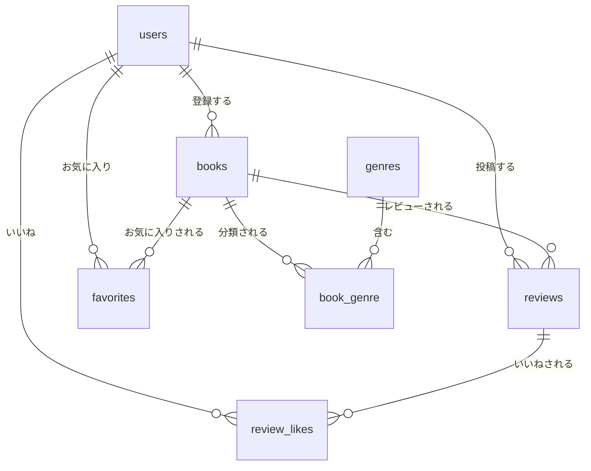

# 模擬案件：書籍レビュー管理システム (BookShelf) - 基本機能編

---

## はじめに

このドキュメントは、書籍レビュー管理システム (BookShelf) の **基本機能編** 実装手順書です。CRUD操作、認証、リレーション、お気に入り、いいね、ランキング、ジャンル管理、公開APIといった基本機能をゼロから構築します。

この手順書の通りに実装を進めると、基本版（basicブランチ）の模範解答コードと同一のものが完成します。

---

# Part 1: 要件定義書

## 1. システム概要

- **プロジェクト名:** 書籍レビュー管理システム (BookShelf)
- **目的:** ユーザーがお気に入りの書籍を登録し、レビューを投稿・閲覧できるWebアプリケーション
- **構成:** 従来型Web（Blade + セッション認証） + 公開API（JSON・認証なし）

### 技術スタック

| カテゴリ | 技術 | バージョン |
|---|---|---|
| サーバーサイド | PHP | 8.2 |
| フレームワーク | Laravel | 10.x |
| データベース | MySQL | 8.0+ |
| 開発環境 | Docker / Laravel Sail | 最新版 |
| フロントエンド | Blade, Tailwind CSS, Alpine.js | Laravel標準 |
| テスト | PHPUnit | Laravel標準 |

## 2. ルート仕様書

### 2.1. Webルート (`routes/web.php`)

| HTTPメソッド | URI | コントローラー@メソッド | 説明 | 認証 |
|---|---|---|---|---|
| GET | `/` | `BookController@index` | トップ（書籍一覧） | 不要 |
| GET | `/books` | `BookController@index` | 書籍一覧 | 不要 |
| GET | `/books/create` | `BookController@create` | 書籍登録フォーム | 必要 |
| POST | `/books` | `BookController@store` | 書籍登録処理 | 必要 |
| GET | `/books/{book}` | `BookController@show` | 書籍詳細 | 不要 |
| GET | `/books/{book}/edit` | `BookController@edit` | 書籍編集フォーム | 必要 |
| PUT | `/books/{book}` | `BookController@update` | 書籍更新処理 | 必要 |
| DELETE | `/books/{book}` | `BookController@destroy` | 書籍削除処理 | 必要 |
| POST | `/books/{book}/reviews` | `ReviewController@store` | レビュー投稿 | 必要 |
| GET | `/reviews/{review}/edit` | `ReviewController@edit` | レビュー編集フォーム | 必要 |
| PUT | `/reviews/{review}` | `ReviewController@update` | レビュー更新処理 | 必要 |
| DELETE | `/reviews/{review}` | `ReviewController@destroy` | レビュー削除処理 | 必要 |
| GET | `/favorites` | `FavoriteController@index` | お気に入り一覧 | 必要 |
| POST | `/books/{book}/favorites` | `FavoriteController@toggle` | お気に入りトグル | 必要 |
| POST | `/reviews/{review}/like` | `ReviewLikeController@toggle` | いいねトグル | 必要 |
| GET | `/ranking` | `RankingController@index` | 評価ランキング | 不要 |
| GET | `/genres` | `GenreController@index` | ジャンル一覧 | 必要 |
| GET | `/genres/create` | `GenreController@create` | ジャンル登録フォーム | 必要 |
| POST | `/genres` | `GenreController@store` | ジャンル登録処理 | 必要 |
| GET | `/genres/{genre}` | `GenreController@show` | ジャンル別書籍一覧 | 不要 |
| GET | `/genres/{genre}/edit` | `GenreController@edit` | ジャンル編集フォーム | 必要 |
| PUT | `/genres/{genre}` | `GenreController@update` | ジャンル更新処理 | 必要 |
| DELETE | `/genres/{genre}` | `GenreController@destroy` | ジャンル削除処理 | 必要 |

### 2.2. APIルート (`routes/api.php`)

| HTTPメソッド | URI | コントローラー@メソッド | 説明 | 認証 |
|---|---|---|---|---|
| GET | `/api/v1/books` | `Api\V1\BookController@index` | 書籍一覧API | 不要 |
| GET | `/api/v1/books/{book}` | `Api\V1\BookController@show` | 書籍詳細API | 不要 |
| POST | `/api/v1/books` | `Api\V1\BookController@store` | 書籍登録API | 不要 |
| PUT | `/api/v1/books/{book}` | `Api\V1\BookController@update` | 書籍更新API | 不要 |
| DELETE | `/api/v1/books/{book}` | `Api\V1\BookController@destroy` | 書籍削除API | 不要 |

> **注意:** 基本機能編ではAPIに認証をかけない。登録者はリクエストボディの `user_id` で指定する。

### 2.3. 認証ルート (`routes/auth.php`)

| HTTPメソッド | URI | 説明 | ミドルウェア |
|---|---|---|---|
| GET | `/login` | ログインフォーム | guest |
| GET | `/register` | 会員登録フォーム | guest |
| POST | `/logout` | ログアウト処理 | auth |

## 3. テーブル仕様書

### 3.1. ER図



### 3.2. テーブル定義

| テーブル名 | 主要カラム | 備考 |
|---|---|---|
| users | id, name, email, password | Laravel標準 |
| books | id, user_id(FK), title, author, isbn(NOT NULL/unique), published_date(NOT NULL), description, image_url | user_id CASCADE |
| genres | id, name(unique) | マスタ |
| book_genre | book_id(FK), genre_id(FK) | 中間テーブル、複合主キー(book_id, genre_id)、timestamps なし |
| reviews | id, user_id(FK), book_id(FK), rating(tinyInt), comment(NOT NULL) | CASCADE |
| favorites | user_id(FK), book_id(FK) | 中間テーブル、複合主キー(user_id, book_id)、timestamps なし |
| review_likes | user_id(FK), review_id(FK) | 中間テーブル、複合主キー(user_id, review_id)、timestamps なし |

---

# Part 2: 実装手順書

---

## Step 1: 環境構築とプロジェクト作成

### 1.1. Laravelプロジェクトの作成 (Laravel 10.x)

```bash
docker run --rm \
    -u "$(id -u):$(id -g)" \
    -v "$(pwd):/var/www/html" \
    -w /var/www/html \
    -e COMPOSER_CACHE_DIR=/tmp/composer_cache \
    laravelsail/php82-composer:latest \
    composer create-project laravel/laravel:^10.0 book-review-app
```

### 1.2. Laravel Sailのインストール

```bash
cd book-review-app

docker run --rm \
    -u "$(id -u):$(id -g)" \
    -v "$(pwd):/var/www/html" \
    -w /var/www/html \
    -e COMPOSER_CACHE_DIR=/tmp/composer_cache \
    laravelsail/php82-composer:latest \
    composer require laravel/sail --dev

docker run --rm \
    -u "$(id -u):$(id -g)" \
    -v "$(pwd):/var/www/html" \
    -w /var/www/html \
    -e COMPOSER_CACHE_DIR=/tmp/composer_cache \
    laravelsail/php82-composer:latest \
    php artisan sail:install --with=mysql
```

### 1.3. .envファイルの設定

`.env` ファイルのデータベース接続情報を確認・修正:

```dotenv
DB_CONNECTION=mysql
DB_HOST=mysql
DB_PORT=3306
DB_DATABASE=bookshelf
DB_USERNAME=sail
DB_PASSWORD=password
```

### 1.4. compose.yaml の設定

phpMyAdminを追加する場合、`compose.yaml` の `services:` 配下に以下を追加:

```yaml
    phpmyadmin:
        image: phpmyadmin/phpmyadmin
        ports:
            - '8080:80'
        environment:
            PMA_HOST: mysql
            PMA_USER: sail
            PMA_PASSWORD: password
        networks:
            - sail
        depends_on:
            - mysql
```

### 1.5. Sailの起動とAPP_KEY生成

```bash
./vendor/bin/sail up -d
sail artisan key:generate
```

### 1.6. フロントエンドのセットアップ

```bash
sail npm install
sail npm install alpinejs
```

`tailwind.config.js`:

```js
import defaultTheme from 'tailwindcss/defaultTheme';
import forms from '@tailwindcss/forms';

/** @type {import('tailwindcss').Config} */
export default {
    content: [
        './vendor/laravel/framework/src/Illuminate/Pagination/resources/views/*.blade.php',
        './storage/framework/views/*.php',
        './resources/views/**/*.blade.php',
    ],

    theme: {
        extend: {
            fontFamily: {
                sans: ['Figtree', ...defaultTheme.fontFamily.sans],
            },
        },
    },

    plugins: [forms],
};
```

`postcss.config.js`:

```js
export default {
    plugins: {
        tailwindcss: {},
        autoprefixer: {},
    },
};
```

`resources/css/app.css`:

```css
@tailwind base;
@tailwind components;
@tailwind utilities;
```

`vite.config.js`:

```js
import { defineConfig } from 'vite';
import laravel from 'laravel-vite-plugin';

export default defineConfig({
    plugins: [
        laravel({
            input: ['resources/css/app.css', 'resources/js/app.js'],
            refresh: true,
        }),
    ],
});
```

`resources/js/app.js`:

```js
import './bootstrap';

import Alpine from 'alpinejs';

window.Alpine = Alpine;

Alpine.start();
```

フロントエンドのビルド:

```bash
sail npm run build
```

### 1.7. 日本語バリデーションメッセージの準備

`config/app.php` で `'locale' => 'ja'` に変更する。

`lang/ja/` ディレクトリを作成し、以下3ファイルを配置する:

```bash
mkdir -p lang/ja
```

#### `lang/ja/validation.php`

```php
<?php

return [
    'min' => [
        'string' => ':attributeは:min文字以上で入力してください。',
    ],

    'attributes' => [
        'name' => 'お名前',
        'email' => 'メールアドレス',
        'password' => 'パスワード',
    ],
];
```

#### `lang/ja/auth.php`

```php
<?php

return [
    'failed' => 'ログイン情報が登録されていません。',
    'password' => '入力されたパスワードが正しくありません。',
    'throttle' => 'ログインの試行回数が多すぎます。:seconds 秒後にお試しください。',
];
```

#### `lang/ja/passwords.php`

```php
<?php

return [
    'reset' => 'パスワードをリセットしました。',
    'sent' => 'パスワードリセット用のリンクをメールで送信しました。',
    'throttled' => '時間をおいてから再度お試しください。',
    'token' => 'このパスワードリセットトークンは無効です。',
    'user' => 'このメールアドレスに一致するユーザーが見つかりません。',
];
```

---

## Step 2: データベース設計とマイグレーション

以下の6つのマイグレーションファイルを作成する。

> **重要:** `make:migration` を連続実行するとタイムスタンプが同一になり、ファイル名のアルファベット順で実行される場合がある。`book_genre` は `genres` テーブルへの外部キーを持つため、必ず `genres` のマイグレーションが先に実行されるようタイムスタンプの順序を確認すること。

### 2.1. `database/migrations/xxxx_create_books_table.php`

```bash
sail artisan make:migration create_books_table
```

```php
<?php

use Illuminate\Database\Migrations\Migration;
use Illuminate\Database\Schema\Blueprint;
use Illuminate\Support\Facades\Schema;

return new class extends Migration
{
    public function up(): void
    {
        Schema::create('books', function (Blueprint $table) {
            $table->id();
            $table->foreignId('user_id')->constrained()->onDelete('cascade'); // 誰が登録した書籍かを記録
            $table->string('title');
            $table->string('author');
            $table->string('isbn', 13)->unique();
            $table->date('published_date');
            $table->text('description')->nullable();
            $table->string('image_url')->nullable();
            $table->timestamps();
        });
    }

    public function down(): void
    {
        Schema::dropIfExists('books');
    }
};
```

> **ポイント:** 基本版では `isbn` は NOT NULL（`nullable()` なし）、`published_date` も NOT NULL。外部キーの削除は `onDelete('cascade')` を使用する。クロージャのパラメータに `: void` 型宣言は不要。

### 2.2. `database/migrations/xxxx_create_genres_table.php`

```bash
sail artisan make:migration create_genres_table
```

```php
<?php

use Illuminate\Database\Migrations\Migration;
use Illuminate\Database\Schema\Blueprint;
use Illuminate\Support\Facades\Schema;

return new class extends Migration
{
    public function up(): void
    {
        Schema::create('genres', function (Blueprint $table) {
            $table->id();
            $table->string('name')->unique();
            $table->timestamps();
        });
    }

    public function down(): void
    {
        Schema::dropIfExists('genres');
    }
};
```

### 2.3. `database/migrations/xxxx_create_book_genre_table.php`

```bash
sail artisan make:migration create_book_genre_table
```

```php
<?php

use Illuminate\Database\Migrations\Migration;
use Illuminate\Database\Schema\Blueprint;
use Illuminate\Support\Facades\Schema;

return new class extends Migration
{
    public function up(): void
    {
        Schema::create('book_genre', function (Blueprint $table) {
            $table->foreignId('book_id')->constrained()->onDelete('cascade');
            $table->foreignId('genre_id')->constrained()->onDelete('cascade');
            $table->primary(['book_id', 'genre_id']);
        });
    }

    public function down(): void
    {
        Schema::dropIfExists('book_genre');
    }
};
```

> **ポイント:** 基本版では `id` カラムなし、`timestamps` なし。複合主キー `primary(['book_id', 'genre_id'])` を使用する。

### 2.4. `database/migrations/xxxx_create_reviews_table.php`

```bash
sail artisan make:migration create_reviews_table
```

```php
<?php

use Illuminate\Database\Migrations\Migration;
use Illuminate\Database\Schema\Blueprint;
use Illuminate\Support\Facades\Schema;

return new class extends Migration
{
    public function up(): void
    {
        Schema::create('reviews', function (Blueprint $table) {
            $table->id();
            $table->foreignId('user_id')->constrained()->onDelete('cascade');
            $table->foreignId('book_id')->constrained()->onDelete('cascade');
            $table->tinyInteger('rating');
            $table->text('comment');
            $table->timestamps();
        });
    }

    public function down(): void
    {
        Schema::dropIfExists('reviews');
    }
};
```

> **ポイント:** 基本版では `comment` は NOT NULL（`nullable()` なし）、`unique(['user_id', 'book_id'])` 制約なし。

### 2.5. `database/migrations/xxxx_create_favorites_table.php`

```bash
sail artisan make:migration create_favorites_table
```

```php
<?php

use Illuminate\Database\Migrations\Migration;
use Illuminate\Database\Schema\Blueprint;
use Illuminate\Support\Facades\Schema;

return new class extends Migration
{
    public function up(): void
    {
        Schema::create('favorites', function (Blueprint $table) {
            $table->foreignId('user_id')->constrained()->onDelete('cascade');
            $table->foreignId('book_id')->constrained()->onDelete('cascade');
            $table->primary(['user_id', 'book_id']);
        });
    }

    public function down(): void
    {
        Schema::dropIfExists('favorites');
    }
};
```

> **ポイント:** 基本版では `id` カラムなし、`timestamps` なし。複合主キーを使用する。

### 2.6. `database/migrations/xxxx_create_review_likes_table.php`

```bash
sail artisan make:migration create_review_likes_table
```

```php
<?php

use Illuminate\Database\Migrations\Migration;
use Illuminate\Database\Schema\Blueprint;
use Illuminate\Support\Facades\Schema;

return new class extends Migration
{
    public function up(): void
    {
        Schema::create('review_likes', function (Blueprint $table) {
            $table->foreignId('user_id')->constrained()->onDelete('cascade');
            $table->foreignId('review_id')->constrained()->onDelete('cascade');
            $table->primary(['user_id', 'review_id']);
        });
    }

    public function down(): void
    {
        Schema::dropIfExists('review_likes');
    }
};
```

> **ポイント:** 基本版では `id` カラムなし、`timestamps` なし。複合主キーを使用する。

### マイグレーション実行

```bash
sail artisan migrate
```

---

## Step 3: モデルとリレーションシップ

### 3.1. `app/Models/User.php`

既存のUserモデルを以下のように更新する:

```php
<?php

namespace App\Models;

use Illuminate\Database\Eloquent\Factories\HasFactory;
use Illuminate\Foundation\Auth\User as Authenticatable;
use Illuminate\Notifications\Notifiable;

class User extends Authenticatable
{
    use HasFactory, Notifiable;

    protected $fillable = [
        'name',
        'email',
        'password',
    ];

    protected $hidden = [
        'password',
        'remember_token',
    ];

    protected function casts(): array
    {
        return [
            'email_verified_at' => 'datetime',
            'password' => 'hashed',
        ];
    }

    public function books()
    {
        return $this->hasMany(Book::class);
    }

    public function reviews()
    {
        return $this->hasMany(Review::class);
    }

    public function favoriteBooks()
    {
        return $this->belongsToMany(Book::class, 'favorites');
    }

    public function likedReviews()
    {
        return $this->belongsToMany(Review::class, 'review_likes');
    }
}
```

> **ポイント:** 基本版では `HasApiTokens` トレイトは不要。リレーションメソッドに戻り値の型宣言（`: HasMany` 等）は付けない。PHPDocコメントも不要。`belongsToMany` に `withTimestamps()` は付けない（中間テーブルに timestamps カラムがないため）。

### 3.2. `app/Models/Book.php`

```bash
sail artisan make:model Book
```

```php
<?php

namespace App\Models;

use Illuminate\Database\Eloquent\Factories\HasFactory;
use Illuminate\Database\Eloquent\Model;

class Book extends Model
{
    use HasFactory;

    protected $fillable = [
        'user_id',
        'title',
        'author',
        'isbn',
        'published_date',
        'description',
        'image_url',
    ];

    public function user()
    {
        return $this->belongsTo(User::class);
    }

    public function reviews()
    {
        return $this->hasMany(Review::class);
    }

    public function genres()
    {
        return $this->belongsToMany(Genre::class);
    }

    public function favoritedByUsers()
    {
        return $this->belongsToMany(User::class, 'favorites');
    }
}
```

> **ポイント:** 基本版では `$casts` に `published_date` を定義しない。リレーション型の `use` 文やPHPDocも不要。

### 3.3. `app/Models/Review.php`

```bash
sail artisan make:model Review
```

```php
<?php

namespace App\Models;

use Illuminate\Database\Eloquent\Factories\HasFactory;
use Illuminate\Database\Eloquent\Model;

class Review extends Model
{
    use HasFactory;

    protected $fillable = [
        'user_id',
        'book_id',
        'rating',
        'comment',
    ];

    public function user()
    {
        return $this->belongsTo(User::class);
    }

    public function book()
    {
        return $this->belongsTo(Book::class);
    }

    public function likedByUsers()
    {
        return $this->belongsToMany(User::class, 'review_likes');
    }
}
```

### 3.4. `app/Models/Genre.php`

```bash
sail artisan make:model Genre
```

```php
<?php

namespace App\Models;

use Illuminate\Database\Eloquent\Factories\HasFactory;
use Illuminate\Database\Eloquent\Model;

class Genre extends Model
{
    use HasFactory;

    protected $fillable = ['name'];

    public function books()
    {
        return $this->belongsToMany(Book::class);
    }
}
```

> **注意:** 基本版では Favorite モデルと ReviewLike モデルは作成しない。中間テーブルへのアクセスは `belongsToMany` リレーション経由で行う。

### 3.5. ファクトリファイル

テストで使用するファクトリを作成する。

#### `database/factories/BookFactory.php`

```bash
sail artisan make:factory BookFactory
```

```php
<?php

namespace Database\Factories;

use App\Models\Book;
use App\Models\User;
use Illuminate\Database\Eloquent\Factories\Factory;

/**
 * @extends Factory<Book>
 */
class BookFactory extends Factory
{
    protected $model = Book::class;

    public function definition(): array
    {
        return [
            'user_id' => User::factory(),
            'title' => fake()->sentence(3),
            'author' => fake()->name(),
            'isbn' => fake()->unique()->numerify(str_repeat('#', 13)),
            'published_date' => fake()->date(),
            'description' => fake()->paragraph(),
            'image_url' => fake()->url(),
        ];
    }
}
```

#### `database/factories/GenreFactory.php`

```bash
sail artisan make:factory GenreFactory
```

```php
<?php

namespace Database\Factories;

use App\Models\Genre;
use Illuminate\Database\Eloquent\Factories\Factory;

/**
 * @extends Factory<Genre>
 */
class GenreFactory extends Factory
{
    protected $model = Genre::class;

    public function definition(): array
    {
        return [
            'name' => fake()->unique()->words(2, true),
        ];
    }
}
```

#### `database/factories/ReviewFactory.php`

```bash
sail artisan make:factory ReviewFactory
```

```php
<?php

namespace Database\Factories;

use App\Models\Book;
use App\Models\Review;
use App\Models\User;
use Illuminate\Database\Eloquent\Factories\Factory;

/**
 * @extends Factory<Review>
 */
class ReviewFactory extends Factory
{
    protected $model = Review::class;

    public function definition(): array
    {
        return [
            'user_id' => User::factory(),
            'book_id' => Book::factory(),
            'rating' => fake()->numberBetween(1, 5),
            'comment' => fake()->sentence(),
        ];
    }
}
```

---

## Step 4: 認証機能の実装（Laravel Fortify）

### 4.1. Fortifyのインストールと設定

```bash
sail composer require laravel/fortify
sail artisan vendor:publish --provider="Laravel\Fortify\FortifyServiceProvider"
```

### 4.2. `config/fortify.php` の設定

`features` 配列で使用する機能を確認（デフォルトで登録・ログインは有効）。

`home` の値を `/` に変更する（デフォルトは `/home`）:

```php
    'home' => '/',
```

### 4.3. `app/Providers/FortifyServiceProvider.php`

```php
<?php

namespace App\Providers;

use App\Actions\Fortify\CreateNewUser;
use App\Actions\Fortify\ResetUserPassword;
use App\Actions\Fortify\UpdateUserPassword;
use App\Actions\Fortify\UpdateUserProfileInformation;
use Illuminate\Cache\RateLimiting\Limit;
use Illuminate\Http\Request;
use Illuminate\Support\Facades\RateLimiter;
use Illuminate\Support\ServiceProvider;
use Illuminate\Support\Str;
use Laravel\Fortify\Actions\RedirectIfTwoFactorAuthenticatable;
use Laravel\Fortify\Fortify;

class FortifyServiceProvider extends ServiceProvider
{
    /**
     * Register any application services.
     */
    public function register(): void
    {
        //
    }

    /**
     * Bootstrap any application services.
     */
    public function boot(): void
    {
        Fortify::createUsersUsing(CreateNewUser::class);
        Fortify::updateUserProfileInformationUsing(UpdateUserProfileInformation::class);
        Fortify::updateUserPasswordsUsing(UpdateUserPassword::class);
        Fortify::resetUserPasswordsUsing(ResetUserPassword::class);
        Fortify::redirectUserForTwoFactorAuthenticationUsing(RedirectIfTwoFactorAuthenticatable::class);
        Fortify::loginView(fn () => view('auth.login'));
        Fortify::registerView(fn () => view('auth.register'));

        RateLimiter::for('login', function (Request $request) {
            $throttleKey = Str::transliterate(Str::lower($request->input(Fortify::username())).'|'.$request->ip());

            return Limit::perMinute(5)->by($throttleKey);
        });

        RateLimiter::for('two-factor', function (Request $request) {
            return Limit::perMinute(5)->by($request->session()->get('login.id'));
        });
    }
}
```

`config/app.php` の `providers` 配列に `App\Providers\FortifyServiceProvider::class` を追加。

### 4.4. `app/Providers/RouteServiceProvider.php`

ログイン後のリダイレクト先と認証ルートの読み込みを設定:

```php
<?php

namespace App\Providers;

use Illuminate\Cache\RateLimiting\Limit;
use Illuminate\Foundation\Support\Providers\RouteServiceProvider as ServiceProvider;
use Illuminate\Http\Request;
use Illuminate\Support\Facades\RateLimiter;
use Illuminate\Support\Facades\Route;

class RouteServiceProvider extends ServiceProvider
{
    /**
     * The path to your application's "home" route.
     *
     * Typically, users are redirected here after authentication.
     *
     * @var string
     */
    public const HOME = '/';

    /**
     * Define your route model bindings, pattern filters, and other route configuration.
     */
    public function boot(): void
    {
        RateLimiter::for('api', function (Request $request) {
            return Limit::perMinute(60)->by($request->user()?->id ?: $request->ip());
        });

        $this->routes(function () {
            Route::middleware('api')
                ->prefix('api')
                ->group(base_path('routes/api.php'));

            Route::middleware('web')
                ->group(base_path('routes/web.php'));

            Route::middleware('web')
                ->group(base_path('routes/auth.php'));
        });
    }
}
```

### 4.5. `app/Actions/Fortify/CreateNewUser.php` の更新

Fortify が生成した `CreateNewUser.php` に日本語バリデーションメッセージを追加する:

```php
<?php

namespace App\Actions\Fortify;

use App\Models\User;
use Illuminate\Support\Facades\Hash;
use Illuminate\Support\Facades\Validator;
use Illuminate\Validation\Rule;
use Laravel\Fortify\Contracts\CreatesNewUsers;

class CreateNewUser implements CreatesNewUsers
{
    use PasswordValidationRules;

    /**
     * Validate and create a newly registered user.
     *
     * @param  array<string, string>  $input
     */
    public function create(array $input): User
    {
        Validator::make($input, [
            'name' => ['required', 'string', 'max:255'],
            'email' => [
                'required',
                'string',
                'email',
                'max:255',
                Rule::unique(User::class),
            ],
            'password' => $this->passwordRules(),
        ], [
            'name.required' => 'お名前を入力してください。',
            'email.required' => 'メールアドレスを入力してください。',
            'email.email' => 'メールアドレスはメール形式で入力してください。',
            'email.unique' => 'このメールアドレスは既に使用されています。',
            'password.required' => 'パスワードを入力してください。',
            'password.confirmed' => 'パスワードと一致しません。',
        ])->validate();

        return User::create([
            'name' => $input['name'],
            'email' => $input['email'],
            'password' => Hash::make($input['password']),
        ]);
    }
}
```

### 4.6. `routes/auth.php`（新規作成）

```php
<?php

use Illuminate\Support\Facades\Route;
use Laravel\Fortify\Http\Controllers\AuthenticatedSessionController;

Route::middleware('guest')->group(function () {
    Route::get('/login', function () {
        return view('auth.login');
    })->name('login');

    Route::get('/register', function () {
        return view('auth.register');
    })->name('register');
});

Route::middleware('auth')->group(function () {
    Route::post('/logout', [AuthenticatedSessionController::class, 'destroy'])
        ->name('logout');
});
```

### 4.7. 認証ビューの配置

`resources/views/auth/login.blade.php` と `resources/views/auth/register.blade.php` は提供されたBladeファイルを配置する。

レイアウトコンポーネント `resources/views/components/app-layout.blade.php` とナビゲーション `resources/views/layouts/navigation.blade.php` も同様に配置する。

---

## Step 5: マスタデータの準備（シーダー）

### 5.1. `database/seeders/UserSeeder.php`

```bash
sail artisan make:seeder UserSeeder
```

```php
<?php

namespace Database\Seeders;

use App\Models\User;
use Illuminate\Database\Seeder;
use Illuminate\Support\Facades\Hash;

class UserSeeder extends Seeder
{
    public function run(): void
    {
        $users = [
            [
                'name' => '山田太郎',
                'email' => 'yamada@example.com',
                'password' => Hash::make('password'),
            ],
            [
                'name' => '鈴木花子',
                'email' => 'suzuki@example.com',
                'password' => Hash::make('password'),
            ],
            [
                'name' => '田中一郎',
                'email' => 'tanaka@example.com',
                'password' => Hash::make('password'),
            ],
            [
                'name' => '佐藤美咲',
                'email' => 'sato@example.com',
                'password' => Hash::make('password'),
            ],
            [
                'name' => '高橋健太',
                'email' => 'takahashi@example.com',
                'password' => Hash::make('password'),
            ],
        ];

        foreach ($users as $user) {
            User::firstOrCreate(
                ['email' => $user['email']],
                $user
            );
        }
    }
}
```

> **ポイント:** 基本版では `firstOrCreate` を使い、既存データがあればスキップする。

### 5.2. `database/seeders/GenreSeeder.php`

```bash
sail artisan make:seeder GenreSeeder
```

```php
<?php

namespace Database\Seeders;

use App\Models\Genre;
use Illuminate\Database\Seeder;

class GenreSeeder extends Seeder
{
    public function run(): void
    {
        $genres = [
            '小説',
            'ビジネス',
            '技術書',
            '自己啓発',
            'エッセイ',
            '歴史',
            '科学',
            '芸術',
            '料理',
            '旅行',
        ];

        foreach ($genres as $genre) {
            Genre::firstOrCreate(['name' => $genre]);
        }
    }
}
```

> **ポイント:** 基本版のジャンル名は短い名前（「小説」「ビジネス」等）を使用。`firstOrCreate` で冪等性を確保。

### 5.3. `database/seeders/BookSeeder.php`

```bash
sail artisan make:seeder BookSeeder
```

```php
<?php

namespace Database\Seeders;

use App\Models\Book;
use App\Models\Genre;
use App\Models\User;
use Illuminate\Database\Seeder;

class BookSeeder extends Seeder
{
    public function run(): void
    {
        $user = User::first();

        $books = [
            [
                'title' => '吾輩は猫である',
                'author' => '夏目漱石',
                'isbn' => '9784101010014',
                'published_date' => '1905-01-01',
                'description' => '中学校の英語教師である珍野苦沙弥の家に飼われている猫である「吾輩」の視点から、珍野一家や、そこに出入りする人々の様子を風刺的に描いた作品。',
                'image_url' => 'https://cover.openbd.jp/9784101010014.jpg',
                'genres' => ['小説'],
            ],
            [
                'title' => '人を動かす',
                'author' => 'D・カーネギー',
                'isbn' => '9784422100524',
                'published_date' => '1936-10-01',
                'description' => '人間関係の古典として、あらゆる自己啓発本の原点となったデール・カーネギーの名著。',
                'image_url' => 'https://cover.openbd.jp/9784422100524.jpg',
                'genres' => ['ビジネス', '自己啓発'],
            ],
            [
                'title' => 'リーダブルコード',
                'author' => 'Dustin Boswell',
                'isbn' => '9784873115658',
                'published_date' => '2012-06-23',
                'description' => 'より良いコードを書くためのシンプルで実践的なテクニックを紹介。',
                'image_url' => 'https://cover.openbd.jp/9784873115658.jpg',
                'genres' => ['技術書'],
            ],
            [
                'title' => '7つの習慣',
                'author' => 'スティーブン・R・コヴィー',
                'isbn' => '9784863940246',
                'published_date' => '2013-08-30',
                'description' => '全世界3000万部、国内180万部を超えるベストセラー。人生を成功に導く7つの習慣を解説。',
                'image_url' => 'https://cover.openbd.jp/9784863940246.jpg',
                'genres' => ['ビジネス', '自己啓発'],
            ],
            [
                'title' => '坊っちゃん',
                'author' => '夏目漱石',
                'isbn' => '9784101010021',
                'published_date' => '1906-04-01',
                'description' => '東京の物理学校を卒業後、四国の中学校に数学教師として赴任した主人公「坊っちゃん」の物語。',
                'image_url' => 'https://cover.openbd.jp/9784101010021.jpg',
                'genres' => ['小説'],
            ],
            [
                'title' => 'サピエンス全史',
                'author' => 'ユヴァル・ノア・ハラリ',
                'isbn' => '9784309226712',
                'published_date' => '2016-09-08',
                'description' => 'なぜ人類だけが文明を築けたのか？ホモ・サピエンスの歴史を俯瞰する世界的ベストセラー。',
                'image_url' => 'https://cover.openbd.jp/9784309226712.jpg',
                'genres' => ['歴史', '科学'],
            ],
            [
                'title' => 'Clean Code',
                'author' => 'Robert C. Martin',
                'isbn' => '9784048930598',
                'published_date' => '2017-12-18',
                'description' => 'アジャイルソフトウェア開発の奥義として、クリーンなコードを書くための原則を解説。',
                'image_url' => 'https://cover.openbd.jp/9784048930598.jpg',
                'genres' => ['技術書'],
            ],
            [
                'title' => '嫌われる勇気',
                'author' => '岸見一郎・古賀史健',
                'isbn' => '9784478025819',
                'published_date' => '2013-12-13',
                'description' => 'アドラー心理学を対話形式でわかりやすく解説した自己啓発書のベストセラー。',
                'image_url' => 'https://cover.openbd.jp/9784478025819.jpg',
                'genres' => ['自己啓発'],
            ],
            [
                'title' => '火花',
                'author' => '又吉直樹',
                'isbn' => '9784163902302',
                'published_date' => '2015-03-11',
                'description' => '芥川賞受賞作。売れない芸人の青春を描いた純文学作品。',
                'image_url' => 'https://cover.openbd.jp/9784163902302.jpg',
                'genres' => ['小説'],
            ],
            [
                'title' => 'FACTFULNESS',
                'author' => 'ハンス・ロスリング',
                'isbn' => '9784822289607',
                'published_date' => '2019-01-11',
                'description' => 'データを基に世界を正しく見る習慣を身につける。思い込みを乗り越え、世界を正しく見る方法。',
                'image_url' => 'https://cover.openbd.jp/9784822289607.jpg',
                'genres' => ['ビジネス', '科学'],
            ],
            [
                'title' => 'コンテナ物語',
                'author' => 'マルク・レビンソン',
                'isbn' => '9784822251468',
                'published_date' => '2007-01-18',
                'description' => 'コンテナが世界を変えた。物流革命の歴史を描いたノンフィクション。',
                'image_url' => 'https://cover.openbd.jp/9784822251468.jpg',
                'genres' => ['ビジネス', '歴史'],
            ],
        ];

        foreach ($books as $bookData) {
            $genreNames = $bookData['genres'];
            unset($bookData['genres']);

            $book = Book::firstOrCreate(
                ['isbn' => $bookData['isbn']],
                array_merge($bookData, ['user_id' => $user->id])
            );

            // ジャンルを紐付け
            $genreIds = Genre::whereIn('name', $genreNames)->pluck('id')->toArray();
            $book->genres()->sync($genreIds);
        }
    }
}
```

> **ポイント:** 基本版では `User::first()` で最初のユーザーを登録者にする。`firstOrCreate` で冪等性を確保。`genres()->sync()` で紐付け。コンテナ物語の ISBN は `9784822251468`。

### 5.4. `database/seeders/ReviewSeeder.php`

```bash
sail artisan make:seeder ReviewSeeder
```

```php
<?php

namespace Database\Seeders;

use App\Models\Book;
use App\Models\Review;
use App\Models\User;
use Illuminate\Database\Seeder;

class ReviewSeeder extends Seeder
{
    public function run(): void
    {
        $users = User::all();
        $books = Book::all();

        $reviews = [
            // 吾輩は猫である
            ['book_index' => 0, 'user_index' => 0, 'rating' => 5, 'comment' => '日本文学の傑作。猫の視点から人間社会を風刺する手法が秀逸です。'],
            ['book_index' => 0, 'user_index' => 1, 'rating' => 4, 'comment' => '古典的な作品ですが、今読んでも面白い。文体に慣れるまで少し時間がかかりました。'],
            ['book_index' => 0, 'user_index' => 2, 'rating' => 5, 'comment' => '何度読んでも新しい発見がある名作です。'],

            // 人を動かす
            ['book_index' => 1, 'user_index' => 0, 'rating' => 5, 'comment' => 'ビジネスパーソン必読の一冊。人間関係の基本が学べます。'],
            ['book_index' => 1, 'user_index' => 2, 'rating' => 4, 'comment' => '具体的な事例が豊富で実践しやすい内容です。'],
            ['book_index' => 1, 'user_index' => 3, 'rating' => 5, 'comment' => '何度も読み返しています。読むたびに新しい気づきがあります。'],
            ['book_index' => 1, 'user_index' => 4, 'rating' => 4, 'comment' => '古い本ですが、内容は今でも十分通用します。'],

            // リーダブルコード
            ['book_index' => 2, 'user_index' => 0, 'rating' => 5, 'comment' => 'エンジニア必読！コードの可読性について深く考えさせられました。'],
            ['book_index' => 2, 'user_index' => 1, 'rating' => 5, 'comment' => '新人エンジニアに最初に読ませたい本。'],
            ['book_index' => 2, 'user_index' => 4, 'rating' => 4, 'comment' => '実践的なテクニックが多く、すぐに業務に活かせます。'],

            // 7つの習慣
            ['book_index' => 3, 'user_index' => 1, 'rating' => 5, 'comment' => '人生のバイブルです。定期的に読み返しています。'],
            ['book_index' => 3, 'user_index' => 2, 'rating' => 4, 'comment' => '内容は素晴らしいですが、少し長いです。'],
            ['book_index' => 3, 'user_index' => 3, 'rating' => 5, 'comment' => '自己啓発書の中でも最高峰。'],

            // 坊っちゃん
            ['book_index' => 4, 'user_index' => 0, 'rating' => 4, 'comment' => '痛快な物語。主人公の真っ直ぐな性格が好きです。'],
            ['book_index' => 4, 'user_index' => 3, 'rating' => 5, 'comment' => '夏目漱石の作品の中で一番好きです。'],

            // サピエンス全史
            ['book_index' => 5, 'user_index' => 0, 'rating' => 5, 'comment' => '人類の歴史を俯瞰できる素晴らしい本。視野が広がりました。'],
            ['book_index' => 5, 'user_index' => 1, 'rating' => 5, 'comment' => '知的好奇心を刺激される一冊。'],
            ['book_index' => 5, 'user_index' => 2, 'rating' => 4, 'comment' => '内容は濃いですが、読み応えがあります。'],
            ['book_index' => 5, 'user_index' => 4, 'rating' => 5, 'comment' => '世界の見方が変わりました。'],

            // Clean Code
            ['book_index' => 6, 'user_index' => 0, 'rating' => 4, 'comment' => 'プロのプログラマーを目指すなら必読。'],
            ['book_index' => 6, 'user_index' => 4, 'rating' => 5, 'comment' => 'コードの品質について深く考えさせられます。'],

            // 嫌われる勇気
            ['book_index' => 7, 'user_index' => 1, 'rating' => 5, 'comment' => 'アドラー心理学を分かりやすく学べます。人生観が変わりました。'],
            ['book_index' => 7, 'user_index' => 2, 'rating' => 4, 'comment' => '対話形式で読みやすい。'],
            ['book_index' => 7, 'user_index' => 3, 'rating' => 5, 'comment' => '何度も読み返したい本です。'],
            ['book_index' => 7, 'user_index' => 4, 'rating' => 4, 'comment' => '考え方の転換に役立ちました。'],

            // 火花
            ['book_index' => 8, 'user_index' => 0, 'rating' => 4, 'comment' => '芸人の世界をリアルに描いた作品。'],
            ['book_index' => 8, 'user_index' => 2, 'rating' => 3, 'comment' => '文学作品として評価は分かれるかも。'],

            // FACTFULNESS
            ['book_index' => 9, 'user_index' => 0, 'rating' => 5, 'comment' => 'データに基づいた世界の見方を学べます。目から鱗でした。'],
            ['book_index' => 9, 'user_index' => 1, 'rating' => 5, 'comment' => '思い込みを打ち破る良書。'],
            ['book_index' => 9, 'user_index' => 3, 'rating' => 4, 'comment' => '統計データの見方が変わりました。'],

            // コンテナ物語
            ['book_index' => 10, 'user_index' => 1, 'rating' => 4, 'comment' => 'コンテナが世界を変えた歴史を学べます。'],
            ['book_index' => 10, 'user_index' => 4, 'rating' => 5, 'comment' => '物流の歴史に興味がある人におすすめ。'],
        ];

        foreach ($reviews as $reviewData) {
            $book = $books[$reviewData['book_index']];
            $user = $users[$reviewData['user_index']];

            Review::firstOrCreate(
                [
                    'book_id' => $book->id,
                    'user_id' => $user->id,
                ],
                [
                    'rating' => $reviewData['rating'],
                    'comment' => $reviewData['comment'],
                ]
            );
        }
    }
}
```

> **ポイント:** 基本版では `firstOrCreate` を使い、(book_id, user_id) の組み合わせで重複チェック。評価は3〜5に偏ったデータになっている。

### 5.5. `database/seeders/FavoriteSeeder.php`

```bash
sail artisan make:seeder FavoriteSeeder
```

```php
<?php

namespace Database\Seeders;

use App\Models\Book;
use App\Models\User;
use Illuminate\Database\Seeder;

class FavoriteSeeder extends Seeder
{
    public function run(): void
    {
        $users = User::all();
        $books = Book::all();

        // 各ユーザーにお気に入りを設定
        $favorites = [
            // 山田太郎のお気に入り
            ['user_index' => 0, 'book_indices' => [0, 2, 5, 9]],
            // 鈴木花子のお気に入り
            ['user_index' => 1, 'book_indices' => [1, 3, 5, 7]],
            // 田中一郎のお気に入り
            ['user_index' => 2, 'book_indices' => [0, 1, 7]],
            // 佐藤美咲のお気に入り
            ['user_index' => 3, 'book_indices' => [3, 4, 7, 8]],
            // 高橋健太のお気に入り
            ['user_index' => 4, 'book_indices' => [2, 5, 6, 9, 10]],
        ];

        foreach ($favorites as $favoriteData) {
            $user = $users[$favoriteData['user_index']];
            $bookIds = collect($favoriteData['book_indices'])->map(fn ($i) => $books[$i]->id)->toArray();
            $user->favoriteBooks()->syncWithoutDetaching($bookIds);
        }
    }
}
```

> **ポイント:** `syncWithoutDetaching` で既存データを上書きせずに追加する。

### 5.6. `database/seeders/ReviewLikeSeeder.php`

```bash
sail artisan make:seeder ReviewLikeSeeder
```

```php
<?php

namespace Database\Seeders;

use App\Models\Review;
use App\Models\User;
use Illuminate\Database\Seeder;

class ReviewLikeSeeder extends Seeder
{
    public function run(): void
    {
        $users = User::all();
        $reviews = Review::all();

        // ランダムにいいねを付ける
        foreach ($reviews as $review) {
            // 各レビューに0〜3人のユーザーがいいねする
            $likeCount = rand(0, 3);
            $likeUsers = $users->where('id', '!=', $review->user_id)->random(min($likeCount, $users->count() - 1));

            foreach ($likeUsers as $user) {
                $user->likedReviews()->syncWithoutDetaching([$review->id]);
            }
        }
    }
}
```

### 5.7. `database/seeders/DatabaseSeeder.php`

```php
<?php

namespace Database\Seeders;

use Illuminate\Database\Seeder;

class DatabaseSeeder extends Seeder
{
    public function run(): void
    {
        // 依存関係を考慮して実行順序を変更
        $this->call([
            UserSeeder::class,       // 先にユーザーを作成
            GenreSeeder::class,      // ジャンルも先に作成
            BookSeeder::class,       // ユーザーとジャンルを使って書籍を作成
            ReviewSeeder::class,     // ユーザーと書籍を使ってレビューを作成
            FavoriteSeeder::class,   // ユーザーと書籍を使ってお気に入りを作成
            ReviewLikeSeeder::class, // ユーザーとレビューを使っていいねを作成
        ]);
    }
}
```

> **ポイント:** 基本版では UserSeeder が先、GenreSeeder が次（BookSeeder がユーザーとジャンルの両方に依存するため）。

### シーディング実行

```bash
sail artisan migrate:fresh --seed
```

---

## Step 6: 書籍管理機能CRUD

### 6.1. ポリシーの作成

#### `app/Policies/BookPolicy.php`

```bash
sail artisan make:policy BookPolicy --model=Book
```

```php
<?php

namespace App\Policies;

use App\Models\Book;
use App\Models\User;

class BookPolicy
{
    public function update(User $user, Book $book): bool
    {
        return $user->id === $book->user_id;
    }

    public function delete(User $user, Book $book): bool
    {
        return $user->id === $book->user_id;
    }
}
```

#### `app/Policies/ReviewPolicy.php`

```bash
sail artisan make:policy ReviewPolicy --model=Review
```

```php
<?php

namespace App\Policies;

use App\Models\Review;
use App\Models\User;

class ReviewPolicy
{
    public function update(User $user, Review $review): bool
    {
        return $user->id === $review->user_id;
    }

    public function delete(User $user, Review $review): bool
    {
        return $user->id === $review->user_id;
    }
}
```

#### `app/Providers/AuthServiceProvider.php`

```php
<?php

namespace App\Providers;

use App\Models\Book;
use App\Models\Review;
use App\Policies\BookPolicy;
use App\Policies\ReviewPolicy;
use Illuminate\Foundation\Support\Providers\AuthServiceProvider as ServiceProvider;

class AuthServiceProvider extends ServiceProvider
{
    /**
     * The model to policy mappings for the application.
     *
     * @var array<class-string, class-string>
     */
    protected $policies = [
        Book::class => BookPolicy::class,
        Review::class => ReviewPolicy::class,
    ];

    /**
     * Register any authentication / authorization services.
     */
    public function boot(): void
    {
        //
    }
}
```

### 6.2. バリデーションリクエスト

#### `app/Http/Requests/StoreBookRequest.php`

```bash
sail artisan make:request StoreBookRequest
```

```php
<?php

namespace App\Http\Requests;

use Illuminate\Foundation\Http\FormRequest;

class StoreBookRequest extends FormRequest
{
    public function authorize(): bool
    {
        return true;
    }

    public function rules(): array
    {
        return [
            'title' => ['required', 'string', 'max:255'],
            'author' => ['required', 'string', 'max:255'],
            'isbn' => ['required', 'string', 'size:13', 'unique:books,isbn'],
            'published_date' => ['required', 'date'],
            'description' => ['nullable', 'string'],
            'image_url' => ['nullable', 'url'],
            'genres' => ['required', 'array'],
            'genres.*' => ['exists:genres,id'],
        ];
    }

    public function messages(): array
    {
        return [
            'title.required' => 'タイトルは必須です。',
            'title.string' => 'タイトルは文字列で入力してください。',
            'title.max' => 'タイトルは255文字以内で入力してください。',
            'author.required' => '著者名は必須です。',
            'author.string' => '著者名は文字列で入力してください。',
            'author.max' => '著者名は255文字以内で入力してください。',
            'isbn.required' => 'ISBNは必須です。',
            'isbn.string' => 'ISBNは文字列で入力してください。',
            'isbn.size' => 'ISBNは13桁で入力してください。',
            'isbn.unique' => 'そのISBNは既に使用されています。',
            'published_date.required' => '出版日は必須です。',
            'published_date.date' => '出版日は有効な日付形式で入力してください。',
            'description.string' => '概要は文字列で入力してください。',
            'image_url.url' => '画像URLは有効なURL形式で入力してください。',
            'genres.required' => 'ジャンルは1つ以上選択してください。',
            'genres.array' => 'ジャンルは配列で入力してください。',
            'genres.*.exists' => '選択されたジャンルは存在しません。',
        ];
    }
}
```

> **ポイント:** 基本版では `isbn` と `published_date` は `required`。`image_url` に `max:255` は不要。`genres` に `min:1` は不要。

#### `app/Http/Requests/UpdateBookRequest.php`

```bash
sail artisan make:request UpdateBookRequest
```

```php
<?php

namespace App\Http\Requests;

use Illuminate\Foundation\Http\FormRequest;
use Illuminate\Validation\Rule;

class UpdateBookRequest extends FormRequest
{
    public function authorize(): bool
    {
        return true;
    }

    public function rules(): array
    {
        return [
            'title' => ['required', 'string', 'max:255'],
            'author' => ['required', 'string', 'max:255'],
            'isbn' => ['required', 'string', 'size:13', Rule::unique('books')->ignore($this->book)],
            'published_date' => ['required', 'date'],
            'description' => ['nullable', 'string'],
            'image_url' => ['nullable', 'url'],
            'genres' => ['required', 'array'],
            'genres.*' => ['exists:genres,id'],
        ];
    }

    public function messages(): array
    {
        return [
            'title.required' => 'タイトルは必須です。',
            'title.string' => 'タイトルは文字列で入力してください。',
            'title.max' => 'タイトルは255文字以内で入力してください。',
            'author.required' => '著者名は必須です。',
            'author.string' => '著者名は文字列で入力してください。',
            'author.max' => '著者名は255文字以内で入力してください。',
            'isbn.required' => 'ISBNは必須です。',
            'isbn.string' => 'ISBNは文字列で入力してください。',
            'isbn.size' => 'ISBNは13桁で入力してください。',
            'isbn.unique' => 'そのISBNは既に使用されています。',
            'published_date.required' => '出版日は必須です。',
            'published_date.date' => '出版日は有効な日付形式で入力してください。',
            'description.string' => '概要は文字列で入力してください。',
            'image_url.url' => '画像URLは有効なURL形式で入力してください。',
            'genres.required' => 'ジャンルは1つ以上選択してください。',
            'genres.array' => 'ジャンルは配列で入力してください。',
            'genres.*.exists' => '選択されたジャンルは存在しません。',
        ];
    }
}
```

### 6.3. コントローラ

#### `app/Http/Controllers/BookController.php`

```bash
sail artisan make:controller BookController
```

```php
<?php

namespace App\Http\Controllers;

use App\Http\Requests\StoreBookRequest;
use App\Http\Requests\UpdateBookRequest;
use App\Models\Book;
use App\Models\Genre;
use Illuminate\Http\RedirectResponse;
use Illuminate\View\View;

class BookController extends Controller
{
    public function index(): View
    {
        $books = Book::with('genres')->latest()->paginate(10);

        return view('books.index', compact('books'));
    }

    public function create(): View
    {
        $genres = Genre::all();

        return view('books.create', compact('genres'));
    }

    public function store(StoreBookRequest $request): RedirectResponse
    {
        $validated = $request->validated();
        $bookData = collect($validated)->except('genres')->toArray();
        $book = $request->user()->books()->create($bookData);
        $book->genres()->attach($validated['genres']);

        return redirect()->route('books.show', $book)->with('success', '書籍を登録しました。');
    }

    public function show(Book $book): View
    {
        $book->load(['reviews.user', 'genres']);

        return view('books.show', compact('book'));
    }

    public function edit(Book $book): View
    {
        $this->authorize('update', $book);
        $genres = Genre::all();

        return view('books.edit', compact('book', 'genres'));
    }

    public function update(UpdateBookRequest $request, Book $book): RedirectResponse
    {
        $this->authorize('update', $book);
        $validated = $request->validated();
        $bookData = collect($validated)->except('genres')->toArray();
        $book->update($bookData);
        $book->genres()->sync($validated['genres']);

        return redirect()->route('books.show', $book)->with('success', '書籍情報を更新しました。');
    }

    public function destroy(Book $book): RedirectResponse
    {
        $this->authorize('delete', $book);
        $book->delete();

        return redirect()->route('books.index')->with('success', '書籍を削除しました。');
    }
}
```

> **ポイント:** 基本版の `index` には検索・フィルタ・ソート機能はない。`Genre::all()` を使用（`orderBy('name')` なし）。`show` では `['reviews.user', 'genres']` のみロード（`likedByUsers` なし）。

### 6.4. Bladeテンプレートの配置

提供された Blade ファイルを以下に配置する:
- `resources/views/books/index.blade.php`
- `resources/views/books/show.blade.php`
- `resources/views/books/create.blade.php`
- `resources/views/books/edit.blade.php`
- `resources/views/books/_form.blade.php`

---

## Step 7: レビュー機能

### 7.1. バリデーションリクエスト

#### `app/Http/Requests/StoreReviewRequest.php`

```bash
sail artisan make:request StoreReviewRequest
```

```php
<?php

namespace App\Http\Requests;

use Illuminate\Foundation\Http\FormRequest;

class StoreReviewRequest extends FormRequest
{
    public function authorize(): bool
    {
        return true;
    }

    public function rules(): array
    {
        return [
            'rating' => ['required', 'integer', 'min:1', 'max:5'],
            'comment' => ['nullable', 'string', 'max:1000'],
        ];
    }

    public function messages(): array
    {
        return [
            'rating.required' => '評価は必須です。',
            'rating.integer' => '評価は整数で入力してください。',
            'rating.min' => '評価は1〜5の整数で入力してください。',
            'rating.max' => '評価は1〜5の整数で入力してください。',
            'comment.string' => 'コメントは文字列で入力してください。',
            'comment.max' => 'コメントは1000文字以内で入力してください。',
        ];
    }
}
```

#### `app/Http/Requests/UpdateReviewRequest.php`

```bash
sail artisan make:request UpdateReviewRequest
```

```php
<?php

namespace App\Http\Requests;

use Illuminate\Foundation\Http\FormRequest;

class UpdateReviewRequest extends FormRequest
{
    public function authorize(): bool
    {
        return true;
    }

    public function rules(): array
    {
        return [
            'rating' => ['required', 'integer', 'min:1', 'max:5'],
            'comment' => ['nullable', 'string', 'max:1000'],
        ];
    }

    public function messages(): array
    {
        return [
            'rating.required' => '評価は必須です。',
            'rating.integer' => '評価は整数で入力してください。',
            'rating.min' => '評価は1〜5の整数で入力してください。',
            'rating.max' => '評価は1〜5の整数で入力してください。',
            'comment.string' => 'コメントは文字列で入力してください。',
            'comment.max' => 'コメントは1000文字以内で入力してください。',
        ];
    }
}
```

### 7.2. コントローラ

#### `app/Http/Controllers/ReviewController.php`

```bash
sail artisan make:controller ReviewController
```

```php
<?php

namespace App\Http\Controllers;

use App\Http\Requests\StoreReviewRequest;
use App\Http\Requests\UpdateReviewRequest;
use App\Models\Book;
use App\Models\Review;
use Illuminate\Support\Facades\Auth;

class ReviewController extends Controller
{
    public function store(StoreReviewRequest $request, Book $book)
    {
        $book->reviews()->create([
            'user_id' => Auth::id(),
            'rating' => $request->rating,
            'comment' => $request->comment ?? '',
        ]);

        return redirect()->route('books.show', $book)->with('success', 'レビューを投稿しました。');
    }

    public function edit(Review $review)
    {
        $this->authorize('update', $review);

        return view('reviews.edit', compact('review'));
    }

    public function update(UpdateReviewRequest $request, Review $review)
    {
        $this->authorize('update', $review);
        $review->update([
            'rating' => $request->rating,
            'comment' => $request->comment ?? '',
        ]);

        return redirect()->route('books.show', $review->book)->with('success', 'レビューを更新しました。');
    }

    public function destroy(Review $review)
    {
        $this->authorize('delete', $review);
        $book = $review->book;
        $review->delete();

        return redirect()->route('books.show', $book)->with('success', 'レビューを削除しました。');
    }
}
```

> **ポイント:** 基本版では `comment` が null の場合に空文字 `''` をセットする（`$request->comment ?? ''`）。これは reviews テーブルの comment が NOT NULL のため。

### 7.3. Bladeテンプレートの配置

- `resources/views/reviews/edit.blade.php`

---

## Step 8: お気に入り機能

### `app/Http/Controllers/FavoriteController.php`

```bash
sail artisan make:controller FavoriteController
```

```php
<?php

namespace App\Http\Controllers;

use App\Models\Book;
use Illuminate\Support\Facades\Auth;

class FavoriteController extends Controller
{
    public function toggle(Book $book)
    {
        Auth::user()->favoriteBooks()->toggle($book->id);

        return back();
    }

    public function index()
    {
        $books = Auth::user()->favoriteBooks()->paginate(10);

        return view('favorites.index', compact('books'));
    }
}
```

### Bladeテンプレートの配置

- `resources/views/favorites/index.blade.php`

---

## Step 9: レビューいいね機能

### `app/Http/Controllers/ReviewLikeController.php`

```bash
sail artisan make:controller ReviewLikeController
```

```php
<?php

namespace App\Http\Controllers;

use App\Models\Review;
use Illuminate\Support\Facades\Auth;

class ReviewLikeController extends Controller
{
    public function toggle(Review $review)
    {
        Auth::user()->likedReviews()->toggle($review->id);

        return back();
    }
}
```

---

## Step 10: ランキング機能

### `app/Http/Controllers/RankingController.php`

```bash
sail artisan make:controller RankingController
```

```php
<?php

namespace App\Http\Controllers;

use App\Models\Book;
use Illuminate\Support\Facades\DB;

class RankingController extends Controller
{
    public function index()
    {
        $rankedBooks = Book::select('books.*', DB::raw('AVG(reviews.rating) as average_rating'), DB::raw('COUNT(reviews.id) as review_count'))
            ->join('reviews', 'books.id', '=', 'reviews.book_id')
            ->groupBy('books.id')
            ->orderByDesc('average_rating')
            ->take(10)
            ->get();

        return view('ranking.index', compact('rankedBooks'));
    }
}
```

### Bladeテンプレートの配置

- `resources/views/ranking/index.blade.php`

---

## Step 11: ジャンル別一覧機能

ジャンル別書籍一覧は GenreController の `show` メソッドで実装する。ジャンルCRUD（Step 12）と合わせて作成する。

---

## Step 12: ジャンル管理機能CRUD

### 12.1. バリデーションリクエスト

#### `app/Http/Requests/StoreGenreRequest.php`

```bash
sail artisan make:request StoreGenreRequest
```

```php
<?php

namespace App\Http\Requests;

use Illuminate\Foundation\Http\FormRequest;

class StoreGenreRequest extends FormRequest
{
    public function authorize(): bool
    {
        return true;
    }

    public function rules(): array
    {
        return [
            'name' => ['required', 'string', 'max:255', 'unique:genres,name'],
        ];
    }

    public function messages(): array
    {
        return [
            'name.required' => 'ジャンル名は必須です。',
            'name.string' => 'ジャンル名は文字列で入力してください。',
            'name.max' => 'ジャンル名は255文字以内で入力してください。',
            'name.unique' => 'そのジャンル名は既に使用されています。',
        ];
    }
}
```

#### `app/Http/Requests/UpdateGenreRequest.php`

```bash
sail artisan make:request UpdateGenreRequest
```

```php
<?php

namespace App\Http\Requests;

use Illuminate\Foundation\Http\FormRequest;
use Illuminate\Validation\Rule;

class UpdateGenreRequest extends FormRequest
{
    public function authorize(): bool
    {
        return true;
    }

    public function rules(): array
    {
        return [
            'name' => ['required', 'string', 'max:255', Rule::unique('genres')->ignore($this->genre)],
        ];
    }

    public function messages(): array
    {
        return [
            'name.required' => 'ジャンル名は必須です。',
            'name.string' => 'ジャンル名は文字列で入力してください。',
            'name.max' => 'ジャンル名は255文字以内で入力してください。',
            'name.unique' => 'そのジャンル名は既に使用されています。',
        ];
    }
}
```

### 12.2. コントローラ

#### `app/Http/Controllers/GenreController.php`

```bash
sail artisan make:controller GenreController
```

```php
<?php

namespace App\Http\Controllers;

use App\Http\Requests\StoreGenreRequest;
use App\Http\Requests\UpdateGenreRequest;
use App\Models\Genre;

class GenreController extends Controller
{
    public function index()
    {
        $genres = Genre::withCount('books')->get();

        return view('genres.index', compact('genres'));
    }

    public function create()
    {
        return view('genres.create');
    }

    public function store(StoreGenreRequest $request)
    {
        Genre::create($request->validated());

        return redirect()->route('genres.index')->with('success', 'ジャンルを作成しました。');
    }

    public function show(Genre $genre)
    {
        $books = $genre->books()->with('genres')->paginate(10);

        return view('genres.show', compact('genre', 'books'));
    }

    public function edit(Genre $genre)
    {
        return view('genres.edit', compact('genre'));
    }

    public function update(UpdateGenreRequest $request, Genre $genre)
    {
        $genre->update($request->validated());

        return redirect()->route('genres.index')->with('success', 'ジャンルを更新しました。');
    }

    public function destroy(Genre $genre)
    {
        if ($genre->books()->count() > 0) {
            return redirect()->route('genres.index')->with('error', 'このジャンルには書籍が紐付いているため削除できません。');
        }
        $genre->delete();

        return redirect()->route('genres.index')->with('success', 'ジャンルを削除しました。');
    }
}
```

### 12.3. Bladeテンプレートの配置

- `resources/views/genres/index.blade.php`
- `resources/views/genres/create.blade.php`
- `resources/views/genres/edit.blade.php`
- `resources/views/genres/show.blade.php`

### 12.4. ルート定義の完成 (`routes/web.php`)

Step 6〜12 の全機能を含む完全な `routes/web.php`:

```php
<?php

use App\Http\Controllers\BookController;
use App\Http\Controllers\FavoriteController;
use App\Http\Controllers\GenreController;
use App\Http\Controllers\RankingController;
use App\Http\Controllers\ReviewController;
use App\Http\Controllers\ReviewLikeController;
use Illuminate\Support\Facades\Route;

/*
|--------------------------------------------------------------------------
| Web Routes
|--------------------------------------------------------------------------
*/

// --- 1. 具体的な名前を持つ公開ルート (最優先) ---
Route::get('/', [BookController::class, 'index'])->name('home');
Route::get('/books', [BookController::class, 'index'])->name('books.index');
Route::get('/ranking', [RankingController::class, 'index'])->name('ranking.index');

// --- 2. 認証必須ルート ---
Route::middleware('auth')->group(function () {

    // 書籍管理 (Resource)
    Route::resource('books', BookController::class)->except(['index', 'show']);

    // ジャンル管理
    Route::resource('genres', GenreController::class)->except(['show']);

    // レビュー管理
    Route::post('/books/{book}/reviews', [ReviewController::class, 'store'])->name('reviews.store');
    Route::get('/reviews/{review}/edit', [ReviewController::class, 'edit'])->name('reviews.edit');
    Route::put('/reviews/{review}', [ReviewController::class, 'update'])->name('reviews.update');
    Route::delete('/reviews/{review}', [ReviewController::class, 'destroy'])->name('reviews.destroy');

    // お気に入り機能
    Route::post('/books/{book}/favorites', [FavoriteController::class, 'toggle'])->name('favorites.toggle');
    Route::get('/favorites', [FavoriteController::class, 'index'])->name('favorites.index');

    // レビューいいね機能
    Route::post('/reviews/{review}/like', [ReviewLikeController::class, 'toggle'])->name('reviews.like');
});

// --- 3. ワイルドカードを含む公開ルート (最後に定義) ---
Route::get('/books/{book}', [BookController::class, 'show'])->name('books.show');
Route::get('/genres/{genre}', [GenreController::class, 'show'])->name('genres.show');
```

---

## Step 13: 公開APIの実装

基本機能編では全APIエンドポイントを認証なしで公開する。登録者はリクエストボディの `user_id` で指定する。

### 13.1. API用 FormRequest

#### `app/Http/Requests/Api/V1/IndexBookRequest.php`

```bash
mkdir -p app/Http/Requests/Api/V1
sail artisan make:request Api/V1/IndexBookRequest
```

```php
<?php

namespace App\Http\Requests\Api\V1;

use Illuminate\Foundation\Http\FormRequest;

class IndexBookRequest extends FormRequest
{
    public function authorize()
    {
        return true;
    }

    public function rules()
    {
        return [
            'keyword' => ['nullable', 'string', 'max:255'],
            'genre_id' => ['nullable', 'integer', 'exists:genres,id'],
            'page' => ['nullable', 'integer', 'min:1'],
            'per_page' => ['nullable', 'integer', 'min:1', 'max:100'],
        ];
    }

    public function messages()
    {
        return [
            'keyword.max' => 'キーワードは255文字以内で入力してください。',
            'genre_id.integer' => 'ジャンルIDは整数で指定してください。',
            'genre_id.exists' => '指定されたジャンルが存在しません。',
            'page.integer' => 'ページ番号は整数で指定してください。',
            'page.min' => 'ページ番号は1以上で指定してください。',
            'per_page.integer' => '1ページあたりの件数は整数で指定してください。',
            'per_page.min' => '1ページあたりの件数は1以上で指定してください。',
            'per_page.max' => '1ページあたりの件数は100以下で指定してください。',
        ];
    }
}
```

#### `app/Http/Requests/Api/V1/StoreBookRequest.php`

```bash
sail artisan make:request Api/V1/StoreBookRequest
```

```php
<?php

namespace App\Http\Requests\Api\V1;

use Illuminate\Foundation\Http\FormRequest;

class StoreBookRequest extends FormRequest
{
    public function authorize()
    {
        return true;
    }

    public function rules()
    {
        return [
            'user_id' => ['required', 'integer', 'exists:users,id'],
            'title' => ['required', 'string', 'max:255'],
            'author' => ['required', 'string', 'max:255'],
            'isbn' => ['required', 'string', 'size:13', 'unique:books,isbn'],
            'published_date' => ['required', 'date'],
            'description' => ['nullable', 'string'],
            'image_url' => ['nullable', 'url', 'max:255'],
            'genres' => ['required', 'array', 'min:1'],
            'genres.*' => ['integer', 'exists:genres,id'],
        ];
    }

    public function messages()
    {
        return [
            'user_id.required' => '登録者IDは必須です。',
            'user_id.integer' => '登録者IDは整数で入力してください。',
            'user_id.exists' => '指定された登録者は存在しません。',
            'title.required' => 'タイトルは必須です。',
            'title.string' => 'タイトルは文字列で入力してください。',
            'title.max' => 'タイトルは255文字以内で入力してください。',
            'author.required' => '著者名は必須です。',
            'author.string' => '著者名は文字列で入力してください。',
            'author.max' => '著者名は255文字以内で入力してください。',
            'isbn.required' => 'ISBNは必須です。',
            'isbn.string' => 'ISBNは文字列で入力してください。',
            'isbn.size' => 'ISBNは13桁で入力してください。',
            'isbn.unique' => 'そのISBNは既に使用されています。',
            'published_date.required' => '出版日は必須です。',
            'published_date.date' => '出版日は有効な日付形式で入力してください。',
            'description.string' => '概要は文字列で入力してください。',
            'image_url.url' => '画像URLは有効なURL形式で入力してください。',
            'image_url.max' => '画像URLは255文字以内で入力してください。',
            'genres.required' => 'ジャンルは1つ以上選択してください。',
            'genres.array' => 'ジャンルは配列で入力してください。',
            'genres.min' => 'ジャンルは1つ以上選択してください。',
            'genres.*.exists' => '選択されたジャンルは存在しません。',
        ];
    }
}
```

> **ポイント:** `user_id` が必須。API認証がないため、リクエストボディで登録者を指定する。

#### `app/Http/Requests/Api/V1/UpdateBookRequest.php`

```bash
sail artisan make:request Api/V1/UpdateBookRequest
```

```php
<?php

namespace App\Http\Requests\Api\V1;

use Illuminate\Foundation\Http\FormRequest;
use Illuminate\Validation\Rule;

class UpdateBookRequest extends FormRequest
{
    public function authorize()
    {
        return true;
    }

    public function rules()
    {
        return [
            'user_id' => ['required', 'integer', 'exists:users,id'],
            'title' => ['required', 'string', 'max:255'],
            'author' => ['required', 'string', 'max:255'],
            'isbn' => ['required', 'string', 'size:13', Rule::unique('books')->ignore($this->route('book'))],
            'published_date' => ['required', 'date'],
            'description' => ['nullable', 'string'],
            'image_url' => ['nullable', 'url', 'max:255'],
            'genres' => ['required', 'array', 'min:1'],
            'genres.*' => ['integer', 'exists:genres,id'],
        ];
    }

    public function messages()
    {
        return [
            'user_id.required' => '登録者IDは必須です。',
            'user_id.integer' => '登録者IDは整数で入力してください。',
            'user_id.exists' => '指定された登録者は存在しません。',
            'title.required' => 'タイトルは必須です。',
            'title.string' => 'タイトルは文字列で入力してください。',
            'title.max' => 'タイトルは255文字以内で入力してください。',
            'author.required' => '著者名は必須です。',
            'author.string' => '著者名は文字列で入力してください。',
            'author.max' => '著者名は255文字以内で入力してください。',
            'isbn.required' => 'ISBNは必須です。',
            'isbn.string' => 'ISBNは文字列で入力してください。',
            'isbn.size' => 'ISBNは13桁で入力してください。',
            'isbn.unique' => 'そのISBNは既に使用されています。',
            'published_date.required' => '出版日は必須です。',
            'published_date.date' => '出版日は有効な日付形式で入力してください。',
            'description.string' => '概要は文字列で入力してください。',
            'image_url.url' => '画像URLは有効なURL形式で入力してください。',
            'image_url.max' => '画像URLは255文字以内で入力してください。',
            'genres.required' => 'ジャンルは1つ以上選択してください。',
            'genres.array' => 'ジャンルは配列で入力してください。',
            'genres.min' => 'ジャンルは1つ以上選択してください。',
            'genres.*.exists' => '選択されたジャンルは存在しません。',
        ];
    }
}
```

### 13.2. APIリソース

#### `app/Http/Resources/Api/V1/GenreResource.php`

```bash
mkdir -p app/Http/Resources/Api/V1
sail artisan make:resource Api/V1/GenreResource
```

```php
<?php

namespace App\Http\Resources\Api\V1;

use Illuminate\Http\Resources\Json\JsonResource;

class GenreResource extends JsonResource
{
    public function toArray($request)
    {
        return [
            'id' => $this->id,
            'name' => $this->name,
        ];
    }
}
```

#### `app/Http/Resources/Api/V1/ReviewResource.php`

```bash
sail artisan make:resource Api/V1/ReviewResource
```

```php
<?php

namespace App\Http\Resources\Api\V1;

use Illuminate\Http\Resources\Json\JsonResource;

class ReviewResource extends JsonResource
{
    public function toArray($request)
    {
        return [
            'id' => $this->id,
            'user_name' => $this->user->name,
            'rating' => $this->rating,
            'comment' => $this->comment,
            'created_at' => $this->created_at,
        ];
    }
}
```

#### `app/Http/Resources/Api/V1/BookResource.php`

```bash
sail artisan make:resource Api/V1/BookResource
```

```php
<?php

namespace App\Http\Resources\Api\V1;

use Illuminate\Http\Resources\Json\JsonResource;

class BookResource extends JsonResource
{
    public function toArray($request)
    {
        return [
            'id' => $this->id,
            'title' => $this->title,
            'author' => $this->author,
            'isbn' => $this->isbn,
            'published_date' => $this->published_date,
            'genres' => GenreResource::collection($this->whenLoaded('genres')),
            'average_rating' => $this->reviews_avg_rating !== null
                ? round((float) $this->reviews_avg_rating, 1)
                : null,
            'review_count' => (int) ($this->reviews_count ?? 0),
            'description' => $this->description,
            'image_url' => $this->image_url,
            'reviews' => ReviewResource::collection($this->whenLoaded('reviews')),
        ];
    }
}
```

> **ポイント:** `BookCollection` クラスは作らない。`BookResource::collection($paginator)` で Laravel が自動的に `data` + `meta` + `links` を付与する。

### 13.3. 例外ハンドラのカスタマイズ

#### `app/Exceptions/Handler.php`

404を API 用にカスタム JSON レスポンスとして返すように `render()` メソッドを追加する:

```php
<?php

namespace App\Exceptions;

use Illuminate\Database\Eloquent\ModelNotFoundException;
use Illuminate\Foundation\Exceptions\Handler as ExceptionHandler;
use Throwable;

class Handler extends ExceptionHandler
{
    /**
     * The list of the inputs that are never flashed to the session on validation exceptions.
     *
     * @var array<int, string>
     */
    protected $dontFlash = [
        'current_password',
        'password',
        'password_confirmation',
    ];

    /**
     * Register the exception handling callbacks for the application.
     */
    public function register(): void
    {
        $this->reportable(function (Throwable $e) {
            //
        });
    }

    /**
     * Render an exception into an HTTP response.
     */
    public function render($request, Throwable $e)
    {
        if ($request->is('api/*') && $e instanceof ModelNotFoundException) {
            return response()->json([
                'error' => '書籍が見つかりませんでした。',
            ], 404);
        }

        return parent::render($request, $e);
    }
}
```

> **ポイント:** 基本版では `ModelNotFoundException` のみハンドリング。認証がないため `AuthorizationException` の処理は不要。

### 13.4. APIコントローラ

#### `app/Http/Controllers/Api/V1/BookController.php`

```bash
mkdir -p app/Http/Controllers/Api/V1
sail artisan make:controller Api/V1/BookController
```

```php
<?php

namespace App\Http\Controllers\Api\V1;

use App\Http\Controllers\Controller;
use App\Http\Requests\Api\V1\IndexBookRequest;
use App\Http\Requests\Api\V1\StoreBookRequest;
use App\Http\Requests\Api\V1\UpdateBookRequest;
use App\Http\Resources\Api\V1\BookResource;
use App\Models\Book;

class BookController extends Controller
{
    public function index(IndexBookRequest $request)
    {
        $query = Book::with('genres')
            ->withCount('reviews')
            ->withAvg('reviews', 'rating');

        if ($request->filled('keyword')) {
            $keyword = $request->input('keyword');
            $query->where(function ($q) use ($keyword) {
                $q->where('title', 'like', "%{$keyword}%")
                    ->orWhere('author', 'like', "%{$keyword}%");
            });
        }

        if ($request->filled('genre_id')) {
            $genreId = $request->input('genre_id');
            $query->whereHas('genres', function ($q) use ($genreId) {
                $q->where('genres.id', $genreId);
            });
        }

        $perPage = $request->input('per_page', 20);
        $books = $query->latest()->paginate($perPage);

        return BookResource::collection($books);
    }

    public function show(Book $book)
    {
        $book->load(['genres', 'reviews.user']);
        $book->loadCount('reviews');
        $book->loadAvg('reviews', 'rating');

        return new BookResource($book);
    }

    public function store(StoreBookRequest $request)
    {
        $validated = $request->validated();

        $book = Book::create([
            'user_id' => $validated['user_id'],
            'title' => $validated['title'],
            'author' => $validated['author'],
            'isbn' => $validated['isbn'],
            'published_date' => $validated['published_date'],
            'description' => $validated['description'] ?? null,
            'image_url' => $validated['image_url'] ?? null,
        ]);

        $book->genres()->sync($validated['genres']);

        $book->load(['genres', 'reviews.user']);
        $book->loadCount('reviews');
        $book->loadAvg('reviews', 'rating');

        return (new BookResource($book))
            ->response()
            ->setStatusCode(201);
    }

    public function update(UpdateBookRequest $request, Book $book)
    {
        $validated = $request->validated();

        $book->update([
            'user_id' => $validated['user_id'],
            'title' => $validated['title'],
            'author' => $validated['author'],
            'isbn' => $validated['isbn'],
            'published_date' => $validated['published_date'],
            'description' => $validated['description'] ?? null,
            'image_url' => $validated['image_url'] ?? null,
        ]);

        $book->genres()->sync($validated['genres']);

        $book->load(['genres', 'reviews.user']);
        $book->loadCount('reviews');
        $book->loadAvg('reviews', 'rating');

        return new BookResource($book);
    }

    public function destroy(Book $book)
    {
        $book->delete();

        return response()->json(null, 204);
    }
}
```

> **ポイント:** 基本版では認証なし。`user_id` はリクエストボディから取得。`$this->authorize()` は不要。

### 13.5. APIルート定義 (`routes/api.php`)

全エンドポイントを認証なしで公開する:

```php
<?php

use App\Http\Controllers\Api\V1\BookController;
use Illuminate\Support\Facades\Route;

/*
|--------------------------------------------------------------------------
| API Routes
|--------------------------------------------------------------------------
|
| 公開API v1。Basic 段階では認証なしの CRUD として実装する。
|
*/

Route::prefix('v1')->group(function () {
    Route::apiResource('books', BookController::class);
});
```

---

## Step 14: 基本機能のテスト

### 14.1. テスト環境の設定

#### `phpunit.xml`

```xml
<?xml version="1.0" encoding="UTF-8"?>
<phpunit xmlns:xsi="http://www.w3.org/2001/XMLSchema-instance"
         xsi:noNamespaceSchemaLocation="vendor/phpunit/phpunit/phpunit.xsd"
         bootstrap="vendor/autoload.php"
         colors="true"
>
    <testsuites>
        <testsuite name="Unit">
            <directory>tests/Unit</directory>
        </testsuite>
        <testsuite name="Feature">
            <directory>tests/Feature</directory>
        </testsuite>
    </testsuites>
    <source>
        <include>
            <directory>app</directory>
        </include>
    </source>
    <php>
        <env name="APP_ENV" value="testing"/>
        <env name="BCRYPT_ROUNDS" value="4"/>
        <env name="CACHE_DRIVER" value="array"/>
        <env name="DB_DATABASE" value="testing"/>
        <env name="MAIL_MAILER" value="array"/>
        <env name="PULSE_ENABLED" value="false"/>
        <env name="QUEUE_CONNECTION" value="sync"/>
        <env name="SESSION_DRIVER" value="array"/>
        <env name="TELESCOPE_ENABLED" value="false"/>
    </php>
</phpunit>
```

### 14.2. ユニットテスト

#### `tests/Unit/UserModelTest.php`

```php
<?php

namespace Tests\Unit;

use App\Models\Book;
use App\Models\Review;
use App\Models\User;
use Illuminate\Foundation\Testing\RefreshDatabase;
use Tests\TestCase;

class UserModelTest extends TestCase
{
    use RefreshDatabase;

    public function test_user_relationships_are_defined(): void
    {
        $user = User::factory()->create();
        $ownedBook = Book::factory()->for($user)->create();
        $ownedReview = Review::factory()->for($ownedBook)->for($user)->create();

        $favoriteBook = Book::factory()->create();
        $user->favoriteBooks()->attach($favoriteBook->id);

        $likedReview = Review::factory()->create();
        $user->likedReviews()->attach($likedReview->id);

        $this->assertTrue($user->books->contains($ownedBook));
        $this->assertTrue($user->reviews->contains($ownedReview));
        $this->assertTrue($user->favoriteBooks->contains($favoriteBook));
        $this->assertTrue($user->likedReviews->contains($likedReview));
    }
}
```

#### `tests/Unit/BookModelTest.php`

```php
<?php

namespace Tests\Unit;

use App\Models\Book;
use App\Models\Genre;
use App\Models\Review;
use App\Models\User;
use Illuminate\Foundation\Testing\RefreshDatabase;
use Tests\TestCase;

class BookModelTest extends TestCase
{
    use RefreshDatabase;

    public function test_book_relationships_are_defined(): void
    {
        $user = User::factory()->create();
        $genre = Genre::factory()->create();
        $book = Book::factory()->for($user)->create();
        $review = Review::factory()->for($book)->for($user)->create();
        $book->genres()->attach($genre);
        $book->favoritedByUsers()->attach($user->id);

        $this->assertTrue($book->user->is($user));
        $this->assertTrue($book->reviews->contains($review));
        $this->assertTrue($book->genres->contains($genre));
        $this->assertTrue($book->favoritedByUsers->contains($user));
    }
}
```

#### `tests/Unit/ReviewModelTest.php`

```php
<?php

namespace Tests\Unit;

use App\Models\Book;
use App\Models\Review;
use App\Models\User;
use Illuminate\Foundation\Testing\RefreshDatabase;
use Tests\TestCase;

class ReviewModelTest extends TestCase
{
    use RefreshDatabase;

    public function test_review_relationships_are_defined(): void
    {
        $author = User::factory()->create();
        $book = Book::factory()->for($author)->create();
        $review = Review::factory()->for($book)->for($author)->create();
        $liker = User::factory()->create();
        $review->likedByUsers()->attach($liker->id);

        $this->assertTrue($review->user->is($author));
        $this->assertTrue($review->book->is($book));
        $this->assertTrue($review->likedByUsers->contains($liker));
    }
}
```

### 14.3. フィーチャーテスト（基本機能）

#### `tests/Feature/BookControllerTest.php`

```php
<?php

namespace Tests\Feature;

use App\Models\Book;
use App\Models\Genre;
use App\Models\User;
use Illuminate\Foundation\Testing\RefreshDatabase;
use Tests\TestCase;

class BookControllerTest extends TestCase
{
    use RefreshDatabase;

    public function test_book_index_page_can_be_rendered(): void
    {
        Book::factory()->count(2)->create();

        $this->get(route('books.index'))
            ->assertOk();
    }

    public function test_authenticated_user_can_view_create_form(): void
    {
        $user = User::factory()->create();

        $this->actingAs($user)
            ->get(route('books.create'))
            ->assertOk();
    }

    public function test_guest_cannot_view_create_form(): void
    {
        $this->get(route('books.create'))
            ->assertRedirect(route('login'));
    }

    public function test_authenticated_user_can_create_book(): void
    {
        $user = User::factory()->create();
        $genres = Genre::factory()->count(2)->create();

        $payload = $this->validBookData([
            'title' => 'My Test Book',
            'isbn' => '1111111111111',
            'genres' => $genres->pluck('id')->toArray(),
        ]);

        $response = $this->actingAs($user)->post(route('books.store'), $payload);

        $book = Book::where('title', 'My Test Book')->first();
        $this->assertNotNull($book);

        $response->assertRedirect(route('books.show', $book));

        $this->assertDatabaseHas('books', [
            'id' => $book->id,
            'user_id' => $user->id,
            'title' => 'My Test Book',
        ]);

        foreach ($genres as $genre) {
            $this->assertDatabaseHas('book_genre', [
                'book_id' => $book->id,
                'genre_id' => $genre->id,
            ]);
        }
    }

    public function test_book_store_validation_errors(): void
    {
        $user = User::factory()->create();

        $response = $this->actingAs($user)->post(route('books.store'), [
            'title' => '',
            'author' => '',
            'isbn' => '123',
            'published_date' => 'invalid-date',
            'genres' => [],
        ]);

        $response->assertSessionHasErrors(['title', 'isbn', 'genres']);
        $this->assertDatabaseCount('books', 0);
    }

    public function test_book_show_page_can_be_rendered(): void
    {
        $book = Book::factory()->create(['title' => 'Detail Book']);

        $this->get(route('books.show', $book))
            ->assertOk()
            ->assertSee('Detail Book');
    }

    public function test_authenticated_user_can_update_book(): void
    {
        $user = User::factory()->create();
        $book = Book::factory()->for($user)->create();
        $originalGenre = Genre::factory()->create();
        $book->genres()->attach($originalGenre);
        $newGenres = Genre::factory()->count(2)->create();

        $payload = $this->validBookData([
            'title' => 'Updated Title',
            'isbn' => '9876543210123',
            'genres' => $newGenres->pluck('id')->toArray(),
        ]);

        $response = $this->actingAs($user)->put(route('books.update', $book), $payload);

        $response->assertRedirect(route('books.show', $book));

        $this->assertDatabaseHas('books', [
            'id' => $book->id,
            'title' => 'Updated Title',
            'isbn' => '9876543210123',
        ]);

        foreach ($newGenres as $genre) {
            $this->assertDatabaseHas('book_genre', [
                'book_id' => $book->id,
                'genre_id' => $genre->id,
            ]);
        }

        $this->assertDatabaseMissing('book_genre', [
            'book_id' => $book->id,
            'genre_id' => $originalGenre->id,
        ]);
    }

    public function test_authenticated_user_can_delete_book(): void
    {
        $user = User::factory()->create();
        $book = Book::factory()->for($user)->create();

        $this->actingAs($user)
            ->delete(route('books.destroy', $book))
            ->assertRedirect(route('books.index'));

        $this->assertDatabaseMissing('books', ['id' => $book->id]);
    }

    public function test_only_owner_can_view_edit_form(): void
    {
        $owner = User::factory()->create();
        $book = Book::factory()->for($owner)->create();
        $otherUser = User::factory()->create();

        $this->actingAs($owner)
            ->get(route('books.edit', $book))
            ->assertOk();

        $this->actingAs($otherUser)
            ->get(route('books.edit', $book))
            ->assertForbidden();
    }

    private function validBookData(array $overrides = []): array
    {
        $genres = $overrides['genres'] ?? Genre::factory()->count(2)->create()->pluck('id')->toArray();

        return array_merge([
            'title' => 'Sample Book',
            'author' => 'Sample Author',
            'isbn' => '1234567890123',
            'published_date' => '2024-01-01',
            'description' => 'Sample description',
            'image_url' => 'https://example.com/image.jpg',
            'genres' => $genres,
        ], $overrides);
    }
}
```

#### `tests/Feature/BookRequestTest.php`

```php
<?php

namespace Tests\Feature;

use App\Models\Genre;
use App\Models\User;
use Illuminate\Foundation\Testing\RefreshDatabase;
use Tests\TestCase;

class BookRequestTest extends TestCase
{
    use RefreshDatabase;

    public function test_タイトルは必須(): void
    {
        $user = User::factory()->create();
        $genre = Genre::factory()->create();

        $response = $this->actingAs($user)->post(route('books.store'), [
            'title' => '',
            'author' => 'テスト著者',
            'genres' => [$genre->id],
        ]);

        $response->assertSessionHasErrors('title');
    }

    public function test_著者は必須(): void
    {
        $user = User::factory()->create();
        $genre = Genre::factory()->create();

        $response = $this->actingAs($user)->post(route('books.store'), [
            'title' => 'テスト書籍',
            'author' => '',
            'genres' => [$genre->id],
        ]);

        $response->assertSessionHasErrors('author');
    }

    public function test_isb_nは13桁でなければならない(): void
    {
        $user = User::factory()->create();
        $genre = Genre::factory()->create();

        $response = $this->actingAs($user)->post(route('books.store'), [
            'title' => 'テスト書籍',
            'author' => 'テスト著者',
            'isbn' => '123456789',
            'genres' => [$genre->id],
        ]);

        $response->assertSessionHasErrors('isbn');
    }

    public function test_ジャンルは必須(): void
    {
        $user = User::factory()->create();

        $response = $this->actingAs($user)->post(route('books.store'), [
            'title' => 'テスト書籍',
            'author' => 'テスト著者',
            'genres' => [],
        ]);

        $response->assertSessionHasErrors('genres');
    }
}
```

#### `tests/Feature/ReviewTest.php`

```php
<?php

namespace Tests\Feature;

use App\Models\Book;
use App\Models\Review;
use App\Models\User;
use Illuminate\Foundation\Testing\RefreshDatabase;
use Tests\TestCase;

class ReviewTest extends TestCase
{
    use RefreshDatabase;

    public function test_authenticated_user_can_create_review(): void
    {
        $user = User::factory()->create();
        $book = Book::factory()->create();

        $response = $this->actingAs($user)->post(route('reviews.store', $book), [
            'rating' => 5,
            'comment' => 'Great read',
        ]);

        $response->assertRedirect(route('books.show', $book));

        $this->assertDatabaseHas('reviews', [
            'user_id' => $user->id,
            'book_id' => $book->id,
            'rating' => 5,
        ]);
    }

    public function test_guest_cannot_create_review(): void
    {
        $book = Book::factory()->create();

        $this->post(route('reviews.store', $book), [
            'rating' => 4,
            'comment' => 'Guest review',
        ])->assertRedirect(route('login'));
    }

    public function test_review_store_validation_errors(): void
    {
        $user = User::factory()->create();
        $book = Book::factory()->create();

        $response = $this->actingAs($user)->post(route('reviews.store', $book), [
            'rating' => 6,
            'comment' => str_repeat('a', 1001),
        ]);

        $response->assertSessionHasErrors(['rating']);
        $this->assertDatabaseCount('reviews', 0);
    }

    public function test_only_owner_can_edit_review(): void
    {
        $owner = User::factory()->create();
        $review = Review::factory()->for($owner)->create();
        $otherUser = User::factory()->create();

        $this->actingAs($owner)
            ->get(route('reviews.edit', $review))
            ->assertOk();

        $this->actingAs($otherUser)
            ->get(route('reviews.edit', $review))
            ->assertForbidden();
    }

    public function test_only_owner_can_update_review(): void
    {
        $owner = User::factory()->create();
        $review = Review::factory()->for($owner)->create(['rating' => 3]);
        $otherUser = User::factory()->create();

        $this->actingAs($owner)
            ->put(route('reviews.update', $review), [
                'rating' => 4,
                'comment' => 'Updated comment',
            ])
            ->assertRedirect(route('books.show', $review->book));

        $this->assertDatabaseHas('reviews', [
            'id' => $review->id,
            'rating' => 4,
            'comment' => 'Updated comment',
        ]);

        $this->actingAs($otherUser)
            ->put(route('reviews.update', $review), [
                'rating' => 2,
                'comment' => 'Not allowed',
            ])
            ->assertForbidden();

        $this->assertDatabaseHas('reviews', [
            'id' => $review->id,
            'rating' => 4,
            'comment' => 'Updated comment',
        ]);
    }

    public function test_only_owner_can_delete_review(): void
    {
        $owner = User::factory()->create();
        $review = Review::factory()->for($owner)->create();
        $otherUser = User::factory()->create();

        $this->actingAs($otherUser)
            ->delete(route('reviews.destroy', $review))
            ->assertForbidden();

        $this->assertDatabaseHas('reviews', ['id' => $review->id]);

        $this->actingAs($owner)
            ->delete(route('reviews.destroy', $review))
            ->assertRedirect(route('books.show', $review->book));

        $this->assertDatabaseMissing('reviews', ['id' => $review->id]);
    }
}
```

#### `tests/Feature/FavoriteTest.php`

```php
<?php

namespace Tests\Feature;

use App\Models\Book;
use App\Models\User;
use Illuminate\Foundation\Testing\RefreshDatabase;
use Tests\TestCase;

class FavoriteTest extends TestCase
{
    use RefreshDatabase;

    public function test_user_can_add_favorite(): void
    {
        $user = User::factory()->create();
        $book = Book::factory()->create();
        $from = route('books.show', $book);

        $this->actingAs($user)
            ->from($from)
            ->post(route('favorites.toggle', $book))
            ->assertRedirect($from);

        $this->assertDatabaseHas('favorites', [
            'user_id' => $user->id,
            'book_id' => $book->id,
        ]);
    }

    public function test_user_can_remove_favorite(): void
    {
        $user = User::factory()->create();
        $book = Book::factory()->create();
        $user->favoriteBooks()->attach($book->id);
        $from = route('books.show', $book);

        $this->actingAs($user)
            ->from($from)
            ->post(route('favorites.toggle', $book))
            ->assertRedirect($from);

        $this->assertDatabaseMissing('favorites', [
            'user_id' => $user->id,
            'book_id' => $book->id,
        ]);
    }

    public function test_favorite_toggle_works_correctly(): void
    {
        $user = User::factory()->create();
        $book = Book::factory()->create();
        $from = route('books.show', $book);

        $this->actingAs($user)
            ->from($from)
            ->post(route('favorites.toggle', $book))
            ->assertRedirect($from);

        $this->assertDatabaseHas('favorites', [
            'user_id' => $user->id,
            'book_id' => $book->id,
        ]);

        $this->actingAs($user)
            ->from($from)
            ->post(route('favorites.toggle', $book))
            ->assertRedirect($from);

        $this->assertDatabaseMissing('favorites', [
            'user_id' => $user->id,
            'book_id' => $book->id,
        ]);
    }

    public function test_favorite_index_page_can_be_rendered(): void
    {
        $user = User::factory()->create();
        $book = Book::factory()->create(['title' => 'Favorite Book']);
        $user->favoriteBooks()->attach($book->id);

        $this->actingAs($user)
            ->get(route('favorites.index'))
            ->assertOk()
            ->assertSee('Favorite Book');
    }

    public function test_guest_cannot_toggle_favorite(): void
    {
        $book = Book::factory()->create();

        $this->post(route('favorites.toggle', $book))
            ->assertRedirect(route('login'));
    }
}
```

#### `tests/Feature/ReviewLikeTest.php`

```php
<?php

namespace Tests\Feature;

use App\Models\Review;
use App\Models\User;
use Illuminate\Foundation\Testing\RefreshDatabase;
use Tests\TestCase;

class ReviewLikeTest extends TestCase
{
    use RefreshDatabase;

    public function test_user_can_like_review(): void
    {
        $user = User::factory()->create();
        $review = Review::factory()->create();
        $from = route('books.show', $review->book);

        $this->actingAs($user)
            ->from($from)
            ->post(route('reviews.like', $review))
            ->assertRedirect($from);

        $this->assertDatabaseHas('review_likes', [
            'user_id' => $user->id,
            'review_id' => $review->id,
        ]);
    }

    public function test_user_can_unlike_review(): void
    {
        $user = User::factory()->create();
        $review = Review::factory()->create();
        $user->likedReviews()->attach($review->id);
        $from = route('books.show', $review->book);

        $this->actingAs($user)
            ->from($from)
            ->post(route('reviews.like', $review))
            ->assertRedirect($from);

        $this->assertDatabaseMissing('review_likes', [
            'user_id' => $user->id,
            'review_id' => $review->id,
        ]);
    }

    public function test_like_toggle_works_correctly(): void
    {
        $user = User::factory()->create();
        $review = Review::factory()->create();
        $from = route('books.show', $review->book);

        $this->actingAs($user)
            ->from($from)
            ->post(route('reviews.like', $review))
            ->assertRedirect($from);

        $this->assertDatabaseHas('review_likes', [
            'user_id' => $user->id,
            'review_id' => $review->id,
        ]);

        $this->actingAs($user)
            ->from($from)
            ->post(route('reviews.like', $review))
            ->assertRedirect($from);

        $this->assertDatabaseMissing('review_likes', [
            'user_id' => $user->id,
            'review_id' => $review->id,
        ]);
    }

    public function test_guest_cannot_like_review(): void
    {
        $review = Review::factory()->create();

        $this->post(route('reviews.like', $review))
            ->assertRedirect(route('login'));
    }
}
```

#### `tests/Feature/GenreTest.php`

```php
<?php

namespace Tests\Feature;

use App\Models\Book;
use App\Models\Genre;
use App\Models\User;
use Illuminate\Foundation\Testing\RefreshDatabase;
use Tests\TestCase;

class GenreTest extends TestCase
{
    use RefreshDatabase;

    public function test_genre_index_page_can_be_rendered(): void
    {
        $user = User::factory()->create();
        Genre::factory()->count(3)->create();

        $this->actingAs($user)
            ->get(route('genres.index'))
            ->assertOk();
    }

    public function test_authenticated_user_can_create_genre(): void
    {
        $user = User::factory()->create();

        $this->actingAs($user)
            ->post(route('genres.store'), [
                'name' => 'Science Fiction',
            ])
            ->assertRedirect(route('genres.index'));

        $this->assertDatabaseHas('genres', ['name' => 'Science Fiction']);
    }

    public function test_genre_store_validation_errors(): void
    {
        $user = User::factory()->create();
        Genre::factory()->create(['name' => 'Fantasy']);

        $this->actingAs($user)
            ->post(route('genres.store'), ['name' => 'Fantasy'])
            ->assertSessionHasErrors(['name']);
    }

    public function test_authenticated_user_can_view_create_form(): void
    {
        $user = User::factory()->create();

        $this->actingAs($user)
            ->get(route('genres.create'))
            ->assertOk();
    }

    public function test_genre_show_page_displays_books(): void
    {
        $genre = Genre::factory()->create(['name' => 'Mystery']);
        $book = Book::factory()->create(['title' => 'Mystery Book']);
        $book->genres()->attach($genre);

        $this->get(route('genres.show', $genre))
            ->assertOk()
            ->assertSee('Mystery Book');
    }

    public function test_authenticated_user_can_update_genre(): void
    {
        $user = User::factory()->create();
        $genre = Genre::factory()->create(['name' => 'History']);

        $this->actingAs($user)
            ->put(route('genres.update', $genre), ['name' => 'World History'])
            ->assertRedirect(route('genres.index'));

        $this->assertDatabaseHas('genres', [
            'id' => $genre->id,
            'name' => 'World History',
        ]);
    }

    public function test_authenticated_user_can_view_edit_form(): void
    {
        $user = User::factory()->create();
        $genre = Genre::factory()->create(['name' => 'Poetry']);

        $this->actingAs($user)
            ->get(route('genres.edit', $genre))
            ->assertOk();
    }

    public function test_genre_with_books_cannot_be_deleted(): void
    {
        $user = User::factory()->create();
        $genre = Genre::factory()->create(['name' => 'Adventure']);
        $book = Book::factory()->create();
        $book->genres()->attach($genre);

        $this->actingAs($user)
            ->delete(route('genres.destroy', $genre))
            ->assertRedirect(route('genres.index'))
            ->assertSessionHas('error', 'このジャンルには書籍が紐付いているため削除できません。');

        $this->assertDatabaseHas('genres', ['id' => $genre->id]);
    }

    public function test_genre_without_books_can_be_deleted(): void
    {
        $user = User::factory()->create();
        $genre = Genre::factory()->create(['name' => 'Short Stories']);

        $this->actingAs($user)
            ->delete(route('genres.destroy', $genre))
            ->assertRedirect(route('genres.index'))
            ->assertSessionHas('success', 'ジャンルを削除しました。');

        $this->assertDatabaseMissing('genres', ['id' => $genre->id]);
    }
}
```

#### `tests/Feature/RankingTest.php`

```php
<?php

namespace Tests\Feature;

use App\Models\Book;
use App\Models\Review;
use Illuminate\Foundation\Testing\RefreshDatabase;
use Tests\TestCase;

class RankingTest extends TestCase
{
    use RefreshDatabase;

    public function test_ranking_page_can_be_rendered(): void
    {
        $book = Book::factory()->create(['title' => 'Ranked Book']);
        Review::factory()->for($book)->count(2)->create(['rating' => 5]);

        $this->get(route('ranking.index'))
            ->assertOk()
            ->assertSee('Ranked Book');
    }

    public function test_ranking_is_ordered_by_average_rating(): void
    {
        $topBook = Book::factory()->create(['title' => 'Top Book']);
        Review::factory()->for($topBook)->count(2)->create(['rating' => 5]);

        $middleBook = Book::factory()->create(['title' => 'Middle Book']);
        Review::factory()->for($middleBook)->count(2)->create([
            'rating' => 3,
        ]);

        $lowBook = Book::factory()->create(['title' => 'Low Book']);
        Review::factory()->for($lowBook)->count(2)->create([
            'rating' => 1,
        ]);

        $this->get(route('ranking.index'))
            ->assertOk()
            ->assertSeeInOrder([
                'Top Book',
                'Middle Book',
                'Low Book',
            ]);
    }
}
```

#### `tests/Feature/RedirectIfAuthenticatedTest.php`

```php
<?php

namespace Tests\Feature;

use App\Http\Middleware\RedirectIfAuthenticated;
use App\Models\User;
use App\Providers\RouteServiceProvider;
use Illuminate\Foundation\Testing\RefreshDatabase;
use Illuminate\Http\Request;
use Illuminate\Support\Facades\Auth;
use Tests\TestCase;

class RedirectIfAuthenticatedTest extends TestCase
{
    use RefreshDatabase;

    public function test_authenticated_user_is_redirected_to_home(): void
    {
        $middleware = new RedirectIfAuthenticated;
        $request = Request::create('/login', 'GET');
        $user = User::factory()->create();

        $this->actingAs($user);

        $response = $middleware->handle($request, fn () => response('next'));

        $this->assertEquals(url(RouteServiceProvider::HOME), $response->headers->get('Location'));

        Auth::logout();
    }

    public function test_guest_can_access_route(): void
    {
        $middleware = new RedirectIfAuthenticated;
        $request = Request::create('/login', 'GET');

        $response = $middleware->handle($request, fn () => response('allowed'));

        $this->assertEquals('allowed', $response->getContent());
    }
}
```

#### `tests/Feature/ReviewPolicyTest.php`

```php
<?php

namespace Tests\Feature;

use App\Models\Book;
use App\Models\Genre;
use App\Models\Review;
use App\Models\User;
use Illuminate\Foundation\Testing\RefreshDatabase;
use Tests\TestCase;

class ReviewPolicyTest extends TestCase
{
    use RefreshDatabase;

    public function test_レビュー投稿者のみが編集できる(): void
    {
        $owner = User::factory()->create();
        $other = User::factory()->create();
        $genre = Genre::factory()->create();
        $book = Book::factory()->create(['user_id' => $owner->id]);
        $book->genres()->attach($genre->id);
        $review = Review::factory()->create(['user_id' => $owner->id, 'book_id' => $book->id]);

        // 投稿者は編集できる
        $this->assertTrue($owner->can('update', $review));

        // 他のユーザーは編集できない
        $this->assertFalse($other->can('update', $review));
    }

    public function test_レビュー投稿者のみが削除できる(): void
    {
        $owner = User::factory()->create();
        $other = User::factory()->create();
        $genre = Genre::factory()->create();
        $book = Book::factory()->create(['user_id' => $owner->id]);
        $book->genres()->attach($genre->id);
        $review = Review::factory()->create(['user_id' => $owner->id, 'book_id' => $book->id]);

        // 投稿者は削除できる
        $this->assertTrue($owner->can('delete', $review));

        // 他のユーザーは削除できない
        $this->assertFalse($other->can('delete', $review));
    }
}
```

#### `tests/Feature/Api/V1/BookApiTest.php`

```php
<?php

namespace Tests\Feature\Api\V1;

use App\Models\Book;
use App\Models\Genre;
use App\Models\Review;
use App\Models\User;
use Illuminate\Foundation\Testing\RefreshDatabase;
use Tests\TestCase;

class BookApiTest extends TestCase
{
    use RefreshDatabase;

    // ===== GET /api/v1/books =====

    public function test_index_returns_data_and_meta_structure(): void
    {
        $user = User::factory()->create();
        $genre = Genre::factory()->create();
        Book::factory()->count(3)->for($user)->create()->each(function ($book) use ($genre) {
            $book->genres()->attach($genre);
        });

        $response = $this->getJson('/api/v1/books');

        $response->assertStatus(200);
        $response->assertJsonStructure([
            'data' => [
                '*' => [
                    'id', 'title', 'author', 'isbn', 'published_date',
                    'description', 'image_url', 'genres',
                    'average_rating', 'review_count',
                ],
            ],
            'meta' => ['current_page', 'last_page', 'per_page', 'total'],
        ]);
        // 一覧では reviews フィールドは含まれない（whenLoaded のため）
        $response->assertJsonMissing(['reviews' => []]);
    }

    public function test_index_filters_by_keyword(): void
    {
        $user = User::factory()->create();
        $genre = Genre::factory()->create();
        $hit = Book::factory()->for($user)->create(['title' => 'Laravel入門']);
        $miss = Book::factory()->for($user)->create(['title' => 'PHP基礎']);
        $hit->genres()->attach($genre);
        $miss->genres()->attach($genre);

        $response = $this->getJson('/api/v1/books?keyword=Laravel');

        $response->assertStatus(200);
        $response->assertJsonCount(1, 'data');
        $response->assertJsonPath('data.0.title', 'Laravel入門');
    }

    public function test_index_filters_by_genre_id(): void
    {
        $user = User::factory()->create();
        $genreA = Genre::factory()->create();
        $genreB = Genre::factory()->create();
        $bookA = Book::factory()->for($user)->create(['title' => 'BookA']);
        $bookB = Book::factory()->for($user)->create(['title' => 'BookB']);
        $bookA->genres()->attach($genreA);
        $bookB->genres()->attach($genreB);

        $response = $this->getJson("/api/v1/books?genre_id={$genreA->id}");

        $response->assertStatus(200);
        $response->assertJsonCount(1, 'data');
        $response->assertJsonPath('data.0.title', 'BookA');
    }

    public function test_index_pagination_per_page(): void
    {
        $user = User::factory()->create();
        $genre = Genre::factory()->create();
        Book::factory()->count(5)->for($user)->create()->each(function ($book) use ($genre) {
            $book->genres()->attach($genre);
        });

        $response = $this->getJson('/api/v1/books?per_page=2');

        $response->assertStatus(200);
        $response->assertJsonCount(2, 'data');
        $response->assertJsonPath('meta.per_page', 2);
        $response->assertJsonPath('meta.last_page', 3);
        $response->assertJsonPath('meta.total', 5);
    }

    public function test_index_returns_422_when_per_page_exceeds_max(): void
    {
        $response = $this->getJson('/api/v1/books?per_page=200');

        $response->assertStatus(422);
        $response->assertJsonValidationErrors(['per_page']);
    }

    // ===== GET /api/v1/books/{book} =====

    public function test_show_returns_book_with_reviews(): void
    {
        $user = User::factory()->create();
        $genre = Genre::factory()->create();
        $book = Book::factory()->for($user)->create();
        $book->genres()->attach($genre);
        Review::factory()->for($book)->for($user)->create();

        $response = $this->getJson("/api/v1/books/{$book->id}");

        $response->assertStatus(200);
        $response->assertJsonStructure([
            'data' => [
                'id', 'title', 'author', 'isbn', 'published_date',
                'description', 'image_url', 'genres',
                'average_rating', 'review_count',
                'reviews' => [
                    '*' => ['id', 'user_name', 'rating', 'comment', 'created_at'],
                ],
            ],
        ]);
        $response->assertJsonPath('data.id', $book->id);
    }

    public function test_show_returns_custom_404_json_when_not_found(): void
    {
        $response = $this->getJson('/api/v1/books/99999');

        $response->assertStatus(404);
        $response->assertExactJson(['error' => '書籍が見つかりませんでした。']);
    }

    // ===== POST /api/v1/books =====

    public function test_store_creates_book_and_attaches_genres(): void
    {
        $user = User::factory()->create();
        $genres = Genre::factory()->count(2)->create();

        $payload = [
            'user_id' => $user->id,
            'title' => 'New API Book',
            'author' => 'API Author',
            'isbn' => '9784000000000',
            'published_date' => '2024-01-01',
            'description' => 'desc',
            'image_url' => 'https://example.com/image.jpg',
            'genres' => $genres->pluck('id')->toArray(),
        ];

        $response = $this->postJson('/api/v1/books', $payload);

        $response->assertStatus(201);
        $response->assertJsonPath('data.title', 'New API Book');

        $this->assertDatabaseHas('books', [
            'user_id' => $user->id,
            'title' => 'New API Book',
            'isbn' => '9784000000000',
        ]);

        $book = Book::where('isbn', '9784000000000')->first();
        foreach ($genres as $genre) {
            $this->assertDatabaseHas('book_genre', [
                'book_id' => $book->id,
                'genre_id' => $genre->id,
            ]);
        }
    }

    public function test_store_returns_422_with_validation_errors(): void
    {
        $response = $this->postJson('/api/v1/books', [
            'title' => '',
            'author' => '',
            'isbn' => '123',
            'published_date' => 'invalid',
            'genres' => [],
        ]);

        $response->assertStatus(422);
        $response->assertJsonValidationErrors([
            'user_id', 'title', 'author', 'isbn', 'published_date', 'genres',
        ]);
    }

    // ===== PUT /api/v1/books/{book} =====

    public function test_update_modifies_book_fields_and_genres(): void
    {
        $user = User::factory()->create();
        $book = Book::factory()->for($user)->create(['title' => 'Old Title']);
        $oldGenre = Genre::factory()->create();
        $newGenre = Genre::factory()->create();
        $book->genres()->attach($oldGenre);

        $payload = [
            'user_id' => $user->id,
            'title' => 'Updated Title',
            'author' => 'Updated Author',
            'isbn' => '9784000000111',
            'published_date' => '2024-02-02',
            'description' => null,
            'image_url' => null,
            'genres' => [$newGenre->id],
        ];

        $response = $this->putJson("/api/v1/books/{$book->id}", $payload);

        $response->assertStatus(200);
        $response->assertJsonPath('data.title', 'Updated Title');

        $this->assertDatabaseHas('books', [
            'id' => $book->id,
            'title' => 'Updated Title',
            'isbn' => '9784000000111',
        ]);
        $this->assertDatabaseHas('book_genre', [
            'book_id' => $book->id,
            'genre_id' => $newGenre->id,
        ]);
        $this->assertDatabaseMissing('book_genre', [
            'book_id' => $book->id,
            'genre_id' => $oldGenre->id,
        ]);
    }

    public function test_update_returns_404_for_unknown_book(): void
    {
        $user = User::factory()->create();
        $genre = Genre::factory()->create();

        $response = $this->putJson('/api/v1/books/99999', [
            'user_id' => $user->id,
            'title' => 'X',
            'author' => 'Y',
            'isbn' => '9784000000222',
            'published_date' => '2024-01-01',
            'genres' => [$genre->id],
        ]);

        $response->assertStatus(404);
        $response->assertExactJson(['error' => '書籍が見つかりませんでした。']);
    }

    public function test_update_returns_422_with_validation_errors(): void
    {
        $user = User::factory()->create();
        $book = Book::factory()->for($user)->create();

        $response = $this->putJson("/api/v1/books/{$book->id}", [
            'title' => '',
            'author' => '',
            'isbn' => 'short',
            'published_date' => 'no-date',
            'genres' => [],
        ]);

        $response->assertStatus(422);
        $response->assertJsonValidationErrors([
            'user_id', 'title', 'author', 'isbn', 'published_date', 'genres',
        ]);
    }

    // ===== DELETE /api/v1/books/{book} =====

    public function test_destroy_deletes_book_and_returns_204(): void
    {
        $user = User::factory()->create();
        $book = Book::factory()->for($user)->create();

        $response = $this->deleteJson("/api/v1/books/{$book->id}");

        $response->assertStatus(204);
        $this->assertDatabaseMissing('books', ['id' => $book->id]);
    }

    public function test_destroy_returns_404_for_unknown_book(): void
    {
        $response = $this->deleteJson('/api/v1/books/99999');

        $response->assertStatus(404);
        $response->assertExactJson(['error' => '書籍が見つかりませんでした。']);
    }
}
```

### テスト実行

```bash
sail artisan test
```

テストカバレッジ目標: **60%以上**
