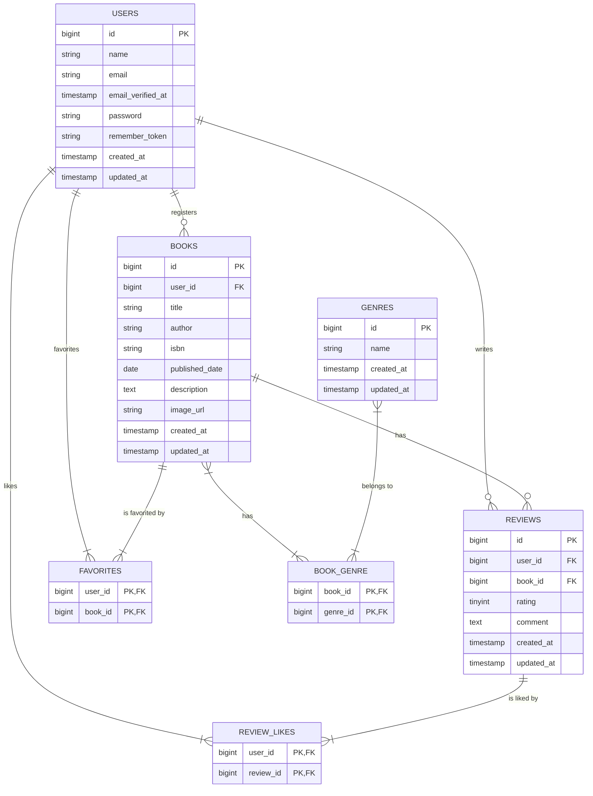

# Chapter 0: 要件の「行間」を読む力【完全版】

## 〜詳細度50%から「実装可能なDB設計」を導くための4つのフェーズ〜

### 1. はじめに

`要件定義書_詳細度50%` には、「書籍を登録したい」とは書かれていても、「ISBNカラムはVARCHAR(13)でユニーク制約が必要」とは書かれていません。
実際の開発現場では、この「要件の行間」をエンジニアがヒアリングと設計で埋める必要があります。

このChapterでは、曖昧な要件から**「データベース基本設計書」を完成させるための思考プロセス**と、その結果として出来上がる**完全なデータベース設計書**を提示します。

---

### 2. 設計を導く4つの思考フェーズ

詳細な設計書を作るために、以下の4段階で要件を分解・再構築します。
この復習教材で提示するヒアリング例というのは、あくまで参考です。
すべてのヒアリング項目を網羅したものではありません。その点をご留意して教材を読み進めてください。

#### Phase 1: エンティティの発見（テーブルの洗い出し）

* **思考**: 「書籍」と「ジャンル」は別々のデータだが、1冊の本に複数のジャンルが付く（多対多）。
* **結論**: `books` テーブルと `genres` テーブルに加え、中間テーブル `book_genre` が必要。
* **思考**: 「お気に入り」や「いいね」は、誰が何に対して行ったかという履歴が必要。
* **結論**: `favorites` テーブル、`review_likes` テーブルが必要。

#### Phase 2: 属性の定義（カラムの詳細化）

* **思考**: ISBNは計算しないので文字列型。フォーマットは13桁で統一したい。
* **結論**: `VARCHAR(13)` 型を採用。
* **思考**: レビューのコメントや書籍の概要は、入力がなくても登録できるようにしたい。
* **結論**: `NULL` を許容（Nullable）にする。

#### Phase 3: リレーション詳細（IDの扱い）

* **思考**: 書籍やレビューは誰が作ったか紐付ける必要がある。
* **結論**: `users` テーブルのIDを外部キー（`user_id`）として持つ。

#### Phase 4: ルールと挙動（制約と整合性）

* **思考**: 同じISBNの本が2冊登録されたり、同じジャンル名が重複するのは防ぎたい。
* **結論**: `isbn` カラムと `name` カラム（ジャンル）に `UNIQUE` 制約をかける。
* **思考**: ユーザーが退会したり書籍が削除されたら、それに紐付くレビューやお気に入りも消えてほしい。
* **結論**: 外部キー制約に `ON DELETE CASCADE` を設定する。

---

### 3. 成果物：データベース基本設計書

上記の思考プロセスを経て完成した、詳細度100%のデータベース設計書です。

#### 3.1. ER図 (Mermaid記法)

---

#### 3.2. テーブル定義書

##### 1. users (ユーザー)

アプリケーションの利用者を管理するテーブル。

| 論理名 | 物理名 | 型 | NULL | 制約・備考 |
| --- | --- | --- | --- | --- |
| ID | `id` | BIGINT | No | PK, AUTO_INCREMENT |
| 名前 | `name` | VARCHAR(255) | No |  |
| メールアドレス | `email` | VARCHAR(255) | No | **UNIQUE** |
| メール確認日時 | `email_verified_at` | TIMESTAMP | Yes |  |
| パスワード | `password` | VARCHAR(255) | No |  |
| ログイン保持 | `remember_token` | VARCHAR(100) | Yes |  |
| 作成日時 | `created_at` | TIMESTAMP | Yes |  |
| 更新日時 | `updated_at` | TIMESTAMP | Yes |  |

##### 2. books (書籍)

ユーザーによって登録された書籍情報を管理するテーブル。

| 論理名 | 物理名 | 型 | NULL | 制約・備考 |
| --- | --- | --- | --- | --- |
| ID | `id` | BIGINT | No | PK, AUTO_INCREMENT |
| ユーザーID | `user_id` | BIGINT | No | FK(`users.id`), **CASCADE DELETE** |
| タイトル | `title` | VARCHAR(255) | No |  |
| 著者 | `author` | VARCHAR(255) | No |  |
| ISBN | `isbn` | VARCHAR(13) | No | **UNIQUE**, 13桁固定 |
| 出版日 | `published_date` | DATE | No |  |
| 概要 | `description` | TEXT | **Yes** |  |
| 画像URL | `image_url` | VARCHAR(255) | **Yes** |  |
| 作成日時 | `created_at` | TIMESTAMP | Yes |  |
| 更新日時 | `updated_at` | TIMESTAMP | Yes |  |

##### 3. reviews (レビュー)

書籍に対するユーザーの評価とコメントを管理するテーブル。

| 論理名 | 物理名 | 型 | NULL | 制約・備考 |
| --- | --- | --- | --- | --- |
| ID | `id` | BIGINT | No | PK, AUTO_INCREMENT |
| ユーザーID | `user_id` | BIGINT | No | FK(`users.id`), **CASCADE DELETE** |
| 書籍ID | `book_id` | BIGINT | No | FK(`books.id`), **CASCADE DELETE** |
| 評価 | `rating` | TINYINT | No | 1〜5の整数 |
| コメント | `comment` | TEXT | **Yes** |  |
| 作成日時 | `created_at` | TIMESTAMP | Yes |  |
| 更新日時 | `updated_at` | TIMESTAMP | Yes |  |

##### 4. genres (ジャンル)

書籍のカテゴリを管理するテーブル。

| 論理名 | 物理名 | 型 | NULL | 制約・備考 |
| --- | --- | --- | --- | --- |
| ID | `id` | BIGINT | No | PK, AUTO_INCREMENT |
| ジャンル名 | `name` | VARCHAR(255) | No | **UNIQUE** |
| 作成日時 | `created_at` | TIMESTAMP | Yes |  |
| 更新日時 | `updated_at` | TIMESTAMP | Yes |  |

##### 5. favorites (お気に入り・中間テーブル)

ユーザーと書籍の多対多関係（お気に入り）を管理。

| 論理名 | 物理名 | 型 | NULL | 制約・備考 |
| --- | --- | --- | --- | --- |
| ID | `id` | BIGINT | No | PK, AUTO_INCREMENT |
| ユーザーID | `user_id` | BIGINT | No | FK(`users.id`), **CASCADE DELETE** |
| 書籍ID | `book_id` | BIGINT | No | FK(`books.id`), **CASCADE DELETE** |
| 作成日時 | `created_at` | TIMESTAMP | Yes |  |
| 更新日時 | `updated_at` | TIMESTAMP | Yes |  |

* **複合ユニーク制約**: `(user_id, book_id)` の組み合わせは重複不可。

##### 6. review_likes (レビューいいね・中間テーブル)

ユーザーとレビューの多対多関係（いいね）を管理。

| 論理名 | 物理名 | 型 | NULL | 制約・備考 |
| --- | --- | --- | --- | --- |
| ID | `id` | BIGINT | No | PK, AUTO_INCREMENT |
| ユーザーID | `user_id` | BIGINT | No | FK(`users.id`), **CASCADE DELETE** |
| レビューID | `review_id` | BIGINT | No | FK(`reviews.id`), **CASCADE DELETE** |
| 作成日時 | `created_at` | TIMESTAMP | Yes |  |
| 更新日時 | `updated_at` | TIMESTAMP | Yes |  |

* **複合ユニーク制約**: `(user_id, review_id)` の組み合わせは重複不可。

##### 7. book_genre (書籍ジャンル紐付け・中間テーブル)

書籍とジャンルの多対多関係を管理。

| 論理名 | 物理名 | 型 | NULL | 制約・備考 |
| --- | --- | --- | --- | --- |
| ID | `id` | BIGINT | No | PK, AUTO_INCREMENT |
| 書籍ID | `book_id` | BIGINT | No | FK(`books.id`), **CASCADE DELETE** |
| ジャンルID | `genre_id` | BIGINT | No | FK(`genres.id`), **CASCADE DELETE** |
| 作成日時 | `created_at` | TIMESTAMP | Yes |  |
| 更新日時 | `updated_at` | TIMESTAMP | Yes |  |

* **複合ユニーク制約**: `(book_id, genre_id)` の組み合わせは重複不可。
