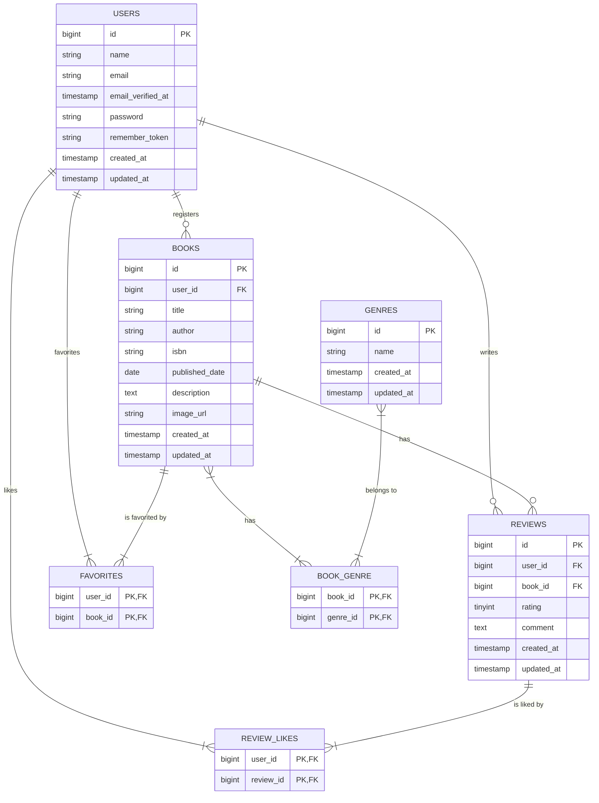

# Chapter 0: 要件の「行間」を読む力【完全版】

## 〜詳細度50%から「実装可能なDB設計」を導くための4つのフェーズ〜

### 1. はじめに

`要件定義書_詳細度50%` には、「書籍を登録したい」とは書かれていても、「ISBNカラムはVARCHAR(13)でユニーク制約が必要」とは書かれていません。
実際の開発現場では、この「要件の行間」をエンジニアがヒアリングと設計で埋める必要があります。

このChapterでは、曖昧な要件から**「データベース基本設計書」を完成させるための思考プロセス**と、その結果として出来上がる**完全なデータベース設計書**を提示します。

---

### 2. 設計を導く4つの思考フェーズ

このフェーズでは詳細な設計書を作るために、後述する4段階で要件を分解・再構築します。  
まずは、Bladeファイルを地図にして詳細設計へと辿り着くことを目的とします。  

受講生の皆さんに提供された要件定義書には「機能」は書かれていますが、「データの詳細」までは書かれていませんでした。  
しかし、プロジェクトの前提を加味すると、クライアントから提供された**Bladeファイル（画面のHTMLコード）**の中には、データベース設計のヒントが隠されているはずです。  
このChapterでは、提供されたBladeファイルを読み解きながら、クライアントPMに対してどのような質問をすれば「詳細度100%のデータベース設計書」に到達できるか、その思考プロセスを追体験します。  

> この復習教材で提示するヒアリング例というのは、あくまで参考です。
> すべてのヒアリング項目を網羅したものではありません。その点をご留意して教材を読み進めてください。


---

#### Phase 1: 機能とナビゲーションから「テーブルの候補」を挙げる

まずは細かいカラムの話をする前に、**「このシステムにはいくつのテーブルが必要か？」**を確定させます。機能一覧と、システムの全体像が見えるナビゲーションバーを確認します。

1. 🔍 観察対象: `resources/views/layouts/navigation.blade.php`

```blade
<x-nav-link :href="route('books.index')" ...>書籍一覧</x-nav-link>
<x-nav-link :href="route('favorites.index')" ...>お気に入り</x-nav-link>
<x-nav-link :href="route('genres.index')" ...>ジャンル一覧</x-nav-link>
<x-nav-link :href="route('ranking.index')" ...>ランキング</x-nav-link>

```

* **エンジニアの思考**:
* 「『書籍(Books)』と『ジャンル(Genres)』は一覧画面がある。つまり、独立して管理されるデータだ。」→ **`books`, `genres` テーブル確定**。
* 「『お気に入り(Favorites)』がある。これは『誰がどの本を』という記録だから、`books`テーブルのカラムではなく、別のテーブルが必要そうだ。」→ **`favorites` テーブル候補**。
* 「『ランキング』は機能であってデータではない（集計結果）。専用テーブルは不要かもしれない。」


2. 🔍 観察対象: `resources/views/books/show.blade.php`

```blade
@foreach($book->reviews as $review)
    ...
    <button class="text-red-500">♥ {{ $review->likes->count() }}</button>
@endforeach

```

* **エンジニアの思考**:
* 「書籍の中に『レビュー』が表示されている。レビューはユーザーが投稿するものだから、独立したデータだ。」→ **`reviews` テーブル確定**。
* 「レビューに対して『いいね(♥)』がついている。お気に入りと同じで、これも『誰がどのレビューに』という記録が必要だ。」→ **`review_likes` テーブル候補**。


* **👨‍💻 PMへのヒアリング (Q1)**:
「機能要件と画面を見る限り、主要なデータとして**『会員(users)』『書籍(books)』『ジャンル(genres)』『レビュー(reviews)』**の4つは独立したテーブルが必要と考えています。
加えて、**『お気に入り』**とレビューへの**『いいね』**機能がありますが、これらは『誰が何に対して行ったか』の履歴を管理するために、それぞれ独立したテーブル（`favorites`, `review_likes`）を作成する認識で合っていますか？」
* **🙋‍♂️ PMの回答**:
「はい、その通りです。お気に入りもいいねも、ユーザーごとの履歴が必要ですので、テーブルを分けてください。」

---

#### Phase 2: フォーム部品から「隠れたテーブル」を見抜く

主要テーブルが出揃いましたが、まだ足りないものがあります。フォームの入力形式から「多対多」の関係を見つけ出し、中間テーブルを特定します。

1.  🔍 観察対象: `resources/views/books/_form.blade.php`

```blade
@foreach($genres as $genre)
    <label>
        <input type="checkbox" name="genres[]" value="{{ $genre->id }}">
        {{ $genre->name }}
    </label>
@endforeach

```

* **エンジニアの思考**:
* 「`name="genres[]"` と配列形式になっているな。」
* 「`type="checkbox"` だから、ユーザーは複数のジャンルを同時に選べるUIだ。」
* 「ということは、書籍テーブルに `genre_id` カラムを1つ持つだけでは足りない。」


* **👨‍💻 PMへのヒアリング (Q2)**:
「書籍登録画面のジャンル選択ですが、チェックボックスで**複数選択**できる仕様になっていますね？ ということは、書籍とジャンルは**多対多（N対N）の関係として実装し、中間に`book_genre` テーブル**を作成する設計でよろしいですか？」
* **🙋‍♂️ PMの回答**:
「はい、その通りです。1冊の本が『小説』であり『ミステリー』であることも想定しています。」

---

#### Phase 3: 入力属性から「データ型と制約」を見抜く

テーブルが出揃ったら、各カラムの型や長さを確定させます。「とりあえずVARCHAR(255)」からの脱却を目指します。

1.  🔍 観察対象: `resources/views/books/_form.blade.php`

```blade
<input type="text" name="isbn" ... maxlength="13" placeholder="9784000000000">
<p>13桁のISBNコードを入力してください</p>

```

* **エンジニアの思考**:
* 「`maxlength="13"` と明記されている。」
* 「プレースホルダーを見るとハイフン（-）がない数字の羅列だ。」
* 「数値型（BIGINT）にするか、文字列型（VARCHAR）にするか…？ 頭に0が来る可能性や、計算に使わないことを考えると文字列型が安全か。」


* **👨‍💻 PMへのヒアリング (Q3)**:
「ISBNについて確認です。画面では13桁制限がありますが、DB定義も**`VARCHAR(13)`**（固定長に近い扱い）で制限をかけて良いですか？ また、システム内で**ISBNの重複は許容しますか？**（同じ本を複数人が登録できるか？）」
* **🙋‍♂️ PMの回答**:
「はい、13桁固定でお願いします。ハイフンは除外して保存してください。重複については、今回は**ISBNを一意（Unique）**とし、同じ本は二重登録できないようにしてください。」

2.  🔍 観察対象: `resources/views/reviews/edit.blade.php`

```blade
@for($i = 1; $i <= 5; $i++)
    <input type="radio" name="rating" value="{{ $i }}" ...>
@endfor

```

* **エンジニアの思考**:
* 「ラジオボタンで `1` から `5` までの値しか送られてこない。」
* 「小数はなさそうだ。`INTEGER` よりも小さい型で十分だな。」


* **👨‍💻 PMへのヒアリング (Q4)**:
「レビューの評価（Rating）ですが、画面を見る限り1〜5の整数のみですね？ データベースの型は最も容量の小さい**`TINYINT`**（または `UNSIGNED TINYINT`）を採用し、範囲を制限しても問題ないですか？」
* **🙋‍♂️ PMの回答**:
「はい、整数のみでOKです。容量節約のため `TINYINT` でお願いします。」

3.  🔍 観察対象: `resources/views/books/_form.blade.php`

```blade
<textarea name="description" ... placeholder="書籍の概要を入力（任意）"></textarea>

```

* **エンジニアの思考**:
* 「`textarea` が使われているということは、長い文章が入る可能性がある。」
* 「プレースホルダーに**（任意）**と書いてあるぞ。これは重要だ。」


* **👨‍💻 PMへのヒアリング (Q5)**:
「書籍の『概要』欄ですが、長文になる可能性があるため `VARCHAR(255)` ではなく **`TEXT` 型**を採用します。また、画面に『任意』とあるので、データベース側でも **`NULL` を許容（Nullable）** する設計にします。これで認識合っていますか？」
* **🙋‍♂️ PMの回答**:
「はい、その認識でお願いします。画像URLも同様に任意項目でお願いします。」

---

#### Phase 4: 操作ボタンから「削除ロジック」を見抜く

最後に、データの整合性を守るための挙動（外部キー制約やロジック）を詰めます。

1.  🔍 観察対象: `resources/views/genres/index.blade.php`

```blade
<form action="{{ route('genres.destroy', $genre) }}" ... onsubmit="return confirm('本当に削除しますか？');">
    @method('DELETE')
    <button type="submit">削除</button>
</form>

```

* **エンジニアの思考**:
* 「ジャンル一覧に削除ボタンがある。」
* 「待てよ…もしこのジャンルを使っている書籍が既に存在していたらどうなる？」
* 「勝手に消したら、書籍データがおかしくなる（参照整合性エラー）か、書籍のジャンル設定が消えてしまう。」


* **👨‍💻 PMへのヒアリング (Q6 - 重要)**:
「ジャンルの削除機能について質問です。**『既に書籍が紐付いているジャンル』を削除しようとした場合**、どう動くべきですか？
A. 構わず削除し、書籍との紐付けも消してしまう（Cascade）
B. エラーメッセージを出して、削除させない（Restrict）」
* **🙋‍♂️ PMの回答**:
「B案でお願いします。使われているジャンルを誤って消すと影響が大きいので、**『紐付く書籍がある場合は削除できない』というエラー**にしてください。」

---

#### 💡 ヒアリングまとめ：現場のバックエンドエンジニアが持つ「3つの観点」

今回はBladeファイル（画面のコード）を地図にして仕様を読み解きましたが、実際の現場でプロのエンジニアがPMにヒアリングを行う際、本当に確認しようとしているのは画面の裏側にある**「システムとしての安全性」**です。

皆さんが今回Bladeの違和感を通して確認したことは、実はエンジニアが最も重要視する以下の「3つの観点」に集約されます。これらは**「後から変更すると修正コストが甚大になる」**ため、初期段階で徹底的に詰める必要があるのです。

1. データ構造の拡張性 (Cardinality)

* **Bladeでの気づき:** 「チェックボックスだから複数選択だ」
* **エンジニアの観点:** **「今は1つだけど、将来2つ以上になる可能性はないか？」**
* **解説:** `1対多` でテーブルを作った後に、`多対多` に変更するのは、テーブル構造の変更やデータ移行が発生し、非常に大変です。「ジャンルは本当に1つだけですか？」「共同著者はいますか？」といった質問は、将来の拡張リスクを回避するために行います。

2. データのライフサイクルと整合性 (Integrity)

* **Bladeでの気づき:** 「削除ボタンがあるけど、消したら紐付くデータはどうなる？」
* **エンジニアの観点:** **「親データが消えた時、子データはどうなるべきか？」**
* **解説:** ここが決まっていないと、画面に表示されない「ゴミデータ」がDBに溜まり続けたり、逆に消してはいけないデータが連鎖して消える事故が起きます。
* **ユーザー退会:** 全て消えて良い（Cascade）
* **ジャンル削除:** 使用中は消してはいけない（Restrict）
このように、データの種類によって「正しい死に方（削除ルール）」を定義するのがエンジニアの責任です。

3. データの厳密さ (Strictness)

* **Bladeでの気づき:** 「13桁制限がある」「任意と書いてある」
* **エンジニアの観点:** **「システムとして絶対に許してはいけないデータは何か？」**
* **解説:** アプリケーション側のバリデーションはバグですり抜ける可能性がありますが、データベースの制約（Unique制約や型定義、Not Null）は最後の砦としてデータを守ります。「重複登録はどう扱うか？」「必須項目は何か？」を詰めることは、システムの品質そのものを決める行為です。

このようにプロのエンジニアは、単に「Bladeにこう書いてあるから」だけでなく、**「システムが長く運用された時にデータが壊れないか？」**という視点を持ってヒアリングを行っています。この視座を持って要件定義に向き合えるようになれば、あなたの設計スキルは確固たるものになるでしょう。

---

### 3. 成果物：データベース基本設計書

上記のプロセスを繰り返すことで完成した、詳細度100%のデータベース設計書です。

#### 3.1. ER図 (Mermaid記法)




---

#### 3.2. テーブル定義書

##### 1. users (ユーザー)

アプリケーションの利用者を管理するテーブル。

| 論理名 | 物理名 | 型 | NULL | 制約・備考 |
| --- | --- | --- | --- | --- |
| ID | `id` | BIGINT | No | PK, AUTO_INCREMENT |
| 名前 | `name` | VARCHAR(255) | No |  |
| メールアドレス | `email` | VARCHAR(255) | No | **UNIQUE** |
| メール確認日時 | `email_verified_at` | TIMESTAMP | Yes |  |
| パスワード | `password` | VARCHAR(255) | No |  |
| ログイン保持 | `remember_token` | VARCHAR(100) | Yes |  |
| 作成日時 | `created_at` | TIMESTAMP | Yes |  |
| 更新日時 | `updated_at` | TIMESTAMP | Yes |  |

##### 2. books (書籍)

ユーザーによって登録された書籍情報を管理するテーブル。

| 論理名 | 物理名 | 型 | NULL | 制約・備考 |
| --- | --- | --- | --- | --- |
| ID | `id` | BIGINT | No | PK, AUTO_INCREMENT |
| ユーザーID | `user_id` | BIGINT | No | FK(`users.id`), **CASCADE DELETE** |
| タイトル | `title` | VARCHAR(255) | No |  |
| 著者 | `author` | VARCHAR(255) | No |  |
| ISBN | `isbn` | VARCHAR(13) | No | **UNIQUE**, 13桁固定 |
| 出版日 | `published_date` | DATE | No |  |
| 概要 | `description` | TEXT | **Yes** |  |
| 画像URL | `image_url` | VARCHAR(255) | **Yes** |  |
| 作成日時 | `created_at` | TIMESTAMP | Yes |  |
| 更新日時 | `updated_at` | TIMESTAMP | Yes |  |

##### 3. reviews (レビュー)

書籍に対するユーザーの評価とコメントを管理するテーブル。

| 論理名 | 物理名 | 型 | NULL | 制約・備考 |
| --- | --- | --- | --- | --- |
| ID | `id` | BIGINT | No | PK, AUTO_INCREMENT |
| ユーザーID | `user_id` | BIGINT | No | FK(`users.id`), **CASCADE DELETE** |
| 書籍ID | `book_id` | BIGINT | No | FK(`books.id`), **CASCADE DELETE** |
| 評価 | `rating` | TINYINT | No | 1〜5の整数 |
| コメント | `comment` | TEXT | **Yes** |  |
| 作成日時 | `created_at` | TIMESTAMP | Yes |  |
| 更新日時 | `updated_at` | TIMESTAMP | Yes |  |

##### 4. genres (ジャンル)

書籍のカテゴリを管理するテーブル。

| 論理名 | 物理名 | 型 | NULL | 制約・備考 |
| --- | --- | --- | --- | --- |
| ID | `id` | BIGINT | No | PK, AUTO_INCREMENT |
| ジャンル名 | `name` | VARCHAR(255) | No | **UNIQUE** |
| 作成日時 | `created_at` | TIMESTAMP | Yes |  |
| 更新日時 | `updated_at` | TIMESTAMP | Yes |  |

##### 5. favorites (お気に入り・中間テーブル)

ユーザーと書籍の多対多関係（お気に入り）を管理。

| 論理名 | 物理名 | 型 | NULL | 制約・備考 |
| --- | --- | --- | --- | --- |
| ID | `id` | BIGINT | No | PK, AUTO_INCREMENT |
| ユーザーID | `user_id` | BIGINT | No | FK(`users.id`), **CASCADE DELETE** |
| 書籍ID | `book_id` | BIGINT | No | FK(`books.id`), **CASCADE DELETE** |
| 作成日時 | `created_at` | TIMESTAMP | Yes |  |
| 更新日時 | `updated_at` | TIMESTAMP | Yes |  |

* **複合ユニーク制約**: `(user_id, book_id)` の組み合わせは重複不可。

##### 6. review_likes (レビューいいね・中間テーブル)

ユーザーとレビューの多対多関係（いいね）を管理。

| 論理名 | 物理名 | 型 | NULL | 制約・備考 |
| --- | --- | --- | --- | --- |
| ID | `id` | BIGINT | No | PK, AUTO_INCREMENT |
| ユーザーID | `user_id` | BIGINT | No | FK(`users.id`), **CASCADE DELETE** |
| レビューID | `review_id` | BIGINT | No | FK(`reviews.id`), **CASCADE DELETE** |
| 作成日時 | `created_at` | TIMESTAMP | Yes |  |
| 更新日時 | `updated_at` | TIMESTAMP | Yes |  |

* **複合ユニーク制約**: `(user_id, review_id)` の組み合わせは重複不可。

##### 7. book_genre (書籍ジャンル紐付け・中間テーブル)

書籍とジャンルの多対多関係を管理。

| 論理名 | 物理名 | 型 | NULL | 制約・備考 |
| --- | --- | --- | --- | --- |
| ID | `id` | BIGINT | No | PK, AUTO_INCREMENT |
| 書籍ID | `book_id` | BIGINT | No | FK(`books.id`), **CASCADE DELETE** |
| ジャンルID | `genre_id` | BIGINT | No | FK(`genres.id`), **CASCADE DELETE** |
| 作成日時 | `created_at` | TIMESTAMP | Yes |  |
| 更新日時 | `updated_at` | TIMESTAMP | Yes |  |

* **複合ユニーク制約**: `(book_id, genre_id)` の組み合わせは重複不可。
