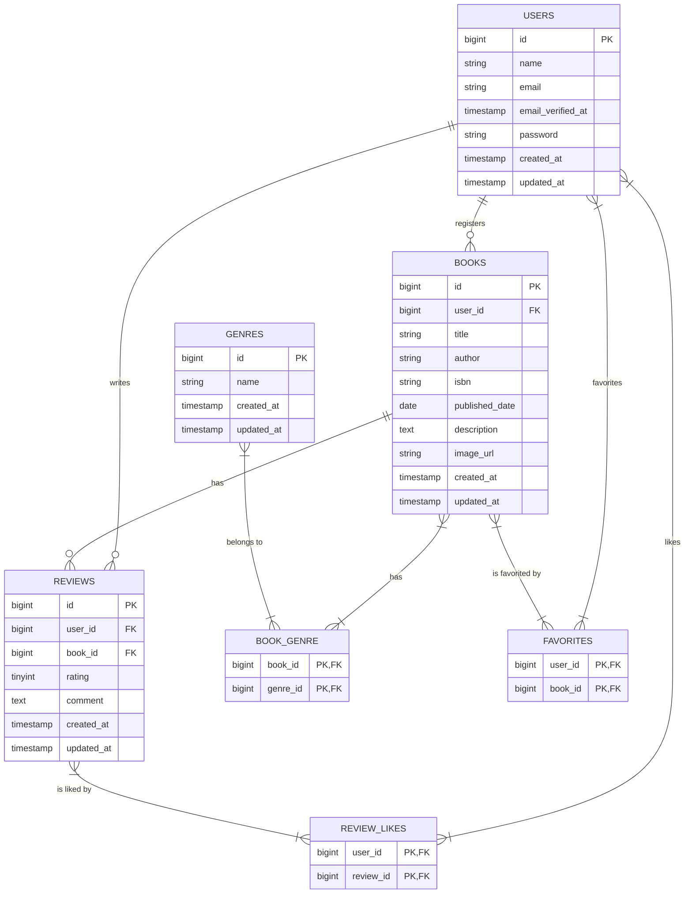

# Chapter 2: データベース設計とマイグレーション

このChapterでは、アプリケーションの根幹となるデータベースの設計を行い、Laravelのマイグレーション機能を使ってテーブルを実際に作成します。

## 2-1. データベース設計の考え方

> **思考プロセス:**
> 優れたアプリケーションを開発するためには、まず堅牢なデータ構造を設計することが不可欠です。設計を始めるにあたり、まず要件定義書からアプリケーションに必要な「モノ」と「コト」を洗い出します。
> 
> - **モノ（エンティティ）**: アプリケーションが管理する主要なデータ。今回は「ユーザー」「書籍」「ジャンル」「レビュー」が該当します。
> - **コト（イベント、関連）**: 「モノ」と「モノ」の間で発生する出来事や関係性。「ユーザーがレビューを投稿する」「書籍が特定のジャンルに属する」「ユーザーが書籍をお気に入りに登録する」「ユーザーがレビューにいいねする」などが該当します。
> 
> これらをテーブルとリレーションシップに落とし込んでいきます。
> 
> 1.  **Usersテーブル**: ユーザー情報を格納します。Laravelのデフォルトで用意されています。
> 2.  **Booksテーブル**: 書籍情報を格納します。誰が登録した書籍かを記録するため、`user_id`カラムを持たせ、`users`テーブルと**1対多**の関係を結びます。
> 3.  **Genresテーブル**: ジャンル名（文学、ビジネスなど）を格納します。
> 4.  **Reviewsテーブル**: レビュー情報を格納します。誰が(`user_id`)、どの書籍に(`book_id`)投稿したレビューなのかを記録するため、`users`テーブルと`books`テーブルの両方と**1対多**の関係を結びます。
> 5.  **中間テーブル**: 
>     - **`book_genre`**: 「書籍」と「ジャンル」の関係は、1冊の書籍が複数のジャンルに属せるため、**多対多**の関係になります。この関係は中間テーブルで表現します。
>     - **`favorites`**: 「ユーザー」と「書籍」の「お気に入り」関係も**多対多**です。1人のユーザーが複数の書籍をお気に入りにでき、1冊の書籍は複数のユーザーからお気に入りに登録されます。
>     - **`review_likes`**: 「ユーザー」と「レビュー」の「いいね」関係も同様に**多対多**です。

### ER図

上記の考え方を元に作成したER図（エンティティ関連図）がこちらです。テーブル間の関係性が一目でわかります。



## 2-2. マイグレーションファイルの作成

設計が固まったら、Artisanコマンドでマイグレーションファイルを生成します。マイグレーションは「データベースのバージョン管理システム」のようなもので、テーブルの作成や変更の履歴をコードで管理できます。

```bash
# genresテーブル用
sail artisan make:migration create_genres_table

# booksテーブル用
sail artisan make:migration create_books_table

# reviewsテーブル用
sail artisan make:migration create_reviews_table

# book_genre中間テーブル用
sail artisan make:migration create_book_genre_table

# favorites中間テーブル用
sail artisan make:migration create_favorites_table

# review_likes中間テーブル用
sail artisan make:migration create_review_likes_table
```

これにより、`database/migrations`ディレクトリに6つのファイルが生成されます。

## 2-3. マイグレーションファイルの実装

生成された各マイグレーションファイルの`up`メソッドに、テーブルの構造を定義していきます。

### `create_genres_table`

**`database/migrations/..._create_genres_table.php`**
```php
Schema::create('genres', function (Blueprint $table) {
    $table->id();
    $table->string('name')->unique();
    $table->timestamps();
});
```

### `create_books_table`

**`database/migrations/..._create_books_table.php`**
```php
Schema::create('books', function (Blueprint $table) {
    $table->id();
    $table->foreignId('user_id')->constrained()->onDelete('cascade');
    $table->string('title');
    $table->string('author');
    $table->string('isbn', 13)->unique();
    $table->date('published_date');
    $table->text('description')->nullable();
    $table->string('image_url')->nullable();
    $table->timestamps();
});
```
> **コード解説:**
> - `$table->foreignId('user_id')->constrained()->onDelete('cascade');` は非常に重要です。参照先の`users`テーブルのレコードが削除された場合、この`books`テーブルの関連レコードも一緒に削除（連鎖削除）されるように設定します。これにより、存在しないユーザーが登録した書籍、という不正なデータが残るのを防ぎます。

### `create_reviews_table`

**`database/migrations/..._create_reviews_table.php`**
```php
Schema::create('reviews', function (Blueprint $table) {
    $table->id();
    $table->foreignId('user_id')->constrained()->onDelete('cascade');
    $table->foreignId('book_id')->constrained()->onDelete('cascade');
    $table->unsignedTinyInteger('rating');
    $table->text('comment'); // 模範解答ではnullableではない
    $table->timestamps();
});
```
> **コード解説:**
> - 模範解答では、1ユーザーが1書籍に複数のレビューを投稿できる仕様のため、複合ユニークキー制約は設定しません。
> - `comment`カラムも`nullable`ではなく、必須入力となります。

### `create_book_genre_table`

**`database/migrations/..._create_book_genre_table.php`**
```php
Schema::create('book_genre', function (Blueprint $table) {
    $table->foreignId('book_id')->constrained()->onDelete('cascade');
    $table->foreignId('genre_id')->constrained()->onDelete('cascade');
    $table->primary(['book_id', 'genre_id']);
});
```
> **コード解説:**
> - 中間テーブルには通常`id`カラムや`timestamps`は不要です。
> - `$table->primary(['book_id', 'genre_id']);`: 複合主キーを設定することで、`(book_id: 1, genre_id: 1)` という組み合わせの重複を防ぎます。

### `create_favorites_table`

**`database/migrations/..._create_favorites_table.php`**
```php
Schema::create('favorites', function (Blueprint $table) {
    $table->foreignId('user_id')->constrained()->onDelete('cascade');
    $table->foreignId('book_id')->constrained()->onDelete('cascade');
    $table->primary(['user_id', 'book_id']);
});
```

### `create_review_likes_table`

**`database/migrations/..._create_review_likes_table.php`**
```php
Schema::create('review_likes', function (Blueprint $table) {
    $table->foreignId('user_id')->constrained()->onDelete('cascade');
    $table->foreignId('review_id')->constrained()->onDelete('cascade');
    $table->primary(['user_id', 'review_id']);
});
```

## 2-4. マイグレーションの実行

すべてのマイグレーションファイルの準備が整ったので、コマンドを実行してデータベースにテーブルを作成します。

```bash
sail artisan migrate
```

このコマンドを実行すると、まだ実行されていない`up`メソッドが実行され、定義した通りのテーブルがMySQLデータベース内に作成されます。

---

これでアプリケーションの骨格となるデータベース構造が完成しました。次のChapterでは、これらのテーブルを操作するためのEloquentモデルと、モデル間のリレーションシップを定義していきます。
