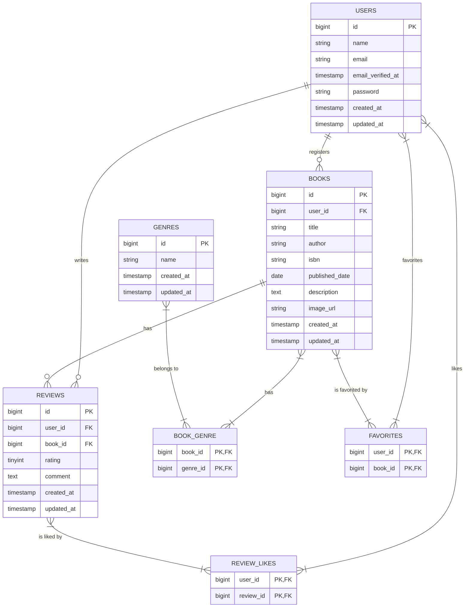

# Chapter 2: データベース設計とマイグレーション

このChapterでは、アプリケーションの根幹となるデータベースの設計を行い、Laravelのマイグレーション機能を使ってテーブルを実際に作成します。

## 2-1. 先輩エンジニアの思考プロセス：曖昧な要件から設計へ

実際の開発現場では、最初から完璧な仕様書が渡されることは稀です。特に「要件定義書50%」のようなドキュメントは、プロジェクトの初期段階でよく見られます。ここから、どうやって具体的な設計に落とし込んでいくのでしょうか？

### Step 1: 要件定義書50%を解読する

まず、与えられた情報から「**何がわかっていて、何がわからないか**」を明確に切り分けます。

> **思考プロセス（要件定義書50%を読んで）**
> 
> 1.  **機能一覧の把握**: 「書籍管理」「レビュー管理」「お気に入り機能」など、アプリケーションが持つべき機能の全体像を掴む。ここに出てくる**名詞**（書籍、レビュー、ジャンル、ユーザー）が、データベースのテーブル設計の核（エンティティ）になる可能性が高いと推測する。
> 
> 2.  **URI設計の確認**: `/books/{book}/reviews` のようなURI構造から、「レビューは書籍に紐づく」という**親子関係（リレーション）**が見えてくる。`/favorites/{book}/toggle` からは「お気に入りは書籍に対して行う」という関係がわかる。
> 
> 3.  **UI（Bladeテンプレート）の確認**: 提供されているBladeテンプレートを眺める。「書籍登録フォーム」に `title`, `author`, `isbn` などの入力欄があれば、これらが`books`テーブルのカラムになるだろうと予測できる。「書籍詳細ページ」にレビュー一覧が表示されていれば、書籍とレビューが1対多の関係にあることが確信に変わる。
> 
> 4.  **不明点・確認点の洗い出し**: ここまでで、大枠は見えてきた。しかし、詳細な仕様はまだ不明瞭だ。例えば、以下のような疑問が浮かんでくる。
>     - 書籍とジャンルの関係は？ 1冊の書籍は1つのジャンルにしか属せないのか、それとも複数のジャンルに属せるのか？（例：「技術書」かつ「プログラミング」）
>     - レビューは1ユーザーにつき1書籍に1回しか投稿できないのか？ それとも複数回投稿できるのか？
>     - 「お気に入り」や「いいね」は、誰がどの書籍/レビューに対して行ったかを記録する必要がある。これはどういうテーブル構造にすべきか？

### Step 2: PM（コーチ）へのヒアリング

洗い出した不明点を元に、PM（この教材ではコーチ）にヒアリングを行います。重要なのは、**ただ質問するのではなく、「自分はこう考えたのですが、この認識で合っていますか？」という仮説ベースで確認する**ことです。

> **ヒアリングの例文**
> 
> 「PM（コーチ）、データベース設計についてご相談です。要件定義書とUIを拝見し、以下のように考えたのですが、認識合わせをさせていただけますでしょうか？」
> 
> 1.  **書籍とジャンルの関係について**：「1冊の書籍が『技術書』であり『デザイン』でもある、といったケースを考慮し、書籍とジャンルは**多対多**の関係になると考えました。そのために、`books`テーブルと`genres`テーブルの間に`book_genre`という中間テーブルを設ける設計でいかがでしょうか？」
> 
> 2.  **レビューの投稿回数について**：「現状、1ユーザーが1つの書籍に複数レビューを投稿できる仕様に見えますが、これは意図したものでしょうか？ もし1回に制限する場合、`reviews`テーブルに`user_id`と`book_id`の複合ユニークキー制約を追加する必要があります。」
> 
> 3.  **お気に入り・いいね機能について**：「『ユーザー』と『書籍』、『ユーザー』と『レビュー』の関係も多対多になると考え、それぞれ`favorites`テーブルと`review_likes`テーブルという中間テーブルで管理する設計を想定しています。これにより、誰が何をお気に入り/いいねしたかを記録できます。」

このように、具体的な設計案を提示しながら質問することで、PMは「Yes/No」や具体的なフィードバックを返しやすくなり、コミュニケーションが円滑に進みます。

### Step 3: ヒアリング結果を元にER図へ落とし込む

PMとのヒアリングで仕様が固まったら、それをER図（エンティティ関連図）に落とし込みます。ER図は、テーブル（エンティティ）、カラム（属性）、テーブル間の関係（リレーションシップ）を視覚的に表現したものです。

> **思考プロセス（ER図作成）**
> 
> 1.  **エンティティの洗い出し**: ヒアリングで固まった「ユーザー」「書籍」「ジャンル」「レビュー」を四角で囲み、テーブルとして定義する。
> 
> 2.  **属性（カラム）の定義**: 各テーブルが持つべき情報をカラムとして列挙する。`id` (主キー), `created_at`, `updated_at` はLaravelの慣習として必ず含める。
> 
> 3.  **リレーションシップの定義**: テーブル間を線で結び、関係性を定義する。
>     - **1対多**: `users`と`books`（1人のユーザーが多数の書籍を登録）。線の記号は `||--o{` のように表現する。
>     - **多対多**: `books`と`genres`。間に`book_genre`中間テーブルを配置し、`books`と`book_genre`、`genres`と`book_genre`をそれぞれ1対多で結ぶ。線の記号は `}|--|{` のように表現する。
> 
> このプロセスを経て、最終的なデータベースの設計図であるER図が完成します。

---

## 2-2. データベース設計とER図

上記の思考プロセスを経て、今回のアプリケーションに必要なテーブルとリレーションシップを設計します。

- **Usersテーブル**: ユーザー情報
- **Booksテーブル**: 書籍情報 (`user_id`を持つ)
- **Genresテーブル**: ジャンル情報
- **Reviewsテーブル**: レビュー情報 (`user_id`, `book_id`を持つ)
- **book_genreテーブル**: 書籍とジャンルの**多対多**関係を表現する中間テーブル
- **favoritesテーブル**: ユーザーと書籍の「お気に入り」関係（**多対多**）を表現する中間テーブル
- **review_likesテーブル**: ユーザーとレビューの「いいね」関係（**多対多**）を表現する中間テーブル

### ER図



## 2-3. マイグレーションファイルの作成

設計が固まったら、Artisanコマンドでマイグレーションファイルを生成します。

```bash
# ... (マイグレーションファイル作成コマンドは変更なし)
sail artisan make:migration create_genres_table
sail artisan make:migration create_books_table
sail artisan make:migration create_reviews_table
sail artisan make:migration create_book_genre_table
sail artisan make:migration create_favorites_table
sail artisan make:migration create_review_likes_table
```

## 2-4. マイグレーションファイルの実装

(ここから先のマイグレーションファイルの実装内容は変更ありません)

### `create_genres_table`

**`database/migrations/..._create_genres_table.php`**
```php
Schema::create("genres", function (Blueprint \$table) {
    \$table->id();
    \$table->string("name")->unique();
    \$table->timestamps();
});
```

### `create_books_table`

**`database/migrations/..._create_books_table.php`**
```php
Schema::create("books", function (Blueprint \$table) {
    \$table->id();
    \$table->foreignId("user_id")->constrained()->onDelete("cascade");
    \$table->string("title");
    \$table->string("author");
    \$table->string("isbn", 13)->unique();
    \$table->date("published_date");
    \$table->text("description")->nullable();
    \$table->string("image_url")->nullable();
    \$table->timestamps();
});
```

### `create_reviews_table`

**`database/migrations/..._create_reviews_table.php`**
```php
Schema::create("reviews", function (Blueprint \$table) {
    \$table->id();
    \$table->foreignId("user_id")->constrained()->onDelete("cascade");
    \$table->foreignId("book_id")->constrained()->onDelete("cascade");
    \$table->unsignedTinyInteger("rating");
    \$table->text("comment");
    \$table->timestamps();
});
```

### `create_book_genre_table`

**`database/migrations/..._create_book_genre_table.php`**
```php
Schema::create("book_genre", function (Blueprint \$table) {
    \$table->foreignId("book_id")->constrained()->onDelete("cascade");
    \$table->foreignId("genre_id")->constrained()->onDelete("cascade");
    \$table->primary(["book_id", "genre_id"]);
});
```

### `create_favorites_table`

**`database/migrations/..._create_favorites_table.php`**
```php
Schema::create("favorites", function (Blueprint \$table) {
    \$table->foreignId("user_id")->constrained()->onDelete("cascade");
    \$table->foreignId("book_id")->constrained()->onDelete("cascade");
    \$table->primary(["user_id", "book_id"]);
});
```

### `create_review_likes_table`

**`database/migrations/..._create_review_likes_table.php`**
```php
Schema::create("review_likes", function (Blueprint \$table) {
    \$table->foreignId("user_id")->constrained()->onDelete("cascade");
    \$table->foreignId("review_id")->constrained()->onDelete("cascade");
    \$table->primary(["user_id", "review_id"]);
});
```

## 2-5. マイグレーションの実行

```bash
sail artisan migrate
```

---

これでアプリケーションの骨格となるデータベース構造が完成しました。次のChapterでは、これらのテーブルを操作するためのEloquentモデルと、モデル間のリレーションシップを定義していきます。
