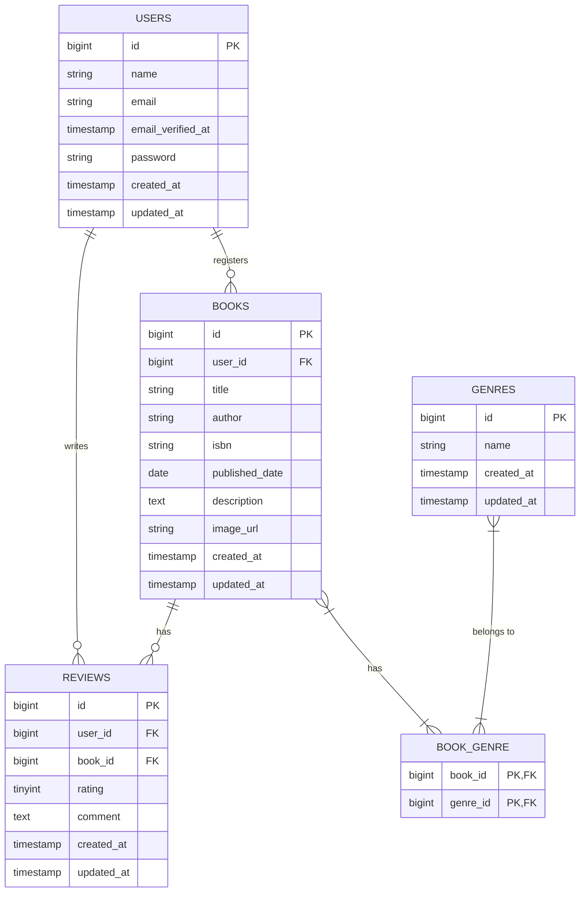

'''# Chapter 2: データベース設計とマイグレーション

このChapterでは、アプリケーションの根幹となるデータベースの設計を行い、Laravelのマイグレーション機能を使ってテーブルを実際に作成します。

## 2-1. データベース設計の考え方

> **思考プロセス:**
> 優れたアプリケーションを開発するためには、まず堅牢なデータ構造を設計することが不可欠です。設計を始めるにあたり、まず要件定義書からアプリケーションに必要な「モノ」と「コト」を洗い出します。
> 
> - **モノ（エンティティ）**: アプリケーションが管理する主要なデータ。今回は「ユーザー」「書籍」「ジャンル」が該当します。
> - **コト（イベント、関連）**: 「モノ」と「モノ」の間で発生する出来事や関係性。「ユーザーがレビューを投稿する」「ユーザーが書籍をお気に入りに登録する」「書籍が特定のジャンルに属する」などが該当します。
> 
> これらをテーブルとリレーションシップに落とし込んでいきます。
> 
> 1.  **Usersテーブル**: ユーザー情報を格納します。Laravelのデフォルトで用意されています。
> 2.  **Booksテーブル**: 書籍情報を格納します。誰が登録した書籍かを記録するため、`user_id`カラムを持たせ、`users`テーブルと**1対多**の関係を結びます。
> 3.  **Genresテーブル**: ジャンル名（文学、ビジネスなど）を格納します。
> 4.  **Reviewsテーブル**: レビュー情報を格納します。誰が(`user_id`)、どの書籍に(`book_id`)投稿したレビューなのかを記録するため、`users`テーブルと`books`テーブルの両方と**1対多**の関係を結びます。
> 5.  **中間テーブル**: 「書籍」と「ジャンル」の関係は、1冊の書籍が複数のジャンル（例: 「SF」かつ「アドベンチャー」）に属せるため、**多対多**の関係になります。このような関係は、`book_genre`という中間テーブル（ピボットテーブル）を作成して表現します。このテーブルは`book_id`と`genre_id`のペアを保持します。

### ER図

上記の考え方を元に作成したER図（エンティティ関連図）がこちらです。テーブル間の関係性が一目でわかります。



## 2-2. マイグレーションファイルの作成

設計が固まったら、Artisanコマンドでマイグレーションファイルを生成します。マイグレーションは「データベースのバージョン管理システム」のようなもので、テーブルの作成や変更の履歴をコードで管理できます。

```bash
# genresテーブル用
sail artisan make:migration create_genres_table

# booksテーブル用
sail artisan make:migration create_books_table

# reviewsテーブル用
sail artisan make:migration create_reviews_table

# book_genre中間テーブル用
sail artisan make:migration create_book_genre_table
```

これにより、`database/migrations`ディレクトリに4つのファイルが生成されます。

## 2-3. マイグレーションファイルの実装

生成された各マイグレーションファイルの`up`メソッドに、テーブルの構造を定義していきます。

### `create_genres_table`

**`database/migrations/xxxx_xx_xx_xxxxxx_create_genres_table.php`**
```php
<?php

use Illuminate\Database\Migrations\Migration;
use Illuminate\Database\Schema\Blueprint;
use Illuminate\Support\Facades\Schema;

return new class extends Migration
{
    public function up(): void
    {
        Schema::create('genres', function (Blueprint $table) {
            $table->id();
            $table->string('name')->unique(); // ジャンル名は重複しない
            $table->timestamps();
        });
    }

    public function down(): void
    {
        Schema::dropIfExists('genres');
    }
};
```

### `create_books_table`

**`database/migrations/xxxx_xx_xx_xxxxxx_create_books_table.php`**
```php
<?php

use Illuminate\Database\Migrations\Migration;
use Illuminate\Database\Schema\Blueprint;
use Illuminate\Support\Facades\Schema;

return new class extends Migration
{
    public function up(): void
    {
        Schema::create('books', function (Blueprint $table) {
            $table->id();
            $table->foreignId('user_id')->constrained()->onDelete('cascade'); // 外部キー
            $table->string('title');
            $table->string('author');
            $table->string('isbn', 13)->unique();
            $table->date('published_date');
            $table->text('description')->nullable();
            $table->string('image_url')->nullable();
            $table->timestamps();
        });
    }

    public function down(): void
    {
        Schema::dropIfExists('books');
    }
};
```
> **コード解説:**
> - `$table->foreignId('user_id')->constrained()->onDelete('cascade');` は非常に重要です。
>   - `foreignId('user_id')`: `users`テーブルの`id`を参照する`user_id`というカラムを作成します。
>   - `constrained()`: 外部キー制約を自動的に設定します。
>   - `onDelete('cascade')`: 参照先の`users`テーブルのレコードが削除された場合、この`books`テーブルの関連レコードも一緒に削除（連鎖削除）されるように設定します。これにより、存在しないユーザーが登録した書籍、という不正なデータが残るのを防ぎます。

### `create_reviews_table`

**`database/migrations/xxxx_xx_xx_xxxxxx_create_reviews_table.php`**
```php
<?php

use Illuminate\Database\Migrations\Migration;
use Illuminate\Database\Schema\Blueprint;
use Illuminate\Support\Facades\Schema;

return new class extends Migration
{
    public function up(): void
    {
        Schema::create('reviews', function (Blueprint $table) {
            $table->id();
            $table->foreignId('user_id')->constrained()->onDelete('cascade');
            $table->foreignId('book_id')->constrained()->onDelete('cascade');
            $table->unsignedTinyInteger('rating'); // 1-5の評価なので符号なしTINYINT
            $table->text('comment')->nullable();
            $table->timestamps();

            $table->unique(['user_id', 'book_id']); // 1ユーザーは1書籍に1レビューまで
        });
    }

    public function down(): void
    {
        Schema::dropIfExists('reviews');
    }
};
```
> **コード解説:**
> - `$table->unique(['user_id', 'book_id']);`: 複合ユニークキー制約です。これにより、同一ユーザーが同一書籍に対して複数のレビューを投稿することをデータベースレベルで禁止できます。

### `create_book_genre_table`

**`database/migrations/xxxx_xx_xx_xxxxxx_create_book_genre_table.php`**
```php
<?php

use Illuminate\Database\Migrations\Migration;
use Illuminate\Database\Schema\Blueprint;
use Illuminate\Support\Facades\Schema;

return new class extends Migration
{
    public function up(): void
    {
        Schema::create('book_genre', function (Blueprint $table) {
            $table->foreignId('book_id')->constrained()->onDelete('cascade');
            $table->foreignId('genre_id')->constrained()->onDelete('cascade');

            // 主キーをbook_idとgenre_idの複合キーに設定
            $table->primary(['book_id', 'genre_id']);
        });
    }

    public function down(): void
    {
        Schema::dropIfExists('book_genre');
    }
};
```
> **コード解説:**
> - 中間テーブルには通常`id`カラムや`timestamps`は不要です。
> - `$table->primary(['book_id', 'genre_id']);`: 複合主キーを設定することで、`(book_id: 1, genre_id: 1)` という組み合わせの重複を防ぎます。

## 2-4. マイグレーションの実行

すべてのマイグレーションファイルの準備が整ったので、コマンドを実行してデータベースにテーブルを作成します。

```bash
sail artisan migrate
```

このコマンドを実行すると、まだ実行されていない`up`メソッドが実行され、定義した通りのテーブルがMySQLデータベース内に作成されます。

---

これでアプリケーションの骨格となるデータベース構造が完成しました。次のChapterでは、これらのテーブルを操作するためのEloquentモデルと、モデル間のリレーションシップを定義していきます。
'''
