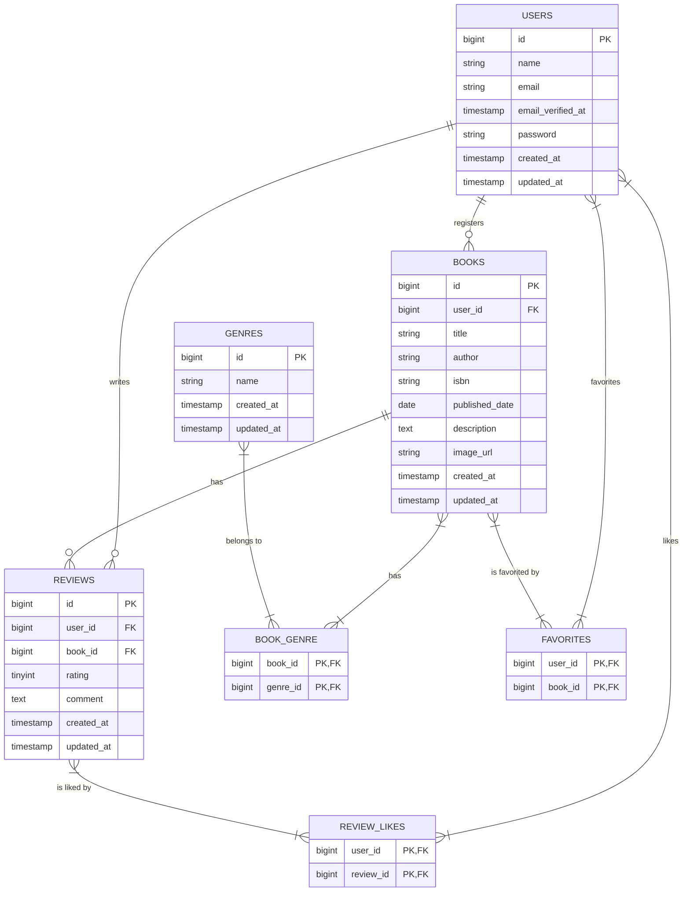

# Chapter 2: データベース設計とマイグレーション

このChapterでは、アプリケーションの根幹となるデータベースの設計を行い、Laravelのマイグレーション機能を使ってテーブルを実際に作成します。

## 2-1. 先輩エンジニアの思考プロセス：曖昧な要件から設計へ

実際の開発現場では、最初から完璧な仕様書が渡されることは稀です。特に「要件定義書50%」のようなドキュメントは、プロジェクトの初期段階でよく見られます。ここから、どうやって具体的な設計に落とし込んでいくのでしょうか？

### Step 1: 要件定義書50%を解読する

まず、与えられた情報から「**何がわかっていて、何がわからないか**」を明確に切り分けます。

> **思考プロセス（要件定義書50%を読んで）**
> 
> 1.  **機能一覧の把握**: 「書籍管理」「レビュー管理」「お気に入り機能」など、アプリケーションが持つべき機能の全体像を掴む。ここに出てくる**名詞**（書籍、レビュー、ジャンル、ユーザー）が、データベースのテーブル設計の核（エンティティ）になる可能性が高いと推測する。
> 
> 2.  **URI設計の確認**: `/books/{book}/reviews` のようなURI構造から、「レビューは書籍に紐づく」という**親子関係（リレーション）**が見えてくる。`/favorites/{book}/toggle` からは「お気に入りは書籍に対して行う」という関係がわかる。
> 
> 3.  **UI（Bladeテンプレート）の確認**: 提供されているBladeテンプレートを眺める。「書籍登録フォーム」に `title`, `author`, `isbn` などの入力欄があれば、これらが`books`テーブルのカラムになるだろうと予測できる。「書籍詳細ページ」にレビュー一覧が表示されていれば、書籍とレビューが1対多の関係にあることが確信に変わる。
> 
> 4.  **不明点・確認点の洗い出し**: ここまでで、大枠は見えてきた。しかし、詳細な仕様はまだ不明瞭だ。例えば、以下のような疑問が浮かんでくる。
>     - 書籍とジャンルの関係は？ 1冊の書籍は1つのジャンルにしか属せないのか、それとも複数のジャンルに属せるのか？（例：「技術書」かつ「プログラミング」）
>     - レビューは1ユーザーにつき1書籍に1回しか投稿できないのか？ それとも複数回投稿できるのか？
>     - 「お気に入り」や「いいね」は、誰がどの書籍/レビューに対して行ったかを記録する必要がある。これはどういうテーブル構造にすべきか？
>     - ISBNの桁数は？ 文字列型で良いのか、数値型か？
>     - 書籍の概要（description）は必須か？ NULLを許容すべきか？

### Step 2: PM（コーチ）へのヒアリング（具体例とコツ）

洗い出した不明点を元に、PM（この教材ではコーチ）にヒアリングを行います。重要なのは、**ただ質問するのではなく、「自分はこう考えたのですが、この認識で合っていますか？」という仮説ベースで確認する**ことです。

> **ヒアリングの例文（良い例・悪い例）**
> 
> **【書籍とジャンルの関係について】**
> - **悪い例**: 「書籍とジャンルの関係はどうしますか？」
>   - *なぜ悪いか: 相手にゼロから考えさせてしまう「丸投げ」の質問。エンジニアとしての思考が放棄されている。*
> - **良い例**: 「1冊の書籍が『技術書』であり『デザイン』でもある、といったケースを考慮し、書籍とジャンルは**多対多**の関係になると考えました。そのために、`books`テーブルと`genres`テーブルの間に`book_genre`という中間テーブルを設ける設計でいかがでしょうか？」
>   - *なぜ良いか: 自分の考察と具体的な設計案を提示しているため、PMは「はい、その方向でお願いします」と答えるだけで済む。*

> **【レビューの投稿回数について】**
> - **悪い例**: 「レビューって何回も投稿できますか？」
> - **良い例**: 「現状、1ユーザーが1つの書籍に複数レビューを投稿できる仕様に見えますが、これは意図したものでしょうか？ もし1回に制限する場合、`reviews`テーブルに`user_id`と`book_id`の複合ユニークキー制約を追加する必要がありますが、どちらの仕様が望ましいですか？」
>   - *なぜ良いか: 仕様の選択肢と、それに伴う技術的な実装（複合ユニークキー）をセットで提示できている。*

> **【その他のヒアリング例】**
> - **データ型と制約について**: 「ISBNは13桁の文字列として`varchar(13)`で定義し、ユニークキー制約を付けようと思いますが、問題ないでしょうか？ また、書籍の概要（description）は未入力の場合も想定し、NULLを許容する想定です。」
> - **外部キー制約について**: 「ユーザーが退会した場合、そのユーザーが登録した書籍やレビューも一緒に削除するのが一般的かと思います。`books`や`reviews`テーブルの`user_id`に`onDelete(\'cascade\')`（連鎖削除）の外部キー制約を設定する方針でよろしいでしょうか？」
> - **エッジケースについて**: 「要件に『紐付く書籍がない場合に限り、ジャンルを削除できる』とありますが、もし紐付く書籍がある場合に削除しようとした場合、エラーメッセージを表示して削除を中止させる、という挙動で合っていますか？」

このように、**具体的な実装をイメージしながら質問を組み立てる**ことで、手戻りの少ない、精度の高い設計が可能になります。

### Step 3: テーブル定義書の作成

PMとのヒアリングで仕様が固まったら、それをドキュメントに落とし込みます。ER図の前に、まず各テーブルの詳細な情報を一覧化した**テーブル定義書**を作成します。これにより、ER図では表現しきれないデータ型や制約を明確に定義できます。

| No. | テーブル名 | カラム名 | 型 | PRIMARY KEY | UNIQUE KEY | NOT NULL | FOREIGN KEY | 備考 |
|:---:|:---|:---|:---|:---:|:---:|:---:|:---|:---|
| 1 | **users** | | | | | | | | 
| | | id | unsigned bigint | ○ | | ○ | | | 
| | | name | varchar(255) | | | ○ | | | 
| | | email | varchar(255) | | ○ | ○ | | | 
| | | email_verified_at | timestamp | | | | | | 
| | | password | varchar(255) | | | ○ | | | 
| | | remember_token | varchar(100) | | | | | | 
| | | created_at | timestamp | | | | | | 
| | | updated_at | timestamp | | | | | | 
| 2 | **genres** | | | | | | | | 
| | | id | unsigned bigint | ○ | | ○ | | | 
| | | name | varchar(255) | | ○ | ○ | | | 
| | | created_at | timestamp | | | | | | 
| | | updated_at | timestamp | | | | | | 
| 3 | **books** | | | | | | | | 
| | | id | unsigned bigint | ○ | | ○ | | | 
| | | user_id | unsigned bigint | | | ○ | users(id) | | 
| | | title | varchar(255) | | | ○ | | | 
| | | author | varchar(255) | | | ○ | | | 
| | | isbn | varchar(13) | | ○ | ○ | | | 
| | | published_date | date | | | ○ | | | 
| | | description | text | | | | | | 
| | | image_url | varchar(255) | | | | | | 
| | | created_at | timestamp | | | | | | 
| | | updated_at | timestamp | | | | | | 
| 4 | **reviews** | | | | | | | | 
| | | id | unsigned bigint | ○ | | ○ | | | 
| | | user_id | unsigned bigint | | | ○ | users(id) | | 
| | | book_id | unsigned bigint | | | ○ | books(id) | | 
| | | rating | tinyint unsigned | | | ○ | | 1〜5の整数 | 
| | | comment | text | | | ○ | | | 
| | | created_at | timestamp | | | | | | 
| | | updated_at | timestamp | | | | | | 
| 5 | **book_genre** | | | | | | | 中間テーブル | 
| | | book_id | unsigned bigint | ○ | | ○ | books(id) | | 
| | | genre_id | unsigned bigint | ○ | | ○ | genres(id) | | 
| 6 | **favorites** | | | | | | | 中間テーブル | 
| | | user_id | unsigned bigint | ○ | | ○ | users(id) | | 
| | | book_id | unsigned bigint | ○ | | ○ | books(id) | | 
| 7 | **review_likes** | | | | | | | 中間テーブル | 
| | | user_id | unsigned bigint | ○ | | ○ | users(id) | | 
| | | review_id | unsigned bigint | ○ | | ○ | reviews(id) | | 

### Step 4: ER図への落とし込み

テーブル定義書で詳細な仕様を固めた後、全体像を視覚的に把握するためにER図を作成します。



---

## 2-2. マイグレーションファイルの作成と実装

設計が固まったら、Artisanコマンドでマイグレーションファイルを生成し、テーブル構造をコードに落とし込んでいきます。

### マイグレーションファイルの作成

```bash
sail artisan make:migration create_genres_table
sail artisan make:migration create_books_table
sail artisan make:migration create_reviews_table
sail artisan make:migration create_book_genre_table
sail artisan make:migration create_favorites_table
sail artisan make:migration create_review_likes_table
```

### マイグレーションファイルの実装

#### `create_genres_table`
```php
Schema::create('genres', function (Blueprint $table) {
    $table->id();
    $table->string('name')->unique();
    $table->timestamps();
});
```

#### `create_books_table`
```php
Schema::create('books', function (Blueprint $table) {
    $table->id();
    $table->foreignId('user_id')->constrained()->onDelete('cascade');
    $table->string('title');
    $table->string('author');
    $table->string('isbn', 13)->unique();
    $table->date('published_date');
    $table->text('description')->nullable();
    $table->string('image_url')->nullable();
    $table->timestamps();
});
```

#### `create_reviews_table`
```php
Schema::create('reviews', function (Blueprint $table) {
    $table->id();
    $table->foreignId('user_id')->constrained()->onDelete('cascade');
    $table->foreignId('book_id')->constrained()->onDelete('cascade');
    $table->unsignedTinyInteger('rating');
    $table->text('comment');
    $table->timestamps();
});
```

#### `create_book_genre_table`
```php
Schema::create('book_genre', function (Blueprint $table) {
    $table->foreignId('book_id')->constrained()->onDelete('cascade');
    $table->foreignId('genre_id')->constrained()->onDelete('cascade');
    $table->primary(['book_id', 'genre_id']);
});
```

#### `create_favorites_table`
```php
Schema::create('favorites', function (Blueprint $table) {
    $table->foreignId('user_id')->constrained()->onDelete('cascade');
    $table->foreignId('book_id')->constrained()->onDelete('cascade');
    $table->primary(['user_id', 'book_id']);
});
```

#### `create_review_likes_table`
```php
Schema::create('review_likes', function (Blueprint $table) {
    $table->foreignId('user_id')->constrained()->onDelete('cascade');
    $table->foreignId('review_id')->constrained()->onDelete('cascade');
    $table->primary(['user_id', 'review_id']);
});
```

## 2-3. マイグレーションの実行

```bash
sail artisan migrate
```

---

これでアプリケーションの骨格となるデータベース構造が完成しました。次のChapterでは、これらのテーブルを操作するためのEloquentモデルと、モデル間のリレーションシップを定義していきます。
