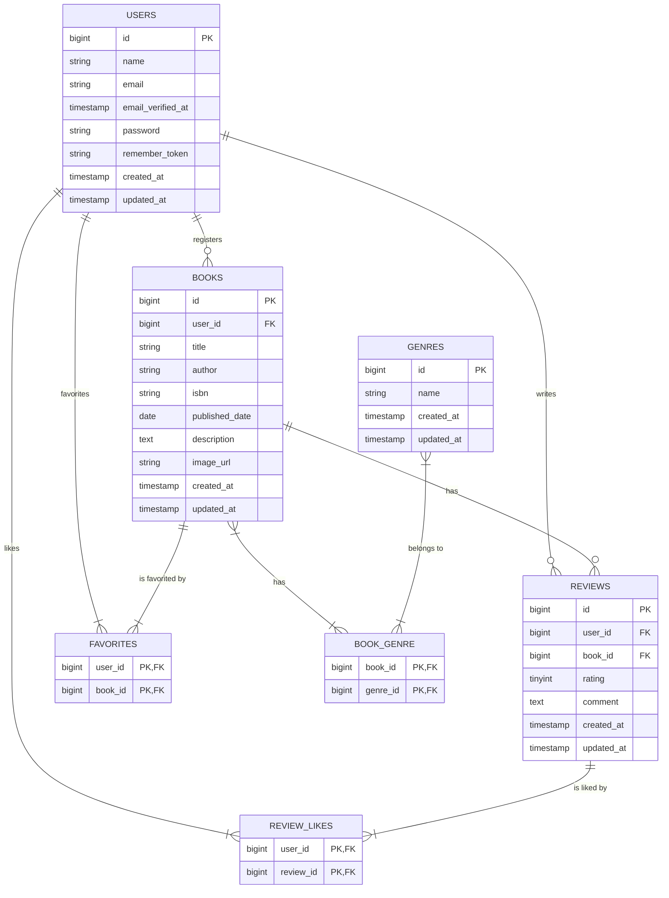

# Chapter 2: データベース設計とマイグレーション

このChapterでは、書籍レビュー管理システムに必要なデータベーステーブルを設計し、Laravelのマイグレーション機能を使ってデータベースの構造を定義します。

---

## 2-1. 先輩エンジニアの思考プロセス：要件からテーブル設計へ

アプリケーション開発において、データベース設計は「家の基礎工事」に例えられます。ここでの設計が、後の機能実装のしやすさやアプリケーション全体のパフォーマンスに大きく影響します。

では、どのようにしてテーブル構造を考えていくのでしょうか？答えは**「要件定義書」**の中にあります。

### Step 1: 要件から「モノ」と「関係」を洗い出す

まず、要件定義書（`基本機能編_要件定義書_基本設計書_詳細度100%.md`）の機能要件一覧を眺めて、アプリケーションに登場する主要な「モノ（エンティティ）」を名詞として抜き出します。

- **ユーザー** (USERS)
- **書籍** (BOOKS)
- **レビュー** (REVIEWS)
- **ジャンル** (GENRES)
- **お気に入り** (FAVORITES)
- **いいね** (REVIEW_LIKES)
- **書籍ジャンル** (BOOK_GENRE)

次に、これらの「モノ」が互いにどういう「関係」にあるかを考えます。

- ユーザーは、**複数の**書籍を登録する (1対多)
- ユーザーは、**複数の**レビューを投稿する (1対多)
- 書籍には、**複数の**レビューが投稿される (1対多)
- ユーザーは、**複数の**書籍をお気に入り登録する (多対多)
- ユーザーは、**複数の**レビューに「いいね」する (多対多)
- 書籍は、**複数の**ジャンルに属する (多対多)

この「1対多」「多対多」の関係性を整理することが、テーブル設計の第一歩です。

### Step 2: ヒアリングで要件を具体化する

要件定義書だけでは分からない細かい仕様は、プロジェクトマネージャーや顧客にヒアリングして明確にします。良いエンジニアは、的確な質問で仕様の曖昧さをなくしていきます。

**【ヒアリング例】**

> **エンジニア**: 「書籍とジャンルの関係ですが、1冊の書籍は1つのジャンルにしか属しませんか？例えば『ハリー・ポッター』は『ファンタジー』であり『小説』でもある、といったケースは考慮しますか？」
> **PM**: 「良い質問ですね。複数のジャンルに属せるようにしましょう。」
> **→ 結果**: 書籍とジャンルは「多対多」の関係だとわかる。中間テーブル `book_genre` が必要になる。

> **エンジニア**: 「ユーザーが退会した場合、そのユーザーが登録した書籍やレビューはどう扱いますか？」
> **PM**: 「ユーザーが退会したら、その人のデータは全て削除してください。」
> **→ 結果**: 外部キー制約に `onDelete(\'cascade\')` を設定し、親レコード（ユーザー）の削除時に子レコード（書籍、レビューなど）も自動で削除されるように設計する。

### Step 3: ER図とテーブル定義書を作成する

洗い出した「モノ」と「関係」を元に、ER図（エンティティ関連図）とテーブル定義書を作成します。これらは、データベースの「設計図」となる重要なドキュメントです。

#### ER図 (Entity-Relationship Diagram)

テーブル間の関係性を視覚的に表現した図です。これにより、アプリケーション全体のデータ構造を直感的に把握できます。



#### テーブル定義書

| テーブル名 | 物理名 | 用途 |
|:---|:---|:---|
| ユーザー | `users` | アプリケーションの利用者情報を格納する |
| 書籍 | `books` | 書籍の基本情報を格納する |
| レビュー | `reviews` | 書籍に対するレビュー情報を格納する |
| ジャンル | `genres` | 書籍のジャンルマスタ |
| お気に入り | `favorites` | ユーザーと書籍のお気に入り関係を格納する中間テーブル |
| レビューいいね | `review_likes` | ユーザーとレビューのいいね関係を格納する中間テーブル |
| 書籍ジャンル | `book_genre` | 書籍とジャンルの中間テーブル |

(各テーブルの詳細定義は省略)

---

## 2.2. マイグレーションファイルの作成と実行

設計が固まったら、Laravelのマイグレーション機能を使ってデータベースにテーブルを作成します。

### Step 1: マイグレーションファイルの作成

```bash
# usersテーブルはLaravelデフォルトで存在
sail artisan make:migration create_genres_table
sail artisan make:migration create_books_table
sail artisan make:migration create_reviews_table
sail artisan make:migration create_book_genre_table
sail artisan make:migration create_favorites_table
sail artisan make:migration create_review_likes_table
```

### Step 2: マイグレーションファイルの編集

(各マイグレーションファイルのコードは省略)

### Step 3: マイグレーションの実行

```bash
sail artisan migrate
```
