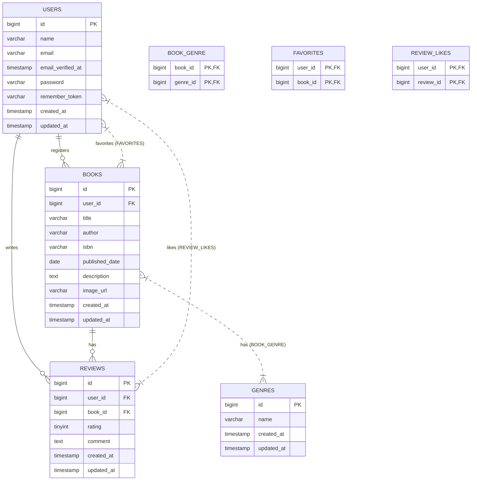

# Chapter 2: データベース設計とマイグレーション

このChapterでは、書籍レビュー管理システムに必要なデータベーステーブルを設計し、Laravelのマイグレーション機能を使ってデータベースの構造を定義します。

---

## 2-1. 先輩エンジニアの思考プロセス：要件からテーブル設計へ

アプリケーション開発において、データベース設計は「家の基礎工事」に例えられます。ここでの設計が、後の機能実装のしやすさやアプリケーション全体のパフォーマンスに大きく影響します。

では、どのようにしてテーブル構造を考えていくのでしょうか？答えは**「要件定義書」**の中にあります。

### Step 1: 要件から「モノ」と「関係」を洗い出す

まず、要件定義書（`基本機能編_要件定義書_基本設計書_詳細度100%.md`）の機能要件一覧を眺めて、アプリケーションに登場する主要な「モノ（エンティティ）」を名詞として抜き出します。

- **ユーザー** (会員登録、ログイン...)
- **書籍** (書籍登録、一覧表示...)
- **レビュー** (レビュー投稿...)
- **ジャンル** (ジャンル別一覧...)
- **お気に入り**
- **いいね**

次に、これらの「モノ」が互いにどういう「関係」にあるかを考えます。

- ユーザーは、**複数の**書籍を登録する (1対多)
- ユーザーは、**複数の**レビューを投稿する (1対多)
- 書籍には、**複数の**レビューが投稿される (1対多)
- ユーザーは、**複数の**書籍をお気に入り登録する (多対多)
- ユーザーは、**複数の**レビューに「いいね」する (多対多)
- 書籍は、**複数の**ジャンルに属する (多対多)

この「1対多」「多対多」の関係性を整理することが、テーブル設計の第一歩です。

### Step 2: ヒアリングで要件を具体化する

要件定義書だけでは分からない細かい仕様は、プロジェクトマネージャーや顧客にヒアリングして明確にします。良いエンジニアは、的確な質問で仕様の曖昧さをなくしていきます。

**【ヒアリング例】**

> **エンジニア**: 「レビュー機能についてですが、評価は5段階評価だけで十分ですか？それとも自由なコメントも入力できるようにしますか？」
> **PM**: 「両方必要です。星評価と、感想を書けるコメント欄を用意してください。」
> **→ 結果**: `reviews`テーブルに`rating`カラムと`comment`カラムが必要だとわかる。

> **エンジニア**: 「書籍とジャンルの関係ですが、1冊の書籍は1つのジャンルにしか属しませんか？例えば『ハリー・ポッター』は『ファンタジー』であり『小説』でもある、といったケースは考慮しますか？」
> **PM**: 「良い質問ですね。複数のジャンルに属せるようにしましょう。」
> **→ 結果**: 書籍とジャンルは「多対多」の関係だとわかる。中間テーブル `book_genre` が必要になる。

> **エンジニア**: 「ユーザーが退会した場合、そのユーザーが登録した書籍やレビューはどう扱いますか？」
> **PM**: 「ユーザーが退会したら、その人のデータは全て削除してください。」
> **→ 結果**: 外部キー制約に `onDelete(\'cascade\')` を設定し、親レコード（ユーザー）の削除時に子レコード（書籍、レビューなど）も自動で削除されるように設計する。

このように、具体的な質問を通じて、必要なテーブルやカラム、設定すべき制約が明確になっていきます。

### Step 3: ER図とテーブル定義書を作成する

洗い出した「モノ」と「関係」を元に、ER図（エンティティ関連図）とテーブル定義書を作成します。これらは、データベースの「設計図」となる重要なドキュメントです。

#### ER図 (Entity-Relationship Diagram)

テーブル間の関係性を視覚的に表現した図です。これにより、アプリケーション全体のデータ構造を直感的に把握できます。



#### テーブル定義書

各テーブルのカラム名、データ型、制約、そして「なぜそのカラムが必要か」という目的を明記します。

| テーブル名 | 物理名 | 用途 |
|:---|:---|:---|
| ユーザー | `users` | アプリケーションの利用者情報を格納する |
| 書籍 | `books` | 書籍の基本情報を格納する |
| レビュー | `reviews` | 書籍に対するレビュー情報を格納する |
| ジャンル | `genres` | 書籍のジャンルマスタ |
| 書籍ジャンル | `book_genre` | 書籍とジャンルの中間テーブル |
| お気に入り | `favorites` | ユーザーと書籍のお気に入り関係を格納する中間テーブル |
| レビューいいね | `review_likes` | ユーザーとレビューのいいね関係を格納する中間テーブル |

**`books` テーブル**

| カラム名 | データ型 | 制約 | 目的 |
|:---|:---|:---|:---|
| `id` | `bigint` | `PK` | 主キー |
| `user_id` | `bigint` | `FK` | **どのユーザーが登録したか**を識別するため |
| `title` | `varchar` | `Not Null` | 書籍のタイトル |
| `author` | `varchar` | `Not Null` | 著者名 |
| `isbn` | `varchar(13)` | `Unique` | ISBN-13コード。書籍を一意に識別するため |
| `published_date` | `date` | `Not Null` | 出版日 |
| `description` | `text` | `Nullable` | 書籍の概要 |
| `image_url` | `varchar` | `Nullable` | 書影のURL |

(他のテーブル定義は省略)

---

## 2.2. マイグレーションファイルの作成と実行

設計が固まったら、Laravelのマイグレーション機能を使ってデータベースにテーブルを作成します。

### Step 1: マイグレーションファイルの作成

以下のコマンドを実行して、各テーブルのマイグレーションファイルを生成します。

> **【ポイント】**
> Laravelはマイグレーションファイルのファイル名に含まれるタイムスタンプ順に実行します。依存されるテーブル（例: `users`, `books`）を先に作り、依存するテーブル（例: `reviews`, `favorites`）を後に作るように、ファイル名が自動生成されます。

```bash
# usersテーブルはLaravelデフォルトで存在

# genresテーブル
sail artisan make:migration create_genres_table

# booksテーブル
sail artisan make:migration create_books_table

# reviewsテーブル
sail artisan make:migration create_reviews_table

# book_genreテーブル (中間テーブル)
sail artisan make:migration create_book_genre_table

# favoritesテーブル (中間テーブル)
sail artisan make:migration create_favorites_table

# review_likesテーブル (中間テーブル)
sail artisan make:migration create_review_likes_table
```

### Step 2: マイグレーションファイルの編集

生成されたマイグレーションファイルの`up`メソッドに、テーブル定義書の内容をコードとして記述していきます。

#### `database/migrations/YYYY_MM_DD_XXXXXX_create_genres_table.php`

```php
<?php

use Illuminate\Database\Migrations\Migration;
use Illuminate\Database\Schema\Blueprint;
use Illuminate\Support\Facades\Schema;

return new class extends Migration
{
    public function up(): void
    {
        Schema::create(\'genres\', function (Blueprint $table) {
            $table->id();
            $table->string(\'name\')->unique(); // ジャンル名は重複しないようにunique制約
            $table->timestamps();
        });
    }

    public function down(): void
    {
        Schema::dropIfExists(\'genres\');
    }
};
```

#### `database/migrations/YYYY_MM_DD_XXXXXX_create_books_table.php`

```php
<?php

use Illuminate\Database\Migrations\Migration;
use Illuminate\Database\Schema\Blueprint;
use Illuminate\Support\Facades\Schema;

return new class extends Migration
{
    public function up(): void
    {
        Schema::create(\'books\', function (Blueprint $table) {
            $table->id();
            // 設計：どのユーザーが登録した書籍かを記録するため、usersテーブルへの外部キーを設定
            // onDelete(\'cascade\")：ユーザーが退会したら、そのユーザーが登録した書籍も自動的に削除される
            $table->foreignId(\'user_id\')->constrained()->onDelete(\'cascade\');
            $table->string(\'title\');
            $table->string(\'author\');
            // 設計：ISBNは書籍を一意に識別するため、unique制約を付与
            $table->string(\'isbn\', 13)->unique();
            $table->date(\'published_date\');
            $table->text(\'description\')->nullable();
            $table->string(\'image_url\')->nullable();
            $table->timestamps();
        });
    }

    public function down(): void
    {
        Schema::dropIfExists(\'books\');
    }
};
```

#### `database/migrations/YYYY_MM_DD_XXXXXX_create_reviews_table.php`

```php
<?php

use Illuminate\Database\Migrations\Migration;
use Illuminate\Database\Schema\Blueprint;
use Illuminate\Support\Facades\Schema;

return new class extends Migration
{
    public function up(): void
    {
        Schema::create(\'reviews\', function (Blueprint $table) {
            $table->id();
            $table->foreignId(\'user_id\')->constrained()->onDelete(\'cascade\');
            $table->foreignId(\'book_id\')->constrained()->onDelete(\'cascade\');
            $table->unsignedTinyInteger(\'rating\'); // 評価は1-5の整数
            $table->text(\'comment\');
            $table->timestamps();
        });
    }

    public function down(): void
    {
        Schema::dropIfExists(\'reviews\');
    }
};
```

#### `database/migrations/YYYY_MM_DD_XXXXXX_create_book_genre_table.php` (中間テーブル)

```php
<?php

use Illuminate\Database\Migrations\Migration;
use Illuminate\Database\Schema\Blueprint;
use Illuminate\Support\Facades\Schema;

return new class extends Migration
{
    public function up(): void
    {
        Schema::create(\'book_genre\', function (Blueprint $table) {
            // 設計：書籍とジャンルの「多対多」の関係を実現するための中間テーブル
            $table->foreignId(\'book_id\')->constrained()->onDelete(\'cascade\');
            $table->foreignId(\'genre_id\')->constrained()->onDelete(\'cascade\');
            // 設計：同じ書籍に同じジャンルが複数登録されるのを防ぐため、2つのカラムを複合主キーに設定
            $table->primary([\'book_id\', \'genre_id\']);
        });
    }

    public function down(): void
    {
        Schema::dropIfExists(\'book_genre\');
    }
};
```

#### `database/migrations/YYYY_MM_DD_XXXXXX_create_favorites_table.php` (中間テーブル)

```php
<?php

use Illuminate\Database\Migrations\Migration;
use Illuminate\Database\Schema\Blueprint;
use Illuminate\Support\Facades\Schema;

return new class extends Migration
{
    public function up(): void
    {
        Schema::create(\'favorites\', function (Blueprint $table) {
            $table->foreignId(\'user_id\')->constrained()->onDelete(\'cascade\');
            $table->foreignId(\'book_id\')->constrained()->onDelete(\'cascade\');
            $table->primary([\'user_id\', \'book_id\']);
        });
    }

    public function down(): void
    {
        Schema::dropIfExists(\'favorites\');
    }
};
```

#### `database/migrations/YYYY_MM_DD_XXXXXX_create_review_likes_table.php` (中間テーブル)

```php
<?php

use Illuminate\Database\Migrations\Migration;
use Illuminate\Database\Schema\Blueprint;
use Illuminate\Support\Facades\Schema;

return new class extends Migration
{
    public function up(): void
    {
        Schema::create(\'review_likes\', function (Blueprint $table) {
            $table->foreignId(\'user_id\')->constrained()->onDelete(\'cascade\');
            $table->foreignId(\'review_id\')->constrained()->onDelete(\'cascade\');
            $table->primary([\'user_id\', \'review_id\']);
        });
    }

    public function down(): void
    {
        Schema::dropIfExists(\'review_likes\');
    }
};
```

### Step 3: マイグレーションの実行

全てのマイグレーションファイルの準備が整ったら、以下のコマンドでデータベースにテーブルを作成します。

```bash
sail artisan migrate
```

このコマンドにより、`database/migrations`ディレクトリ内の全ての未実行のマイグレーションファイルが実行され、ER図とテーブル定義書通りのテーブルがデータベース内に作成されます。

phpMyAdmin (`http://localhost:8080`) にアクセスし、テーブルが正しく作成されていることを確認してみましょう。
