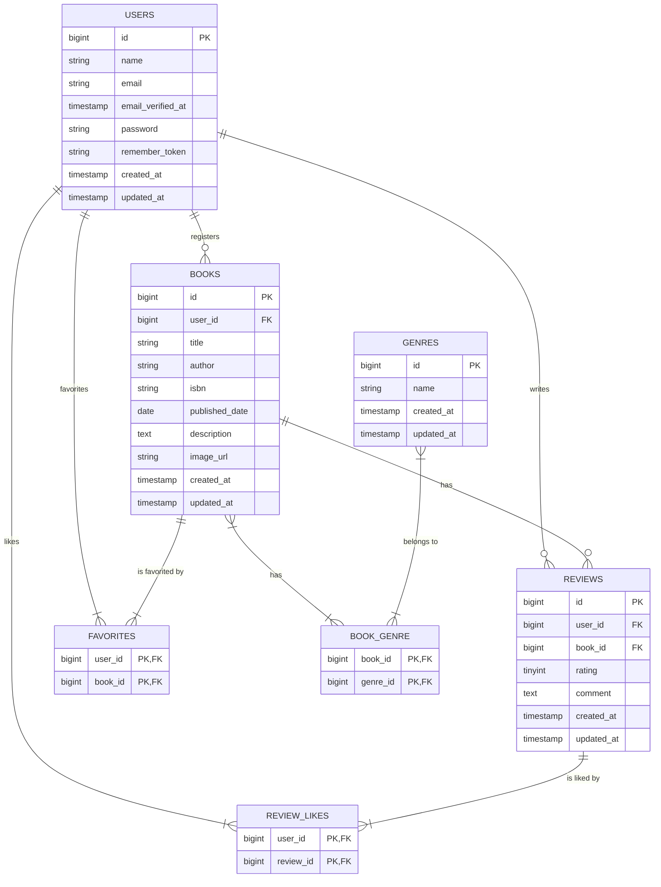

# Chapter 00: 「行間リーダー」 - 要件の行間を読む力

## 🎯 このChapterの目標

`要件定義書_詳細度50%` には、「書籍を登録したい」とは書かれていても、「ISBNカラムはVARCHAR(13)で必須」とは書かれていません。
実際の開発現場では、この「要件の行間」をエンジニアがヒアリングと設計で埋める必要があります。

このChapterでは、曖昧な要件から**「データベース基本設計書」を完成させるための思考プロセス**と、その結果として出来上がる**完全なデータベース設計書**を提示します。

| このChapterで学ぶこと | 解説 |
|:---|:---|
| 機能要件と画面の突き合わせ | 要件定義書とBladeファイルの両方から仕様を読み取る手法 |
| PMへのヒアリング技法 | 曖昧な記述に対し、的確な質問を投げるプロセス |
| テーブル候補の洗い出し | 機能一覧からデータの器（テーブル）を特定する思考法 |
| リレーションの見極め | UIの形状からデータ間の関係性（1対多 / 多対多）を判断する手法 |
| データ型と制約の決定 | Bladeの属性値からカラムの型・NULL許容・UNIQUE制約を導出する |

---

## 📖 背景知識：なぜ「機能要件」と「画面」の両方を見るのか？

詳細な設計書（100%）を作る際、手がかりとなるのは以下の2つです。

1. **要件定義書（詳細度50%）**: 「何ができるか（機能）」が書かれている。
2. **Bladeファイル（画面）**: 「どう操作するか（UI）」が書かれている。

片方だけでは不十分です。要件定義書だけでは「データの型」が分からず、Bladeだけでは「機能の意図」が見えません。
このChapterでは、この**2つの情報を突き合わせる**ことで、行間にある仕様を読み解き、PM（プロジェクトマネージャー）に対して的確な質問を行うプロセスを追体験します。

> ※この復習教材で提示するヒアリング例はあくまで参考です。

---

## 📋 実装の手順

このChapterにはコード実装はありません。代わりに、以下の4つのPhaseを通じて「曖昧な要件 → 完全なデータベース設計書」を導出する思考プロセスを追体験します。

---

### Phase 1: 機能一覧とナビゲーションから「テーブルの候補」を挙げる

まずは、システムに必要な「テーブル（データの箱）」を洗い出します。
50%要件定義書の「3.1 機能一覧」を見て、必要なデータを予測し、Bladeのナビゲーションで裏付けを取ります。

#### 1. 手がかり1: 要件定義書 (3.1 機能一覧)

* **記載内容**: 「会員登録」「書籍管理」「レビュー管理」「ジャンル管理」「お気に入り機能」「いいね機能」
* **エンジニアの思考**:
    * 「管理対象として明記されている『会員』『書籍』『レビュー』『ジャンル』は、確実にテーブルが必要だ。」

#### 2. 手がかり2: Blade (Navigation & Show)

要件書には「お気に入り機能」としか書かれていませんが、データとしてどう持つべきでしょうか？

* `resources/views/layouts/navigation.blade.php`:
```blade
<x-nav-link :href="route('favorites.index')" ...>お気に入り</x-nav-link>
```

* `resources/views/books/show.blade.php`:
```blade
<button class="text-red-500">{{ $review->likes->count() }}</button>
```

* **エンジニアの思考**:
    * 「『お気に入り一覧画面』へのリンクがある。つまり、ユーザーごとに『どの本をお気に入りにしたか』の履歴データが必要だ。」 → **`favorites` テーブル**
    * 「レビューに対して『いいね』数だけでなくボタンがある。これも『誰が押したか』の履歴が必要だ。」 → **`review_likes` テーブル**

#### PMへのヒアリング例 (Q1)

「要件定義書の機能一覧と、Bladeの表示項目を照らし合わせました。
基本の**『users, books, genres, reviews』**の4テーブルに加え、お気に入りといいねの履歴を管理するための**『favorites, review_likes』**という中間テーブルを作成する構成で認識合っていますか？」

---

### Phase 2: 機能の仕様とフォーム部品から「リレーション」を見抜く

次に、テーブル同士の関係性（リレーション）を特定します。特に「1対多」か「多対多」かは、要件定義書の記述とフォームの形状から判断します。

#### 1. 手がかり1: 要件定義書 (機能要件)

* **記載内容**: 「書籍登録：...ジャンルを登録できる。」
* **エンジニアの思考**:
    * 「『ジャンルを登録できる』とあるが、1つだけなのか、複数選べるのか、ここには書かれていない。」

#### 2. 手がかり2: Blade (_form.blade.php)

不明点をBladeで確認します。

* `resources/views/books/_form.blade.php`:
```blade
@foreach($genres as $genre)
    <label>
        <input type="checkbox" name="genres[]" value="{{ $genre->id }}">
        {{ $genre->name }}
    </label>
@endforeach
```

* **エンジニアの思考**:
    * 「チェックボックスかつ、name属性が `genres[]`（配列）になっている。」
    * 「つまり仕様としては**『複数選択』**が正解だ。」

#### PMへのヒアリング例 (Q2)

「要件定義書には『ジャンルを登録』とだけありますが、登録画面のUIはチェックボックス（複数選択）になっています。
したがって、書籍とジャンルは**多対多（N対N）の関係として実装し、中間に`book_genre` テーブル**を作成する設計で進めますが、よろしいですか？」

---

### Phase 3: 入力項目一覧と属性から「データ型と制約」を見抜く

テーブルが決まったら、カラムの詳細（型・長さ・必須/任意）を詰めます。要件書の項目リストと、Bladeの属性を突き合わせます。

#### 1. 手がかり1: 要件定義書 (3.1 機能一覧 / 書籍登録)

* **記載内容**: 「書籍登録：タイトル、著者、ISBN、出版日、説明、画像URL...」
* **エンジニアの思考**:
    * 「項目は分かった。だが、ISBNの桁数や、必須かどうかの記載がない。」

#### 2. 手がかり2: Blade (_form.blade.php / reviews/edit.blade.php)

* **ISBN**: `maxlength="13"`、プレースホルダー `978...`（ハイフンなし）
* **説明**: プレースホルダーに `（任意）` と記載あり。
* **評価**: ラジオボタンで `1` ~ `5` のみ。
* **エンジニアの思考**:
    * 「ISBNは13桁固定の文字列として扱おう。」
    * 「説明は『任意』だから、DB側でも `NULL` を許容（Nullable）しないとエラーになる。」
    * 「評価は整数のみだから、`INTEGER` ではなく最小の `TINYINT` で十分だ。」

#### PMへのヒアリング例 (Q3, Q4, Q5)

* 「ISBNは画面に合わせて**13桁固定・ハイフンなし**とし、DB定義は `VARCHAR(13)` とします。書籍管理の基幹データなので**必須かつ一意（Unique）**制約をかけます。」
* 「説明（description）と画像URLは、画面の記載通り**任意入力**とするため、DBのカラムも**NULL許容**で設計します。」
* 「レビュー評価は1~5の整数のみのため、**`TINYINT`** 型を採用します。」

---

### Phase 4: 機能の制約とボタンから「削除ロジック」を見抜く

最後に、データの整合性に関わる重要なロジックを詰めます。

#### 1. 手がかり1: 要件定義書 (3.1 機能一覧 / ジャンル管理)

* **記載内容**: 「ジャンル削除：紐付く書籍がない場合に限り、ジャンルを削除できる。」
* **エンジニアの思考**:
    * 「要件書にサラッと重要な制約（制限事項）が書いてある。『紐付く書籍がない場合に限り』ということは、無条件で削除してはいけない。」

#### 2. 手がかり2: Blade (index.blade.php)

* `resources/views/genres/index.blade.php`:
```blade
<form action="{{ route('genres.destroy', $genre) }}" ... onsubmit="return confirm('本当に削除しますか？');">
```

* **エンジニアの思考**:
    * 「画面には普通の削除ボタンしかない。このまま実装すると、ボタンを押した瞬間に削除されてしまう恐れがある。」
    * 「Controller側でチェックロジックを入れる必要があるな。」

#### PMへのヒアリング例 (Q6)

「要件定義書にある『紐付く書籍がない場合に限り削除できる』という点について確認です。
これは、もし紐付く書籍がある状態で削除ボタンが押された場合、**削除処理を行わずにエラーメッセージを表示する（Restrict）**という挙動でよろしいですか？（※誤って書籍側のジャンル設定が消えるのを防ぐため）」

---

## 💭 なぜこう作るのか？：現場のバックエンドエンジニアが持つ「3つの観点」

今回は「要件定義書（機能）」と「Blade（画面）」の2つを照らし合わせることで、矛盾や不足を洗い出しました。
プロのエンジニアがPMにヒアリングを行う際、本当に確認しようとしているのは以下の「3つの観点」です。これらは**「後から変更すると修正コストが甚大になる」**ため、初期段階で徹底的に詰める必要があります。

### 1. データ構造の拡張性 (Cardinality)

* **気づき**: 「要件では『ジャンル登録』だが、画面は『複数選択』だ」
* **エンジニアの観点**: **「今は1つだけど、将来2つ以上になる可能性はないか？」**
* **解説**: `1対多` でテーブルを作った後に `多対多` に変更するのは、テーブル構造の変更やデータ移行が発生し、非常に大変です。

### 2. データのライフサイクルと整合性 (Integrity)

* **気づき**: 「削除機能があるが、要件書には『条件付き』と書いてある」
* **エンジニアの観点**: **「親データが消えた時、子データはどうなるべきか？」**
* **解説**:
  * **ユーザー退会**: 全て消えて良い（Cascade）
  * **ジャンル削除**: 使用中は消してはいけない（Restrict）
  このように、データの種類によって「正しい死に方（削除ルール）」を定義するのがエンジニアの責任です。

### 3. データの厳密さ (Strictness)

* **気づき**: 「要件書にはないが、画面には『13桁』『任意』という制約がある」
* **エンジニアの観点**: **「システムとして絶対に許してはいけないデータは何か？」**
* **解説**: アプリケーション側のバリデーションだけでなく、データベースの制約（Unique制約、型定義、Not Null）でデータを守ることで、システムの品質を担保します。

このようにプロのエンジニアは、**「機能要件」と「画面」のギャップ**にこそリスクが潜んでいることを知っており、そこを埋めるためにヒアリングを行っているのです。

---

## 🚀 成果物：データベース基本設計書

上記のプロセスを繰り返すことで完成した、詳細度100%のデータベース設計書です。

### ER図 (Mermaid記法)



### テーブル定義書

#### 1. users (ユーザー)

アプリケーションの利用者を管理するテーブル。

| 論理名 | 物理名 | 型 | NULL | 制約・備考 |
| --- | --- | --- | --- | --- |
| ID | `id` | BIGINT | No | PK, AUTO_INCREMENT |
| 名前 | `name` | VARCHAR(255) | No |  |
| メールアドレス | `email` | VARCHAR(255) | No | **UNIQUE** |
| メール確認日時 | `email_verified_at` | TIMESTAMP | Yes |  |
| パスワード | `password` | VARCHAR(255) | No |  |
| ログイン保持 | `remember_token` | VARCHAR(100) | Yes |  |
| 作成日時 | `created_at` | TIMESTAMP | Yes |  |
| 更新日時 | `updated_at` | TIMESTAMP | Yes |  |

#### 2. books (書籍)

ユーザーによって登録された書籍情報を管理するテーブル。

| 論理名 | 物理名 | 型 | NULL | 制約・備考 |
| --- | --- | --- | --- | --- |
| ID | `id` | BIGINT | No | PK, AUTO_INCREMENT |
| ユーザーID | `user_id` | BIGINT | No | FK(`users.id`), **CASCADE DELETE** |
| タイトル | `title` | VARCHAR(255) | No |  |
| 著者 | `author` | VARCHAR(255) | No |  |
| ISBN | `isbn` | VARCHAR(13) | **No** | **UNIQUE**, 必須 |
| 出版日 | `published_date` | DATE | **No** | 必須 |
| 説明 | `description` | TEXT | **Yes** |  |
| 画像URL | `image_url` | VARCHAR(255) | **Yes** |  |
| 作成日時 | `created_at` | TIMESTAMP | Yes |  |
| 更新日時 | `updated_at` | TIMESTAMP | Yes |  |

#### 3. reviews (レビュー)

書籍に対するユーザーの評価とコメントを管理するテーブル。

| 論理名 | 物理名 | 型 | NULL | 制約・備考 |
| --- | --- | --- | --- | --- |
| ID | `id` | BIGINT | No | PK, AUTO_INCREMENT |
| ユーザーID | `user_id` | BIGINT | No | FK(`users.id`), **CASCADE DELETE** |
| 書籍ID | `book_id` | BIGINT | No | FK(`books.id`), **CASCADE DELETE** |
| 評価 | `rating` | TINYINT | No | 1~5の整数 |
| コメント | `comment` | TEXT | **No** | 必須 |
| 作成日時 | `created_at` | TIMESTAMP | Yes |  |
| 更新日時 | `updated_at` | TIMESTAMP | Yes |  |

#### 4. genres (ジャンル)

書籍のカテゴリを管理するテーブル。

| 論理名 | 物理名 | 型 | NULL | 制約・備考 |
| --- | --- | --- | --- | --- |
| ID | `id` | BIGINT | No | PK, AUTO_INCREMENT |
| ジャンル名 | `name` | VARCHAR(255) | No | **UNIQUE** |
| 作成日時 | `created_at` | TIMESTAMP | Yes |  |
| 更新日時 | `updated_at` | TIMESTAMP | Yes |  |

#### 5. favorites (お気に入り・中間テーブル)

ユーザーと書籍の多対多関係（お気に入り）を管理。

| 論理名 | 物理名 | 型 | NULL | 制約・備考 |
| --- | --- | --- | --- | --- |
| ユーザーID | `user_id` | BIGINT | No | FK(`users.id`), **CASCADE DELETE** |
| 書籍ID | `book_id` | BIGINT | No | FK(`books.id`), **CASCADE DELETE** |

* **複合主キー**: `PRIMARY KEY (user_id, book_id)` で重複を防止。

#### 6. review_likes (レビューいいね・中間テーブル)

ユーザーとレビューの多対多関係（いいね）を管理。

| 論理名 | 物理名 | 型 | NULL | 制約・備考 |
| --- | --- | --- | --- | --- |
| ユーザーID | `user_id` | BIGINT | No | FK(`users.id`), **CASCADE DELETE** |
| レビューID | `review_id` | BIGINT | No | FK(`reviews.id`), **CASCADE DELETE** |

* **複合主キー**: `PRIMARY KEY (user_id, review_id)` で重複を防止。

#### 7. book_genre (書籍ジャンル紐付け・中間テーブル)

書籍とジャンルの多対多関係を管理。

| 論理名 | 物理名 | 型 | NULL | 制約・備考 |
| --- | --- | --- | --- | --- |
| 書籍ID | `book_id` | BIGINT | No | FK(`books.id`), **CASCADE DELETE** |
| ジャンルID | `genre_id` | BIGINT | No | FK(`genres.id`), **CASCADE DELETE** |

* **複合主キー**: `PRIMARY KEY (book_id, genre_id)` で重複を防止。

---

## 🔍 コードリーディング

このChapterにはコードはありませんが、Phase 1~4で行った「要件の行間を読む」プロセスそのものが、設計の核心です。以下の対応表を確認しておきましょう。

| 手がかり | 導出された設計判断 |
|:---|:---|
| 機能一覧に「お気に入り」「いいね」 | `favorites`, `review_likes` 中間テーブルが必要 |
| フォームのチェックボックス `genres[]` | 書籍とジャンルは多対多 → `book_genre` 中間テーブル |
| `maxlength="13"` + プレースホルダー `978...` | ISBN は `VARCHAR(13)`, UNIQUE, 必須 |
| プレースホルダーに「(任意)」 | `description`, `image_url` は nullable |
| ラジオボタン 1~5 | `rating` は `TINYINT` |
| 「紐付く書籍がない場合に限り削除」 | ジャンル削除は Restrict（コントローラーでチェック） |

---

## 🧐 調べ方のヒント

分からないことがあった時、AIに聞くプロンプト例を紹介します。

| 疑問 | プロンプト例 |
|:---|:---|
| テーブル同士の関係がわからない | 「Laravel で users テーブルと books テーブルを1対多で繋ぐ場合、外部キーはどちらに持たせますか？理由も教えてください。」 |
| 多対多の中間テーブルの設計方法 | 「Laravel で書籍とジャンルの多対多リレーションを実装する際、中間テーブルの命名規則とカラム構成を教えてください。」 |
| CASCADE と RESTRICT の違い | 「データベースの外部キー制約で CASCADE DELETE と RESTRICT の違いを、具体例を交えて教えてください。」 |
| NULL許容の判断基準 | 「データベース設計で nullable にすべきカラムの判断基準を教えてください。フォームの入力が任意の場合はどうしますか？」 |

---

## ✨ このChapterのまとめ

このChapterでは、50%の要件定義書から100%のデータベース設計書を導出するプロセスを学びました。

| Phase | やったこと | 得られた成果 |
|:---|:---|:---|
| Phase 1 | 機能一覧 + ナビゲーションBlade | テーブル候補7個の確定 |
| Phase 2 | フォーム部品の形状から判断 | 多対多リレーション + 中間テーブルの特定 |
| Phase 3 | Bladeの属性値から導出 | カラムの型・NULL許容・UNIQUE制約の決定 |
| Phase 4 | 要件書の制約条件を深読み | 削除ルール（Cascade / Restrict）の決定 |

**重要な3つの観点:**
1. **データ構造の拡張性** -- 1対多を多対多に後から変更するコストは甚大
2. **データのライフサイクルと整合性** -- 親データ削除時の子データの扱いを定義
3. **データの厳密さ** -- DB制約でシステムの品質を担保

次のChapter 01では、この設計を実装するための開発環境をセットアップします。
