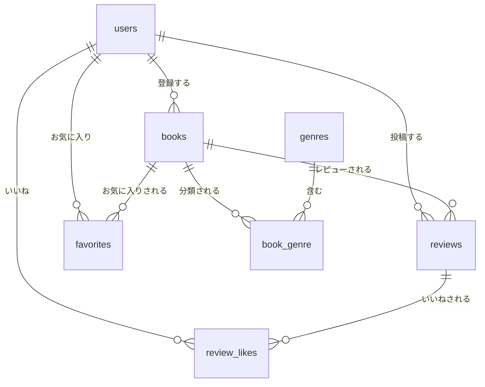

# 模擬案件：書籍レビュー管理システム (BookShelf) - 応用機能編

---

## はじめに

このドキュメントは、書籍レビュー管理システム (BookShelf) の **応用機能編** 実装手順書です。基本機能に加え、高度な検索・ISBN検索・マイ読書レポート・Sanctum認証APIといった応用機能を含む、全機能を最初から **型宣言** や **PHPDoc** 、**Collectionメソッド活用** といった品質の高いコーディングスタイルで実装します。

この手順書の通りに実装を進めると、応用版（advancedブランチ）の模範解答コードと同一のものが完成します。

---

# Part 1: 要件定義書

## 1. システム概要

- **プロジェクト名:** 書籍レビュー管理システム (BookShelf)
- **目的:** ユーザーがお気に入りの書籍を登録し、レビューを投稿・閲覧できるWebアプリケーション
- **構成:** 従来型Web（Blade + セッション認証） + 公開API（JSON + Sanctum認証）

### 技術スタック

| カテゴリ | 技術 | バージョン |
|---|---|---|
| サーバーサイド | PHP | 8.2 |
| フレームワーク | Laravel | 10.x |
| データベース | MySQL | 8.0+ |
| 開発環境 | Docker / Laravel Sail | 最新版 |
| フロントエンド | Blade, Tailwind CSS, Alpine.js | Laravel標準 |
| API認証 | Laravel Sanctum | 3.3+ |
| テスト | PHPUnit | Laravel標準 |

## 2. ルート仕様書

### 2.1. Webルート (`routes/web.php`)

| HTTPメソッド | URI | コントローラー@メソッド | 説明 | 認証 |
|---|---|---|---|---|
| GET | `/` | `BookController@index` | トップ（書籍一覧） | 不要 |
| GET | `/books` | `BookController@index` | 書籍一覧 | 不要 |
| GET | `/books/create` | `BookController@create` | 書籍登録フォーム | 必要 |
| POST | `/books` | `BookController@store` | 書籍登録処理 | 必要 |
| GET | `/books/{book}` | `BookController@show` | 書籍詳細 | 不要 |
| GET | `/books/{book}/edit` | `BookController@edit` | 書籍編集フォーム | 必要 |
| PUT | `/books/{book}` | `BookController@update` | 書籍更新処理 | 必要 |
| DELETE | `/books/{book}` | `BookController@destroy` | 書籍削除処理 | 必要 |
| GET | `/books/isbn/{isbn}` | `BookController@searchByIsbn` | ISBN検索（応用） | 必要 |
| POST | `/books/{book}/reviews` | `ReviewController@store` | レビュー投稿 | 必要 |
| GET | `/reviews/{review}/edit` | `ReviewController@edit` | レビュー編集フォーム | 必要 |
| PUT | `/reviews/{review}` | `ReviewController@update` | レビュー更新処理 | 必要 |
| DELETE | `/reviews/{review}` | `ReviewController@destroy` | レビュー削除処理 | 必要 |
| GET | `/favorites` | `FavoriteController@index` | お気に入り一覧 | 必要 |
| POST | `/books/{book}/favorites` | `FavoriteController@toggle` | お気に入りトグル | 必要 |
| POST | `/reviews/{review}/like` | `ReviewLikeController@toggle` | いいねトグル | 必要 |
| GET | `/ranking` | `RankingController@index` | 評価ランキング | 不要 |
| GET | `/reports` | `ReportController@index` | マイ読書レポート（応用） | 必要 |
| GET | `/genres` | `GenreController@index` | ジャンル一覧 | 必要 |
| GET | `/genres/create` | `GenreController@create` | ジャンル登録フォーム | 必要 |
| POST | `/genres` | `GenreController@store` | ジャンル登録処理 | 必要 |
| GET | `/genres/{genre}` | `GenreController@show` | ジャンル別書籍一覧 | 不要 |
| GET | `/genres/{genre}/edit` | `GenreController@edit` | ジャンル編集フォーム | 必要 |
| PUT | `/genres/{genre}` | `GenreController@update` | ジャンル更新処理 | 必要 |
| DELETE | `/genres/{genre}` | `GenreController@destroy` | ジャンル削除処理 | 必要 |

### 2.2. APIルート (`routes/api.php`)

| HTTPメソッド | URI | コントローラー@メソッド | 説明 | 認証 |
|---|---|---|---|---|
| GET | `/api/v1/books` | `Api\V1\BookController@index` | 書籍一覧API | 不要 |
| GET | `/api/v1/books/{book}` | `Api\V1\BookController@show` | 書籍詳細API | 不要 |
| POST | `/api/v1/books` | `Api\V1\BookController@store` | 書籍登録API | Sanctum |
| PUT | `/api/v1/books/{book}` | `Api\V1\BookController@update` | 書籍更新API | Sanctum |
| DELETE | `/api/v1/books/{book}` | `Api\V1\BookController@destroy` | 書籍削除API | Sanctum |

### 2.3. 認証ルート (`routes/auth.php`)

| HTTPメソッド | URI | 説明 | ミドルウェア |
|---|---|---|---|
| GET | `/login` | ログインフォーム | guest |
| GET | `/register` | 会員登録フォーム | guest |
| POST | `/logout` | ログアウト処理 | auth |

## 3. テーブル仕様書

### 3.1. ER図



### 3.2. テーブル定義

| テーブル名 | 主要カラム | 備考 |
|---|---|---|
| users | id, name, email, password | Laravel標準 |
| books | id, user_id(FK), title, author, isbn(nullable/unique), published_date(nullable), description, image_url | user_id CASCADE |
| genres | id, name(unique) | マスタ |
| book_genre | id, book_id(FK), genre_id(FK) | 中間テーブル、unique(book_id, genre_id)、timestamps付き |
| reviews | id, user_id(FK), book_id(FK), rating(tinyInt), comment(nullable) | CASCADE |
| favorites | id, user_id(FK), book_id(FK) | unique(user_id, book_id)、timestamps付き |
| review_likes | id, user_id(FK), review_id(FK) | unique(user_id, review_id)、timestamps付き |

---

# Part 2: 実装手順書

---

## Step 1: 環境構築とプロジェクト作成

### 1.1. Laravelプロジェクトの作成 (Laravel 10.x)

```bash
docker run --rm \
    -u "$(id -u):$(id -g)" \
    -v "$(pwd):/var/www/html" \
    -w /var/www/html \
    -e COMPOSER_CACHE_DIR=/tmp/composer_cache \
    laravelsail/php82-composer:latest \
    composer create-project laravel/laravel:^10.0 book-review-app
```

### 1.2. Laravel Sailのインストール

```bash
cd book-review-app

docker run --rm \
    -u "$(id -u):$(id -g)" \
    -v "$(pwd):/var/www/html" \
    -w /var/www/html \
    -e COMPOSER_CACHE_DIR=/tmp/composer_cache \
    laravelsail/php82-composer:latest \
    composer require laravel/sail --dev

docker run --rm \
    -u "$(id -u):$(id -g)" \
    -v "$(pwd):/var/www/html" \
    -w /var/www/html \
    -e COMPOSER_CACHE_DIR=/tmp/composer_cache \
    laravelsail/php82-composer:latest \
    php artisan sail:install --with=mysql
```

### 1.3. .envファイルの設定

`.env` ファイルのデータベース接続情報を確認・修正:

```dotenv
DB_CONNECTION=mysql
DB_HOST=mysql
DB_PORT=3306
DB_DATABASE=bookshelf
DB_USERNAME=sail
DB_PASSWORD=password
```

末尾に Google Books API キーを追加:

```dotenv
# Google Books API（応用機能 ISBN検索で使用）
GOOGLE_BOOKS_API_KEY=
```

### 1.4. compose.yaml の設定

phpMyAdminを追加する場合、`compose.yaml` の `services:` 配下に以下を追加:

```yaml
    phpmyadmin:
        image: phpmyadmin/phpmyadmin
        ports:
            - '8080:80'
        environment:
            PMA_HOST: mysql
            PMA_USER: sail
            PMA_PASSWORD: password
        networks:
            - sail
        depends_on:
            - mysql
```

### 1.5. Sailの起動とAPP_KEY生成

```bash
./vendor/bin/sail up -d
sail artisan key:generate
```

### 1.6. フロントエンドのセットアップ

```bash
sail npm install
sail npm install alpinejs
```

`tailwind.config.js`:

```js
import defaultTheme from 'tailwindcss/defaultTheme';
import forms from '@tailwindcss/forms';

/** @type {import('tailwindcss').Config} */
export default {
    content: [
        './vendor/laravel/framework/src/Illuminate/Pagination/resources/views/*.blade.php',
        './storage/framework/views/*.php',
        './resources/views/**/*.blade.php',
    ],

    theme: {
        extend: {
            fontFamily: {
                sans: ['Figtree', ...defaultTheme.fontFamily.sans],
            },
        },
    },

    plugins: [forms],
};
```

`postcss.config.js`:

```js
export default {
    plugins: {
        tailwindcss: {},
        autoprefixer: {},
    },
};
```

`resources/css/app.css`:

```css
@tailwind base;
@tailwind components;
@tailwind utilities;
```

`vite.config.js`:

```js
import { defineConfig } from 'vite';
import laravel from 'laravel-vite-plugin';

export default defineConfig({
    plugins: [
        laravel({
            input: ['resources/css/app.css', 'resources/js/app.js'],
            refresh: true,
        }),
    ],
});
```

`resources/js/app.js`:

```js
import './bootstrap';

import Alpine from 'alpinejs';

window.Alpine = Alpine;

Alpine.start();
```

フロントエンドのビルド:

```bash
sail npm run build
```

### 1.7. 日本語バリデーションメッセージの準備

`config/app.php` で `'locale' => 'ja'` に変更する。

`lang/ja/` ディレクトリを作成し、以下3ファイルを配置する:

```bash
mkdir -p lang/ja
```

#### `lang/ja/validation.php`

```php
<?php

return [
    'min' => [
        'string' => ':attributeは:min文字以上で入力してください。',
    ],

    'attributes' => [
        'name' => 'お名前',
        'email' => 'メールアドレス',
        'password' => 'パスワード',
    ],
];
```

#### `lang/ja/auth.php`

```php
<?php

return [
    'failed' => 'ログイン情報が登録されていません。',
    'password' => '入力されたパスワードが正しくありません。',
    'throttle' => 'ログインの試行回数が多すぎます。:seconds 秒後にお試しください。',
];
```

#### `lang/ja/passwords.php`

```php
<?php

return [
    'reset' => 'パスワードをリセットしました。',
    'sent' => 'パスワードリセット用のリンクをメールで送信しました。',
    'throttled' => '時間をおいてから再度お試しください。',
    'token' => 'このパスワードリセットトークンは無効です。',
    'user' => 'このメールアドレスに一致するユーザーが見つかりません。',
];
```

---

## Step 2: データベース設計とマイグレーション

以下の6つのマイグレーションファイルを作成する。

> **重要:** `make:migration` を連続実行するとタイムスタンプが同一になり、ファイル名のアルファベット順で実行される場合がある。`book_genre` は `genres` テーブルへの外部キーを持つため、必ず `genres` のマイグレーションが先に実行されるようタイムスタンプの順序を確認すること。

### 2.1. `database/migrations/xxxx_create_books_table.php`

```bash
sail artisan make:migration create_books_table
```

```php
<?php

use Illuminate\Database\Migrations\Migration;
use Illuminate\Database\Schema\Blueprint;
use Illuminate\Support\Facades\Schema;

return new class extends Migration
{
    public function up(): void
    {
        Schema::create('books', function (Blueprint $table): void {
            $table->id();
            $table->foreignId('user_id')->constrained()->cascadeOnDelete();
            $table->string('title');
            $table->string('author');
            $table->string('isbn', 13)->nullable()->unique();
            $table->date('published_date')->nullable();
            $table->text('description')->nullable();
            $table->string('image_url')->nullable();
            $table->timestamps();
        });
    }

    public function down(): void
    {
        Schema::dropIfExists('books');
    }
};
```

### 2.2. `database/migrations/xxxx_create_genres_table.php`

```bash
sail artisan make:migration create_genres_table
```

```php
<?php

use Illuminate\Database\Migrations\Migration;
use Illuminate\Database\Schema\Blueprint;
use Illuminate\Support\Facades\Schema;

return new class extends Migration
{
    public function up(): void
    {
        Schema::create('genres', function (Blueprint $table): void {
            $table->id();
            $table->string('name')->unique();
            $table->timestamps();
        });
    }

    public function down(): void
    {
        Schema::dropIfExists('genres');
    }
};
```

### 2.3. `database/migrations/xxxx_create_book_genre_table.php`

```bash
sail artisan make:migration create_book_genre_table
```

```php
<?php

use Illuminate\Database\Migrations\Migration;
use Illuminate\Database\Schema\Blueprint;
use Illuminate\Support\Facades\Schema;

return new class extends Migration
{
    public function up(): void
    {
        Schema::create('book_genre', function (Blueprint $table): void {
            $table->id();
            $table->foreignId('book_id')->constrained()->cascadeOnDelete();
            $table->foreignId('genre_id')->constrained()->cascadeOnDelete();
            $table->timestamps();

            $table->unique(['book_id', 'genre_id']);
        });
    }

    public function down(): void
    {
        Schema::dropIfExists('book_genre');
    }
};
```

### 2.4. `database/migrations/xxxx_create_reviews_table.php`

```bash
sail artisan make:migration create_reviews_table
```

```php
<?php

use Illuminate\Database\Migrations\Migration;
use Illuminate\Database\Schema\Blueprint;
use Illuminate\Support\Facades\Schema;

return new class extends Migration
{
    public function up(): void
    {
        Schema::create('reviews', function (Blueprint $table) {
            $table->id();
            $table->foreignId('user_id')->constrained()->onDelete('cascade');
            $table->foreignId('book_id')->constrained()->onDelete('cascade');
            $table->tinyInteger('rating');
            $table->text('comment')->nullable();
            $table->timestamps();
        });
    }

    public function down(): void
    {
        Schema::dropIfExists('reviews');
    }
};
```

### 2.5. `database/migrations/xxxx_create_favorites_table.php`

```bash
sail artisan make:migration create_favorites_table
```

```php
<?php

use Illuminate\Database\Migrations\Migration;
use Illuminate\Database\Schema\Blueprint;
use Illuminate\Support\Facades\Schema;

return new class extends Migration
{
    public function up(): void
    {
        Schema::create('favorites', function (Blueprint $table): void {
            $table->id();
            $table->foreignId('user_id')->constrained()->cascadeOnDelete();
            $table->foreignId('book_id')->constrained()->cascadeOnDelete();
            $table->timestamps();

            $table->unique(['user_id', 'book_id']);
        });
    }

    public function down(): void
    {
        Schema::dropIfExists('favorites');
    }
};
```

### 2.6. `database/migrations/xxxx_create_review_likes_table.php`

```bash
sail artisan make:migration create_review_likes_table
```

```php
<?php

use Illuminate\Database\Migrations\Migration;
use Illuminate\Database\Schema\Blueprint;
use Illuminate\Support\Facades\Schema;

return new class extends Migration
{
    public function up(): void
    {
        Schema::create('review_likes', function (Blueprint $table): void {
            $table->id();
            $table->foreignId('user_id')->constrained()->cascadeOnDelete();
            $table->foreignId('review_id')->constrained()->cascadeOnDelete();
            $table->timestamps();

            $table->unique(['user_id', 'review_id']);
        });
    }

    public function down(): void
    {
        Schema::dropIfExists('review_likes');
    }
};
```

### マイグレーション実行

```bash
sail artisan migrate
```

---

## Step 3: モデルとリレーションシップ

### 3.1. `app/Models/User.php`

既存のUserモデルを以下のように更新する:

```php
<?php

namespace App\Models;

use Illuminate\Database\Eloquent\Factories\HasFactory;
use Illuminate\Database\Eloquent\Relations\BelongsToMany;
use Illuminate\Database\Eloquent\Relations\HasMany;
use Illuminate\Foundation\Auth\User as Authenticatable;
use Illuminate\Notifications\Notifiable;
use Laravel\Sanctum\HasApiTokens;

class User extends Authenticatable
{
    use HasApiTokens, HasFactory, Notifiable;

    /**
     * The attributes that are mass assignable.
     *
     * @var array<int, string>
     */
    protected $fillable = [
        'name',
        'email',
        'password',
    ];

    /**
     * The attributes that should be hidden for serialization.
     *
     * @var array<int, string>
     */
    protected $hidden = [
        'password',
        'remember_token',
    ];

    /**
     * Get the attributes that should be cast.
     *
     * @return array<string, string>
     */
    protected function casts(): array
    {
        return [
            'email_verified_at' => 'datetime',
            'password' => 'hashed',
        ];
    }

    /**
     * ユーザーが登録した書籍
     */
    public function books(): HasMany
    {
        return $this->hasMany(Book::class);
    }

    /**
     * ユーザーが投稿したレビュー
     */
    public function reviews(): HasMany
    {
        return $this->hasMany(Review::class);
    }

    /**
     * ユーザーがお気に入りに登録した書籍
     */
    public function favoriteBooks(): BelongsToMany
    {
        return $this->belongsToMany(Book::class, 'favorites')->withTimestamps();
    }

    /**
     * ユーザーがいいねしたレビュー
     */
    public function likedReviews(): BelongsToMany
    {
        return $this->belongsToMany(Review::class, 'review_likes')->withTimestamps();
    }
}
```

> **注意:** `HasApiTokens` トレイトの追加は Step 18（Sanctum認証）で使用する。先にここで追加しておく。`sail composer require laravel/sanctum` は Step 18 で実行する。

### 3.2. `app/Models/Book.php`

```bash
sail artisan make:model Book
```

```php
<?php

namespace App\Models;

use Illuminate\Database\Eloquent\Factories\HasFactory;
use Illuminate\Database\Eloquent\Model;
use Illuminate\Database\Eloquent\Relations\BelongsTo;
use Illuminate\Database\Eloquent\Relations\BelongsToMany;
use Illuminate\Database\Eloquent\Relations\HasMany;

class Book extends Model
{
    use HasFactory;

    /**
     * The attributes that are mass assignable.
     *
     * @var array<int, string>
     */
    protected $fillable = [
        'user_id',
        'title',
        'author',
        'isbn',
        'published_date',
        'description',
        'image_url',
    ];

    /**
     * The attributes that should be cast.
     *
     * @var array<string, string>
     */
    protected $casts = [
        'published_date' => 'date',
    ];

    /**
     * 書籍を登録したユーザー
     */
    public function user(): BelongsTo
    {
        return $this->belongsTo(User::class);
    }

    /**
     * 書籍に対するレビュー
     */
    public function reviews(): HasMany
    {
        return $this->hasMany(Review::class);
    }

    /**
     * 書籍のジャンル
     */
    public function genres(): BelongsToMany
    {
        return $this->belongsToMany(Genre::class)->withTimestamps();
    }

    /**
     * 書籍をお気に入りに登録したユーザー
     */
    public function favoritedByUsers(): BelongsToMany
    {
        return $this->belongsToMany(User::class, 'favorites')->withTimestamps();
    }
}
```

### 3.3. `app/Models/Review.php`

```bash
sail artisan make:model Review
```

```php
<?php

namespace App\Models;

use Illuminate\Database\Eloquent\Factories\HasFactory;
use Illuminate\Database\Eloquent\Model;
use Illuminate\Database\Eloquent\Relations\BelongsTo;
use Illuminate\Database\Eloquent\Relations\BelongsToMany;

class Review extends Model
{
    use HasFactory;

    /**
     * The attributes that are mass assignable.
     *
     * @var array<int, string>
     */
    protected $fillable = [
        'user_id',
        'book_id',
        'rating',
        'comment',
    ];

    /**
     * レビューを投稿したユーザー
     */
    public function user(): BelongsTo
    {
        return $this->belongsTo(User::class);
    }

    /**
     * レビュー対象の書籍
     */
    public function book(): BelongsTo
    {
        return $this->belongsTo(Book::class);
    }

    /**
     * レビューにいいねしたユーザー
     */
    public function likedByUsers(): BelongsToMany
    {
        return $this->belongsToMany(User::class, 'review_likes')->withTimestamps();
    }
}
```

### 3.4. `app/Models/Genre.php`

```bash
sail artisan make:model Genre
```

```php
<?php

namespace App\Models;

use Illuminate\Database\Eloquent\Factories\HasFactory;
use Illuminate\Database\Eloquent\Model;
use Illuminate\Database\Eloquent\Relations\BelongsToMany;

class Genre extends Model
{
    use HasFactory;

    /**
     * The attributes that are mass assignable.
     *
     * @var array<int, string>
     */
    protected $fillable = [
        'name',
    ];

    /**
     * ジャンルに属する書籍
     */
    public function books(): BelongsToMany
    {
        return $this->belongsToMany(Book::class)->withTimestamps();
    }
}
```

### 3.5. `app/Models/Favorite.php`

```bash
sail artisan make:model Favorite
```

```php
<?php

namespace App\Models;

use Illuminate\Database\Eloquent\Model;
use Illuminate\Database\Eloquent\Relations\BelongsTo;

class Favorite extends Model
{
    /**
     * The attributes that are mass assignable.
     *
     * @var array<int, string>
     */
    protected $fillable = [
        'user_id',
        'book_id',
    ];

    /**
     * お気に入りを登録したユーザー
     */
    public function user(): BelongsTo
    {
        return $this->belongsTo(User::class);
    }

    /**
     * お気に入りに登録された書籍
     */
    public function book(): BelongsTo
    {
        return $this->belongsTo(Book::class);
    }
}
```

### 3.6. `app/Models/ReviewLike.php`

```bash
sail artisan make:model ReviewLike
```

```php
<?php

namespace App\Models;

use Illuminate\Database\Eloquent\Model;
use Illuminate\Database\Eloquent\Relations\BelongsTo;

class ReviewLike extends Model
{
    /**
     * The attributes that are mass assignable.
     *
     * @var array<int, string>
     */
    protected $fillable = [
        'user_id',
        'review_id',
    ];

    /**
     * いいねしたユーザー
     */
    public function user(): BelongsTo
    {
        return $this->belongsTo(User::class);
    }

    /**
     * いいねされたレビュー
     */
    public function review(): BelongsTo
    {
        return $this->belongsTo(Review::class);
    }
}
```

### 3.7. ファクトリファイル

テストで使用するファクトリを作成する。

#### `database/factories/BookFactory.php`

```bash
sail artisan make:factory BookFactory
```

```php
<?php

namespace Database\Factories;

use App\Models\Book;
use App\Models\User;
use Illuminate\Database\Eloquent\Factories\Factory;

/**
 * @extends Factory<Book>
 */
class BookFactory extends Factory
{
    protected $model = Book::class;

    public function definition(): array
    {
        return [
            'user_id' => User::factory(),
            'title' => fake()->sentence(3),
            'author' => fake()->name(),
            'isbn' => fake()->unique()->numerify(str_repeat('#', 13)),
            'published_date' => fake()->date(),
            'description' => fake()->paragraph(),
            'image_url' => fake()->url(),
        ];
    }
}
```

#### `database/factories/GenreFactory.php`

```bash
sail artisan make:factory GenreFactory
```

```php
<?php

namespace Database\Factories;

use App\Models\Genre;
use Illuminate\Database\Eloquent\Factories\Factory;

/**
 * @extends Factory<Genre>
 */
class GenreFactory extends Factory
{
    protected $model = Genre::class;

    public function definition(): array
    {
        return [
            'name' => fake()->unique()->words(2, true),
        ];
    }
}
```

#### `database/factories/ReviewFactory.php`

```bash
sail artisan make:factory ReviewFactory
```

```php
<?php

namespace Database\Factories;

use App\Models\Book;
use App\Models\Review;
use App\Models\User;
use Illuminate\Database\Eloquent\Factories\Factory;

/**
 * @extends Factory<Review>
 */
class ReviewFactory extends Factory
{
    protected $model = Review::class;

    public function definition(): array
    {
        return [
            'user_id' => User::factory(),
            'book_id' => Book::factory(),
            'rating' => fake()->numberBetween(1, 5),
            'comment' => fake()->sentence(),
        ];
    }
}
```

---

## Step 4: 認証機能の実装（Laravel Fortify）

### 4.1. Fortifyのインストールと設定

```bash
sail composer require laravel/fortify
sail artisan vendor:publish --provider="Laravel\Fortify\FortifyServiceProvider"
```

### 4.2. `config/fortify.php` の設定

`features` 配列で使用する機能を確認（デフォルトで登録・ログインは有効）。

`home` の値を `/` に変更する（デフォルトは `/home`）:

```php
    'home' => '/',
```

### 4.3. `app/Providers/FortifyServiceProvider.php`

```php
<?php

namespace App\Providers;

use App\Actions\Fortify\CreateNewUser;
use App\Actions\Fortify\ResetUserPassword;
use App\Actions\Fortify\UpdateUserPassword;
use App\Actions\Fortify\UpdateUserProfileInformation;
use Illuminate\Cache\RateLimiting\Limit;
use Illuminate\Http\Request;
use Illuminate\Support\Facades\RateLimiter;
use Illuminate\Support\ServiceProvider;
use Illuminate\Support\Str;
use Laravel\Fortify\Actions\RedirectIfTwoFactorAuthenticatable;
use Laravel\Fortify\Contracts\LogoutResponse;
use Laravel\Fortify\Fortify;

class FortifyServiceProvider extends ServiceProvider
{
    /**
     * Register any application services.
     */
    public function register(): void
    {
        $this->app->instance(LogoutResponse::class, new class implements LogoutResponse {
            public function toResponse($request)
            {
                return redirect('/login');
            }
        });
    }

    /**
     * Bootstrap any application services.
     */
    public function boot(): void
    {
        Fortify::createUsersUsing(CreateNewUser::class);
        Fortify::updateUserProfileInformationUsing(UpdateUserProfileInformation::class);
        Fortify::updateUserPasswordsUsing(UpdateUserPassword::class);
        Fortify::resetUserPasswordsUsing(ResetUserPassword::class);
        Fortify::redirectUserForTwoFactorAuthenticationUsing(RedirectIfTwoFactorAuthenticatable::class);
        Fortify::loginView(fn () => view('auth.login'));
        Fortify::registerView(fn () => view('auth.register'));

        RateLimiter::for('login', function (Request $request) {
            $throttleKey = Str::transliterate(Str::lower($request->input(Fortify::username())).'|'.$request->ip());

            return Limit::perMinute(5)->by($throttleKey);
        });

        RateLimiter::for('two-factor', function (Request $request) {
            return Limit::perMinute(5)->by($request->session()->get('login.id'));
        });
    }
}
```

`config/app.php` の `providers` 配列に `App\Providers\FortifyServiceProvider::class` を追加。

### 4.4. `app/Providers/RouteServiceProvider.php`

ログイン後のリダイレクト先と認証ルートの読み込みを設定:

```php
<?php

namespace App\Providers;

use Illuminate\Cache\RateLimiting\Limit;
use Illuminate\Foundation\Support\Providers\RouteServiceProvider as ServiceProvider;
use Illuminate\Http\Request;
use Illuminate\Support\Facades\RateLimiter;
use Illuminate\Support\Facades\Route;

class RouteServiceProvider extends ServiceProvider
{
    /**
     * The path to your application's "home" route.
     *
     * Typically, users are redirected here after authentication.
     *
     * @var string
     */
    public const HOME = '/';

    /**
     * Define your route model bindings, pattern filters, and other route configuration.
     */
    public function boot(): void
    {
        RateLimiter::for('api', function (Request $request) {
            return Limit::perMinute(60)->by($request->user()?->id ?: $request->ip());
        });

        $this->routes(function () {
            Route::middleware('api')
                ->prefix('api')
                ->group(base_path('routes/api.php'));

            Route::middleware('web')
                ->group(base_path('routes/web.php'));

            Route::middleware('web')
                ->group(base_path('routes/auth.php'));
        });
    }
}
```

### 4.5. `app/Actions/Fortify/CreateNewUser.php` の更新

Fortify が生成した `CreateNewUser.php` に日本語バリデーションメッセージを追加する:

```php
<?php

namespace App\Actions\Fortify;

use App\Models\User;
use Illuminate\Support\Facades\Hash;
use Illuminate\Support\Facades\Validator;
use Illuminate\Validation\Rule;
use Laravel\Fortify\Contracts\CreatesNewUsers;

class CreateNewUser implements CreatesNewUsers
{
    use PasswordValidationRules;

    /**
     * Validate and create a newly registered user.
     *
     * @param  array<string, string>  $input
     */
    public function create(array $input): User
    {
        Validator::make($input, [
            'name' => ['required', 'string', 'max:255'],
            'email' => [
                'required',
                'string',
                'email',
                'max:255',
                Rule::unique(User::class),
            ],
            'password' => $this->passwordRules(),
        ], [
            'name.required' => 'お名前を入力してください。',
            'email.required' => 'メールアドレスを入力してください。',
            'email.email' => 'メールアドレスはメール形式で入力してください。',
            'email.unique' => 'このメールアドレスは既に使用されています。',
            'password.required' => 'パスワードを入力してください。',
            'password.confirmed' => 'パスワードと一致しません。',
        ])->validate();

        return User::create([
            'name' => $input['name'],
            'email' => $input['email'],
            'password' => Hash::make($input['password']),
        ]);
    }
}
```

### 4.6. `routes/auth.php`（新規作成）

```php
<?php

use Illuminate\Support\Facades\Route;
use Laravel\Fortify\Http\Controllers\AuthenticatedSessionController;

Route::middleware('guest')->group(function () {
    Route::get('/login', function () {
        return view('auth.login');
    })->name('login');

    Route::get('/register', function () {
        return view('auth.register');
    })->name('register');
});

Route::middleware('auth')->group(function () {
    Route::post('/logout', [AuthenticatedSessionController::class, 'destroy'])
        ->name('logout');
});
```

### 4.6. 認証ビューの配置

`resources/views/auth/login.blade.php` と `resources/views/auth/register.blade.php` は提供されたBladeファイルを配置する。

レイアウトコンポーネント `resources/views/components/app-layout.blade.php` とナビゲーション `resources/views/layouts/navigation.blade.php` も同様に配置する。

---

## Step 5: マスタデータの準備（シーダー）

### 5.1. `database/seeders/UserSeeder.php`

```bash
sail artisan make:seeder UserSeeder
```

```php
<?php

namespace Database\Seeders;

use App\Models\User;
use Illuminate\Database\Seeder;
use Illuminate\Support\Facades\Hash;

class UserSeeder extends Seeder
{
    public function run(): void
    {
        $users = [
            [
                'name' => '山田太郎',
                'email' => 'yamada@example.com',
                'password' => Hash::make('password'),
            ],
            [
                'name' => '鈴木花子',
                'email' => 'suzuki@example.com',
                'password' => Hash::make('password'),
            ],
            [
                'name' => '田中一郎',
                'email' => 'tanaka@example.com',
                'password' => Hash::make('password'),
            ],
            [
                'name' => '佐藤美咲',
                'email' => 'sato@example.com',
                'password' => Hash::make('password'),
            ],
            [
                'name' => '高橋健太',
                'email' => 'takahashi@example.com',
                'password' => Hash::make('password'),
            ],
        ];

        foreach ($users as $user) {
            User::firstOrCreate(
                ['email' => $user['email']],
                $user
            );
        }
    }
}
```

`firstOrCreate` を使うことで、既に同じメールアドレスのユーザーが存在する場合は作成をスキップし、`migrate:fresh --seed` を複数回実行しても重複エラーが発生しないようにしている。

### 5.2. `database/seeders/GenreSeeder.php`

```bash
sail artisan make:seeder GenreSeeder
```

```php
<?php

namespace Database\Seeders;

use App\Models\Genre;
use Illuminate\Database\Seeder;

class GenreSeeder extends Seeder
{
    public function run(): void
    {
        $genres = [
            '小説',
            'ビジネス',
            '技術書',
            '自己啓発',
            'エッセイ',
            '歴史',
            '科学',
            '芸術',
            '料理',
            '旅行',
        ];

        foreach ($genres as $genre) {
            Genre::firstOrCreate(['name' => $genre]);
        }
    }
}
```

ジャンル名を `name` カラムで一意に扱うため、`firstOrCreate` で冪等にシーディングできるようにしている。

### 5.3. `database/seeders/BookSeeder.php`

```bash
sail artisan make:seeder BookSeeder
```

```php
<?php

namespace Database\Seeders;

use App\Models\Book;
use App\Models\Genre;
use App\Models\User;
use Illuminate\Database\Seeder;

class BookSeeder extends Seeder
{
    public function run(): void
    {
        $users = User::all();

        $books = [
            [
                'title' => '吾輩は猫である',
                'author' => '夏目漱石',
                'isbn' => '9784101010014',
                'published_date' => '1905-01-01',
                'description' => '中学校の英語教師である珍野苦沙弥の家に飼われている猫である「吾輩」の視点から、珍野一家や、そこに出入りする人々の様子を風刺的に描いた作品。',
                'image_url' => 'https://placehold.co/200x300/e2e8f0/475569?text=1',
                'genres' => ['小説'],
            ],
            [
                'title' => '人を動かす',
                'author' => 'D・カーネギー',
                'isbn' => '9784422100524',
                'published_date' => '1936-10-01',
                'description' => '人間関係の古典として、あらゆる自己啓発本の原点となったデール・カーネギーの名著。',
                'image_url' => 'https://placehold.co/200x300/e2e8f0/475569?text=2',
                'genres' => ['ビジネス', '自己啓発'],
            ],
            [
                'title' => 'リーダブルコード',
                'author' => 'Dustin Boswell',
                'isbn' => '9784873115658',
                'published_date' => '2012-06-23',
                'description' => 'より良いコードを書くためのシンプルで実践的なテクニックを紹介。',
                'image_url' => 'https://placehold.co/200x300/e2e8f0/475569?text=3',
                'genres' => ['技術書'],
            ],
            [
                'title' => '7つの習慣',
                'author' => 'スティーブン・R・コヴィー',
                'isbn' => '9784863940246',
                'published_date' => '2013-08-30',
                'description' => '全世界3000万部、国内180万部を超えるベストセラー。人生を成功に導く7つの習慣を解説。',
                'image_url' => 'https://placehold.co/200x300/e2e8f0/475569?text=4',
                'genres' => ['ビジネス', '自己啓発'],
            ],
            [
                'title' => '坊っちゃん',
                'author' => '夏目漱石',
                'isbn' => '9784101010021',
                'published_date' => '1906-04-01',
                'description' => '東京の物理学校を卒業後、四国の中学校に数学教師として赴任した主人公「坊っちゃん」の物語。',
                'image_url' => 'https://placehold.co/200x300/e2e8f0/475569?text=5',
                'genres' => ['小説'],
            ],
            [
                'title' => 'サピエンス全史',
                'author' => 'ユヴァル・ノア・ハラリ',
                'isbn' => '9784309226712',
                'published_date' => '2016-09-08',
                'description' => 'なぜ人類だけが文明を築けたのか？ホモ・サピエンスの歴史を俯瞰する世界的ベストセラー。',
                'image_url' => 'https://placehold.co/200x300/e2e8f0/475569?text=6',
                'genres' => ['歴史', '科学'],
            ],
            [
                'title' => 'Clean Code',
                'author' => 'Robert C. Martin',
                'isbn' => '9784048930598',
                'published_date' => '2017-12-18',
                'description' => 'アジャイルソフトウェア開発の奥義として、クリーンなコードを書くための原則を解説。',
                'image_url' => 'https://placehold.co/200x300/e2e8f0/475569?text=7',
                'genres' => ['技術書'],
            ],
            [
                'title' => '嫌われる勇気',
                'author' => '岸見一郎・古賀史健',
                'isbn' => '9784478025819',
                'published_date' => '2013-12-13',
                'description' => 'アドラー心理学を対話形式でわかりやすく解説した自己啓発書のベストセラー。',
                'image_url' => 'https://placehold.co/200x300/e2e8f0/475569?text=8',
                'genres' => ['自己啓発'],
            ],
            [
                'title' => '火花',
                'author' => '又吉直樹',
                'isbn' => '9784163902302',
                'published_date' => '2015-03-11',
                'description' => '芥川賞受賞作。売れない芸人の青春を描いた純文学作品。',
                'image_url' => 'https://placehold.co/200x300/e2e8f0/475569?text=9',
                'genres' => ['小説'],
            ],
            [
                'title' => 'FACTFULNESS',
                'author' => 'ハンス・ロスリング',
                'isbn' => '9784822289607',
                'published_date' => '2019-01-11',
                'description' => 'データを基に世界を正しく見る習慣を身につける。思い込みを乗り越え、世界を正しく見る方法。',
                'image_url' => 'https://placehold.co/200x300/e2e8f0/475569?text=10',
                'genres' => ['ビジネス', '科学'],
            ],
            [
                'title' => 'コンテナ物語',
                'author' => 'マルク・レビンソン',
                'isbn' => '9784822251468',
                'published_date' => '2007-01-18',
                'description' => 'コンテナが世界を変えた。物流革命の歴史を描いたノンフィクション。',
                'image_url' => 'https://placehold.co/200x300/e2e8f0/475569?text=11',
                'genres' => ['ビジネス', '歴史'],
            ],
        ];

        foreach ($books as $bookData) {
            $genreNames = $bookData['genres'];
            unset($bookData['genres']);

            $book = Book::firstOrCreate(
                ['isbn' => $bookData['isbn']],
                array_merge($bookData, ['user_id' => $users->random()->id])
            );

            // ジャンルを紐付け
            $genreIds = Genre::whereIn('name', $genreNames)->pluck('id')->toArray();
            $book->genres()->sync($genreIds);
        }
    }
}
```

`isbn` をキーに `firstOrCreate` で書籍を冪等に作成し、ジャンルの紐付けは `sync` を使って再実行時にも中間テーブルが正しい状態に保たれるようにしている。出品者（`user_id`）はランダムなユーザーを割り当てている（W5の「出品者名を表示する」要件と整合）。

### 5.4. `database/seeders/ReviewSeeder.php`

```bash
sail artisan make:seeder ReviewSeeder
```

```php
<?php

namespace Database\Seeders;

use App\Models\Book;
use App\Models\Review;
use App\Models\User;
use Illuminate\Database\Seeder;

class ReviewSeeder extends Seeder
{
    public function run(): void
    {
        $users = User::all();
        $books = Book::all();

        $comments = [
            5 => ['素晴らしい本でした！', '人生が変わりました。', '何度も読み返しています。'],
            4 => ['とても参考になりました。', '読みやすくておすすめです。', '期待通りの内容でした。'],
            3 => ['普通でした。', '可もなく不可もなく。', '期待したほどではなかった。'],
            2 => ['少し期待外れでした。', '内容が薄い印象。', 'もう少し深掘りしてほしかった。'],
            1 => ['残念ながら合いませんでした。', '期待と違いました。'],
        ];

        foreach ($books as $book) {
            $reviewCount = rand(2, 4);
            $reviewers = $users->random($reviewCount);

            foreach ($reviewers as $user) {
                $rating = rand(1, 5);
                Review::create([
                    'user_id' => $user->id,
                    'book_id' => $book->id,
                    'rating' => $rating,
                    'comment' => $comments[$rating][array_rand($comments[$rating])],
                ]);
            }
        }
    }
}
```

`$users->random($reviewCount)` により各書籍ごとに投稿者となるユーザーが重複なく選ばれるため、`create` で各レビューをそのまま挿入している。

### 5.5. `database/seeders/FavoriteSeeder.php`

```bash
sail artisan make:seeder FavoriteSeeder
```

```php
<?php

namespace Database\Seeders;

use App\Models\Book;
use App\Models\User;
use Illuminate\Database\Seeder;

class FavoriteSeeder extends Seeder
{
    public function run(): void
    {
        $users = User::all();
        $books = Book::all();

        // 各ユーザーにお気に入りを設定
        $favorites = [
            // 山田太郎のお気に入り
            ['user_index' => 0, 'book_indices' => [0, 2, 5, 9]],
            // 鈴木花子のお気に入り
            ['user_index' => 1, 'book_indices' => [1, 3, 5, 7]],
            // 田中一郎のお気に入り
            ['user_index' => 2, 'book_indices' => [0, 1, 7]],
            // 佐藤美咲のお気に入り
            ['user_index' => 3, 'book_indices' => [3, 4, 7, 8]],
            // 高橋健太のお気に入り
            ['user_index' => 4, 'book_indices' => [2, 5, 6, 9, 10]],
        ];

        foreach ($favorites as $favoriteData) {
            $user = $users[$favoriteData['user_index']];
            $bookIds = collect($favoriteData['book_indices'])->map(fn ($i) => $books[$i]->id)->toArray();
            $user->favoriteBooks()->syncWithoutDetaching($bookIds);
        }
    }
}
```

ランダムではなく固定のユーザー・書籍インデックスを使い、再現性の高いお気に入りデータを投入している。`syncWithoutDetaching` を使うことで、既存の紐付けを消さずに追加のみを行い、シーダー再実行時にも重複エラーが発生しない。

### 5.6. `database/seeders/ReviewLikeSeeder.php`

```bash
sail artisan make:seeder ReviewLikeSeeder
```

```php
<?php

namespace Database\Seeders;

use App\Models\Review;
use App\Models\User;
use Illuminate\Database\Seeder;

class ReviewLikeSeeder extends Seeder
{
    public function run(): void
    {
        $users = User::all();
        $reviews = Review::all();

        // ランダムにいいねを付ける
        foreach ($reviews as $review) {
            // 各レビューに0〜3人のユーザーがいいねする
            $likeCount = rand(0, 3);
            $likeUsers = $users->where('id', '!=', $review->user_id)->random(min($likeCount, $users->count() - 1));

            foreach ($likeUsers as $user) {
                $user->likedReviews()->syncWithoutDetaching([$review->id]);
            }
        }
    }
}
```

`syncWithoutDetaching` を使い、再シーディング時に既存のいいねを維持したまま追加するようにしている。レビュー投稿者本人はいいねの候補から除外している。

### 5.7. `database/seeders/DatabaseSeeder.php`

```php
<?php

namespace Database\Seeders;

use Illuminate\Database\Seeder;

class DatabaseSeeder extends Seeder
{
    public function run(): void
    {
        // 依存関係を考慮して実行順序を変更
        $this->call([
            UserSeeder::class,       // 先にユーザーを作成
            GenreSeeder::class,      // ジャンルも先に作成
            BookSeeder::class,       // ユーザーとジャンルを使って書籍を作成
            ReviewSeeder::class,     // ユーザーと書籍を使ってレビューを作成
            FavoriteSeeder::class,   // ユーザーと書籍を使ってお気に入りを作成
            ReviewLikeSeeder::class, // ユーザーとレビューを使っていいねを作成
        ]);
    }
}
```

外部キー制約を満たすように、ユーザー → ジャンル → 書籍 → レビュー → お気に入り → レビューいいねの順でシーディングを行う。

### シーディング実行

```bash
sail artisan migrate:fresh --seed
```

---

## Step 6: 書籍管理機能CRUD

### 6.1. ポリシーの作成

#### `app/Policies/BookPolicy.php`

```bash
sail artisan make:policy BookPolicy --model=Book
```

```php
<?php

namespace App\Policies;

use App\Models\Book;
use App\Models\User;

class BookPolicy
{
    /**
     * Determine whether the user can update the book.
     */
    public function update(User $user, Book $book): bool
    {
        return $user->id === $book->user_id;
    }

    /**
     * Determine whether the user can delete the book.
     */
    public function delete(User $user, Book $book): bool
    {
        return $user->id === $book->user_id;
    }
}
```

#### `app/Policies/ReviewPolicy.php`

```bash
sail artisan make:policy ReviewPolicy --model=Review
```

```php
<?php

namespace App\Policies;

use App\Models\Review;
use App\Models\User;

class ReviewPolicy
{
    /**
     * Determine whether the user can update the review.
     */
    public function update(User $user, Review $review): bool
    {
        return $user->id === $review->user_id;
    }

    /**
     * Determine whether the user can delete the review.
     */
    public function delete(User $user, Review $review): bool
    {
        return $user->id === $review->user_id;
    }
}
```

#### `app/Providers/AuthServiceProvider.php`

```php
<?php

namespace App\Providers;

use App\Models\Book;
use App\Models\Review;
use App\Policies\BookPolicy;
use App\Policies\ReviewPolicy;
use Illuminate\Foundation\Support\Providers\AuthServiceProvider as ServiceProvider;

class AuthServiceProvider extends ServiceProvider
{
    /**
     * The model to policy mappings for the application.
     *
     * @var array<class-string, class-string>
     */
    protected $policies = [
        Book::class => BookPolicy::class,
        Review::class => ReviewPolicy::class,
    ];

    /**
     * Register any authentication / authorization services.
     */
    public function boot(): void
    {
        //
    }
}
```

### 6.2. バリデーションリクエスト

#### `app/Http/Requests/StoreBookRequest.php`

```bash
sail artisan make:request StoreBookRequest
```

```php
<?php

namespace App\Http\Requests;

use Illuminate\Foundation\Http\FormRequest;

class StoreBookRequest extends FormRequest
{
    public function authorize(): bool
    {
        return true;
    }

    public function rules(): array
    {
        return [
            'title' => ['required', 'string', 'max:255'],
            'author' => ['required', 'string', 'max:255'],
            'isbn' => ['nullable', 'string', 'size:13', 'unique:books'],
            'published_date' => ['nullable', 'date'],
            'description' => ['nullable', 'string'],
            'image_url' => ['nullable', 'url', 'max:255'],
            'genres' => ['required', 'array', 'min:1'],
            'genres.*' => ['exists:genres,id'],
        ];
    }

    public function messages(): array
    {
        return [
            'title.required' => 'タイトルは必須です。',
            'title.string' => 'タイトルは文字列で入力してください。',
            'title.max' => 'タイトルは255文字以内で入力してください。',
            'author.required' => '著者名は必須です。',
            'author.string' => '著者名は文字列で入力してください。',
            'author.max' => '著者名は255文字以内で入力してください。',
            'isbn.string' => 'ISBNは文字列で入力してください。',
            'isbn.size' => 'ISBNは13桁で入力してください。',
            'isbn.unique' => 'そのISBNは既に使用されています。',
            'published_date.date' => '出版日は有効な日付形式で入力してください。',
            'description.string' => '説明は文字列で入力してください。',
            'image_url.url' => '画像URLは有効なURL形式で入力してください。',
            'image_url.max' => '画像URLは255文字以内で入力してください。',
            'genres.required' => 'ジャンルは1つ以上選択してください。',
            'genres.array' => 'ジャンルは配列で入力してください。',
            'genres.min' => 'ジャンルは1つ以上選択してください。',
            'genres.*.exists' => '選択されたジャンルは存在しません。',
        ];
    }
}
```

#### `app/Http/Requests/UpdateBookRequest.php`

```bash
sail artisan make:request UpdateBookRequest
```

```php
<?php

namespace App\Http\Requests;

use Illuminate\Foundation\Http\FormRequest;
use Illuminate\Validation\Rule;

class UpdateBookRequest extends FormRequest
{
    public function authorize(): bool
    {
        return true;
    }

    public function rules(): array
    {
        return [
            'title' => ['required', 'string', 'max:255'],
            'author' => ['required', 'string', 'max:255'],
            'isbn' => ['nullable', 'string', 'size:13', Rule::unique('books')->ignore($this->book)],
            'published_date' => ['nullable', 'date'],
            'description' => ['nullable', 'string'],
            'image_url' => ['nullable', 'url', 'max:255'],
            'genres' => ['required', 'array', 'min:1'],
            'genres.*' => ['exists:genres,id'],
        ];
    }

    public function messages(): array
    {
        return [
            'title.required' => 'タイトルは必須です。',
            'title.string' => 'タイトルは文字列で入力してください。',
            'title.max' => 'タイトルは255文字以内で入力してください。',
            'author.required' => '著者名は必須です。',
            'author.string' => '著者名は文字列で入力してください。',
            'author.max' => '著者名は255文字以内で入力してください。',
            'isbn.string' => 'ISBNは文字列で入力してください。',
            'isbn.size' => 'ISBNは13桁で入力してください。',
            'isbn.unique' => 'そのISBNは既に使用されています。',
            'published_date.date' => '出版日は有効な日付形式で入力してください。',
            'description.string' => '説明は文字列で入力してください。',
            'image_url.url' => '画像URLは有効なURL形式で入力してください。',
            'image_url.max' => '画像URLは255文字以内で入力してください。',
            'genres.required' => 'ジャンルは1つ以上選択してください。',
            'genres.array' => 'ジャンルは配列で入力してください。',
            'genres.min' => 'ジャンルは1つ以上選択してください。',
            'genres.*.exists' => '選択されたジャンルは存在しません。',
        ];
    }
}
```

### 6.3. コントローラ

#### `app/Http/Controllers/BookController.php`

```bash
sail artisan make:controller BookController
```

この段階ではCRUD機能のみ実装する（検索・ISBN検索は Step 15, 16 で追加）。

```php
<?php

namespace App\Http\Controllers;

use App\Http\Requests\StoreBookRequest;
use App\Http\Requests\UpdateBookRequest;
use App\Models\Book;
use App\Models\Genre;
use Illuminate\Http\RedirectResponse;
use Illuminate\View\View;

class BookController extends Controller
{
    /**
     * 書籍一覧を表示
     */
    public function index(): View
    {
        $books = Book::with('genres')->latest()->paginate(10);
        $genres = Genre::orderBy('name')->get();

        return view('books.index', compact('books', 'genres'));
    }

    /**
     * 書籍登録フォームを表示
     */
    public function create(): View
    {
        $genres = Genre::orderBy('name')->get();

        return view('books.create', compact('genres'));
    }

    /**
     * 書籍を登録
     */
    public function store(StoreBookRequest $request): RedirectResponse
    {
        $validated = $request->validated();
        $bookData = collect($validated)->except('genres')->toArray();
        $book = $request->user()->books()->create($bookData);
        $book->genres()->attach($validated['genres']);

        return redirect()->route('books.show', $book)->with('success', '書籍を登録しました。');
    }

    /**
     * 書籍詳細を表示
     */
    public function show(Book $book): View
    {
        $book->load(['reviews.user', 'reviews.likedByUsers', 'genres']);

        return view('books.show', compact('book'));
    }

    /**
     * 書籍編集フォームを表示
     */
    public function edit(Book $book): View
    {
        $this->authorize('update', $book);
        $genres = Genre::orderBy('name')->get();

        return view('books.edit', compact('book', 'genres'));
    }

    /**
     * 書籍を更新
     */
    public function update(UpdateBookRequest $request, Book $book): RedirectResponse
    {
        $this->authorize('update', $book);
        $validated = $request->validated();
        $bookData = collect($validated)->except('genres')->toArray();
        $book->update($bookData);
        $book->genres()->sync($validated['genres']);

        return redirect()->route('books.show', $book)->with('success', '書籍情報を更新しました。');
    }

    /**
     * 書籍を削除
     */
    public function destroy(Book $book): RedirectResponse
    {
        $this->authorize('delete', $book);
        $book->delete();

        return redirect()->route('books.index')->with('success', '書籍を削除しました。');
    }
}
```

### 6.4. Bladeテンプレートの配置

提供された Blade ファイルを以下に配置する:
- `resources/views/books/index.blade.php`
- `resources/views/books/show.blade.php`
- `resources/views/books/create.blade.php`
- `resources/views/books/edit.blade.php`
- `resources/views/books/_form.blade.php`

---

## Step 7: レビュー機能

### 7.1. バリデーションリクエスト

#### `app/Http/Requests/StoreReviewRequest.php`

```bash
sail artisan make:request StoreReviewRequest
```

```php
<?php

namespace App\Http\Requests;

use Illuminate\Contracts\Validation\ValidationRule;
use Illuminate\Foundation\Http\FormRequest;

class StoreReviewRequest extends FormRequest
{
    /**
     * Determine if the user is authorized to make this request.
     */
    public function authorize(): bool
    {
        return true;
    }

    /**
     * Get the validation rules that apply to the request.
     *
     * @return array<string, ValidationRule|array<mixed>|string>
     */
    public function rules(): array
    {
        return [
            'rating' => ['required', 'integer', 'min:1', 'max:5'],
            'comment' => ['nullable', 'string', 'max:1000'],
        ];
    }

    /**
     * Get custom messages for validator errors.
     *
     * @return array<string, string>
     */
    public function messages(): array
    {
        return [
            'rating.required' => '評価は必須です。',
            'rating.integer' => '評価は整数で入力してください。',
            'rating.min' => '評価は1〜5の整数で入力してください。',
            'rating.max' => '評価は1〜5の整数で入力してください。',
            'comment.string' => 'コメントは文字列で入力してください。',
            'comment.max' => 'コメントは1000文字以内で入力してください。',
        ];
    }
}
```

#### `app/Http/Requests/UpdateReviewRequest.php`

```bash
sail artisan make:request UpdateReviewRequest
```

```php
<?php

namespace App\Http\Requests;

use Illuminate\Contracts\Validation\ValidationRule;
use Illuminate\Foundation\Http\FormRequest;

class UpdateReviewRequest extends FormRequest
{
    /**
     * Determine if the user is authorized to make this request.
     */
    public function authorize(): bool
    {
        return true;
    }

    /**
     * Get the validation rules that apply to the request.
     *
     * @return array<string, ValidationRule|array<mixed>|string>
     */
    public function rules(): array
    {
        return [
            'rating' => ['required', 'integer', 'min:1', 'max:5'],
            'comment' => ['nullable', 'string', 'max:1000'],
        ];
    }

    /**
     * Get custom messages for validator errors.
     *
     * @return array<string, string>
     */
    public function messages(): array
    {
        return [
            'rating.required' => '評価は必須です。',
            'rating.integer' => '評価は整数で入力してください。',
            'rating.min' => '評価は1〜5の整数で入力してください。',
            'rating.max' => '評価は1〜5の整数で入力してください。',
            'comment.string' => 'コメントは文字列で入力してください。',
            'comment.max' => 'コメントは1000文字以内で入力してください。',
        ];
    }
}
```

### 7.2. コントローラ

#### `app/Http/Controllers/ReviewController.php`

```bash
sail artisan make:controller ReviewController
```

```php
<?php

namespace App\Http\Controllers;

use App\Http\Requests\StoreReviewRequest;
use App\Http\Requests\UpdateReviewRequest;
use App\Models\Book;
use App\Models\Review;
use Illuminate\Http\RedirectResponse;
use Illuminate\Support\Facades\Auth;
use Illuminate\View\View;

class ReviewController extends Controller
{
    /**
     * レビューを投稿
     */
    public function store(StoreReviewRequest $request, Book $book): RedirectResponse
    {
        $book->reviews()->create([
            'user_id' => Auth::id(),
            'rating' => $request->rating,
            'comment' => $request->comment,
        ]);

        return redirect()->route('books.show', $book)->with('success', 'レビューを投稿しました。');
    }

    /**
     * レビュー編集フォームを表示
     */
    public function edit(Review $review): View
    {
        $this->authorize('update', $review);

        return view('reviews.edit', compact('review'));
    }

    /**
     * レビューを更新
     */
    public function update(UpdateReviewRequest $request, Review $review): RedirectResponse
    {
        $this->authorize('update', $review);

        $review->update([
            'rating' => $request->rating,
            'comment' => $request->comment,
        ]);

        return redirect()->route('books.show', $review->book)->with('success', 'レビューを更新しました。');
    }

    /**
     * レビューを削除
     */
    public function destroy(Review $review): RedirectResponse
    {
        $this->authorize('delete', $review);

        $book = $review->book;
        $review->delete();

        return redirect()->route('books.show', $book)->with('success', 'レビューを削除しました。');
    }
}
```

### 7.3. Bladeテンプレートの配置

- `resources/views/reviews/edit.blade.php`

---

## Step 8: お気に入り機能

### `app/Http/Controllers/FavoriteController.php`

```bash
sail artisan make:controller FavoriteController
```

```php
<?php

namespace App\Http\Controllers;

use App\Models\Book;
use Illuminate\Http\RedirectResponse;
use Illuminate\Support\Facades\Auth;
use Illuminate\View\View;

class FavoriteController extends Controller
{
    /**
     * お気に入り一覧を表示
     */
    public function index(): View
    {
        $books = Auth::user()->favoriteBooks()->paginate(10);

        return view('favorites.index', compact('books'));
    }

    /**
     * お気に入りを追加/削除（トグル）
     */
    public function toggle(Book $book): RedirectResponse
    {
        Auth::user()->favoriteBooks()->toggle($book->id);

        return back();
    }
}
```

### Bladeテンプレートの配置

- `resources/views/favorites/index.blade.php`

---

## Step 9: レビューいいね機能

### `app/Http/Controllers/ReviewLikeController.php`

```bash
sail artisan make:controller ReviewLikeController
```

```php
<?php

namespace App\Http\Controllers;

use App\Models\Review;
use Illuminate\Http\RedirectResponse;
use Illuminate\Support\Facades\Auth;

class ReviewLikeController extends Controller
{
    /**
     * いいねを追加/削除（トグル）
     */
    public function toggle(Review $review): RedirectResponse
    {
        Auth::user()->likedReviews()->toggle($review->id);

        return back();
    }
}
```

---

## Step 10: ランキング機能

### `app/Http/Controllers/RankingController.php`

```bash
sail artisan make:controller RankingController
```

```php
<?php

namespace App\Http\Controllers;

use App\Models\Book;
use Illuminate\View\View;

class RankingController extends Controller
{
    /**
     * 評価ランキングを表示
     */
    public function index(): View
    {
        $rankedBooks = Book::withAvg('reviews', 'rating')
            ->withCount('reviews')
            ->has('reviews')
            ->orderByDesc('reviews_avg_rating')
            ->take(10)
            ->get();

        return view('ranking.index', compact('rankedBooks'));
    }
}
```

### Bladeテンプレートの配置

- `resources/views/ranking/index.blade.php`

---

## Step 11: ジャンル別一覧機能

ジャンル別書籍一覧は GenreController の `show` メソッドで実装する。ジャンルCRUD（Step 12）と合わせて作成する。

---

## Step 12: ジャンル管理機能CRUD

### 12.1. バリデーションリクエスト

#### `app/Http/Requests/StoreGenreRequest.php`

```bash
sail artisan make:request StoreGenreRequest
```

```php
<?php

namespace App\Http\Requests;

use Illuminate\Contracts\Validation\ValidationRule;
use Illuminate\Foundation\Http\FormRequest;

class StoreGenreRequest extends FormRequest
{
    /**
     * Determine if the user is authorized to make this request.
     */
    public function authorize(): bool
    {
        return true;
    }

    /**
     * Get the validation rules that apply to the request.
     *
     * @return array<string, ValidationRule|array<mixed>|string>
     */
    public function rules(): array
    {
        return [
            'name' => ['required', 'string', 'max:255', 'unique:genres,name'],
        ];
    }

    /**
     * Get custom messages for validator errors.
     *
     * @return array<string, string>
     */
    public function messages(): array
    {
        return [
            'name.required' => 'ジャンル名は必須です。',
            'name.string' => 'ジャンル名は文字列で入力してください。',
            'name.max' => 'ジャンル名は255文字以内で入力してください。',
            'name.unique' => 'そのジャンル名は既に使用されています。',
        ];
    }
}
```

#### `app/Http/Requests/UpdateGenreRequest.php`

```bash
sail artisan make:request UpdateGenreRequest
```

```php
<?php

namespace App\Http\Requests;

use Illuminate\Contracts\Validation\ValidationRule;
use Illuminate\Foundation\Http\FormRequest;
use Illuminate\Validation\Rule;

class UpdateGenreRequest extends FormRequest
{
    /**
     * Determine if the user is authorized to make this request.
     */
    public function authorize(): bool
    {
        return true;
    }

    /**
     * Get the validation rules that apply to the request.
     *
     * @return array<string, ValidationRule|array<mixed>|string>
     */
    public function rules(): array
    {
        return [
            'name' => ['required', 'string', 'max:255', Rule::unique('genres')->ignore($this->genre)],
        ];
    }

    /**
     * Get custom messages for validator errors.
     *
     * @return array<string, string>
     */
    public function messages(): array
    {
        return [
            'name.required' => 'ジャンル名は必須です。',
            'name.string' => 'ジャンル名は文字列で入力してください。',
            'name.max' => 'ジャンル名は255文字以内で入力してください。',
            'name.unique' => 'そのジャンル名は既に使用されています。',
        ];
    }
}
```

### 12.2. コントローラ

#### `app/Http/Controllers/GenreController.php`

```bash
sail artisan make:controller GenreController
```

```php
<?php

namespace App\Http\Controllers;

use App\Http\Requests\StoreGenreRequest;
use App\Http\Requests\UpdateGenreRequest;
use App\Models\Genre;
use Illuminate\Http\RedirectResponse;
use Illuminate\View\View;

class GenreController extends Controller
{
    /**
     * ジャンル一覧を表示
     */
    public function index(): View
    {
        $genres = Genre::withCount('books')->get();

        return view('genres.index', compact('genres'));
    }

    /**
     * ジャンル登録フォームを表示
     */
    public function create(): View
    {
        return view('genres.create');
    }

    /**
     * ジャンルを登録
     */
    public function store(StoreGenreRequest $request): RedirectResponse
    {
        Genre::create($request->validated());

        return redirect()->route('genres.index')->with('success', 'ジャンルを作成しました。');
    }

    /**
     * ジャンル別書籍一覧を表示
     */
    public function show(Genre $genre): View
    {
        $books = $genre->books()->with('genres')->paginate(10);

        return view('genres.show', compact('genre', 'books'));
    }

    /**
     * ジャンル編集フォームを表示
     */
    public function edit(Genre $genre): View
    {
        return view('genres.edit', compact('genre'));
    }

    /**
     * ジャンルを更新
     */
    public function update(UpdateGenreRequest $request, Genre $genre): RedirectResponse
    {
        $genre->update($request->validated());

        return redirect()->route('genres.index')->with('success', 'ジャンルを更新しました。');
    }

    /**
     * ジャンルを削除
     */
    public function destroy(Genre $genre): RedirectResponse
    {
        if ($genre->books()->count() > 0) {
            return redirect()->route('genres.index')->with('error', 'このジャンルには書籍が紐付いているため削除できません。');
        }

        $genre->delete();

        return redirect()->route('genres.index')->with('success', 'ジャンルを削除しました。');
    }
}
```

### 12.3. Bladeテンプレートの配置

- `resources/views/genres/index.blade.php`
- `resources/views/genres/create.blade.php`（基本的にはフォームに `name` フィールドのみ）
- `resources/views/genres/edit.blade.php`
- `resources/views/genres/show.blade.php`

### 12.4. ルート定義の完成 (`routes/web.php`)

Step 6〜12 の全機能を含む完全な `routes/web.php`:

```php
<?php

use App\Http\Controllers\BookController;
use App\Http\Controllers\FavoriteController;
use App\Http\Controllers\GenreController;
use App\Http\Controllers\RankingController;
use App\Http\Controllers\ReviewController;
use App\Http\Controllers\ReviewLikeController;
use Illuminate\Support\Facades\Route;

// トップページ（書籍一覧）
Route::get('/', [BookController::class, 'index'])->name('home');

// 書籍関連（認証不要）
Route::get('/books', [BookController::class, 'index'])->name('books.index');

// ランキング（認証不要）
Route::get('/ranking', [RankingController::class, 'index'])->name('ranking.index');

// 認証が必要なルート
Route::middleware('auth')->group(function () {
    // ジャンル管理
    Route::resource('genres', GenreController::class);

    // 書籍管理（createは{book}より先に定義）
    Route::get('/books/create', [BookController::class, 'create'])->name('books.create');
    Route::post('/books', [BookController::class, 'store'])->name('books.store');
    Route::get('/books/{book}/edit', [BookController::class, 'edit'])->name('books.edit');
    Route::put('/books/{book}', [BookController::class, 'update'])->name('books.update');
    Route::delete('/books/{book}', [BookController::class, 'destroy'])->name('books.destroy');

    // レビュー管理
    Route::post('/books/{book}/reviews', [ReviewController::class, 'store'])->name('reviews.store');
    Route::get('/reviews/{review}/edit', [ReviewController::class, 'edit'])->name('reviews.edit');
    Route::put('/reviews/{review}', [ReviewController::class, 'update'])->name('reviews.update');
    Route::delete('/reviews/{review}', [ReviewController::class, 'destroy'])->name('reviews.destroy');

    // お気に入り
    Route::get('/favorites', [FavoriteController::class, 'index'])->name('favorites.index');
    Route::post('/books/{book}/favorites', [FavoriteController::class, 'toggle'])->name('favorites.toggle');

    // いいね
    Route::post('/reviews/{review}/like', [ReviewLikeController::class, 'toggle'])->name('reviews.like');
});

// 書籍詳細（認証不要、{book}パラメータを含むため最後に定義）
Route::get('/books/{book}', [BookController::class, 'show'])->name('books.show');
```

---

## Step 13: 公開APIの実装

### 13.1. API用 FormRequest

#### `app/Http/Requests/Api/V1/IndexBookRequest.php`

```bash
mkdir -p app/Http/Requests/Api/V1
sail artisan make:request Api/V1/IndexBookRequest
```

```php
<?php

namespace App\Http\Requests\Api\V1;

use Illuminate\Foundation\Http\FormRequest;

class IndexBookRequest extends FormRequest
{
    /**
     * Determine if the user is authorized to make this request.
     */
    public function authorize(): bool
    {
        return true;
    }

    /**
     * Get the validation rules that apply to the request.
     *
     * @return array<string, array<int, string>>
     */
    public function rules(): array
    {
        return [
            'keyword' => ['nullable', 'string', 'max:255'],
            'genre_id' => ['nullable', 'integer', 'exists:genres,id'],
            'page' => ['nullable', 'integer', 'min:1'],
            'per_page' => ['nullable', 'integer', 'min:1', 'max:100'],
        ];
    }

    /**
     * Get custom messages for validator errors.
     *
     * @return array<string, string>
     */
    public function messages(): array
    {
        return [
            'keyword.max' => 'キーワードは255文字以内で入力してください。',
            'genre_id.integer' => 'ジャンルIDは整数で指定してください。',
            'genre_id.exists' => '指定されたジャンルが存在しません。',
            'page.integer' => 'ページ番号は整数で指定してください。',
            'page.min' => 'ページ番号は1以上で指定してください。',
            'per_page.integer' => '1ページあたりの件数は整数で指定してください。',
            'per_page.min' => '1ページあたりの件数は1以上で指定してください。',
            'per_page.max' => '1ページあたりの件数は100以下で指定してください。',
        ];
    }
}
```

#### `app/Http/Requests/Api/V1/StoreBookRequest.php`

```bash
sail artisan make:request Api/V1/StoreBookRequest
```

```php
<?php

namespace App\Http\Requests\Api\V1;

use Illuminate\Foundation\Http\FormRequest;

class StoreBookRequest extends FormRequest
{
    /**
     * Determine if the user is authorized to make this request.
     */
    public function authorize(): bool
    {
        return true;
    }

    /**
     * Get the validation rules that apply to the request.
     *
     * @return array<string, array<int, string>>
     */
    public function rules(): array
    {
        return [
            'user_id' => ['required', 'integer', 'exists:users,id'],
            'title' => ['required', 'string', 'max:255'],
            'author' => ['required', 'string', 'max:255'],
            'isbn' => ['required', 'string', 'size:13', 'unique:books,isbn'],
            'published_date' => ['required', 'date'],
            'description' => ['nullable', 'string'],
            'image_url' => ['nullable', 'url', 'max:255'],
            'genres' => ['required', 'array', 'min:1'],
            'genres.*' => ['integer', 'exists:genres,id'],
        ];
    }

    /**
     * Get custom messages for validator errors.
     *
     * @return array<string, string>
     */
    public function messages(): array
    {
        return [
            'user_id.required' => 'ユーザーIDは必須です。',
            'user_id.integer' => 'ユーザーIDは整数で指定してください。',
            'user_id.exists' => '指定されたユーザーが存在しません。',
            'title.required' => 'タイトルは必須です。',
            'title.string' => 'タイトルは文字列で入力してください。',
            'title.max' => 'タイトルは255文字以内で入力してください。',
            'author.required' => '著者名は必須です。',
            'author.string' => '著者名は文字列で入力してください。',
            'author.max' => '著者名は255文字以内で入力してください。',
            'isbn.required' => 'ISBNは必須です。',
            'isbn.string' => 'ISBNは文字列で入力してください。',
            'isbn.size' => 'ISBNは13桁で入力してください。',
            'isbn.unique' => 'そのISBNは既に使用されています。',
            'published_date.required' => '出版日は必須です。',
            'published_date.date' => '出版日は有効な日付形式で入力してください。',
            'description.string' => '説明は文字列で入力してください。',
            'image_url.url' => '画像URLは有効なURL形式で入力してください。',
            'image_url.max' => '画像URLは255文字以内で入力してください。',
            'genres.required' => 'ジャンルは1つ以上選択してください。',
            'genres.array' => 'ジャンルは配列で入力してください。',
            'genres.min' => 'ジャンルは1つ以上選択してください。',
            'genres.*.exists' => '選択されたジャンルは存在しません。',
        ];
    }
}
```

> **注意:** `user_id` フィールドは Step 18（Sanctum導入時）で削除する。Basic 段階ではリクエストボディで書籍登録者を指定する。

#### `app/Http/Requests/Api/V1/UpdateBookRequest.php`

```bash
sail artisan make:request Api/V1/UpdateBookRequest
```

```php
<?php

namespace App\Http\Requests\Api\V1;

use Illuminate\Foundation\Http\FormRequest;
use Illuminate\Validation\Rule;

class UpdateBookRequest extends FormRequest
{
    /**
     * Determine if the user is authorized to make this request.
     */
    public function authorize(): bool
    {
        return true;
    }

    /**
     * Get the validation rules that apply to the request.
     *
     * @return array<string, array<int, mixed>>
     */
    public function rules(): array
    {
        return [
            'user_id' => ['required', 'integer', 'exists:users,id'],
            'title' => ['required', 'string', 'max:255'],
            'author' => ['required', 'string', 'max:255'],
            'isbn' => ['required', 'string', 'size:13', Rule::unique('books')->ignore($this->route('book'))],
            'published_date' => ['required', 'date'],
            'description' => ['nullable', 'string'],
            'image_url' => ['nullable', 'url', 'max:255'],
            'genres' => ['required', 'array', 'min:1'],
            'genres.*' => ['integer', 'exists:genres,id'],
        ];
    }

    /**
     * Get custom messages for validator errors.
     *
     * @return array<string, string>
     */
    public function messages(): array
    {
        return [
            'user_id.required' => 'ユーザーIDは必須です。',
            'user_id.integer' => 'ユーザーIDは整数で指定してください。',
            'user_id.exists' => '指定されたユーザーが存在しません。',
            'title.required' => 'タイトルは必須です。',
            'title.string' => 'タイトルは文字列で入力してください。',
            'title.max' => 'タイトルは255文字以内で入力してください。',
            'author.required' => '著者名は必須です。',
            'author.string' => '著者名は文字列で入力してください。',
            'author.max' => '著者名は255文字以内で入力してください。',
            'isbn.required' => 'ISBNは必須です。',
            'isbn.string' => 'ISBNは文字列で入力してください。',
            'isbn.size' => 'ISBNは13桁で入力してください。',
            'isbn.unique' => 'そのISBNは既に使用されています。',
            'published_date.required' => '出版日は必須です。',
            'published_date.date' => '出版日は有効な日付形式で入力してください。',
            'description.string' => '説明は文字列で入力してください。',
            'image_url.url' => '画像URLは有効なURL形式で入力してください。',
            'image_url.max' => '画像URLは255文字以内で入力してください。',
            'genres.required' => 'ジャンルは1つ以上選択してください。',
            'genres.array' => 'ジャンルは配列で入力してください。',
            'genres.min' => 'ジャンルは1つ以上選択してください。',
            'genres.*.exists' => '選択されたジャンルは存在しません。',
        ];
    }
}
```

> **注意:** `user_id` フィールドは Step 18（Sanctum導入時）で削除する。

### 13.2. APIリソース

#### `app/Http/Resources/Api/V1/GenreResource.php`

```bash
mkdir -p app/Http/Resources/Api/V1
sail artisan make:resource Api/V1/GenreResource
```

```php
<?php

namespace App\Http\Resources\Api\V1;

use Illuminate\Http\Request;
use Illuminate\Http\Resources\Json\JsonResource;

class GenreResource extends JsonResource
{
    /**
     * Transform the resource into an array.
     *
     * @return array<string, mixed>
     */
    public function toArray(Request $request): array
    {
        return [
            'id' => $this->id,
            'name' => $this->name,
        ];
    }
}
```

#### `app/Http/Resources/Api/V1/ReviewResource.php`

```bash
sail artisan make:resource Api/V1/ReviewResource
```

```php
<?php

namespace App\Http\Resources\Api\V1;

use Illuminate\Http\Request;
use Illuminate\Http\Resources\Json\JsonResource;

class ReviewResource extends JsonResource
{
    /**
     * Transform the resource into an array.
     *
     * @return array<string, mixed>
     */
    public function toArray(Request $request): array
    {
        return [
            'id' => $this->id,
            'user_name' => $this->user->name,
            'rating' => $this->rating,
            'comment' => $this->comment,
            'created_at' => $this->created_at,
        ];
    }
}
```

#### `app/Http/Resources/Api/V1/BookResource.php`

```bash
sail artisan make:resource Api/V1/BookResource
```

```php
<?php

namespace App\Http\Resources\Api\V1;

use Illuminate\Http\Request;
use Illuminate\Http\Resources\Json\JsonResource;

class BookResource extends JsonResource
{
    /**
     * Transform the resource into an array.
     *
     * @return array<string, mixed>
     */
    public function toArray(Request $request): array
    {
        return [
            'id' => $this->id,
            'title' => $this->title,
            'author' => $this->author,
            'isbn' => $this->isbn,
            'published_date' => $this->published_date,
            'genres' => GenreResource::collection($this->whenLoaded('genres')),
            'average_rating' => $this->reviews_avg_rating !== null
                ? round((float) $this->reviews_avg_rating, 1)
                : null,
            'review_count' => (int) ($this->reviews_count ?? 0),
            'description' => $this->description,
            'image_url' => $this->image_url,
            'reviews' => ReviewResource::collection($this->whenLoaded('reviews')),
        ];
    }
}
```

> **ポイント:** `BookCollection` クラスは作らない。`BookResource::collection($paginator)` で Laravel が自動的に `data` + `meta` + `links` を付与する。

### 13.3. 例外ハンドラのカスタマイズ

#### `app/Exceptions/Handler.php`

404 と 403 を API 用にカスタム JSON レスポンスとして返すように `render()` メソッドを追加する:

```php
<?php

namespace App\Exceptions;

use Illuminate\Auth\Access\AuthorizationException;
use Illuminate\Database\Eloquent\ModelNotFoundException;
use Illuminate\Foundation\Exceptions\Handler as ExceptionHandler;
use Throwable;

class Handler extends ExceptionHandler
{
    /**
     * The list of the inputs that are never flashed to the session on validation exceptions.
     *
     * @var array<int, string>
     */
    protected $dontFlash = [
        'current_password',
        'password',
        'password_confirmation',
    ];

    /**
     * Register the exception handling callbacks for the application.
     */
    public function register(): void
    {
        $this->reportable(function (Throwable $e) {
            //
        });
    }

    /**
     * Render an exception into an HTTP response.
     */
    public function render($request, Throwable $e)
    {
        if ($request->is('api/*')) {
            if ($e instanceof ModelNotFoundException) {
                return response()->json([
                    'error' => '書籍が見つかりませんでした。',
                ], 404);
            }

            if ($e instanceof AuthorizationException) {
                return response()->json([
                    'error' => 'この操作を実行する権限がありません。',
                ], 403);
            }
        }

        return parent::render($request, $e);
    }
}
```

### 13.4. APIコントローラ

#### `app/Http/Controllers/Api/V1/BookController.php`

この段階では認証なし（CRUD全公開）で実装する。Sanctum 認証層は Step 18 で追加する。

```bash
mkdir -p app/Http/Controllers/Api/V1
sail artisan make:controller Api/V1/BookController
```

```php
<?php

namespace App\Http\Controllers\Api\V1;

use App\Http\Controllers\Controller;
use App\Http\Requests\Api\V1\IndexBookRequest;
use App\Http\Requests\Api\V1\StoreBookRequest;
use App\Http\Requests\Api\V1\UpdateBookRequest;
use App\Http\Resources\Api\V1\BookResource;
use App\Models\Book;
use App\Models\User;
use Illuminate\Http\JsonResponse;
use Illuminate\Http\Resources\Json\AnonymousResourceCollection;
use Illuminate\Http\Response;

class BookController extends Controller
{
    /**
     * 書籍一覧を取得
     */
    public function index(IndexBookRequest $request): AnonymousResourceCollection
    {
        $query = Book::with('genres')
            ->withCount('reviews')
            ->withAvg('reviews', 'rating');

        if ($request->filled('keyword')) {
            $keyword = $request->input('keyword');
            $query->where(function ($q) use ($keyword): void {
                $q->where('title', 'like', "%{$keyword}%")
                    ->orWhere('author', 'like', "%{$keyword}%");
            });
        }

        if ($request->filled('genre_id')) {
            $genreId = $request->input('genre_id');
            $query->whereHas('genres', function ($q) use ($genreId): void {
                $q->where('genres.id', $genreId);
            });
        }

        $perPage = (int) $request->input('per_page', 20);
        $books = $query->latest()->paginate($perPage);

        return BookResource::collection($books);
    }

    /**
     * 書籍詳細を取得
     */
    public function show(Book $book): BookResource
    {
        $book->load(['genres', 'reviews.user']);
        $book->loadCount('reviews');
        $book->loadAvg('reviews', 'rating');

        return new BookResource($book);
    }

    /**
     * 書籍を新規登録（認証なし — Step 18 で Sanctum 認証を追加する）
     */
    public function store(StoreBookRequest $request): JsonResponse
    {
        $validated = $request->validated();
        $genreIds = $validated['genres'];
        $userId = $validated['user_id'];
        unset($validated['genres'], $validated['user_id']);

        $book = User::findOrFail($userId)->books()->create($validated);
        $book->genres()->sync($genreIds);

        $book->load(['genres', 'reviews.user']);
        $book->loadCount('reviews');
        $book->loadAvg('reviews', 'rating');

        return (new BookResource($book))
            ->response()
            ->setStatusCode(Response::HTTP_CREATED);
    }

    /**
     * 書籍を更新（認証なし — Step 18 で Sanctum 認証 + BookPolicy を追加する）
     */
    public function update(UpdateBookRequest $request, Book $book): BookResource
    {
        $validated = $request->validated();
        $genreIds = $validated['genres'];
        unset($validated['genres'], $validated['user_id']);

        $book->update($validated);
        $book->genres()->sync($genreIds);

        $book->load(['genres', 'reviews.user']);
        $book->loadCount('reviews');
        $book->loadAvg('reviews', 'rating');

        return new BookResource($book);
    }

    /**
     * 書籍を削除（認証なし — Step 18 で Sanctum 認証 + BookPolicy を追加する）
     */
    public function destroy(Book $book): JsonResponse
    {
        $book->delete();

        return response()->json(null, Response::HTTP_NO_CONTENT);
    }
}
```

### 13.5. APIルート定義 (`routes/api.php`)

この段階では全エンドポイントを認証なしで公開する:

```php
<?php

use App\Http\Controllers\Api\V1\BookController;
use Illuminate\Support\Facades\Route;

Route::prefix('v1')->group(function () {
    Route::apiResource('books', BookController::class);
});
```

> **注意:** Step 18 で Sanctum 認証を追加する際に、読み取り系と書き込み系を分離する。

---

## Step 14: 基本機能のテスト

> **重要:** 提供された Blade テンプレート（navigation.blade.php 等）は、Step 15〜17 で追加するルート（`reports.index` 等）を参照しています。テストファイルはこの Step で作成しますが、**`sail artisan test` の実行は Step 17 完了後に行ってください。** Step 15〜17 のコントローラ・ルートが未定義の状態でテストを実行すると、ビューのレンダリングでエラーが発生します。

### 14.1. テスト環境の設定

#### `phpunit.xml`

```xml
<?xml version="1.0" encoding="UTF-8"?>
<phpunit xmlns:xsi="http://www.w3.org/2001/XMLSchema-instance"
         xsi:noNamespaceSchemaLocation="vendor/phpunit/phpunit/phpunit.xsd"
         bootstrap="vendor/autoload.php"
         colors="true"
>
    <testsuites>
        <testsuite name="Unit">
            <directory>tests/Unit</directory>
        </testsuite>
        <testsuite name="Feature">
            <directory>tests/Feature</directory>
        </testsuite>
    </testsuites>
    <source>
        <include>
            <directory>app</directory>
        </include>
    </source>
    <php>
        <env name="APP_ENV" value="testing"/>
        <env name="BCRYPT_ROUNDS" value="4"/>
        <env name="CACHE_DRIVER" value="array"/>
        <env name="DB_CONNECTION" value="sqlite"/>
        <env name="DB_DATABASE" value=":memory:"/>
        <env name="MAIL_MAILER" value="array"/>
        <env name="PULSE_ENABLED" value="false"/>
        <env name="QUEUE_CONNECTION" value="sync"/>
        <env name="SESSION_DRIVER" value="array"/>
        <env name="TELESCOPE_ENABLED" value="false"/>
    </php>
</phpunit>
```

### 14.2. ユニットテスト

#### `tests/Unit/UserModelTest.php`

```php
<?php

namespace Tests\Unit;

use App\Models\Book;
use App\Models\Review;
use App\Models\User;
use Illuminate\Foundation\Testing\RefreshDatabase;
use Tests\TestCase;

class UserModelTest extends TestCase
{
    use RefreshDatabase;

    public function test_user_relationships_are_defined(): void
    {
        $user = User::factory()->create();
        $ownedBook = Book::factory()->for($user)->create();
        $ownedReview = Review::factory()->for($ownedBook)->for($user)->create();

        $favoriteBook = Book::factory()->create();
        $user->favoriteBooks()->attach($favoriteBook->id);

        $likedReview = Review::factory()->create();
        $user->likedReviews()->attach($likedReview->id);

        $this->assertTrue($user->books->contains($ownedBook));
        $this->assertTrue($user->reviews->contains($ownedReview));
        $this->assertTrue($user->favoriteBooks->contains($favoriteBook));
        $this->assertTrue($user->likedReviews->contains($likedReview));
    }
}
```

#### `tests/Unit/BookModelTest.php`

```php
<?php

namespace Tests\Unit;

use App\Models\Book;
use App\Models\Genre;
use App\Models\Review;
use App\Models\User;
use Illuminate\Foundation\Testing\RefreshDatabase;
use Tests\TestCase;

class BookModelTest extends TestCase
{
    use RefreshDatabase;

    public function test_book_relationships_are_defined(): void
    {
        $user = User::factory()->create();
        $genre = Genre::factory()->create();
        $book = Book::factory()->for($user)->create();
        $review = Review::factory()->for($book)->for($user)->create();
        $book->genres()->attach($genre);
        $book->favoritedByUsers()->attach($user->id);

        $this->assertTrue($book->user->is($user));
        $this->assertTrue($book->reviews->contains($review));
        $this->assertTrue($book->genres->contains($genre));
        $this->assertTrue($book->favoritedByUsers->contains($user));
    }
}
```

#### `tests/Unit/ReviewModelTest.php`

```php
<?php

namespace Tests\Unit;

use App\Models\Book;
use App\Models\Review;
use App\Models\User;
use Illuminate\Foundation\Testing\RefreshDatabase;
use Tests\TestCase;

class ReviewModelTest extends TestCase
{
    use RefreshDatabase;

    public function test_review_relationships_are_defined(): void
    {
        $author = User::factory()->create();
        $book = Book::factory()->for($author)->create();
        $review = Review::factory()->for($book)->for($author)->create();
        $liker = User::factory()->create();
        $review->likedByUsers()->attach($liker->id);

        $this->assertTrue($review->user->is($author));
        $this->assertTrue($review->book->is($book));
        $this->assertTrue($review->likedByUsers->contains($liker));
    }
}
```

#### `tests/Unit/FavoriteModelTest.php`

```php
<?php

namespace Tests\Unit;

use App\Models\Book;
use App\Models\Favorite;
use App\Models\User;
use Illuminate\Foundation\Testing\RefreshDatabase;
use Tests\TestCase;

class FavoriteModelTest extends TestCase
{
    use RefreshDatabase;

    public function test_favorite_relationships_are_defined(): void
    {
        $user = User::factory()->create();
        $book = Book::factory()->for($user)->create();

        $favorite = Favorite::create([
            'user_id' => $user->id,
            'book_id' => $book->id,
        ]);

        $this->assertTrue($favorite->user->is($user));
        $this->assertTrue($favorite->book->is($book));
    }
}
```

#### `tests/Unit/ReviewLikeModelTest.php`

```php
<?php

namespace Tests\Unit;

use App\Models\Book;
use App\Models\Review;
use App\Models\ReviewLike;
use App\Models\User;
use Illuminate\Foundation\Testing\RefreshDatabase;
use Tests\TestCase;

class ReviewLikeModelTest extends TestCase
{
    use RefreshDatabase;

    public function test_review_like_relationships_are_defined(): void
    {
        $author = User::factory()->create();
        $book = Book::factory()->for($author)->create();
        $review = Review::factory()->for($book)->for($author)->create();
        $liker = User::factory()->create();

        $reviewLike = ReviewLike::create([
            'user_id' => $liker->id,
            'review_id' => $review->id,
        ]);

        $this->assertTrue($reviewLike->user->is($liker));
        $this->assertTrue($reviewLike->review->is($review));
    }
}
```

### 14.3. フィーチャーテスト（基本機能）

#### `tests/Feature/BookRequestTest.php`

```php
<?php

namespace Tests\Feature;

use App\Models\Genre;
use App\Models\User;
use Illuminate\Foundation\Testing\RefreshDatabase;
use Tests\TestCase;

class BookRequestTest extends TestCase
{
    use RefreshDatabase;

    public function test_タイトルは必須(): void
    {
        $user = User::factory()->create();
        $genre = Genre::factory()->create();

        $response = $this->actingAs($user)->post(route('books.store'), [
            'title' => '',
            'author' => 'テスト著者',
            'genres' => [$genre->id],
        ]);

        $response->assertSessionHasErrors('title');
    }

    public function test_著者は必須(): void
    {
        $user = User::factory()->create();
        $genre = Genre::factory()->create();

        $response = $this->actingAs($user)->post(route('books.store'), [
            'title' => 'テスト書籍',
            'author' => '',
            'genres' => [$genre->id],
        ]);

        $response->assertSessionHasErrors('author');
    }

    public function test_isb_nは13桁でなければならない(): void
    {
        $user = User::factory()->create();
        $genre = Genre::factory()->create();

        $response = $this->actingAs($user)->post(route('books.store'), [
            'title' => 'テスト書籍',
            'author' => 'テスト著者',
            'isbn' => '123456789',
            'genres' => [$genre->id],
        ]);

        $response->assertSessionHasErrors('isbn');
    }

    public function test_ジャンルは必須(): void
    {
        $user = User::factory()->create();

        $response = $this->actingAs($user)->post(route('books.store'), [
            'title' => 'テスト書籍',
            'author' => 'テスト著者',
            'genres' => [],
        ]);

        $response->assertSessionHasErrors('genres');
    }
}
```

#### `tests/Feature/ReviewTest.php`

```php
<?php

namespace Tests\Feature;

use App\Models\Book;
use App\Models\Review;
use App\Models\User;
use Illuminate\Foundation\Testing\RefreshDatabase;
use Tests\TestCase;

class ReviewTest extends TestCase
{
    use RefreshDatabase;

    public function test_authenticated_user_can_create_review(): void
    {
        $user = User::factory()->create();
        $book = Book::factory()->create();

        $response = $this->actingAs($user)->post(route('reviews.store', $book), [
            'rating' => 5,
            'comment' => 'Great read',
        ]);

        $response->assertRedirect(route('books.show', $book));
        $this->assertDatabaseHas('reviews', [
            'user_id' => $user->id,
            'book_id' => $book->id,
            'rating' => 5,
        ]);
    }

    public function test_guest_cannot_create_review(): void
    {
        $book = Book::factory()->create();

        $this->post(route('reviews.store', $book), [
            'rating' => 4,
            'comment' => 'Guest review',
        ])->assertRedirect(route('login'));
    }

    public function test_review_store_validation_errors(): void
    {
        $user = User::factory()->create();
        $book = Book::factory()->create();

        $response = $this->actingAs($user)->post(route('reviews.store', $book), [
            'rating' => 6,
            'comment' => str_repeat('a', 1001),
        ]);

        $response->assertSessionHasErrors(['rating']);
        $this->assertDatabaseCount('reviews', 0);
    }

    public function test_only_owner_can_edit_review(): void
    {
        $owner = User::factory()->create();
        $review = Review::factory()->for($owner)->create();
        $otherUser = User::factory()->create();

        $this->actingAs($owner)->get(route('reviews.edit', $review))->assertOk();
        $this->actingAs($otherUser)->get(route('reviews.edit', $review))->assertForbidden();
    }

    public function test_only_owner_can_update_review(): void
    {
        $owner = User::factory()->create();
        $review = Review::factory()->for($owner)->create(['rating' => 3]);
        $otherUser = User::factory()->create();

        $this->actingAs($owner)->put(route('reviews.update', $review), [
            'rating' => 4,
            'comment' => 'Updated comment',
        ])->assertRedirect(route('books.show', $review->book));

        $this->assertDatabaseHas('reviews', ['id' => $review->id, 'rating' => 4, 'comment' => 'Updated comment']);

        $this->actingAs($otherUser)->put(route('reviews.update', $review), [
            'rating' => 2,
            'comment' => 'Not allowed',
        ])->assertForbidden();

        $this->assertDatabaseHas('reviews', ['id' => $review->id, 'rating' => 4, 'comment' => 'Updated comment']);
    }

    public function test_only_owner_can_delete_review(): void
    {
        $owner = User::factory()->create();
        $review = Review::factory()->for($owner)->create();
        $otherUser = User::factory()->create();

        $this->actingAs($otherUser)->delete(route('reviews.destroy', $review))->assertForbidden();
        $this->assertDatabaseHas('reviews', ['id' => $review->id]);

        $this->actingAs($owner)->delete(route('reviews.destroy', $review))->assertRedirect(route('books.show', $review->book));
        $this->assertDatabaseMissing('reviews', ['id' => $review->id]);
    }
}
```

#### `tests/Feature/FavoriteTest.php`

```php
<?php

namespace Tests\Feature;

use App\Models\Book;
use App\Models\User;
use Illuminate\Foundation\Testing\RefreshDatabase;
use Tests\TestCase;

class FavoriteTest extends TestCase
{
    use RefreshDatabase;

    public function test_user_can_add_favorite(): void
    {
        $user = User::factory()->create();
        $book = Book::factory()->create();
        $from = route('books.show', $book);

        $this->actingAs($user)->from($from)->post(route('favorites.toggle', $book))->assertRedirect($from);
        $this->assertDatabaseHas('favorites', ['user_id' => $user->id, 'book_id' => $book->id]);
    }

    public function test_user_can_remove_favorite(): void
    {
        $user = User::factory()->create();
        $book = Book::factory()->create();
        $user->favoriteBooks()->attach($book->id);
        $from = route('books.show', $book);

        $this->actingAs($user)->from($from)->post(route('favorites.toggle', $book))->assertRedirect($from);
        $this->assertDatabaseMissing('favorites', ['user_id' => $user->id, 'book_id' => $book->id]);
    }

    public function test_favorite_toggle_works_correctly(): void
    {
        $user = User::factory()->create();
        $book = Book::factory()->create();
        $from = route('books.show', $book);

        $this->actingAs($user)->from($from)->post(route('favorites.toggle', $book))->assertRedirect($from);
        $this->assertDatabaseHas('favorites', ['user_id' => $user->id, 'book_id' => $book->id]);

        $this->actingAs($user)->from($from)->post(route('favorites.toggle', $book))->assertRedirect($from);
        $this->assertDatabaseMissing('favorites', ['user_id' => $user->id, 'book_id' => $book->id]);
    }

    public function test_favorite_index_page_can_be_rendered(): void
    {
        $user = User::factory()->create();
        $book = Book::factory()->create(['title' => 'Favorite Book']);
        $user->favoriteBooks()->attach($book->id);

        $this->actingAs($user)->get(route('favorites.index'))->assertOk()->assertSee('Favorite Book');
    }

    public function test_guest_cannot_toggle_favorite(): void
    {
        $book = Book::factory()->create();
        $this->post(route('favorites.toggle', $book))->assertRedirect(route('login'));
    }
}
```

#### `tests/Feature/ReviewLikeTest.php`

```php
<?php

namespace Tests\Feature;

use App\Models\Review;
use App\Models\User;
use Illuminate\Foundation\Testing\RefreshDatabase;
use Tests\TestCase;

class ReviewLikeTest extends TestCase
{
    use RefreshDatabase;

    public function test_user_can_like_review(): void
    {
        $user = User::factory()->create();
        $review = Review::factory()->create();
        $from = route('books.show', $review->book);

        $this->actingAs($user)->from($from)->post(route('reviews.like', $review))->assertRedirect($from);
        $this->assertDatabaseHas('review_likes', ['user_id' => $user->id, 'review_id' => $review->id]);
    }

    public function test_user_can_unlike_review(): void
    {
        $user = User::factory()->create();
        $review = Review::factory()->create();
        $user->likedReviews()->attach($review->id);
        $from = route('books.show', $review->book);

        $this->actingAs($user)->from($from)->post(route('reviews.like', $review))->assertRedirect($from);
        $this->assertDatabaseMissing('review_likes', ['user_id' => $user->id, 'review_id' => $review->id]);
    }

    public function test_like_toggle_works_correctly(): void
    {
        $user = User::factory()->create();
        $review = Review::factory()->create();
        $from = route('books.show', $review->book);

        $this->actingAs($user)->from($from)->post(route('reviews.like', $review))->assertRedirect($from);
        $this->assertDatabaseHas('review_likes', ['user_id' => $user->id, 'review_id' => $review->id]);

        $this->actingAs($user)->from($from)->post(route('reviews.like', $review))->assertRedirect($from);
        $this->assertDatabaseMissing('review_likes', ['user_id' => $user->id, 'review_id' => $review->id]);
    }

    public function test_guest_cannot_like_review(): void
    {
        $review = Review::factory()->create();
        $this->post(route('reviews.like', $review))->assertRedirect(route('login'));
    }
}
```

#### `tests/Feature/GenreTest.php`

```php
<?php

namespace Tests\Feature;

use App\Models\Book;
use App\Models\Genre;
use App\Models\User;
use Illuminate\Foundation\Testing\RefreshDatabase;
use Tests\TestCase;

class GenreTest extends TestCase
{
    use RefreshDatabase;

    public function test_genre_index_page_can_be_rendered(): void
    {
        $user = User::factory()->create();
        Genre::factory()->count(3)->create();
        $this->actingAs($user)->get(route('genres.index'))->assertOk();
    }

    public function test_authenticated_user_can_create_genre(): void
    {
        $user = User::factory()->create();
        $this->actingAs($user)->post(route('genres.store'), ['name' => 'Science Fiction'])->assertRedirect(route('genres.index'));
        $this->assertDatabaseHas('genres', ['name' => 'Science Fiction']);
    }

    public function test_genre_store_validation_errors(): void
    {
        $user = User::factory()->create();
        Genre::factory()->create(['name' => 'Fantasy']);
        $this->actingAs($user)->post(route('genres.store'), ['name' => 'Fantasy'])->assertSessionHasErrors(['name']);
    }

    public function test_authenticated_user_can_view_create_form(): void
    {
        $user = User::factory()->create();
        $this->actingAs($user)->get(route('genres.create'))->assertOk();
    }

    public function test_genre_show_page_displays_books(): void
    {
        $user = User::factory()->create();
        $genre = Genre::factory()->create(['name' => 'Mystery']);
        $book = Book::factory()->create(['title' => 'Mystery Book']);
        $book->genres()->attach($genre);
        $this->actingAs($user)->get(route('genres.show', $genre))->assertOk()->assertSee('Mystery Book');
    }

    public function test_authenticated_user_can_update_genre(): void
    {
        $user = User::factory()->create();
        $genre = Genre::factory()->create(['name' => 'History']);
        $this->actingAs($user)->put(route('genres.update', $genre), ['name' => 'World History'])->assertRedirect(route('genres.index'));
        $this->assertDatabaseHas('genres', ['id' => $genre->id, 'name' => 'World History']);
    }

    public function test_authenticated_user_can_view_edit_form(): void
    {
        $user = User::factory()->create();
        $genre = Genre::factory()->create(['name' => 'Poetry']);
        $this->actingAs($user)->get(route('genres.edit', $genre))->assertOk();
    }

    public function test_genre_with_books_cannot_be_deleted(): void
    {
        $user = User::factory()->create();
        $genre = Genre::factory()->create(['name' => 'Adventure']);
        $book = Book::factory()->create();
        $book->genres()->attach($genre);

        $this->actingAs($user)->delete(route('genres.destroy', $genre))
            ->assertRedirect(route('genres.index'))
            ->assertSessionHas('error', 'このジャンルには書籍が紐付いているため削除できません。');
        $this->assertDatabaseHas('genres', ['id' => $genre->id]);
    }

    public function test_genre_without_books_can_be_deleted(): void
    {
        $user = User::factory()->create();
        $genre = Genre::factory()->create(['name' => 'Short Stories']);

        $this->actingAs($user)->delete(route('genres.destroy', $genre))
            ->assertRedirect(route('genres.index'))
            ->assertSessionHas('success', 'ジャンルを削除しました。');
        $this->assertDatabaseMissing('genres', ['id' => $genre->id]);
    }
}
```

#### `tests/Feature/RankingTest.php`

```php
<?php

namespace Tests\Feature;

use App\Models\Book;
use App\Models\Review;
use Illuminate\Foundation\Testing\RefreshDatabase;
use Tests\TestCase;

class RankingTest extends TestCase
{
    use RefreshDatabase;

    public function test_ranking_page_can_be_rendered(): void
    {
        $book = Book::factory()->create(['title' => 'Ranked Book']);
        Review::factory()->for($book)->count(2)->create(['rating' => 5]);

        $this->get(route('ranking.index'))->assertOk()->assertSee('Ranked Book');
    }

    public function test_ranking_is_ordered_by_average_rating(): void
    {
        $topBook = Book::factory()->create(['title' => 'Top Book']);
        Review::factory()->for($topBook)->count(2)->create(['rating' => 5]);

        $middleBook = Book::factory()->create(['title' => 'Middle Book']);
        Review::factory()->for($middleBook)->count(2)->create(['rating' => 3]);

        $lowBook = Book::factory()->create(['title' => 'Low Book']);
        Review::factory()->for($lowBook)->count(2)->create(['rating' => 1]);

        $this->get(route('ranking.index'))->assertOk()
            ->assertSeeInOrder(['Top Book', 'Middle Book', 'Low Book']);
    }
}
```

#### `tests/Feature/RedirectIfAuthenticatedTest.php`

```php
<?php

namespace Tests\Feature;

use App\Http\Middleware\RedirectIfAuthenticated;
use App\Models\User;
use App\Providers\RouteServiceProvider;
use Illuminate\Foundation\Testing\RefreshDatabase;
use Illuminate\Http\Request;
use Illuminate\Support\Facades\Auth;
use Tests\TestCase;

class RedirectIfAuthenticatedTest extends TestCase
{
    use RefreshDatabase;

    public function test_authenticated_user_is_redirected_to_home(): void
    {
        $middleware = new RedirectIfAuthenticated;
        $request = Request::create('/login', 'GET');
        $user = User::factory()->create();

        $this->actingAs($user);
        $response = $middleware->handle($request, fn () => response('next'));
        $this->assertEquals(url(RouteServiceProvider::HOME), $response->headers->get('Location'));
        Auth::logout();
    }

    public function test_guest_can_access_route(): void
    {
        $middleware = new RedirectIfAuthenticated;
        $request = Request::create('/login', 'GET');

        $response = $middleware->handle($request, fn () => response('allowed'));
        $this->assertEquals('allowed', $response->getContent());
    }
}
```

#### `tests/Feature/ReviewPolicyTest.php`

```php
<?php

namespace Tests\Feature;

use App\Models\Book;
use App\Models\Genre;
use App\Models\Review;
use App\Models\User;
use Illuminate\Foundation\Testing\RefreshDatabase;
use Tests\TestCase;

class ReviewPolicyTest extends TestCase
{
    use RefreshDatabase;

    public function test_レビュー投稿者のみが編集できる(): void
    {
        $owner = User::factory()->create();
        $other = User::factory()->create();
        $genre = Genre::factory()->create();
        $book = Book::factory()->create(['user_id' => $owner->id]);
        $book->genres()->attach($genre->id);
        $review = Review::factory()->create(['user_id' => $owner->id, 'book_id' => $book->id]);

        // 投稿者は編集できる
        $this->assertTrue($owner->can('update', $review));

        // 他のユーザーは編集できない
        $this->assertFalse($other->can('update', $review));
    }

    public function test_レビュー投稿者のみが削除できる(): void
    {
        $owner = User::factory()->create();
        $other = User::factory()->create();
        $genre = Genre::factory()->create();
        $book = Book::factory()->create(['user_id' => $owner->id]);
        $book->genres()->attach($genre->id);
        $review = Review::factory()->create(['user_id' => $owner->id, 'book_id' => $book->id]);

        // 投稿者は削除できる
        $this->assertTrue($owner->can('delete', $review));

        // 他のユーザーは削除できない
        $this->assertFalse($other->can('delete', $review));
    }
}
```

### テスト実行

```bash
sail artisan test
```

---

## Step 15: 高度な検索機能（応用機能）

### 15.1. BookController の更新

`app/Http/Controllers/BookController.php` の `index` メソッドに検索・フィルタ・ソート機能を追加する。以下が更新後の **完全な** BookController:

```php
<?php

namespace App\Http\Controllers;

use App\Http\Requests\StoreBookRequest;
use App\Http\Requests\UpdateBookRequest;
use App\Models\Book;
use App\Models\Genre;
use Illuminate\Http\RedirectResponse;
use Illuminate\Http\Request;
use Illuminate\View\View;

class BookController extends Controller
{
    /**
     * 書籍一覧を表示（検索機能付き - 応用機能）
     */
    public function index(Request $request): View
    {
        $query = Book::with('genres');

        // キーワード検索（応用機能）
        $query->when($request->input('keyword'), function ($q, $keyword): void {
            $q->where(function ($q) use ($keyword): void {
                $q->where('title', 'like', "%{$keyword}%")
                    ->orWhere('author', 'like', "%{$keyword}%");
            });
        });

        // ジャンル絞り込み（応用機能）
        $query->when($request->input('genre'), function ($q, $genreId): void {
            $q->whereHas('genres', function ($q) use ($genreId): void {
                $q->where('genres.id', $genreId);
            });
        });

        // 並び順（応用機能）
        switch ($request->input('sort')) {
            case 'oldest':
                $query->oldest();
                break;
            case 'title':
                $query->orderBy('title');
                break;
            case 'rating':
                $query->withAvg('reviews', 'rating')->orderByDesc('reviews_avg_rating');
                break;
            default:
                $query->latest();
                break;
        }

        $books = $query->paginate(10)->appends(request()->query());
        $genres = Genre::orderBy('name')->get();

        return view('books.index', compact('books', 'genres'));
    }

    // create, store, show, edit, update, destroy は Step 6 から変更なし
    // （中略 - 完全なコードは Step 6 を参照）

    /**
     * 書籍登録フォームを表示
     */
    public function create(): View
    {
        $genres = Genre::orderBy('name')->get();

        return view('books.create', compact('genres'));
    }

    /**
     * 書籍を登録
     */
    public function store(StoreBookRequest $request): RedirectResponse
    {
        $validated = $request->validated();
        $bookData = collect($validated)->except('genres')->toArray();
        $book = $request->user()->books()->create($bookData);
        $book->genres()->attach($validated['genres']);

        return redirect()->route('books.show', $book)->with('success', '書籍を登録しました。');
    }

    /**
     * 書籍詳細を表示
     */
    public function show(Book $book): View
    {
        $book->load(['reviews.user', 'reviews.likedByUsers', 'genres']);

        return view('books.show', compact('book'));
    }

    /**
     * 書籍編集フォームを表示
     */
    public function edit(Book $book): View
    {
        $this->authorize('update', $book);
        $genres = Genre::orderBy('name')->get();

        return view('books.edit', compact('book', 'genres'));
    }

    /**
     * 書籍を更新
     */
    public function update(UpdateBookRequest $request, Book $book): RedirectResponse
    {
        $this->authorize('update', $book);
        $validated = $request->validated();
        $bookData = collect($validated)->except('genres')->toArray();
        $book->update($bookData);
        $book->genres()->sync($validated['genres']);

        return redirect()->route('books.show', $book)->with('success', '書籍情報を更新しました。');
    }

    /**
     * 書籍を削除
     */
    public function destroy(Book $book): RedirectResponse
    {
        $this->authorize('delete', $book);
        $book->delete();

        return redirect()->route('books.index')->with('success', '書籍を削除しました。');
    }
}
```

> **注意:** `Request` の use 文の追加を忘れないこと。

---

## Step 16: ISBN書籍検索（Google Books API連携）（応用機能）

### 16.1. Google Books API 設定

#### `config/services.php`

`google` 項目を追加:

```php
    'google' => [
        'books_api_key' => env('GOOGLE_BOOKS_API_KEY'),
    ],
```

### 16.2. BookController に ISBN 検索メソッドを追加

`app/Http/Controllers/BookController.php` に `searchByIsbn` メソッドと必要な use 文を追加:

```php
use Illuminate\Http\JsonResponse;
use Illuminate\Support\Facades\Http;
```

```php
    /**
     * ISBN検索（Google Books API）（応用機能）
     */
    public function searchByIsbn(string $isbn): JsonResponse
    {
        if (strlen($isbn) !== 13) {
            return response()->json(['error' => 'ISBNは13桁で入力してください。'], 400);
        }

        $apiKey = config('services.google.books_api_key');
        $url = "https://www.googleapis.com/books/v1/volumes?q=isbn:{$isbn}";

        if ($apiKey) {
            $url .= "&key={$apiKey}";
        }

        try {
            $response = Http::get($url);

            if ($response->status() === 429) {
                return response()->json([
                    'error' => 'Google Books API のクォータを超過しました。.env に GOOGLE_BOOKS_API_KEY を設定してください。',
                ], 429);
            }

            $data = $response->json();

            if (! isset($data['items'][0])) {
                return response()->json(['error' => '書籍が見つかりませんでした。'], 404);
            }

            $volumeInfo = $data['items'][0]['volumeInfo'];

            return response()->json([
                'title' => $volumeInfo['title'] ?? '',
                'author' => isset($volumeInfo['authors']) ? implode(', ', $volumeInfo['authors']) : '',
                'published_date' => $volumeInfo['publishedDate'] ?? '',
                'description' => $volumeInfo['description'] ?? '',
                'image_url' => $volumeInfo['imageLinks']['thumbnail'] ?? '',
            ]);
        } catch (\Exception $e) {
            return response()->json(['error' => 'API通信エラーが発生しました。'], 500);
        }
    }
```

### 16.3. ルートの追加

`routes/web.php` の `auth` ミドルウェアグループ内に追加:

```php
    Route::get('/books/isbn/{isbn}', [BookController::class, 'searchByIsbn'])->name('books.searchByIsbn');
```

> **注意:** この行は `/books/create` ルートの直後、`/books/{book}/edit` ルートの前に配置する。

---

## Step 17: マイ読書レポート機能（応用機能）

### 17.1. `app/Http/Controllers/ReportController.php`

```bash
sail artisan make:controller ReportController
```

```php
<?php

namespace App\Http\Controllers;

use Illuminate\Support\Collection;
use Illuminate\Support\Facades\Auth;
use Illuminate\View\View;

class ReportController extends Controller
{
    /**
     * マイ読書レポートを表示します。
     */
    public function index(): View
    {
        $user = Auth::user();
        $reviews = $user->reviews()->with('book.genres')->get();

        $stats = [
            'summary' => $this->calculateSummary($reviews),
            'rating_distribution' => $this->calculateRatingDistribution($reviews),
            'top_rated_books' => $this->calculateTopRatedBooks($reviews),
            'genre_ratings' => $this->calculateGenreRatings($reviews),
        ];

        return view('reports.index', compact('stats'));
    }

    /**
     * 基本サマリー（総レビュー数、読了冊数、平均評価）を計算する
     *
     * @return array{total_reviews: int, books_read: int, average_rating: float}
     */
    private function calculateSummary(Collection $reviews): array
    {
        return [
            'total_reviews' => $reviews->count(),
            'books_read' => $reviews->pluck('book_id')->unique()->count(),
            'average_rating' => $reviews->avg('rating') ?? 0,
        ];
    }

    /**
     * 評価分布（1〜5星ごとの件数）を計算する
     *
     * @return Collection<int, int>
     */
    private function calculateRatingDistribution(Collection $reviews): Collection
    {
        $grouped = $reviews->groupBy('rating');

        return collect(range(1, 5))
            ->map(fn ($rating) => $grouped->has($rating) ? $grouped[$rating]->count() : 0);
    }

    /**
     * 高評価書籍TOP5（4星以上）を計算する
     *
     * @return Collection<int, array{id: int, title: string, author: string, rating: int}>
     */
    private function calculateTopRatedBooks(Collection $reviews): Collection
    {
        return $reviews
            ->filter(fn ($review) => $review->rating >= 4)
            ->sortByDesc('rating')
            ->take(5)
            ->map(fn ($review) => [
                'id' => $review->book->id,
                'title' => $review->book->title,
                'author' => $review->book->author,
                'rating' => $review->rating,
            ])
            ->values();
    }

    /**
     * ジャンル別評価傾向TOP5を計算する
     *
     * flatMap()で多対多リレーションを展開し、groupBy()で集計する
     *
     * @return Collection<int, array{id: int, name: string, count: int, average_rating: float}>
     */
    private function calculateGenreRatings(Collection $reviews): Collection
    {
        return $reviews
            // flatMap: 1レビュー → 複数ジャンルに展開（多対多の扱い）
            ->flatMap(fn ($review) => $review->book->genres->map(fn ($genre) => [
                'genre_id' => $genre->id,
                'genre_name' => $genre->name,
                'rating' => $review->rating,
            ]))
            // groupBy + map: ジャンルごとに集計
            ->groupBy('genre_id')
            ->map(fn ($items) => [
                'id' => $items->first()['genre_id'],
                'name' => $items->first()['genre_name'],
                'count' => $items->count(),
                'average_rating' => round($items->avg('rating'), 1),
            ])
            ->sortByDesc('average_rating')
            ->take(5)
            ->values();
    }
}
```

### 17.2. ルートの追加

`routes/web.php` の `auth` ミドルウェアグループ内に追加:

```php
    // マイ読書レポート
    Route::get('/reports', [ReportController::class, 'index'])->name('reports.index');
```

use 文も追加:

```php
use App\Http\Controllers\ReportController;
```

### 17.3. 完全な routes/web.php（最終版）

```php
<?php

use App\Http\Controllers\BookController;
use App\Http\Controllers\FavoriteController;
use App\Http\Controllers\GenreController;
use App\Http\Controllers\RankingController;
use App\Http\Controllers\ReportController;
use App\Http\Controllers\ReviewController;
use App\Http\Controllers\ReviewLikeController;
use Illuminate\Support\Facades\Route;

// トップページ（書籍一覧）
Route::get('/', [BookController::class, 'index'])->name('home');

// 書籍関連（認証不要）
Route::get('/books', [BookController::class, 'index'])->name('books.index');

// ランキング（認証不要）
Route::get('/ranking', [RankingController::class, 'index'])->name('ranking.index');

// 認証が必要なルート
Route::middleware('auth')->group(function () {
    // ジャンル管理
    Route::resource('genres', GenreController::class);

    // 書籍管理（createは{book}より先に定義）
    Route::get('/books/create', [BookController::class, 'create'])->name('books.create');
    Route::get('/books/isbn/{isbn}', [BookController::class, 'searchByIsbn'])->name('books.searchByIsbn');
    Route::post('/books', [BookController::class, 'store'])->name('books.store');
    Route::get('/books/{book}/edit', [BookController::class, 'edit'])->name('books.edit');
    Route::put('/books/{book}', [BookController::class, 'update'])->name('books.update');
    Route::delete('/books/{book}', [BookController::class, 'destroy'])->name('books.destroy');

    // レビュー管理
    Route::post('/books/{book}/reviews', [ReviewController::class, 'store'])->name('reviews.store');
    Route::get('/reviews/{review}/edit', [ReviewController::class, 'edit'])->name('reviews.edit');
    Route::put('/reviews/{review}', [ReviewController::class, 'update'])->name('reviews.update');
    Route::delete('/reviews/{review}', [ReviewController::class, 'destroy'])->name('reviews.destroy');

    // お気に入り
    Route::get('/favorites', [FavoriteController::class, 'index'])->name('favorites.index');
    Route::post('/books/{book}/favorites', [FavoriteController::class, 'toggle'])->name('favorites.toggle');

    // いいね
    Route::post('/reviews/{review}/like', [ReviewLikeController::class, 'toggle'])->name('reviews.like');

    // マイ読書レポート
    Route::get('/reports', [ReportController::class, 'index'])->name('reports.index');
});

// 書籍詳細（認証不要、{book}パラメータを含むため最後に定義）
Route::get('/books/{book}', [BookController::class, 'show'])->name('books.show');

// 認証機能用ルート、RouteServiceProvider.php でミドルウェアを設定しているので必要ない
// require __DIR__.'/auth.php';
```

### 17.4. Bladeテンプレートの配置

- `resources/views/reports/index.blade.php`

---

## Step 18: Sanctum認証層の追加（応用機能）

### 18.1. Sanctum のインストール

```bash
sail composer require laravel/sanctum
sail artisan vendor:publish --provider="Laravel\Sanctum\SanctumServiceProvider"
sail artisan migrate
```

### 18.2. User モデルの確認

Step 3 で既に `HasApiTokens` トレイトを追加済み。追加されていない場合は `app/Models/User.php` に追加:

```php
use Laravel\Sanctum\HasApiTokens;

class User extends Authenticatable
{
    use HasApiTokens, HasFactory, Notifiable;
```

### 18.3. APIルートの更新 (`routes/api.php`)

認証不要の読み取り系と、Sanctum 必須の書き込み系を分離する:

```php
<?php

use App\Http\Controllers\Api\V1\BookController;
use Illuminate\Support\Facades\Route;

/*
|--------------------------------------------------------------------------
| API Routes
|--------------------------------------------------------------------------
|
| 公開API v1。
| 読み取り系（index/show）は認証不要、書き込み系（store/update/destroy）は
| 応用機能で Laravel Sanctum によるトークン認証を必須化する。
|
*/

Route::prefix('v1')->group(function () {
    // 読み取り系（認証不要）
    Route::apiResource('books', BookController::class)->only(['index', 'show']);

    // 書き込み系（Sanctum 認証必須）
    Route::middleware('auth:sanctum')->group(function () {
        Route::apiResource('books', BookController::class)->only(['store', 'update', 'destroy']);
    });
});
```

### 18.4. Api\V1\StoreBookRequest / UpdateBookRequest の更新

Sanctum 認証により `$request->user()` からユーザーを取得できるようになるため、`user_id` フィールドを削除する。以下が最終版の完全なファイル:

#### `app/Http/Requests/Api/V1/StoreBookRequest.php`

```php
<?php

namespace App\Http\Requests\Api\V1;

use Illuminate\Foundation\Http\FormRequest;

class StoreBookRequest extends FormRequest
{
    /**
     * Determine if the user is authorized to make this request.
     */
    public function authorize(): bool
    {
        return true;
    }

    /**
     * Get the validation rules that apply to the request.
     *
     * @return array<string, array<int, string>>
     */
    public function rules(): array
    {
        return [
            'title' => ['required', 'string', 'max:255'],
            'author' => ['required', 'string', 'max:255'],
            'isbn' => ['required', 'string', 'size:13', 'unique:books,isbn'],
            'published_date' => ['required', 'date'],
            'description' => ['nullable', 'string'],
            'image_url' => ['nullable', 'url', 'max:255'],
            'genres' => ['required', 'array', 'min:1'],
            'genres.*' => ['integer', 'exists:genres,id'],
        ];
    }

    /**
     * Get custom messages for validator errors.
     *
     * @return array<string, string>
     */
    public function messages(): array
    {
        return [
            'title.required' => 'タイトルは必須です。',
            'title.string' => 'タイトルは文字列で入力してください。',
            'title.max' => 'タイトルは255文字以内で入力してください。',
            'author.required' => '著者名は必須です。',
            'author.string' => '著者名は文字列で入力してください。',
            'author.max' => '著者名は255文字以内で入力してください。',
            'isbn.required' => 'ISBNは必須です。',
            'isbn.string' => 'ISBNは文字列で入力してください。',
            'isbn.size' => 'ISBNは13桁で入力してください。',
            'isbn.unique' => 'そのISBNは既に使用されています。',
            'published_date.required' => '出版日は必須です。',
            'published_date.date' => '出版日は有効な日付形式で入力してください。',
            'description.string' => '説明は文字列で入力してください。',
            'image_url.url' => '画像URLは有効なURL形式で入力してください。',
            'image_url.max' => '画像URLは255文字以内で入力してください。',
            'genres.required' => 'ジャンルは1つ以上選択してください。',
            'genres.array' => 'ジャンルは配列で入力してください。',
            'genres.min' => 'ジャンルは1つ以上選択してください。',
            'genres.*.exists' => '選択されたジャンルは存在しません。',
        ];
    }
}
```

#### `app/Http/Requests/Api/V1/UpdateBookRequest.php`

```php
<?php

namespace App\Http\Requests\Api\V1;

use Illuminate\Foundation\Http\FormRequest;
use Illuminate\Validation\Rule;

class UpdateBookRequest extends FormRequest
{
    /**
     * Determine if the user is authorized to make this request.
     */
    public function authorize(): bool
    {
        return true;
    }

    /**
     * Get the validation rules that apply to the request.
     *
     * @return array<string, array<int, mixed>>
     */
    public function rules(): array
    {
        return [
            'title' => ['required', 'string', 'max:255'],
            'author' => ['required', 'string', 'max:255'],
            'isbn' => ['required', 'string', 'size:13', Rule::unique('books')->ignore($this->route('book'))],
            'published_date' => ['required', 'date'],
            'description' => ['nullable', 'string'],
            'image_url' => ['nullable', 'url', 'max:255'],
            'genres' => ['required', 'array', 'min:1'],
            'genres.*' => ['integer', 'exists:genres,id'],
        ];
    }

    /**
     * Get custom messages for validator errors.
     *
     * @return array<string, string>
     */
    public function messages(): array
    {
        return [
            'title.required' => 'タイトルは必須です。',
            'title.string' => 'タイトルは文字列で入力してください。',
            'title.max' => 'タイトルは255文字以内で入力してください。',
            'author.required' => '著者名は必須です。',
            'author.string' => '著者名は文字列で入力してください。',
            'author.max' => '著者名は255文字以内で入力してください。',
            'isbn.required' => 'ISBNは必須です。',
            'isbn.string' => 'ISBNは文字列で入力してください。',
            'isbn.size' => 'ISBNは13桁で入力してください。',
            'isbn.unique' => 'そのISBNは既に使用されています。',
            'published_date.required' => '出版日は必須です。',
            'published_date.date' => '出版日は有効な日付形式で入力してください。',
            'description.string' => '説明は文字列で入力してください。',
            'image_url.url' => '画像URLは有効なURL形式で入力してください。',
            'image_url.max' => '画像URLは255文字以内で入力してください。',
            'genres.required' => 'ジャンルは1つ以上選択してください。',
            'genres.array' => 'ジャンルは配列で入力してください。',
            'genres.min' => 'ジャンルは1つ以上選択してください。',
            'genres.*.exists' => '選択されたジャンルは存在しません。',
        ];
    }
}
```

### 18.5. Api\V1\BookController の更新

`store` / `update` / `destroy` を Sanctum 認証版に書き換える。以下が **最終版の完全なコントローラ**:

```php
<?php

namespace App\Http\Controllers\Api\V1;

use App\Http\Controllers\Controller;
use App\Http\Requests\Api\V1\IndexBookRequest;
use App\Http\Requests\Api\V1\StoreBookRequest;
use App\Http\Requests\Api\V1\UpdateBookRequest;
use App\Http\Resources\Api\V1\BookResource;
use App\Models\Book;
use Illuminate\Http\JsonResponse;
use Illuminate\Http\Resources\Json\AnonymousResourceCollection;
use Illuminate\Http\Response;

class BookController extends Controller
{
    /**
     * 書籍一覧を取得
     */
    public function index(IndexBookRequest $request): AnonymousResourceCollection
    {
        $query = Book::with('genres')
            ->withCount('reviews')
            ->withAvg('reviews', 'rating');

        if ($request->filled('keyword')) {
            $keyword = $request->input('keyword');
            $query->where(function ($q) use ($keyword): void {
                $q->where('title', 'like', "%{$keyword}%")
                    ->orWhere('author', 'like', "%{$keyword}%");
            });
        }

        if ($request->filled('genre_id')) {
            $genreId = $request->input('genre_id');
            $query->whereHas('genres', function ($q) use ($genreId): void {
                $q->where('genres.id', $genreId);
            });
        }

        $perPage = (int) $request->input('per_page', 20);
        $books = $query->latest()->paginate($perPage);

        return BookResource::collection($books);
    }

    /**
     * 書籍詳細を取得
     */
    public function show(Book $book): BookResource
    {
        $book->load(['genres', 'reviews.user']);
        $book->loadCount('reviews');
        $book->loadAvg('reviews', 'rating');

        return new BookResource($book);
    }

    /**
     * 書籍を新規登録（要 Sanctum 認証）
     */
    public function store(StoreBookRequest $request): JsonResponse
    {
        $validated = $request->validated();
        $genreIds = $validated['genres'];
        unset($validated['genres']);

        $book = $request->user()->books()->create($validated);
        $book->genres()->sync($genreIds);

        $book->load(['genres', 'reviews.user']);
        $book->loadCount('reviews');
        $book->loadAvg('reviews', 'rating');

        return (new BookResource($book))
            ->response()
            ->setStatusCode(Response::HTTP_CREATED);
    }

    /**
     * 書籍を更新（要 Sanctum 認証 + 書籍所有者）
     */
    public function update(UpdateBookRequest $request, Book $book): BookResource
    {
        $this->authorize('update', $book);

        $validated = $request->validated();
        $genreIds = $validated['genres'];
        unset($validated['genres']);

        $book->update($validated);
        $book->genres()->sync($genreIds);

        $book->load(['genres', 'reviews.user']);
        $book->loadCount('reviews');
        $book->loadAvg('reviews', 'rating');

        return new BookResource($book);
    }

    /**
     * 書籍を削除（要 Sanctum 認証 + 書籍所有者）
     */
    public function destroy(Book $book): JsonResponse
    {
        $this->authorize('delete', $book);

        $book->delete();

        return response()->json(null, Response::HTTP_NO_CONTENT);
    }
}
```

> **変更点まとめ:**
> - `use App\Models\User;` を削除（不要になった）
> - `store`: `User::findOrFail($userId)` → `$request->user()` に変更、`user_id` の unset を削除
> - `update`: `$this->authorize('update', $book)` を追加、`user_id` の unset を削除
> - `destroy`: `$this->authorize('delete', $book)` を追加

---

## Step 19: 応用機能のテスト

### 19.1. BookControllerTest の完全版

Step 14 で作成した基本テストに加え、検索・ソート・ISBN検索・書籍編集認可のテストを追加する。以下が **完全な** `tests/Feature/BookControllerTest.php`:

```php
<?php

namespace Tests\Feature;

use App\Models\Book;
use App\Models\Genre;
use App\Models\Review;
use App\Models\User;
use Illuminate\Foundation\Testing\RefreshDatabase;
use Illuminate\Support\Facades\Http;
use Tests\TestCase;

class BookControllerTest extends TestCase
{
    use RefreshDatabase;

    // ===== 基本機能（basic と同一） =====

    public function test_book_index_page_can_be_rendered(): void
    {
        Book::factory()->count(2)->create();
        $this->get(route('books.index'))->assertOk();
    }

    public function test_authenticated_user_can_view_create_form(): void
    {
        $user = User::factory()->create();
        $this->actingAs($user)->get(route('books.create'))->assertOk();
    }

    public function test_guest_cannot_view_create_form(): void
    {
        $this->get(route('books.create'))->assertRedirect(route('login'));
    }

    public function test_authenticated_user_can_create_book(): void
    {
        $user = User::factory()->create();
        $genres = Genre::factory()->count(2)->create();

        $payload = $this->validBookData([
            'title' => 'My Test Book',
            'isbn' => '1111111111111',
            'genres' => $genres->pluck('id')->toArray(),
        ]);

        $response = $this->actingAs($user)->post(route('books.store'), $payload);
        $book = Book::where('title', 'My Test Book')->first();
        $this->assertNotNull($book);
        $response->assertRedirect(route('books.show', $book));
        $this->assertDatabaseHas('books', ['id' => $book->id, 'user_id' => $user->id, 'title' => 'My Test Book']);

        foreach ($genres as $genre) {
            $this->assertDatabaseHas('book_genre', ['book_id' => $book->id, 'genre_id' => $genre->id]);
        }
    }

    public function test_book_store_validation_errors(): void
    {
        $user = User::factory()->create();
        $response = $this->actingAs($user)->post(route('books.store'), [
            'title' => '', 'author' => '', 'isbn' => '123', 'published_date' => 'invalid-date', 'genres' => [],
        ]);
        $response->assertSessionHasErrors(['title', 'isbn', 'genres']);
        $this->assertDatabaseCount('books', 0);
    }

    public function test_book_show_page_can_be_rendered(): void
    {
        $book = Book::factory()->create(['title' => 'Detail Book']);
        $this->get(route('books.show', $book))->assertOk()->assertSee('Detail Book');
    }

    public function test_authenticated_user_can_update_book(): void
    {
        $user = User::factory()->create();
        $book = Book::factory()->for($user)->create();
        $originalGenre = Genre::factory()->create();
        $book->genres()->attach($originalGenre);
        $newGenres = Genre::factory()->count(2)->create();

        $payload = $this->validBookData([
            'title' => 'Updated Title', 'isbn' => '9876543210123',
            'genres' => $newGenres->pluck('id')->toArray(),
        ]);

        $response = $this->actingAs($user)->put(route('books.update', $book), $payload);
        $response->assertRedirect(route('books.show', $book));
        $this->assertDatabaseHas('books', ['id' => $book->id, 'title' => 'Updated Title', 'isbn' => '9876543210123']);

        foreach ($newGenres as $genre) {
            $this->assertDatabaseHas('book_genre', ['book_id' => $book->id, 'genre_id' => $genre->id]);
        }
        $this->assertDatabaseMissing('book_genre', ['book_id' => $book->id, 'genre_id' => $originalGenre->id]);
    }

    public function test_authenticated_user_can_delete_book(): void
    {
        $user = User::factory()->create();
        $book = Book::factory()->for($user)->create();
        $this->actingAs($user)->delete(route('books.destroy', $book))->assertRedirect(route('books.index'));
        $this->assertDatabaseMissing('books', ['id' => $book->id]);
    }

    public function test_only_owner_can_view_edit_form(): void
    {
        $owner = User::factory()->create();
        $book = Book::factory()->for($owner)->create();
        $otherUser = User::factory()->create();

        $this->actingAs($owner)->get(route('books.edit', $book))->assertOk();
        $this->actingAs($otherUser)->get(route('books.edit', $book))->assertForbidden();
    }

    // ===== 検索・フィルタ（応用機能） =====

    public function test_book_index_with_search_query_displays_results(): void
    {
        $user = User::factory()->create();
        $genre = Genre::factory()->create();
        $hit = Book::factory()->create(['user_id' => $user->id, 'title' => 'Laravel入門']);
        $miss = Book::factory()->create(['user_id' => $user->id, 'title' => 'PHP基礎']);
        $hit->genres()->attach($genre->id);
        $miss->genres()->attach($genre->id);

        $response = $this->get(route('books.index', ['keyword' => 'Laravel']));
        $response->assertOk();
        $response->assertSee('Laravel入門');
        $response->assertDontSee('PHP基礎');
    }

    public function test_book_index_can_filter_by_genre(): void
    {
        $user = User::factory()->create();
        $genreA = Genre::factory()->create(['name' => 'GenreA']);
        $genreB = Genre::factory()->create(['name' => 'GenreB']);
        $bookA = Book::factory()->create(['user_id' => $user->id, 'title' => 'BookA-Title']);
        $bookB = Book::factory()->create(['user_id' => $user->id, 'title' => 'BookB-Title']);
        $bookA->genres()->attach($genreA->id);
        $bookB->genres()->attach($genreB->id);

        $response = $this->get(route('books.index', ['genre' => $genreA->id]));
        $response->assertOk();
        $response->assertSee('BookA-Title');
        $response->assertDontSee('BookB-Title');
    }

    public function test_book_index_default_sort_is_newest(): void
    {
        $user = User::factory()->create();
        $genre = Genre::factory()->create();
        $oldBook = Book::factory()->create(['user_id' => $user->id, 'title' => 'Old Book', 'created_at' => now()->subDays(5)]);
        $newBook = Book::factory()->create(['user_id' => $user->id, 'title' => 'New Book', 'created_at' => now()]);
        $oldBook->genres()->attach($genre->id);
        $newBook->genres()->attach($genre->id);

        $response = $this->get(route('books.index'));
        $response->assertOk();
        $response->assertSeeInOrder(['New Book', 'Old Book']);
    }

    public function test_book_index_can_sort_by_oldest(): void
    {
        $user = User::factory()->create();
        $genre = Genre::factory()->create();
        $oldBook = Book::factory()->create(['user_id' => $user->id, 'title' => 'Old Book', 'created_at' => now()->subDays(5)]);
        $newBook = Book::factory()->create(['user_id' => $user->id, 'title' => 'New Book', 'created_at' => now()]);
        $oldBook->genres()->attach($genre->id);
        $newBook->genres()->attach($genre->id);

        $response = $this->get(route('books.index', ['sort' => 'oldest']));
        $response->assertOk();
        $response->assertSeeInOrder(['Old Book', 'New Book']);
    }

    public function test_book_index_can_sort_by_title(): void
    {
        $user = User::factory()->create();
        $genre = Genre::factory()->create();
        $bookB = Book::factory()->create(['user_id' => $user->id, 'title' => 'B Book']);
        $bookA = Book::factory()->create(['user_id' => $user->id, 'title' => 'A Book']);
        $bookB->genres()->attach($genre->id);
        $bookA->genres()->attach($genre->id);

        $response = $this->get(route('books.index', ['sort' => 'title']));
        $response->assertOk();
        $books = $response->viewData('books');
        $titles = $books->pluck('title')->all();
        $this->assertSame(['A Book', 'B Book'], $titles);
    }

    public function test_book_index_can_sort_by_rating(): void
    {
        $user = User::factory()->create();
        $genre = Genre::factory()->create();
        $highBook = Book::factory()->create(['user_id' => $user->id, 'title' => 'High Rated']);
        $lowBook = Book::factory()->create(['user_id' => $user->id, 'title' => 'Low Rated']);
        $highBook->genres()->attach($genre->id);
        $lowBook->genres()->attach($genre->id);

        Review::factory()->for($highBook)->for($user)->create(['rating' => 5]);
        Review::factory()->for($lowBook)->for($user)->create(['rating' => 1]);

        $response = $this->get(route('books.index', ['sort' => 'rating']));
        $response->assertOk();
        $books = $response->viewData('books');
        $titles = $books->pluck('title')->all();
        $this->assertSame('High Rated', $titles[0]);
        $this->assertSame('Low Rated', $titles[1]);
    }

    public function test_owner_receives_edit_view_with_genres(): void
    {
        $owner = User::factory()->create();
        $book = Book::factory()->create(['user_id' => $owner->id]);
        Genre::factory()->count(3)->create();

        $this->assertTrue($owner->can('update', $book));
        $response = $this->actingAs($owner)->get(route('books.edit', $book));
        $response->assertOk();
        $view = $response->viewData('book');
        $this->assertInstanceOf(Book::class, $view);
        $this->assertSame($book->id, $view->id);
        $genres = $response->viewData('genres');
        $this->assertCount(3, $genres);
    }

    // ===== ISBN検索（応用機能） =====

    public function test_search_by_isbn_returns_book_information(): void
    {
        Http::fake([
            'googleapis.com/*' => Http::response([
                'items' => [[
                    'volumeInfo' => [
                        'title' => 'モックされた本',
                        'authors' => ['著者A', '著者B'],
                        'publishedDate' => '2024-06-01',
                        'description' => 'これはモック説明文',
                        'imageLinks' => ['thumbnail' => 'https://example.com/thumb.jpg'],
                    ],
                ]],
            ], 200),
        ]);

        $user = User::factory()->create();
        $response = $this->actingAs($user)->getJson(route('books.searchByIsbn', ['isbn' => '9784000000000']));
        $response->assertStatus(200);
        $response->assertJson([
            'title' => 'モックされた本', 'author' => '著者A, 著者B',
            'published_date' => '2024-06-01', 'description' => 'これはモック説明文',
            'image_url' => 'https://example.com/thumb.jpg',
        ]);
    }

    public function test_search_by_isbn_returns_400_for_non_13_digit(): void
    {
        $user = User::factory()->create();
        $response = $this->actingAs($user)->getJson(route('books.searchByIsbn', ['isbn' => '12345']));
        $response->assertStatus(400);
        $response->assertJson(['error' => 'ISBNは13桁で入力してください。']);
    }

    public function test_search_by_isbn_returns_404_when_no_results(): void
    {
        Http::fake(['googleapis.com/*' => Http::response(['totalItems' => 0], 200)]);
        $user = User::factory()->create();
        $response = $this->actingAs($user)->getJson(route('books.searchByIsbn', ['isbn' => '9784000000000']));
        $response->assertStatus(404);
        $response->assertJson(['error' => '書籍が見つかりませんでした。']);
    }

    public function test_search_by_isbn_returns_500_on_api_exception(): void
    {
        Http::fake(function (): void {
            throw new \Exception('Network error');
        });
        $user = User::factory()->create();
        $response = $this->actingAs($user)->getJson(route('books.searchByIsbn', ['isbn' => '9784000000000']));
        $response->assertStatus(500);
        $response->assertJson(['error' => 'API通信エラーが発生しました。']);
    }

    private function validBookData(array $overrides = []): array
    {
        $genres = $overrides['genres'] ?? Genre::factory()->count(2)->create()->pluck('id')->toArray();
        return array_merge([
            'title' => 'Sample Book', 'author' => 'Sample Author', 'isbn' => '1234567890123',
            'published_date' => '2024-01-01', 'description' => 'Sample description',
            'image_url' => 'https://example.com/image.jpg', 'genres' => $genres,
        ], $overrides);
    }
}
```

### 19.2. ReportTest

#### `tests/Feature/ReportTest.php`

```php
<?php

namespace Tests\Feature;

use App\Models\Book;
use App\Models\Genre;
use App\Models\Review;
use App\Models\User;
use Illuminate\Foundation\Testing\RefreshDatabase;
use Illuminate\Support\Collection;
use Tests\TestCase;

class ReportTest extends TestCase
{
    use RefreshDatabase;

    public function test_guest_is_redirected_to_login(): void
    {
        $this->get(route('reports.index'))->assertRedirect(route('login'));
    }

    public function test_authenticated_user_can_view_report_page(): void
    {
        $user = User::factory()->create();
        $this->actingAs($user)->get(route('reports.index'))->assertOk()->assertSee('マイ読書レポート');
    }

    public function test_summary_statistics_are_calculated_correctly(): void
    {
        $user = User::factory()->create();
        $bookA = Book::factory()->create();
        $bookB = Book::factory()->create();
        Review::factory()->for($user)->for($bookA)->create(['rating' => 5]);
        Review::factory()->for($user)->for($bookB)->create(['rating' => 3]);

        $response = $this->actingAs($user)->get(route('reports.index'));
        $stats = $response->viewData('stats');
        $summary = $stats['summary'];
        $this->assertSame(2, $summary['total_reviews']);
        $this->assertSame(2, $summary['books_read']);
        $this->assertEqualsWithDelta(4.0, $summary['average_rating'], 0.001);
    }

    public function test_rating_distribution_counts_each_star_rating(): void
    {
        $user = User::factory()->create();
        Review::factory()->for($user)->count(2)->create(['rating' => 5]);
        Review::factory()->for($user)->count(1)->create(['rating' => 4]);
        Review::factory()->for($user)->count(3)->create(['rating' => 3]);

        $response = $this->actingAs($user)->get(route('reports.index'));
        $distribution = $response->viewData('stats')['rating_distribution'];
        $this->assertInstanceOf(Collection::class, $distribution);
        // インデックス 0..4 が rating 1..5 に対応
        $this->assertSame([0, 0, 3, 1, 2], $distribution->values()->all());
    }

    public function test_top_rated_books_includes_only_4_stars_or_higher(): void
    {
        $user = User::factory()->create();
        $highBook = Book::factory()->create(['title' => 'High Rated Book']);
        $midBook = Book::factory()->create(['title' => 'Mid Rated Book']);
        Review::factory()->for($user)->for($highBook)->create(['rating' => 5]);
        Review::factory()->for($user)->for($midBook)->create(['rating' => 3]);

        $response = $this->actingAs($user)->get(route('reports.index'));
        $top = $response->viewData('stats')['top_rated_books'];
        $this->assertInstanceOf(Collection::class, $top);
        $this->assertCount(1, $top);
        $this->assertSame('High Rated Book', $top->first()['title']);
        $this->assertSame(5, $top->first()['rating']);
    }

    public function test_genre_ratings_aggregates_by_genre(): void
    {
        $user = User::factory()->create();
        $genre = Genre::factory()->create(['name' => 'テストジャンル']);
        $book = Book::factory()->create();
        $book->genres()->attach($genre);
        Review::factory()->for($user)->for($book)->create(['rating' => 4]);

        $response = $this->actingAs($user)->get(route('reports.index'));
        $genreRatings = $response->viewData('stats')['genre_ratings'];
        $this->assertInstanceOf(Collection::class, $genreRatings);
        $this->assertCount(1, $genreRatings);
        $this->assertSame('テストジャンル', $genreRatings->first()['name']);
        $this->assertSame(1, $genreRatings->first()['count']);
        $this->assertEqualsWithDelta(4.0, $genreRatings->first()['average_rating'], 0.001);
    }

    public function test_user_with_no_reviews_sees_empty_safe_stats(): void
    {
        $user = User::factory()->create();
        $response = $this->actingAs($user)->get(route('reports.index'));
        $response->assertOk();
        $stats = $response->viewData('stats');
        $this->assertSame(0, $stats['summary']['total_reviews']);
        $this->assertSame(0, $stats['summary']['books_read']);
        $this->assertSame(0, $stats['summary']['average_rating']);
        $this->assertCount(0, $stats['top_rated_books']);
        $this->assertCount(0, $stats['genre_ratings']);
        $this->assertSame([0, 0, 0, 0, 0], $stats['rating_distribution']->values()->all());
    }
}
```

### 19.3. BookApiTest（Sanctum認証テスト含む）

Step 14 で GET テストのみ作成していた場合、以下の **完全版** に置き換える:

#### `tests/Feature/Api/V1/BookApiTest.php`

```php
<?php

namespace Tests\Feature\Api\V1;

use App\Models\Book;
use App\Models\Genre;
use App\Models\Review;
use App\Models\User;
use Illuminate\Foundation\Testing\RefreshDatabase;
use Laravel\Sanctum\Sanctum;
use Tests\TestCase;

class BookApiTest extends TestCase
{
    use RefreshDatabase;

    // ===== GET /api/v1/books =====

    public function test_index_returns_data_and_meta_structure(): void
    {
        $user = User::factory()->create();
        $genre = Genre::factory()->create();
        Book::factory()->count(3)->for($user)->create()->each(function ($book) use ($genre): void {
            $book->genres()->attach($genre);
        });

        $response = $this->getJson('/api/v1/books');
        $response->assertStatus(200);
        $response->assertJsonStructure([
            'data' => [
                '*' => [
                    'id', 'title', 'author', 'isbn', 'published_date',
                    'description', 'image_url', 'genres',
                    'average_rating', 'review_count',
                ],
            ],
            'meta' => ['current_page', 'last_page', 'per_page', 'total'],
        ]);
        // 一覧では reviews フィールドは含まれない（whenLoaded のため）
        $response->assertJsonMissing(['reviews' => []]);
    }

    public function test_index_filters_by_keyword(): void
    {
        $user = User::factory()->create();
        $genre = Genre::factory()->create();
        $hit = Book::factory()->for($user)->create(['title' => 'Laravel入門']);
        $miss = Book::factory()->for($user)->create(['title' => 'PHP基礎']);
        $hit->genres()->attach($genre);
        $miss->genres()->attach($genre);

        $response = $this->getJson('/api/v1/books?keyword=Laravel');
        $response->assertStatus(200);
        $response->assertJsonCount(1, 'data');
        $response->assertJsonPath('data.0.title', 'Laravel入門');
    }

    public function test_index_filters_by_genre_id(): void
    {
        $user = User::factory()->create();
        $genreA = Genre::factory()->create();
        $genreB = Genre::factory()->create();
        $bookA = Book::factory()->for($user)->create(['title' => 'BookA']);
        $bookB = Book::factory()->for($user)->create(['title' => 'BookB']);
        $bookA->genres()->attach($genreA);
        $bookB->genres()->attach($genreB);

        $response = $this->getJson("/api/v1/books?genre_id={$genreA->id}");
        $response->assertStatus(200);
        $response->assertJsonCount(1, 'data');
        $response->assertJsonPath('data.0.title', 'BookA');
    }

    public function test_index_pagination_per_page(): void
    {
        $user = User::factory()->create();
        $genre = Genre::factory()->create();
        Book::factory()->count(5)->for($user)->create()->each(function ($book) use ($genre): void {
            $book->genres()->attach($genre);
        });

        $response = $this->getJson('/api/v1/books?per_page=2');
        $response->assertStatus(200);
        $response->assertJsonCount(2, 'data');
        $response->assertJsonPath('meta.per_page', 2);
        $response->assertJsonPath('meta.last_page', 3);
        $response->assertJsonPath('meta.total', 5);
    }

    public function test_index_returns_422_when_per_page_exceeds_max(): void
    {
        $response = $this->getJson('/api/v1/books?per_page=200');
        $response->assertStatus(422);
        $response->assertJsonValidationErrors(['per_page']);
    }

    // ===== GET /api/v1/books/{book} =====

    public function test_show_returns_book_with_reviews(): void
    {
        $user = User::factory()->create();
        $genre = Genre::factory()->create();
        $book = Book::factory()->for($user)->create();
        $book->genres()->attach($genre);
        Review::factory()->for($book)->for($user)->create();

        $response = $this->getJson("/api/v1/books/{$book->id}");
        $response->assertStatus(200);
        $response->assertJsonStructure([
            'data' => [
                'id', 'title', 'author', 'isbn', 'published_date',
                'description', 'image_url', 'genres',
                'average_rating', 'review_count',
                'reviews' => [
                    '*' => ['id', 'user_name', 'rating', 'comment', 'created_at'],
                ],
            ],
        ]);
        $response->assertJsonPath('data.id', $book->id);
    }

    public function test_show_returns_custom_404_json_when_not_found(): void
    {
        $response = $this->getJson('/api/v1/books/99999');
        $response->assertStatus(404);
        $response->assertExactJson(['error' => '書籍が見つかりませんでした。']);
    }

    // ===== POST /api/v1/books (Sanctum 必須) =====

    public function test_store_returns_401_when_unauthenticated(): void
    {
        $genre = Genre::factory()->create();
        $response = $this->postJson('/api/v1/books', [
            'title' => 'New Book', 'author' => 'Author', 'isbn' => '9784000000000',
            'published_date' => '2024-01-01', 'genres' => [$genre->id],
        ]);
        $response->assertStatus(401);
    }

    public function test_store_creates_book_for_authenticated_user(): void
    {
        $user = User::factory()->create();
        $genres = Genre::factory()->count(2)->create();
        Sanctum::actingAs($user, ['*']);

        $payload = [
            'title' => 'New API Book', 'author' => 'API Author', 'isbn' => '9784000000000',
            'published_date' => '2024-01-01', 'description' => 'desc',
            'image_url' => 'https://example.com/image.jpg', 'genres' => $genres->pluck('id')->toArray(),
        ];

        $response = $this->postJson('/api/v1/books', $payload);
        $response->assertStatus(201);
        $response->assertJsonPath('data.title', 'New API Book');
        $this->assertDatabaseHas('books', ['user_id' => $user->id, 'title' => 'New API Book', 'isbn' => '9784000000000']);

        $book = Book::where('isbn', '9784000000000')->first();
        foreach ($genres as $genre) {
            $this->assertDatabaseHas('book_genre', ['book_id' => $book->id, 'genre_id' => $genre->id]);
        }
    }

    public function test_store_returns_422_with_validation_errors(): void
    {
        $user = User::factory()->create();
        Sanctum::actingAs($user, ['*']);
        $response = $this->postJson('/api/v1/books', ['title' => '', 'author' => '', 'isbn' => '123', 'genres' => []]);
        $response->assertStatus(422);
        $response->assertJsonValidationErrors(['title', 'author', 'isbn', 'genres']);
    }

    // ===== PUT /api/v1/books/{book} =====

    public function test_update_returns_401_when_unauthenticated(): void
    {
        $user = User::factory()->create();
        $book = Book::factory()->for($user)->create();
        $genre = Genre::factory()->create();
        $response = $this->putJson("/api/v1/books/{$book->id}", [
            'title' => 'X', 'author' => 'Y', 'isbn' => '9784000000111',
            'published_date' => '2024-01-01', 'genres' => [$genre->id],
        ]);
        $response->assertStatus(401);
    }

    public function test_owner_can_update_book(): void
    {
        $user = User::factory()->create();
        $book = Book::factory()->for($user)->create(['title' => 'Old Title']);
        $oldGenre = Genre::factory()->create();
        $newGenre = Genre::factory()->create();
        $book->genres()->attach($oldGenre);
        Sanctum::actingAs($user, ['*']);

        $response = $this->putJson("/api/v1/books/{$book->id}", [
            'title' => 'Updated Title', 'author' => 'Updated Author', 'isbn' => '9784000000222',
            'published_date' => '2024-02-02', 'description' => null, 'image_url' => null, 'genres' => [$newGenre->id],
        ]);
        $response->assertStatus(200);
        $response->assertJsonPath('data.title', 'Updated Title');
        $this->assertDatabaseHas('books', ['id' => $book->id, 'title' => 'Updated Title', 'isbn' => '9784000000222']);
        $this->assertDatabaseHas('book_genre', ['book_id' => $book->id, 'genre_id' => $newGenre->id]);
        $this->assertDatabaseMissing('book_genre', ['book_id' => $book->id, 'genre_id' => $oldGenre->id]);
    }

    public function test_other_user_cannot_update_book_returns_403_json(): void
    {
        $owner = User::factory()->create();
        $other = User::factory()->create();
        $book = Book::factory()->for($owner)->create();
        $genre = Genre::factory()->create();
        Sanctum::actingAs($other, ['*']);

        $response = $this->putJson("/api/v1/books/{$book->id}", [
            'title' => 'Hacked', 'author' => 'Hacker', 'isbn' => '9784000000333',
            'published_date' => '2024-01-01', 'genres' => [$genre->id],
        ]);
        $response->assertStatus(403);
        $response->assertExactJson(['error' => 'この操作を実行する権限がありません。']);
    }

    public function test_update_returns_404_for_unknown_book(): void
    {
        $user = User::factory()->create();
        $genre = Genre::factory()->create();
        Sanctum::actingAs($user, ['*']);
        $response = $this->putJson('/api/v1/books/99999', [
            'title' => 'X', 'author' => 'Y', 'isbn' => '9784000000444',
            'published_date' => '2024-01-01', 'genres' => [$genre->id],
        ]);
        $response->assertStatus(404);
        $response->assertExactJson(['error' => '書籍が見つかりませんでした。']);
    }

    public function test_update_returns_422_with_validation_errors(): void
    {
        $user = User::factory()->create();
        $book = Book::factory()->for($user)->create();
        Sanctum::actingAs($user, ['*']);
        $response = $this->putJson("/api/v1/books/{$book->id}", ['title' => '', 'author' => '', 'isbn' => 'short', 'genres' => []]);
        $response->assertStatus(422);
        $response->assertJsonValidationErrors(['title', 'author', 'isbn', 'genres']);
    }

    // ===== DELETE /api/v1/books/{book} =====

    public function test_destroy_returns_401_when_unauthenticated(): void
    {
        $user = User::factory()->create();
        $book = Book::factory()->for($user)->create();
        $response = $this->deleteJson("/api/v1/books/{$book->id}");
        $response->assertStatus(401);
    }

    public function test_owner_can_destroy_book(): void
    {
        $user = User::factory()->create();
        $book = Book::factory()->for($user)->create();
        Sanctum::actingAs($user, ['*']);
        $response = $this->deleteJson("/api/v1/books/{$book->id}");
        $response->assertStatus(204);
        $this->assertDatabaseMissing('books', ['id' => $book->id]);
    }

    public function test_other_user_cannot_destroy_book_returns_403_json(): void
    {
        $owner = User::factory()->create();
        $other = User::factory()->create();
        $book = Book::factory()->for($owner)->create();
        Sanctum::actingAs($other, ['*']);
        $response = $this->deleteJson("/api/v1/books/{$book->id}");
        $response->assertStatus(403);
        $response->assertExactJson(['error' => 'この操作を実行する権限がありません。']);
        $this->assertDatabaseHas('books', ['id' => $book->id]);
    }

    public function test_destroy_returns_404_for_unknown_book(): void
    {
        $user = User::factory()->create();
        Sanctum::actingAs($user, ['*']);
        $response = $this->deleteJson('/api/v1/books/99999');
        $response->assertStatus(404);
        $response->assertExactJson(['error' => '書籍が見つかりませんでした。']);
    }
}
```

### テスト実行

```bash
sail artisan test
```

全テストがパスすることを確認する。

---

## Step 20: 最終確認

### 20.1. コードフォーマット

Laravel Pint を実行してコードフォーマットを統一する。メソッドチェーンの改行やインポート順序など、模範解答コードとの微細なスタイル差分はこの実行で自動的に解消される。

```bash
sail bin pint
sail bin pint --test
```

### 20.2. テスト実行

```bash
sail artisan test
sail artisan test --coverage
```

カバレッジ 80% 以上を確認する。

### 20.3. README.md の作成

以下を含む README.md を作成する:
- プロジェクト名と説明
- ER図（Mermaid または画像）
- 環境構築手順
- 使用技術一覧
- 作成者名

### 20.4. チェックリスト

- [ ] 全テストがパスする
- [ ] コードフォーマットに問題がない（`sail bin pint --test` で 'No fixable issues were found'）
- [ ] マイグレーションが正常に動作する（`sail artisan migrate:fresh --seed`）
- [ ] 全画面が正常に表示される
- [ ] 認証・認可が正しく動作する
- [ ] APIエンドポイントが正しく動作する
- [ ] Sanctum 認証が正しく動作する
- [ ] README.md が作成されている
