# 模擬案件：書籍レビュー管理システム (BookShelf) - 応用機能編（宣言的記述版）

---

## はじめに

このドキュメントは、プログラミング初学者が300時間程度の学習を終えた段階で、実務に近い開発プロセスを体験し、教材で学んだ知識を総合的にアウトプットすることを目指す模擬案件の要件定義書および実装手順書です。

**応用機能編（宣言的記述版）:** この教材では、書籍レビューシステムのすべての機能（基本機能＋応用機能）を、最初から**宣言的記述**や**型宣言**といった品質の高いコーディングスタイルで実装します。実務で求められるレベルのコードをゼロから構築することを目指します。

---

# Part 1: 要件定義書

## 1. システム概要書

### 1.1. プロジェクト概要

- **プロジェクト名:** 書籍レビュー管理システム (BookShelf)
- **目的:** ユーザーがお気に入りの書籍を登録し、レビューを投稿・閲覧できるWebアプリケーションを開発する。本プロジェクトを通じて、Laravelを用いたWebアプリケーション開発の一連のフロー（設計、実装、テスト）を体系的に学習し、実践的なスキルを習得する。
- **背景:** 約300時間の教材学習内容を網羅し、学習者の理解度と応用力を測るための総合演習として位置づける。実務に近い要件と応用的な課題（外部API連携、非同期処理など）を含めることで、ポートフォリオとしても価値のある成果物を作成する。

### 1.2. 技術スタック

| カテゴリ | 技術 | バージョン |
|---|---|---|
| サーバーサイド | PHP | 8.2 |
| フレームワーク | Laravel | 10.x |
| データベース | MySQL | 8.0 |
| Webサーバー | Nginx | stable |
| パッケージ管理 | Composer | 最新版 |
| 開発環境 | Docker / Docker Compose | 最新版 |
| フロントエンド | Blade, Tailwind CSS, Alpine.js | Laravel標準 |
| テスト | PHPUnit | Laravel標準 |

### 1.3. 主要機能一覧

- **ユーザー管理:** 会員登録、ログイン、ログアウト
- **書籍管理:** CRUD
- **レビュー管理:** CRUD
- **検索機能:** 書籍のタイトル・著者名検索
- **ジャンル管理:** 多対多リレーションによるジャンル別一覧
- **【応用】外部API連携:** Google Books APIによる書籍情報自動取得
- **【応用】お気に入り機能:** Ajaxによる非同期お気に入り登録・解除
- **【応用】いいね機能:** Ajaxによるレビューへの「参考になった」投票
- **【応用】ランキング機能:** 平均評価点に基づく書籍ランキング
- **【応用】CSVエクスポート:** 検索条件を維持したCSVダウンロード
- **【応用】テスト:** 機能テスト、単体テスト、ポリシーテスト

### 1.4. 想定開発期間

**約250時間** (教材の復習、調査、実装、テスト、リファクタリングを含む)

---

## 2. 機能要件書

| No. | EPIC名 | 機能ID | 機能名 | 詳細仕様 | 必須/応用 |
|---|---|---|---|---|---|
| 1 | ユーザー管理 | 1-1 | 会員登録 | メールアドレス、パスワード、氏名でユーザー登録できる。 | 必須 |
| 2 | | 1-2 | ログイン | メールアドレスとパスワードでログインできる。 | 必須 |
| 3 | | 1-3 | ログアウト | ログアウトできる。 | 必須 |
| 4 | 書籍管理 | 2-1 | 書籍一覧表示 | 登録書籍をページネーション付きで一覧表示する。 | 必須 |
| 5 | | 2-2 | 書籍詳細表示 | 書籍詳細と関連レビューを一覧表示する。 | 必須 |
| 6 | | 2-3 | 書籍登録 | 書籍情報（タイトル、著者、ISBN、出版日、ジャンル）を登録できる。 | 必須 |
| 7 | | 2-4 | 書籍編集・更新 | 登録済みの書籍情報を編集・更新できる。 | 必須 |
| 8 | | 2-5 | 書籍削除 | 登録済みの書籍を削除できる。 | 必須 |
| 9 | レビュー管理 | 3-1 | レビュー投稿 | 書籍に5段階評価とコメントでレビューを投稿できる。 | 必須 |
| 10 | | 3-2 | レビュー編集・更新 | 自分が投稿したレビューを編集・更新できる。 | 必須 |
| 11 | | 3-3 | レビュー削除 | 自分が投稿したレビューを削除できる。 | 必須 |
| 12 | 検索機能 | 4-1 | 書籍検索 | タイトルまたは著者名で書籍を部分一致検索できる。 | 必須 |
| 13 | ジャンル管理 | 5-1 | ジャンル別一覧 | ジャンルに属する書籍を一覧表示する。 | 必須 |
| 14 | ジャンル管理 | 5-2 | ジャンル作成 | ジャンルを新規作成できる。 | 必須 |
| 15 | | 5-3 | ジャンル編集 | ジャンル名を編集できる。 | 必須 |
| 16 | | 5-4 | ジャンル削除 | ジャンルを削除できる。 | 必須 |
| 14 | ジャンル管理 | 5-2 | ジャンル作成 | ジャンルを新規作成できる。 | 必須 |
| 15 | | 5-3 | ジャンル編集 | ジャンル名を編集できる。 | 必須 |
| 16 | | 5-4 | ジャンル削除 | ジャンルを削除できる。 | 必須 |
| 17 | 外部API連携 | 6-1 | 書籍情報自動取得 | ISBNでGoogle Books APIから書籍情報を取得しフォームに自動入力する。 | 応用 |
| 18 | お気に入り機能 | 7-1 | お気に入り登録・解除 | Ajaxで書籍をお気に入り登録・解除できる。 | 応用 |
| 19 | | 7-2 | お気に入り一覧 | 自分のお気に入り書籍を一覧表示する。 | 応用 |
| 20 | いいね機能 | 8-1 | レビューいいね | Ajaxでレビューに「参考になった」投票ができる。 | 応用 |
| 21 | ランキング機能 | 9-1 | 評価ランキング | レビューの平均評価点が高い書籍TOP10を表示する。 | 応用 |
| 22 | CSVエクスポート | 10-1 | CSVダウンロード | 書籍一覧を検索条件を維持したままCSVダウンロードする。 | 応用 |
| 23 | テスト | 11-1 | 機能テスト | 書籍CRUD、認証、検索などの主要機能をテストする。 | 応用 |
| 24 | | 11-2 | 単体テスト | バリデーションルールをテストする。 | 応用 |
| 25 | | 11-3 | ポリシーテスト | 認可ロジックをテストする。 | 応用 |
| 26 | パフォーマンス | 12-1 | N+1問題対策 | Eager Loadingを適切に利用し、不要なクエリ発行を防ぐ。 | 応用 |

---

## 3. ルート仕様書

本アプリケーションは、主にWebルート（`routes/web.php`）を使用して実装します。以下は各エンドポイントの一覧です。

### 3.1. エンドポイント一覧（Webルート）

| HTTPメソッド | URI | コントローラー@メソッド | 説明 | 認証 |
|---|---|---|---|---|
| GET | `/` | `BookController@index` | 書籍一覧表示 | 不要 |
| GET | `/books/search` | `BookController@search` | 書籍検索 | 不要 |
| GET | `/books/create` | `BookController@create` | 書籍登録フォーム表示 | 必要 |
| POST | `/books` | `BookController@store` | 書籍登録処理 | 必要 |
| GET | `/books/{book}` | `BookController@show` | 書籍詳細表示 | 不要 |
| GET | `/books/{book}/edit` | `BookController@edit` | 書籍編集フォーム表示 | 必要 |
| PUT | `/books/{book}` | `BookController@update` | 書籍更新処理 | 必要 |
| DELETE | `/books/{book}` | `BookController@destroy` | 書籍削除処理 | 必要 |
| POST | `/books/{book}/reviews` | `ReviewController@store` | レビュー投稿 | 必要 |
| GET | `/reviews/{review}/edit` | `ReviewController@edit` | レビュー編集フォーム表示 | 必要 |
| PUT | `/reviews/{review}` | `ReviewController@update` | レビュー更新処理 | 必要 |
| DELETE | `/reviews/{review}` | `ReviewController@destroy` | レビュー削除処理 | 必要 |
| POST | `/books/{book}/favorite` | `FavoriteController@store` | お気に入り登録 | 必要 |
| DELETE | `/books/{book}/favorite` | `FavoriteController@destroy` | お気に入り解除 | 必要 |
| GET | `/favorites` | `FavoriteController@index` | お気に入り一覧 | 必要 |
| POST | `/reviews/{review}/like` | `ReviewLikeController@store` | レビューいいね | 必要 |
| DELETE | `/reviews/{review}/like` | `ReviewLikeController@destroy` | レビューいいね解除 | 必要 |
| GET | `/genres/{genre}` | `GenreController@show` | ジャンル別書籍一覧 | 不要 |
| GET | `/ranking` | `RankingController@index` | 評価ランキング | 不要 |
| GET | `/api/books/fetch` | `BookController@fetch` | Google Books API連携（内部用） | 必要 |
| GET | `/export/csv` | `BookController@exportCsv` | CSVエクスポート | 必要 |

### 3.2. リクエスト/レスポンス例

> **注意:** 本アプリケーションは従来のWebアプリケーションとして実装されており、フォーム送信とページリダイレクトを主に使用します。`/api/books/fetch` のみがJSONレスポンスを返す内部APIとして動作します。

#### 書籍登録 (POST `/books`)

**リクエストボディ:**
```json
{
    "title": "タイトル",
    "author": "著者名",
    "isbn": "1234567890123",
    "published_date": "2023-01-01",
    "description": "書籍の説明",
    "image_url": "https://example.com/image.jpg",
    "genres": [1, 2]
}
```

**レスポンス (302 Redirect):** 成功時は書籍一覧ページにリダイレクト

#### Google Books API連携 (GET `/api/books/fetch?isbn=xxx`)

**レスポンス (200 OK):**
```json
{
    "title": "取得したタイトル",
    "author": "取得した著者名",
    "published_date": "2023-01-01",
    "description": "取得した説明",
    "image_url": "https://books.google.com/..."
}
```

---

## 4. テーブル仕様書

### 4.1. ER図

```mermaid
erDiagram
    users {
        bigint id PK
        varchar name
        varchar email
    }
    books {
        bigint id PK
        bigint user_id FK
        varchar title
        varchar author
        varchar isbn
        date published_date
        text description
        varchar image_url
    }
    reviews {
        bigint id PK
        bigint user_id FK
        bigint book_id FK
        tinyint rating
    }
    genres {
        bigint id PK
        varchar name
    }
    book_genre {
        bigint book_id FK
        bigint genre_id FK
    }
    favorites {
        bigint user_id FK
        bigint book_id FK
    }
    review_likes {
        bigint user_id FK
        bigint review_id FK
    }
    users ||--o{ books : "registers"
    users ||--o{ reviews : has
    books ||--o{ reviews : has
    users ||--o{ favorites : favorites
    books ||--o{ favorites : "is favorited by"
    users ||--o{ review_likes : likes
    reviews ||--o{ review_likes : "is liked by"
    books }o--o{ genres : has
```



### 4.2. テーブル定義

- **users**: id, name, email, password, etc.
- **books**: id, user_id, title, author, isbn, published_date, description, image_url
- **reviews**: id, user_id, book_id, rating, comment
- **genres**: id, name
- **book_genre** (中間テーブル): book_id, genre_id
- **favorites** (中間テーブル): user_id, book_id
- **review_likes** (中間テーブル): user_id, review_id


# Part 2: 実装手順書（完全版）

## Step 1: 環境構築とプロジェクト作成

### 1.1. Laravelプロジェクトの作成 (Laravel 10.x)

**注意:** `curl -s "https://laravel.build/..."` は最新版のLaravelをインストールするため、今回は使用しません。

以下のDockerコマンドを実行して、Laravel 10.xを明示的に指定してプロジェクトを作成します。

```bash
# Laravel 10.x を指定してプロジェクトを作成
docker run --rm \
    -u "$(id -u):$(id -g)" \
    -v "$(pwd):/var/www/html" \
    -w /var/www/html \
    -e COMPOSER_CACHE_DIR=/tmp/composer_cache \
    laravelsail/php82-composer:latest \
    composer create-project laravel/laravel:^10.0 book-review-app
```

### 1.2. Laravel Sailのインストール

プロジェクト作成後、`book-review-app` ディレクトリに移動し、Laravel Sailをインストールします。

```bash
# プロジェクトディレクトリに移動
cd book-review-app

# Laravel Sailをインストール
docker run --rm \
    -u "$(id -u):$(id -g)" \
    -v "$(pwd):/var/www/html" \
    -w /var/www/html \
    -e COMPOSER_CACHE_DIR=/tmp/composer_cache \
    laravelsail/php82-composer:latest \
    composer require laravel/sail --dev

# Sailの設定ファイルをパブリッシュ（MySQLを選択）
docker run --rm \
    -u "$(id -u):$(id -g)" \
    -v "$(pwd):/var/www/html" \
    -w /var/www/html \
    -e COMPOSER_CACHE_DIR=/tmp/composer_cache \
    laravelsail/php82-composer:latest \
    php artisan sail:install --with=mysql
```

### 1.2. .env ファイルの設定

### 1.3. フロントエンドのセットアップ (Vite & Tailwind CSS)

本プロジェクトでは、フロントエンドのスタイリングにTailwind CSSを使用します。以下の手順でセットアップを行ってください。

#### 1. NPM依存パッケージのインストール

まず、プロジェクトに必要なNode.jsのパッケージをインストールします。

```bash
sail npm install
```

#### 2. Tailwind CSSのインストール

次に、Tailwind CSSとその関連パッケージをインストールします。

```bash
sail npm install -D tailwindcss@^3.4.0 postcss autoprefixer
```

#### 3. 設定ファイルの生成

Tailwind CSSの設定ファイルを生成します。

```bash
sail npx tailwindcss init -p
```

このコマンドにより、プロジェクトのルートに `tailwind.config.js` と `postcss.config.js` の2つのファイルが作成されます。

#### 4. Tailwind CSSのテンプレートパス設定

`tailwind.config.js` を開き、TailwindがCSSを適用するテンプレートファイル（Bladeファイルなど）のパスを指定します。

**`tailwind.config.js`**
```javascript
/** @type {import('tailwindcss').Config} */
export default {
  content: [
    "./resources/**/*.blade.php",
    "./resources/**/*.js",
    "./resources/**/*.vue",
  ],
  theme: {
    extend: {},
  },
  plugins: [],
}
```

#### 5. CSSファイルにTailwindディレクティブを追加

`resources/css/app.css` を開き、中身を以下の3行に置き換えます。これにより、Tailwindの各レイヤーが読み込まれます。

**`resources/css/app.css`**
```css
@tailwind base;
@tailwind components;
@tailwind utilities;
```

#### 6. Vite開発サーバーの起動

最後に、Viteの開発サーバーを起動します。これにより、CSSやJavaScriptの変更が自動的にブラウザに反映されます。

```bash
# 新しいターミナルを開いて実行
sail npm run dev
```

> **注意:** `sail npm run dev` は実行したままにしておく必要があります。コマンドを停止すると、CSSの変更が反映されなくなります。開発中は常にこのコマンドを実行した状態にしておいてください。

これでTailwind CSSを使用する準備が整いました。
確認

`.env` ファイルを開き、データベース接続情報が以下と一致していることを確認します。

```dotenv
DB_CONNECTION=mysql
DB_HOST=mysql
DB_PORT=3306
DB_DATABASE=laravel
DB_USERNAME=sail
DB_PASSWORD=password
```

**重要:** `DB_HOST` は `localhost` や `127.0.0.1` ではなく、Dockerコンテナ名である `mysql` を指定します。

### 1.4. phpMyAdminの追加

データベースをGUIで管理するために、phpMyAdminをDocker環境に追加します。`compose.yaml` を開き、`mysql` サービスの後に以下の設定を追加してください。

**`compose.yaml` に追加する内容:**

```yaml
    phpmyadmin:
        image: 'phpmyadmin:latest'
        ports:
            - '${FORWARD_PHPMYADMIN_PORT:-8080}:80'
        environment:
            PMA_HOST: mysql
            PMA_USER: '${DB_USERNAME}'
            PMA_PASSWORD: '${DB_PASSWORD}'
        networks:
            - sail
        depends_on:
            - mysql
```

この設定を追加すると、Sail起動後に `http://localhost:8080` でphpMyAdminにアクセスできます。デフォルトでは `.env` ファイルの `DB_USERNAME` と `DB_PASSWORD` を使用して自動ログインされます。

> **ポート番号の変更:** ポート8080が他のアプリケーションで使用されている場合は、`.env` ファイルに `FORWARD_PHPMYADMIN_PORT=8888` のように記述して別のポートを指定できます。

### 1.5. Sailの起動とエイリアス設定

```bash
# Sailをバックグラウンドで起動
./vendor/bin/sail up -d
```

> **注意：Dockerボリュームについて**
>
> 以前に同じプロジェクト名やポートでDockerを使用したことがある場合、MySQLのデータボリュームに古いデータが残っている可能性があります。後のステップでマイグレーションを実行した際に「Table already exists」エラーが発生した場合は、以下のコマンドでボリュームをクリアしてください：
>
> ```bash
> sail down -v
> sail up -d
> sail artisan migrate
> ```
>
> `-v` オプションはDockerボリュームを削除し、データベースを完全にクリアします。

```bash
# エイリアスを設定して 'sail' だけでコマンドを実行できるようにする
echo "alias sail='[ -f sail ] && bash sail || bash vendor/bin/sail'" >> ~/.zshrc
# または bash の場合
# echo "alias sail='[ -f sail ] && bash sail || bash vendor/bin/sail'" >> ~/.bashrc

# シェルを再起動するか、新しいターミナルを開いてエイリアスを有効にする
exec $SHELL
```

### 1.6. アプリケーションキーの生成

```bash
sail artisan key:generate
```


## Step 2: データベース設計とマイグレーション

### 2.1. マイグレーションファイルの確認

本プロジェクトのリポジトリには、既にマイグレーションファイルが含まれています。`database/migrations` ディレクトリを確認してください。

```bash
ls database/migrations/
```

以下のファイルが存在することを確認します：

- `YYYY_MM_DD_XXXXXX_create_genres_table.php`
- `YYYY_MM_DD_XXXXXX_create_books_table.php`
- `YYYY_MM_DD_XXXXXX_create_reviews_table.php`
- `YYYY_MM_DD_XXXXXX_create_book_genre_table.php`
- `YYYY_MM_DD_XXXXXX_create_favorites_table.php`
- `YYYY_MM_DD_XXXXXX_create_review_likes_table.php`

> **重要：マイグレーションファイルについて**
>
> リポジトリに既にマイグレーションファイルが存在するため、**`sail artisan make:migration` コマンドは実行しないでください**。実行すると同じ名前のファイルが重複して作成され、マイグレーション実行時に「Table already exists」エラーが発生します。
>
> もしゼロからプロジェクトを作成する場合は、以下のコマンドでマイグレーションファイルを作成できます：
>
> ```bash
> sail artisan make:migration create_genres_table
> sail artisan make:migration create_books_table
> sail artisan make:migration create_reviews_table
> sail artisan make:migration create_book_genre_table
> sail artisan make:migration create_favorites_table
> sail artisan make:migration create_review_likes_table
> ```

> **重要：マイグレーションの実行順序について**
> 
> マイグレーションファイルはタイムスタンプ順に実行されます。`book_genre` テーブルは `genres` テーブルと `books` テーブルに外部キーで依存しているため、必ず **`genres` と `books` のマイグレーションが先に実行される必要があります**。
>
> もし `sail artisan migrate` 実行時に `Failed to open the referenced table 'genres'` のようなエラーが出た場合は、`database/migrations` ディレクトリ内のファイル名を確認し、`create_genres_table` のタイムスタンプが `create_book_genre_table` よりも古く（小さく）なるように手動でファイル名を変更してください。

### 2.2. マイグレーションファイルの内容確認

リポジトリに含まれているマイグレーションファイルの内容を確認しましょう。各ファイルは以下のように定義されています。

#### `database/migrations/YYYY_MM_DD_XXXXXX_create_books_table.php`

```php
<?php

use Illuminate\Database\Migrations\Migration;
use Illuminate\Database\Schema\Blueprint;
use Illuminate\Support\Facades\Schema;

return new class extends Migration
{
    public function up(): void
    {
        Schema::create('books', function (Blueprint $table) {
            $table->id();
            $table->foreignId('user_id')->constrained()->onDelete('cascade'); // 誰が登録した書籍かを記録
            $table->string('title');
            $table->string('author');
            $table->string('isbn', 13)->unique();
            $table->date('published_date');
            $table->text('description')->nullable();
            $table->string('image_url')->nullable();
            $table->timestamps();
        });
    }

    public function down(): void
    {
        Schema::dropIfExists('books');
    }
};
```

#### `database/migrations/YYYY_MM_DD_XXXXXX_create_reviews_table.php`

```php
<?php

use Illuminate\Database\Migrations\Migration;
use Illuminate\Database\Schema\Blueprint;
use Illuminate\Support\Facades\Schema;

return new class extends Migration
{
    public function up(): void
    {
        Schema::create('reviews', function (Blueprint $table) {
            $table->id();
            $table->foreignId('user_id')->constrained()->onDelete('cascade');
            $table->foreignId('book_id')->constrained()->onDelete('cascade');
            $table->unsignedTinyInteger('rating');
            $table->text('comment');
            $table->timestamps();
        });
    }

    public function down(): void
    {
        Schema::dropIfExists('reviews');
    }
};
```

#### `database/migrations/YYYY_MM_DD_XXXXXX_create_genres_table.php`

```php
<?php

use Illuminate\Database\Migrations\Migration;
use Illuminate\Database\Schema\Blueprint;
use Illuminate\Support\Facades\Schema;

return new class extends Migration
{
    public function up(): void
    {
        Schema::create('genres', function (Blueprint $table) {
            $table->id();
            $table->string('name')->unique();
            $table->timestamps();
        });
    }

    public function down(): void
    {
        Schema::dropIfExists('genres');
    }
};
```

#### `database/migrations/YYYY_MM_DD_XXXXXX_create_book_genre_table.php`

```php
<?php

use Illuminate\Database\Migrations\Migration;
use Illuminate\Database\Schema\Blueprint;
use Illuminate\Support\Facades\Schema;

return new class extends Migration
{
    public function up(): void
    {
        Schema::create('book_genre', function (Blueprint $table) {
            $table->foreignId('book_id')->constrained()->onDelete('cascade');
            $table->foreignId('genre_id')->constrained()->onDelete('cascade');
            $table->primary(['book_id', 'genre_id']);
        });
    }

    public function down(): void
    {
        Schema::dropIfExists('book_genre');
    }
};
```

#### `database/migrations/YYYY_MM_DD_XXXXXX_create_favorites_table.php`

```php
<?php

use Illuminate\Database\Migrations\Migration;
use Illuminate\Database\Schema\Blueprint;
use Illuminate\Support\Facades\Schema;

return new class extends Migration
{
    public function up(): void
    {
        Schema::create('favorites', function (Blueprint $table) {
            $table->foreignId('user_id')->constrained()->onDelete('cascade');
            $table->foreignId('book_id')->constrained()->onDelete('cascade');
            $table->primary(['user_id', 'book_id']);
        });
    }

    public function down(): void
    {
        Schema::dropIfExists('favorites');
    }
};
```

#### `database/migrations/YYYY_MM_DD_XXXXXX_create_review_likes_table.php`

```php
<?php

use Illuminate\Database\Migrations\Migration;
use Illuminate\Database\Schema\Blueprint;
use Illuminate\Support\Facades\Schema;

return new class extends Migration
{
    public function up(): void
    {
        Schema::create('review_likes', function (Blueprint $table) {
            $table->foreignId('user_id')->constrained()->onDelete('cascade');
            $table->foreignId('review_id')->constrained()->onDelete('cascade');
            $table->primary(['user_id', 'review_id']);
        });
    }

    public function down(): void
    {
        Schema::dropIfExists('review_likes');
    }
};
```

### 2.3. マイグレーションの実行

```bash
sail artisan migrate
```


## Step 3: モデルとリレーションシップ

### 3.1. モデルの作成

```bash
sail artisan make:model Book
sail artisan make:model Review
sail artisan make:model Genre
```

### 3.2. リレーションシップの定義（完全版）

#### `app/Models/User.php`

```php
<?php

namespace App\Models;

use Illuminate\Database\Eloquent\Factories\HasFactory;
use Illuminate\Foundation\Auth\User as Authenticatable;
use Illuminate\Notifications\Notifiable;

class User extends Authenticatable
{
    use HasFactory, Notifiable;

    protected $fillable = [
        'name',
        'email',
        'password',
    ];

    protected $hidden = [
        'password',
        'remember_token',
    ];

    protected function casts(): array
    {
        return [
            'email_verified_at' => 'datetime',
            'password' => 'hashed',
        ];
    }

    public function books()
    {
        return $this->hasMany(Book::class);
    }

    public function reviews()
    {
        return $this->hasMany(Review::class);
    }

    public function favoriteBooks()
    {
        return $this->belongsToMany(Book::class, 'favorites');
    }

    public function likedReviews()
    {
        return $this->belongsToMany(Review::class, 'review_likes');
    }
}
```

#### `app/Models/Book.php`

```php
<?php

namespace App\Models;

use Illuminate\Database\Eloquent\Factories\HasFactory;
use Illuminate\Database\Eloquent\Model;

class Book extends Model
{
    use HasFactory;

protected $fillable = [
        "user_id",
        "title",
        "author",
        "isbn",
        "published_date",
        "description",
        "image_url",
    ];

    public function user()
    {
        return $this->belongsTo(User::class);
    }

    public function reviews()
    {
        return $this->hasMany(Review::class);
    }

    public function genres()
    {
        return $this->belongsToMany(Genre::class);
    }

    public function favoritedByUsers()
    {
        return $this->belongsToMany(User::class, 'favorites');
    }
}
```

#### `app/Models/Review.php`

```php
<?php

namespace App\Models;

use Illuminate\Database\Eloquent\Factories\HasFactory;
use Illuminate\Database\Eloquent\Model;

class Review extends Model
{
    use HasFactory;

    protected $fillable = [
        'user_id',
        'book_id',
        'rating',
        'comment',
    ];

    public function user()
    {
        return $this->belongsTo(User::class);
    }

    public function book()
    {
        return $this->belongsTo(Book::class);
    }

    public function likedByUsers()
    {
        return $this->belongsToMany(User::class, 'review_likes');
    }
}
```

#### `app/Models/Genre.php`

```php
<?php

namespace App\Models;

use Illuminate\Database\Eloquent\Factories\HasFactory;
use Illuminate\Database\Eloquent\Model;

class Genre extends Model
{
    use HasFactory;

    protected $fillable = ['name'];

    public function books()
    {
        return $this->belongsToMany(Book::class);
    }
}
```


## Step 4: 認証機能の実装

### 4.1. Laravel Fortifyのインストール

```bash
sail composer require laravel/fortify
sail artisan vendor:publish --provider="Laravel\Fortify\FortifyServiceProvider"
```

### 4.1.1. 認証ルートの作成

レイアウトファイルで `route('login')` や `route('register')` を使用するため、先に認証ルートを定義します。

**`routes/auth.php` を新規作成:**

```php
<?php

use Illuminate\Support\Facades\Route;
use Laravel\Fortify\Http\Controllers\AuthenticatedSessionController;

/*
|--------------------------------------------------------------------------
| Authentication Routes
|--------------------------------------------------------------------------
|
| Fortifyが自動的に認証ルートを処理しますが、
| ビューを返すルートは手動で定義する必要があります。
|
*/

Route::middleware("guest")->group(function () {
    Route::get("/login", function () {
        return view("auth.login");
    })->name("login");

    Route::get("/register", function () {
        return view("auth.register");
    })->name("register");
});

Route::middleware("auth")->group(function () {
    Route::post("/logout", [AuthenticatedSessionController::class, "destroy"])
        ->name("logout");
});
```

**`routes/web.php` の末尾に追記:**

現時点では、デフォルトの `routes/web.php` の末尾に以下を追記してください。Step 5.4 で `routes/web.php` の完全版を作成する際に、この行は含まれています。

```php
// 認証ルート
require __DIR__."/auth.php";
```

> **重要:** `routes/auth.php` を作成し、`routes/web.php` に読み込みを追加しないと、後続のレイアウトファイル作成時に「Route [login] not defined」エラーが発生します。

### 4.2. レイアウトファイルとコンポーネントの作成

Fortifyは認証のバックエンドロジックのみを提供するため、ログイン画面や登録画面などのビューは手動で作成する必要があります。また、`<x-app-layout>` のようなコンポーネントも存在しないため、自作します。

#### 1. レイアウトファイルの作成 (`resources/views/layouts/app.blade.php`)

```php
<!DOCTYPE html>
<html lang="{{ str_replace("_", "-", app()->getLocale()) }}">
    <head>
        <meta charset="utf-8">
        <meta name="viewport" content="width=device-width, initial-scale=1">
        <meta name="csrf-token" content="{{ csrf_token() }}">

        <title>{{ config("app.name", "Laravel") }}</title>

        <!-- Fonts -->
        <link rel="preconnect" href="https://fonts.bunny.net">
        <link href="https://fonts.bunny.net/css?family=figtree:400,500,600&display=swap" rel="stylesheet" />

        <!-- Scripts -->
        @vite(["resources/css/app.css", "resources/js/app.js"])

        <!-- Alpine.js -->
        <script defer src="https://cdn.jsdelivr.net/npm/alpinejs@3.x.x/dist/cdn.min.js"></script>
    </head>
    <body class="font-sans antialiased">
        <div class="min-h-screen bg-gray-100">
            @include("layouts.navigation")

            <!-- Page Heading -->
            @if (isset($header))
                <header class="bg-white shadow">
                    <div class="max-w-7xl mx-auto py-6 px-4 sm:px-6 lg:px-8">
                        {{ $header }}
                    </div>
                </header>
            @endif

            <!-- Page Content -->
            <main>
                {{ $slot }}
            </main>
        </div>
    </body>
</html>
```

#### 2. ナビゲーションファイルの作成 (`resources/views/layouts/navigation.blade.php`)

```php
<nav x-data="{ open: false }" class="bg-white border-b border-gray-100">
    <div class="max-w-7xl mx-auto px-4 sm:px-6 lg:px-8">
        <div class="flex justify-between h-16">
            <div class="flex">
                <div class="shrink-0 flex items-center">
                    <a href="{{ route('books.index') }}">
                        <x-application-logo class="block h-9 w-auto fill-current text-gray-800" />
                    </a>
                </div>

                <div class="hidden space-x-8 sm:-my-px sm:ml-10 sm:flex">
                    <x-nav-link :href="route('books.index')" :active="request()->routeIs('books.index')">
                        {{ __('Books') }}
                    </x-nav-link>
                </div>
            </div>

            <div class="hidden sm:flex sm:items-center sm:ml-6">
                @auth
                    <x-dropdown align="right" width="48">
                        <x-slot name="trigger">
                            <button class="inline-flex items-center px-3 py-2 border border-transparent text-sm leading-4 font-medium rounded-md text-gray-500 bg-white hover:text-gray-700 focus:outline-none transition ease-in-out duration-150">
                                <div>{{ Auth::user()->name }}</div>

                                <div class="ml-1">
                                    <svg class="fill-current h-4 w-4" xmlns="http://www.w3.org/2000/svg" viewBox="0 0 20 20">
                                        <path fill-rule="evenodd" d="M5.293 7.293a1 1 0 011.414 0L10 10.586l3.293-3.293a1 1 0 111.414 1.414l-4 4a1 1 0 01-1.414 0l-4-4a1 1 0 010-1.414z" clip-rule="evenodd" />
                                    </svg>
                                </div>
                            </button>
                        </x-slot>

                        <x-slot name="content">
                            <form method="POST" action="{{ route('logout') }}">
                                @csrf

                                <x-dropdown-link :href="route('logout')"
                                        onclick="event.preventDefault();
                                                    this.closest('form').submit();">
                                    {{ __('Log Out') }}
                                </x-dropdown-link>
                            </form>
                        </x-slot>
                    </x-dropdown>
                @else
                    <a href="{{ route('login') }}" class="text-sm text-gray-700 underline">Log in</a>
                    <a href="{{ route('register') }}" class="ml-4 text-sm text-gray-700 underline">Register</a>
                @endauth
            </div>

            <div class="-mr-2 flex items-center sm:hidden">
                <button @click="open = ! open" class="inline-flex items-center justify-center p-2 rounded-md text-gray-400 hover:text-gray-500 hover:bg-gray-100 focus:outline-none focus:bg-gray-100 focus:text-gray-500 transition duration-150 ease-in-out">
                    <svg class="h-6 w-6" stroke="currentColor" fill="none" viewBox="0 0 24 24">
                        <path :class="{ 'hidden': open, 'inline-flex': ! open }" class="inline-flex" stroke-linecap="round" stroke-linejoin="round" stroke-width="2" d="M4 6h16M4 12h16M4 18h16" />
                        <path :class="{ 'hidden': ! open, 'inline-flex': open }" class="hidden" stroke-linecap="round" stroke-linejoin="round" stroke-width="2" d="M6 18L18 6M6 6l12 12" />
                    </svg>
                </button>
            </div>
        </div>
    </div>

    <div :class="{ 'block': open, 'hidden': ! open }" class="hidden sm:hidden">
        <div class="pt-2 pb-3 space-y-1">
            <x-responsive-nav-link :href="route('books.index')" :active="request()->routeIs('books.index')">
                {{ __('Books') }}
            </x-responsive-nav-link>
        </div>

        <div class="pt-4 pb-1 border-t border-gray-200">
            @auth
                <div class="px-4">
                    <div class="font-medium text-base text-gray-800">{{ Auth::user()->name }}</div>
                    <div class="font-medium text-sm text-gray-500">{{ Auth::user()->email }}</div>
                </div>

                <div class="mt-3 space-y-1">
                    <form method="POST" action="{{ route('logout') }}">
                        @csrf

                        <x-responsive-nav-link :href="route('logout')"
                                onclick="event.preventDefault();
                                            this.closest('form').submit();">
                            {{ __('Log Out') }}
                        </x-responsive-nav-link>
                    </form>
                </div>
            @else
                <div class="mt-3 space-y-1">
                    <x-responsive-nav-link :href="route('login')">
                        {{ __('Log in') }}
                    </x-responsive-nav-link>
                    <x-responsive-nav-link :href="route('register')">
                        {{ __('Register') }}
                    </x-responsive-nav-link>
                </div>
            @endauth
        </div>
    </div>
</nav>
```

#### 3. レイアウトコンポーネントクラスの作成

`<x-app-layout>` や `<x-guest-layout>` を使用するために、対応するコンポーネントクラスを作成します。`app/View/Components` ディレクトリが存在しない場合は作成してください。

**`app/View/Components/AppLayout.php` を新規作成:**
```php
<?php

namespace App\View\Components;

use Illuminate\View\Component;
use Illuminate\View\View;

class AppLayout extends Component
{
    public function render(): View
    {
        return view('layouts.app');
    }
}
```

**`app/View/Components/GuestLayout.php` を新規作成:**
```php
<?php

namespace App\View\Components;

use Illuminate\View\Component;
use Illuminate\View\View;

class GuestLayout extends Component
{
    public function render(): View
    {
        return view('layouts.guest');
    }
}
```

#### 4. ゲストレイアウトの作成 (`resources/views/layouts/guest.blade.php`)

ログイン・登録画面用のゲストレイアウトを作成します。

```php
<!DOCTYPE html>
<html lang="{{ str_replace('_', '-', app()->getLocale()) }}">
    <head>
        <meta charset="utf-8">
        <meta name="viewport" content="width=device-width, initial-scale=1">
        <meta name="csrf-token" content="{{ csrf_token() }}">

        <title>{{ config('app.name', 'Laravel') }}</title>

        <!-- Fonts -->
        <link rel="preconnect" href="https://fonts.bunny.net">
        <link href="https://fonts.bunny.net/css?family=figtree:400,500,600&display=swap" rel="stylesheet" />

        <!-- Scripts -->
        @vite(['resources/css/app.css', 'resources/js/app.js'])
    </head>
    <body class="font-sans text-gray-900 antialiased">
        <div class="min-h-screen flex flex-col sm:justify-center items-center pt-6 sm:pt-0 bg-gray-100">
            <div>
                <a href="/">
                    <x-application-logo class="w-20 h-20 fill-current text-gray-500" />
                </a>
            </div>

            <div class="w-full sm:max-w-md mt-6 px-6 py-4 bg-white shadow-md overflow-hidden sm:rounded-lg">
                {{ $slot }}
            </div>
        </div>
    </body>
</html>
```

#### 5. レイアウトコンポーネントクラスの作成

Bladeテンプレートで `<x-app-layout>` や `<x-guest-layout>` を使用するためには、対応するPHPクラスを作成する必要があります。`app/View/Components` ディレクトリを作成し、以下のファイルを作成してください。

```bash
mkdir -p app/View/Components
```

**`app/View/Components/AppLayout.php`**
```php
<?php

namespace App\View\Components;

use Illuminate\View\Component;
use Illuminate\View\View;

class AppLayout extends Component
{
    /**
     * Get the view / contents that represents the component.
     */
    public function render(): View
    {
        return view('layouts.app');
    }
}
```

**`app/View/Components/GuestLayout.php`**
```php
<?php

namespace App\View\Components;

use Illuminate\View\Component;
use Illuminate\View\View;

class GuestLayout extends Component
{
    /**
     * Get the view / contents that represents the component.
     */
    public function render(): View
    {
        return view('layouts.guest');
    }
}
```

> **解説:** これらのクラスは、`<x-app-layout>` や `<x-guest-layout>` タグが使用されたときに、対応する `resources/views/layouts/*.blade.php` ファイルをレンダリングします。

#### 6. Bladeコンポーネントの作成

認証画面で使用するBladeコンポーネントを手動で作成します。`resources/views/components` ディレクトリに以下のファイルを作成してください。

- `application-logo.blade.php`
- `dropdown.blade.php`
- `dropdown-link.blade.php`
- `nav-link.blade.php`
- `responsive-nav-link.blade.php`
- `text-input.blade.php`
- `input-label.blade.php`
- `input-error.blade.php`
- `primary-button.blade.php`

以下に各コンポーネントのコードを記載します。

**`application-logo.blade.php`**
```html
<svg viewBox="0 0 316 316" xmlns="http://www.w3.org/2000/svg" {{ $attributes }}>
    <path d="M305.8 81.1c-3.2-3.2-8.4-3.2-11.6 0L193.8 181.5c-3.2 3.2-3.2 8.4 0 11.6l11.6 11.6c3.2 3.2 8.4 3.2 11.6 0l100.4-100.4c3.2-3.2 3.2-8.4 0-11.6L305.8 81.1z"/>
    <path d="M21.1 81.1c-3.2-3.2-8.4-3.2-11.6 0L-1.1 92.7c-3.2 3.2-3.2 8.4 0 11.6l100.4 100.4c3.2 3.2 8.4 3.2 11.6 0l11.6-11.6c3.2-3.2 3.2-8.4 0-11.6L21.1 81.1z"/>
    <path d="M215.4 81.1c-3.2-3.2-8.4-3.2-11.6 0L103.4 181.5c-3.2 3.2-3.2 8.4 0 11.6l11.6 11.6c3.2 3.2 8.4 3.2 11.6 0l100.4-100.4c3.2-3.2 3.2-8.4 0-11.6L215.4 81.1z"/>
</svg>
```

**`dropdown.blade.php`**
```php
@props(["align" => "right", "width" => "48", "contentClasses" => "py-1 bg-white"])

@php
switch ($align) {
    case "left":
        $alignmentClasses = "origin-top-left left-0";
        break;
    case "top":
        $alignmentClasses = "origin-top";
        break;
    case "right":
    default:
        $alignmentClasses = "origin-top-right right-0";
        break;
}

switch ($width) {
    case "48":
        $width = "w-48";
        break;
}
@endphp

<div class="relative" x-data="{ open: false }" @click.outside="open = false" @close.stop="open = false">
    <div @click="open = ! open">
        {{ $trigger }}
    </div>

    <div x-show="open"
            x-transition:enter="transition ease-out duration-200"
            x-transition:enter-start="transform opacity-0 scale-95"
            x-transition:enter-end="transform opacity-100 scale-100"
            x-transition:leave="transition ease-in duration-75"
            x-transition:leave-start="transform opacity-100 scale-100"
            x-transition:leave-end="transform opacity-0 scale-95"
            class="absolute z-50 mt-2 {{ $width }} rounded-md shadow-lg {{ $alignmentClasses }}"
            style="display: none;"
            @click="open = false">
        <div class="rounded-md ring-1 ring-black ring-opacity-5 {{ $contentClasses }}">
            {{ $content }}
        </div>
    </div>
</div>
```

**`dropdown-link.blade.php`**
```php
<a {{ $attributes->merge(["class" => "block w-full px-4 py-2 text-left text-sm leading-5 text-gray-700 hover:bg-gray-100 focus:outline-none focus:bg-gray-100 transition duration-150 ease-in-out"]) }}>{{ $slot }}</a>
```

**`nav-link.blade.php`**
```php
@props(["active"])

@php
$classes = ($active ?? false)
            ? "inline-flex items-center px-1 pt-1 border-b-2 border-indigo-400 text-sm font-medium leading-5 text-gray-900 focus:outline-none focus:border-indigo-700 transition duration-150 ease-in-out"
            : "inline-flex items-center px-1 pt-1 border-b-2 border-transparent text-sm font-medium leading-5 text-gray-500 hover:text-gray-700 hover:border-gray-300 focus:outline-none focus:text-gray-700 focus:border-gray-300 transition duration-150 ease-in-out";
@endphp

<a {{ $attributes->merge(["class" => $classes]) }}>
    {{ $slot }}
</a>
```

**`responsive-nav-link.blade.php`**
```php
@props(["active"])

@php
$classes = ($active ?? false)
            ? "block w-full pl-3 pr-4 py-2 border-l-4 border-indigo-400 text-left text-base font-medium text-indigo-700 bg-indigo-50 focus:outline-none focus:text-indigo-800 focus:bg-indigo-100 focus:border-indigo-700 transition duration-150 ease-in-out"
            : "block w-full pl-3 pr-4 py-2 border-l-4 border-transparent text-left text-base font-medium text-gray-600 hover:text-gray-800 hover:bg-gray-50 hover:border-gray-300 focus:outline-none focus:text-gray-800 focus:bg-gray-50 focus:border-gray-300 transition duration-150 ease-in-out";
@endphp

<a {{ $attributes->merge(["class" => $classes]) }}>
    {{ $slot }}
</a>
```

**`text-input.blade.php`**
```php
@props(["disabled" => false])

<input {{ $disabled ? "disabled" : "" }} {!! $attributes->merge(["class" => "border-gray-300 focus:border-indigo-500 focus:ring-indigo-500 rounded-md shadow-sm"]) !!}>
```

**`input-label.blade.php`**
```php
@props(["value"])

<label {{ $attributes->merge(["class" => "block font-medium text-sm text-gray-700"]) }}>
    {{ $value ?? $slot }}
</label>
```

**`input-error.blade.php`**
```php
@props(["messages"])

@if ($messages)
    <ul {{ $attributes->merge(["class" => "text-sm text-red-600 space-y-1"]) }}>
        @foreach ((array) $messages as $message)
            <li>{{ $message }}</li>
        @endforeach
    </ul>
@endif
```

**`primary-button.blade.php`**
```php
<button {{ $attributes->merge(["type" => "submit", "class" => "inline-flex items-center px-4 py-2 bg-gray-800 border border-transparent rounded-md font-semibold text-xs text-white uppercase tracking-widest hover:bg-gray-700 focus:bg-gray-700 active:bg-gray-900 focus:outline-none focus:ring-2 focus:ring-indigo-500 focus:ring-offset-2 transition ease-in-out duration-150"]) }}>
    {{ $slot }}
</button>
```

### 4.3. Fortifyのビューを無効化

`config/fortify.php` を開き、`views` の値を `false` に変更します。今回は自前のBladeテンプレートを使用するためです。

`config/fortify.php` を開き、`'views'` の値を `false` に変更します。

**変更前:**
```php
'views' => true,
```

**変更後:**
```php
'views' => false,
```

### 4.3. Fortifyのサービスプロバイダを登録

`config/app.php` を開き、`providers` 配列に `FortifyServiceProvider` を追加します。

```php
'providers' => ServiceProvider::defaultProviders()->merge([
    /*
     * Package Service Providers...
     */

    /*
     * Application Service Providers...
     */
    App\Providers\AppServiceProvider::class,
    App\Providers\AuthServiceProvider::class,
    // ...
    App\Providers\FortifyServiceProvider::class, // ← これを追加
    App\Providers\RouteServiceProvider::class,
])->toArray(),
```

### 4.4. Fortifyのビューを設定


`app/Providers/FortifyServiceProvider.php` を開き、`boot` メソッド内に以下のコードを追加します。

```php
<?php

namespace App\Providers;

use App\Actions\Fortify\CreateNewUser;
use App\Actions\Fortify\ResetUserPassword;
use App\Actions\Fortify\UpdateUserPassword;

use Illuminate\Cache\RateLimiting\Limit;
use Illuminate\Http\Request;
use Illuminate\Support\Facades\RateLimiter;
use Illuminate\Support\ServiceProvider;
use Illuminate\Support\Str;
use Laravel\Fortify\Fortify;

class FortifyServiceProvider extends ServiceProvider
{
    /**
     * Register any application services.
     */
    public function register(): void
    {
        //
    }

    /**
     * Bootstrap any application services.
     */
    public function boot(): void
    {
        Fortify::createUsersUsing(CreateNewUser::class);
        
        Fortify::updateUserPasswordsUsing(UpdateUserPassword::class);
        Fortify::resetUserPasswordsUsing(ResetUserPassword::class);

        // ビューの設定
        Fortify::loginView(fn () => view("auth.login"));
        Fortify::registerView(fn () => view("auth.register"));
        Fortify::requestPasswordResetLinkView(fn () => view("auth.forgot-password"));
        Fortify::resetPasswordView(fn ($request) => view("auth.reset-password", ["request" => $request]));
        Fortify::verifyEmailView(fn () => view("auth.verify-email"));

        RateLimiter::for('login', function (Request $request) {
            $throttleKey = Str::transliterate(Str::lower($request->input(Fortify::username())).'|'.$request->ip());

            return Limit::perMinute(5)->by($throttleKey);
        });

        RateLimiter::for('two-factor', function (Request $request) {
            return Limit::perMinute(5)->by($request->session()->get('login.id'));
        });
    }
}
```

### 4.4. ルートとコントローラー、ビューの作成

認証関連のルート、コントローラー、ビューは教材の `Tutorial 10` を参考に作成します。ここでは主要なビューの完全なコードを記載します。

#### `resources/views/auth/login.blade.php` (完全版)

```html
<x-guest-layout>
    <!-- Session Status -->
    @if (session('status'))
        <div class="mb-4 font-medium text-sm text-green-600">
            {{ session('status') }}
        </div>
    @endif

    <form method="POST" action="{{ route('login') }}">
        @csrf

        <!-- Email Address -->
        <div>
            <x-input-label for="email" :value="__('Email')" />
            <x-text-input id="email" class="block mt-1 w-full" type="email" name="email" :value="old('email')" required autofocus autocomplete="username" />
            <x-input-error :messages="$errors->get('email')" class="mt-2" />
        </div>

        <!-- Password -->
        <div class="mt-4">
            <x-input-label for="password" :value="__('Password')" />
            <x-text-input id="password" class="block mt-1 w-full" type="password" name="password" required autocomplete="current-password" />
            <x-input-error :messages="$errors->get('password')" class="mt-2" />
        </div>

        <!-- Remember Me -->
        <div class="block mt-4">
            <label for="remember_me" class="inline-flex items-center">
                <input id="remember_me" type="checkbox" class="rounded border-gray-300 text-indigo-600 shadow-sm focus:ring-indigo-500" name="remember">
                <span class="ml-2 text-sm text-gray-600">{{ __('Remember me') }}</span>
            </label>
        </div>

        <div class="flex items-center justify-end mt-4">
            <x-primary-button class="ml-3">
                {{ __('Log in') }}
            </x-primary-button>
        </div>
    </form>
</x-guest-layout>
```

#### `resources/views/auth/register.blade.php` (完全版)

```html
<x-guest-layout>
    <form method="POST" action="{{ route('register') }}">
        @csrf

        <!-- Name -->
        <div>
            <x-input-label for="name" :value="__('Name')" />
            <x-text-input id="name" class="block mt-1 w-full" type="text" name="name" :value="old('name')" required autofocus autocomplete="name" />
            <x-input-error :messages="$errors->get('name')" class="mt-2" />
        </div>

        <!-- Email Address -->
        <div class="mt-4">
            <x-input-label for="email" :value="__('Email')" />
            <x-text-input id="email" class="block mt-1 w-full" type="email" name="email" :value="old('email')" required autocomplete="username" />
            <x-input-error :messages="$errors->get('email')" class="mt-2" />
        </div>

        <!-- Password -->
        <div class="mt-4">
            <x-input-label for="password" :value="__('Password')" />
            <x-text-input id="password" class="block mt-1 w-full" type="password" name="password" required autocomplete="new-password" />
            <x-input-error :messages="$errors->get('password')" class="mt-2" />
        </div>

        <!-- Confirm Password -->
        <div class="mt-4">
            <x-input-label for="password_confirmation" :value="__('Confirm Password')" />
            <x-text-input id="password_confirmation" class="block mt-1 w-full" type="password" name="password_confirmation" required autocomplete="new-password" />
            <x-input-error :messages="$errors->get('password_confirmation')" class="mt-2" />
        </div>

        <div class="flex items-center justify-end mt-4">
            <a class="underline text-sm text-gray-600 hover:text-gray-900 rounded-md focus:outline-none focus:ring-2 focus:ring-offset-2 focus:ring-indigo-500" href="{{ route('login') }}">
                {{ __('Already registered?') }}
            </a>

            <x-primary-button class="ml-4">
                {{ __('Register') }}
            </x-primary-button>
        </div>
    </form>
</x-guest-layout>
```


## Step 5: 書籍管理 (CRUD) の実装

### 5.1. コントローラーとリクエストの作成

```bash
sail artisan make:controller BookController --resource
sail artisan make:request StoreBookRequest
sail artisan make:request UpdateBookRequest
sail artisan make:policy BookPolicy --model=Book
sail artisan make:policy ReviewPolicy --model=Review
```

### 5.2. ポリシーの登録と実装

作成したポリシーが機能するためには、`app/Providers/AuthServiceProvider.php` に登録する必要があります。`$policies` プロパティにモデルとポリシーの対応を記述します。

**`app/Providers/AuthServiceProvider.php`**

```php
<?php

namespace App\Providers;

use App\Models\Book;
use App\Policies\BookPolicy;
use App\Models\Review;
use App\Policies\ReviewPolicy;
use Illuminate\Foundation\Support\Providers\AuthServiceProvider as ServiceProvider;

class AuthServiceProvider extends ServiceProvider
{
    /**
     * The model to policy mappings for the application.
     *
     * @var array<class-string, class-string>
     */
    protected $policies = [
        Book::class => BookPolicy::class,
        Review::class => ReviewPolicy::class,
    ];

    /**
     * Register any authentication / authorization services.
     */
    public function boot(): void
    {
        //
    }
}
```

次に、各ポリシーファイルに認可ロジックを実装します。

#### `app/Policies/BookPolicy.php` (完全版)

書籍の更新と削除は、その書籍を登録したユーザー本人にのみ許可します。

```php
<?php

namespace App\Policies;

use App\Models\Book;
use App\Models\User;
use Illuminate\Auth\Access\Response;

class BookPolicy
{
    /**
     * Determine whether the user can update the model.
     */
    public function update(User $user, Book $book): bool
    {
        return $user->id === $book->user_id;
    }

    /**
     * Determine whether the user can delete the model.
     */
    public function delete(User $user, Book $book): bool
    {
        return $user->id === $book->user_id;
    }
}
```

#### `app/Policies/ReviewPolicy.php` (完全版)

レビューの更新と削除は、そのレビューを投稿したユーザー本人にのみ許可します。

```php
<?php

namespace App\Policies;

use App\Models\Review;
use App\Models\User;
use Illuminate\Auth\Access\Response;

class ReviewPolicy
{
    /**
     * Determine whether the user can update the model.
     */
    public function update(User $user, Review $review): bool
    {
        return $user->id === $review->user_id;
    }

    /**
     * Determine whether the user can delete the model.
     */
    public function delete(User $user, Review $review): bool
    {
        return $user->id === $review->user_id;
    }
}
```

### 5.3. フォームリクエストの実装

バリデーションロジックをカプセル化するため、フォームリクエストクラスにルールを定義します。

#### `app/Http/Requests/StoreBookRequest.php` (完全版)

```php
<?php

namespace App\Http\Requests;

use Illuminate\Foundation\Http\FormRequest;

class StoreBookRequest extends FormRequest
{
    public function authorize(): bool
    {
        return true;
    }

    public function rules(): array
    {
        return [
            'title' => ['required', 'string', 'max:255'],
            'author' => ['required', 'string', 'max:255'],
            'isbn' => ['required', 'string', 'size:13', 'unique:books,isbn'],
            'published_date' => ['required', 'date'],
            'description' => ['nullable', 'string'],
            'image_url' => ['nullable', 'url'],
            'genres' => ['required', 'array'],
            'genres.*' => ['exists:genres,id'],
        ];
    }
}
```

#### `app/Http/Requests/UpdateBookRequest.php` (完全版)

```php
<?php

namespace App\Http\Requests;

use Illuminate\Foundation\Http\FormRequest;
use Illuminate\Validation\Rule;

class UpdateBookRequest extends FormRequest
{
    public function authorize(): bool
    {
        return true;
    }

    public function rules(): array
    {
        return [
            'title' => ['required', 'string', 'max:255'],
            'author' => ['required', 'string', 'max:255'],
            'isbn' => ['required', 'string', 'size:13', Rule::unique('books')->ignore($this->book)],
            'published_date' => ['required', 'date'],
            'description' => ['nullable', 'string'],
            'image_url' => ['nullable', 'url'],
            'genres' => ['required', 'array'],
            'genres.*' => ['exists:genres,id'],
        ];
    }
}
```

### 5.4. ルートの定義 (`routes/web.php`)

```php
<?php

use App\Http\Controllers\BookController;
use App\Http\Controllers\ReviewController;
use App\Http\Controllers\FavoriteController;
use App\Http\Controllers\ReviewLikeController;
use App\Http\Controllers\GenreController;
use App\Http\Controllers\RankingController;
use Illuminate\Support\Facades\Route;

// Public routes (認証不要)
Route::get('/', [BookController::class, 'index'])->name('home');
Route::get('/books', [BookController::class, 'index'])->name('books.index');
Route::get('/books/search', [BookController::class, 'search'])->name('books.search');
Route::get('/genres/{genre}', [GenreController::class, 'show'])->name('genres.show');
Route::get('/ranking', [RankingController::class, 'index'])->name('ranking.index');

// Authenticated routes (認証必須)
Route::middleware('auth')->group(function () {
    // Genre management (リソースルートは個別ルートより先に定義)
    Route::resource('genres', GenreController::class)->except(['show']);

    // Book management
    Route::get('/books/create', [BookController::class, 'create'])->name('books.create');
    Route::get('/books/export/csv', [BookController::class, 'exportCsv'])->name('books.export.csv');
    Route::post('/books', [BookController::class, 'store'])->name('books.store');
    Route::get('/books/{book}/edit', [BookController::class, 'edit'])->name('books.edit');
    Route::put('/books/{book}', [BookController::class, 'update'])->name('books.update');
    Route::delete('/books/{book}', [BookController::class, 'destroy'])->name('books.destroy');

    // Review management
    Route::post('/books/{book}/reviews', [ReviewController::class, 'store'])->name('reviews.store');
    Route::get('/reviews/{review}/edit', [ReviewController::class, 'edit'])->name('reviews.edit');
    Route::put('/reviews/{review}', [ReviewController::class, 'update'])->name('reviews.update');
    Route::delete('/reviews/{review}', [ReviewController::class, 'destroy'])->name('reviews.destroy');

    // Favorite management
    Route::post('/books/{book}/favorite', [FavoriteController::class, 'store'])->name('favorites.store');
    Route::delete('/books/{book}/unfavorite', [FavoriteController::class, 'destroy'])->name('favorites.destroy');
    Route::get('/favorites', [FavoriteController::class, 'index'])->name('favorites.index');

    // Review Like management
    Route::post('/reviews/{review}/like', [ReviewLikeController::class, 'store'])->name('likes.store');
    Route::delete('/reviews/{review}/unlike', [ReviewLikeController::class, 'destroy'])->name('likes.destroy');
    
    // Google Books API
    Route::get('/api/books/fetch', [BookController::class, 'fetch'])->name('books.fetch');
});

// Public book show route (認証不要、パラメータ付きルートは最後に定義)
Route::get('/books/{book}', [BookController::class, 'show'])->name('books.show');

// 認証ルート
require __DIR__."/auth.php";
```

> **注意:** 認証ルート（`/login`, `/register`, `/logout`）は Step 4.1.1 で既に作成済みです。`routes/web.php` の末尾に `require __DIR__."/auth.php";` が追記されていることを確認してください。

### 5.5. `BookController.php` の実装（完全版）

> **重要:** 本コードは最初から型宣言（Type Hinting）を含んだ状態で記述しています。コントローラーを作成する際は、常に戻り値の型（`: View`, `: RedirectResponse` 等）を明記する習慣を身につけましょう。

```php
<?php

namespace App\Http\Controllers;

use App\Models\Book;
use App\Http\Requests\StoreBookRequest;
use App\Http\Requests\UpdateBookRequest;
use App\Models\Genre;
use Illuminate\Http\RedirectResponse;
use Illuminate\Http\Request;
use Illuminate\Support\Facades\DB;
use Illuminate\View\View;
use Symfony\Component\HttpFoundation\StreamedResponse;

class BookController extends Controller
{
    public function index(): View
    {
        $books = Book::with("genres")->latest()->paginate(10);
        return view("books.index", compact("books"));
    }

    public function create(): View
    {
        $genres = Genre::all();
        return view("books.create", compact("genres"));
    }

    public function store(StoreBookRequest $request): RedirectResponse
    {
        $validated = $request->validated();

        DB::transaction(function () use ($request, $validated) {
            $book = $request->user()->books()->create(
                collect($validated)->except('genres')->toArray()
            );
            $book->genres()->attach($validated['genres']);
        });

        return redirect()->route("books.index")->with("success", "書籍を登録しました。");
    }

    public function show(Book $book): View
    {
        $book->load(["reviews.user", "genres"]);
        return view("books.show", compact("book"));
    }

    public function edit(Book $book): View
    {
        $this->authorize("update", $book);
        $genres = Genre::all();
        return view("books.edit", compact("book", "genres"));
    }

    public function update(UpdateBookRequest $request, Book $book): RedirectResponse
    {
        $this->authorize("update", $book);

        DB::transaction(function () use ($request, $book) {
            $book->update(
                collect($request->validated())->except('genres')->toArray()
            );
            $book->genres()->sync($request->validated('genres'));
        });

        return redirect()->route("books.show", $book)->with("success", "書籍情報を更新しました。");
    }

    public function destroy(Book $book): RedirectResponse
    {
        $this->authorize("delete", $book);
        $book->delete();

        return redirect()->route("books.index")->with("success", "書籍を削除しました。");
    }
    
    public function search(Request $request): View
    {
        $query = $request->input("query");
        $books = Book::where("title", "like", "%{$query}%")
            ->orWhere("author", "like", "%{$query}%")
            ->with("genres")
            ->latest()
            ->paginate(10);

        return view("books.index", compact("books", "query"));
    }

    public function exportCsv(Request $request): StreamedResponse
    {
        $query = $request->query("query");

        $headers = [
            "Content-Type" => "text/csv",
            "Content-Disposition" => "attachment; filename=books.csv",
        ];

        $callback = function () use ($query) {
            $stream = fopen("php://output", "w");
            fputs($stream, $bom = (chr(0xEF) . chr(0xBB) . chr(0xBF)));
            fputcsv($stream, ["ID", "タイトル", "著者", "ISBN", "出版日"]);

            Book::query()
                ->when($query, fn ($q) => $q->where("title", "like", "%{$query}%")->orWhere("author", "like", "%{$query}%"))
                ->cursor()
                ->each(fn ($book) => fputcsv($stream, [
                    $book->id,
                    $book->title,
                    $book->author,
                    $book->isbn,
                    $book->published_date,
                ]));

            fclose($stream);
        };

        return response()->stream($callback, 200, $headers);
    }
}
```

### 5.6. Bladeテンプレートの実装（完全版）

### 5.6.1. 書籍フォーム部品 (`resources/views/books/_form.blade.php`)

```html
@csrf
<div class="space-y-4">
    <div>
        <label for="title" class="block text-sm font-medium text-gray-700">タイトル</label>
        <input type="text" name="title" id="title" value="{{ old('title', isset($book) ? $book->title : '') }}"
               class="mt-1 block w-full rounded-md border-gray-300 shadow-sm focus:border-indigo-500 focus:ring-indigo-500 sm:text-sm"
               required>
        @error('title')
        <p class="mt-2 text-sm text-red-600">{{ $message }}</p>
        @enderror
    </div>

    <div>
        <label for="author" class="block text-sm font-medium text-gray-700">著者</label>
        <input type="text" name="author" id="author" value="{{ old('author', isset($book) ? $book->author : '') }}"
               class="mt-1 block w-full rounded-md border-gray-300 shadow-sm focus:border-indigo-500 focus:ring-indigo-500 sm:text-sm"
               required>
        @error('author')
        <p class="mt-2 text-sm text-red-600">{{ $message }}</p>
        @enderror
    </div>

    <div x-data="bookFetcher()">
        <label for="isbn" class="block text-sm font-medium text-gray-700">ISBN-13</label>
        <div class="mt-1 flex rounded-md shadow-sm">
            <input type="text" name="isbn" id="isbn" x-model="isbn" @input.debounce.500ms="fetchBookInfo"
                   value="{{ old('isbn', isset($book) ? $book->isbn : '') }}"
                   class="block w-full flex-1 rounded-none rounded-l-md border-gray-300 focus:border-indigo-500 focus:ring-indigo-500 sm:text-sm"
                   required>
            <button type="button" @click.prevent="fetchBookInfo"
                    class="inline-flex items-center rounded-r-md border border-l-0 border-gray-300 bg-gray-50 px-3 text-sm text-gray-500">
                APIから取得
            </button>
        </div>
        <p x-show="loading" class="mt-2 text-sm text-gray-500">検索中...</p>
        <p x-show="error" class="mt-2 text-sm text-red-600" x-text="error"></p>
        @error('isbn')
        <p class="mt-2 text-sm text-red-600">{{ $message }}</p>
        @enderror
    </div>

    <div>
        <label for="published_date" class="block text-sm font-medium text-gray-700">出版日</label>
        <input type="date" name="published_date" id="published_date" value="{{ old('published_date', isset($book) ? $book->published_date : '') }}"
               class="mt-1 block w-full rounded-md border-gray-300 shadow-sm focus:border-indigo-500 focus:ring-indigo-500 sm:text-sm"
               required>
        @error('published_date')
        <p class="mt-2 text-sm text-red-600">{{ $message }}</p>
        @enderror
    </div>

    <div>
        <label for="description" class="block text-sm font-medium text-gray-700">概要</label>
        <textarea name="description" id="description" rows="4"
                  class="mt-1 block w-full rounded-md border-gray-300 shadow-sm focus:border-indigo-500 focus:ring-indigo-500 sm:text-sm">{{ old('description', isset($book) ? $book->description : '') }}</textarea>
        @error('description')
        <p class="mt-2 text-sm text-red-600">{{ $message }}</p>
        @enderror
    </div>

    <div>
        <label for="image_url" class="block text-sm font-medium text-gray-700">画像URL</label>
        <input type="text" name="image_url" id="image_url" value="{{ old('image_url', isset($book) ? $book->image_url : '') }}"
               class="mt-1 block w-full rounded-md border-gray-300 shadow-sm focus:border-indigo-500 focus:ring-indigo-500 sm:text-sm">
        @error('image_url')
        <p class="mt-2 text-sm text-red-600">{{ $message }}</p>
        @enderror
    </div>

    <div>
        <label class="block text-sm font-medium text-gray-700">ジャンル</label>
        <div class="mt-2 grid grid-cols-2 gap-2">
            @foreach($genres as $genre)
                <div class="flex items-center">
                    <input id="genre-{{ $genre->id }}" name="genres[]" type="checkbox" value="{{ $genre->id }}"
                           @if(in_array($genre->id, old('genres', isset($book) ? $book->genres->pluck('id')->toArray() : []))) checked @endif
                           class="h-4 w-4 rounded border-gray-300 text-indigo-600 focus:ring-indigo-500">
                    <label for="genre-{{ $genre->id }}" class="ml-2 block text-sm text-gray-900">{{ $genre->name }}</label>
                </div>
            @endforeach
        </div>
        @error('genres')
        <p class="mt-2 text-sm text-red-600">{{ $message }}</p>
        @enderror
    </div>
</div>

<script>
function bookFetcher() {
        return {
            isbn: document.getElementById("isbn").value,
            loading: false,
            error: "",
            async fetchBookInfo() {
                if (this.isbn.length < 10) return; // 10桁または13桁

                this.loading = true;
                this.error = "";

                try {
                    const response = await fetch(`/api/books/fetch?isbn=${this.isbn}`);
                    const data = await response.json();

                    if (!response.ok) {
                        throw new Error(data.error || "書籍情報の取得に失敗しました");
                    }

                    document.getElementById("title").value = data.title || "";
                    document.getElementById("author").value = data.author || "";
                    document.getElementById("published_date").value = data.published_date ? data.published_date.split("T")[0] : "";
                    document.getElementById("description").value = data.description || "";
                    document.getElementById("image_url").value = data.image_url || "";

                } catch (e) {
                    this.error = e.message;
                } finally {
                    this.loading = false;
                }
            }
        }
    }
</script>
```

### 5.6.2. 書籍登録ビュー (`resources/views/books/create.blade.php`)

```html
<x-app-layout>
    <x-slot name="header">
        <h2 class="font-semibold text-xl text-gray-800 leading-tight">
            書籍の登録
        </h2>
    </x-slot>

    <div class="py-12">
        <div class="max-w-7xl mx-auto sm:px-6 lg:px-8">
            <div class="bg-white overflow-hidden shadow-sm sm:rounded-lg">
                <div class="p-6 bg-white border-b border-gray-200">
                    <form action="{{ route('books.store') }}" method="POST">
                        @include('books._form')
                        <div class="mt-6 flex justify-end">
                            <a href="{{ route('books.index') }}" class="mr-4 py-2 px-4 bg-gray-400 text-white rounded-md">キャンセル</a>
                            <button type="submit" class="py-2 px-4 bg-indigo-600 text-white rounded-md">登録する</button>
                        </div>
                    </form>
                </div>
            </div>
        </div>
    </div>
</x-app-layout>
```

### 5.6.3. 書籍編集ビュー (`resources/views/books/edit.blade.php`)

```html
<x-app-layout>
    <x-slot name="header">
        <h2 class="font-semibold text-xl text-gray-800 leading-tight">
            書籍の編集
        </h2>
    </x-slot>

    <div class="py-12">
        <div class="max-w-7xl mx-auto sm:px-6 lg:px-8">
            <div class="bg-white overflow-hidden shadow-sm sm:rounded-lg">
                <div class="p-6 bg-white border-b border-gray-200">
                    <form action="{{ route('books.update', $book) }}" method="POST">
                        @method('PUT')
                        @include("books._form")

                        <div class="mt-6 flex items-center space-x-4">
                            <button type="submit" class="inline-flex items-center px-4 py-2 bg-indigo-600 border border-transparent rounded-md font-semibold text-xs text-white uppercase tracking-widest hover:bg-indigo-500 active:bg-indigo-700 focus:outline-none focus:border-indigo-700 focus:ring ring-indigo-300 disabled:opacity-25 transition ease-in-out duration-150">
                                更新
                            </button>
                            <a href="{{ route("books.show", $book) }}" class="text-gray-600 hover:text-gray-900">キャンセル</a>
                        </div>
                        <div class="mt-6 flex justify-end">
                            <a href="{{ route('books.show', $book) }}" class="mr-4 py-2 px-4 bg-gray-400 text-white rounded-md">キャンセル</a>
                            <button type="submit" class="py-2 px-4 bg-indigo-600 text-white rounded-md">更新する</button>
                        </div>
                    </form>
                </div>
            </div>
        </div>
    </div>
</x-app-layout>
```

### 5.6.4. 書籍一覧ビュー (`resources/views/books/index.blade.php`)

```html
<x-app-layout>
    <x-slot name="header">
        <div class="flex justify-between items-center">
            <h2 class="font-semibold text-xl text-gray-800 leading-tight">
                書籍一覧
            </h2>
            <a href="{{ route('books.create') }}" class="py-2 px-4 bg-indigo-600 text-white rounded-md">書籍を登録</a>
        </div>
    </x-slot>

    <div class="py-12">
        <div class="max-w-7xl mx-auto sm:px-6 lg:px-8">
            <div class="bg-white overflow-hidden shadow-sm sm:rounded-lg">
                <div class="p-6 bg-white border-b border-gray-200">
                    <!-- 検索フォーム -->
                    <form action="{{ route('books.search') }}" method="GET" class="mb-6">
                        <div class="flex">
                            <input type="text" name="query" placeholder="タイトルや著者名で検索..." class="w-full rounded-l-md border-gray-300" value="{{ request('query') }}">
                            <button type="submit" class="py-2 px-4 bg-gray-800 text-white rounded-r-md">検索</button>
                        </div>
                    </form>

                    <div class="grid grid-cols-1 md:grid-cols-2 lg:grid-cols-3 gap-6">
                        @forelse($books as $book)
                            <div class="bg-gray-50 p-4 rounded-lg shadow">
                                <a href="{{ route('books.show', $book) }}">
                                    image_url ?? 'https://via.placeholder.com/150' }}" alt="{{ $book->title }}" class="w-full h-48 object-cover mb-4 rounded">
                                    <h3 class="font-bold text-lg truncate">{{ $book->title }}</h3>
                                    <p class="text-gray-600 text-sm">{{ $book->author }}</p>
                                </a>
                            </div>
                        @empty
                            <p>書籍がありません。</p>
                        @endforelse
                    </div>

                    <div class="mt-6">
                        {{ $books->links() }}
                    </div>
                </div>
            </div>
        </div>
    </div>
</x-app-layout>
```

### 5.6.5. 書籍詳細ビュー (`resources/views/books/show.blade.php`)

```html
<x-app-layout>
    <x-slot name="header">
        <h2 class="font-semibold text-xl text-gray-800 leading-tight">
            書籍詳細
        </h2>
    </x-slot>

    <div class="py-12">
        <div class="max-w-7xl mx-auto sm:px-6 lg:px-8">
            <div class="bg-white overflow-hidden shadow-sm sm:rounded-lg">
                <div class="p-6 bg-white border-b border-gray-200">
                    <div class="md:flex">
                        <div class="md:flex-shrink-0">
                            image_url ?? 'https://via.placeholder.com/300' }}" alt="{{ $book->title }}" class="w-full h-96 md:w-64 object-cover rounded-lg">
                        </div>
                        <div class="mt-4 md:mt-0 md:ml-6">
                            <h1 class="text-3xl font-bold text-gray-900">{{ $book->title }}</h1>
                            <p class="mt-2 text-lg text-gray-600">{{ $book->author }}</p>
                            <p class="mt-1 text-sm text-gray-500">出版日: {{ $book->published_date }}</p>
                            <p class="mt-1 text-sm text-gray-500">ISBN: {{ $book->isbn }}</p>
                            
                            <div class="mt-4">
                                @foreach($book->genres as $genre)
                                    <span class="inline-block bg-gray-200 rounded-full px-3 py-1 text-sm font-semibold text-gray-700 mr-2 mb-2">{{ $genre->name }}</span>
                                @endforeach
                            </div>

                            <p class="mt-4 text-gray-700">{{ $book->description }}</p>

                            <div class="mt-6 flex items-center space-x-4">
                                <a href="{{ route('books.edit', $book) }}" class="py-2 px-4 bg-yellow-500 text-white rounded-md">編集</a>
                                <form action="{{ route('books.destroy', $book) }}" method="POST" onsubmit="return confirm('本当に削除しますか？');">
                                    @csrf
                                    @method('DELETE')
                                    <button type="submit" class="py-2 px-4 bg-red-600 text-white rounded-md">削除</button>
                                </form>
                            </div>
                        </div>
                    </div>

                    <!-- レビューセクション -->
                    <div class="mt-12">
                        <h3 class="text-2xl font-bold">レビュー</h3>
                        <!-- レビュー投稿フォーム -->
                        @auth
                            <div class="mt-6">
                                <form action="{{ route('reviews.store', $book) }}" method="POST">
                                    @csrf
                                    <div class="space-y-3">
                                        <div>
                                            <label for="rating" class="block text-sm font-medium text-gray-700">評価</label>
                                            <select name="rating" id="rating" class="mt-1 block w-full rounded-md border-gray-300">
                                                <option value="1">1</option>
                                                <option value="2">2</option>
                                                <option value="3">3</option>
                                                <option value="4">4</option>
                                                <option value="5">5</option>
                                            </select>
                                        </div>
                                        <div>
                                            <label for="comment" class="block text-sm font-medium text-gray-700">コメント</label>
                                            <textarea name="comment" id="comment" rows="3" class="mt-1 block w-full rounded-md border-gray-300"></textarea>
                                        </div>
                                    </div>
                                    <div class="mt-4">
                                        <button type="submit" class="py-2 px-4 bg-indigo-600 text-white rounded-md">レビューを投稿</button>
                                    </div>
                                </form>
                            </div>
                        @endauth

                        <!-- レビュー一覧 -->
                        <div class="mt-8 space-y-6">
                            @forelse($book->reviews as $review)
                                <div class="bg-gray-50 p-4 rounded-lg">
                                    <div class="flex justify-between items-start">
                                        <div>
                                            <p class="font-semibold">{{ $review->user->name }}</p>
                                            <p class="text-sm text-gray-500">{{ $review->created_at->format('Y/m/d') }}</p>
                                        </div>
                                        <div class="flex items-center">
                                            <span class="text-yellow-500 font-bold text-lg">{{ $review->rating }} ★</span>
                                        </div>
                                    </div>
                                    <p class="mt-2 text-gray-700">{{ $review->comment }}</p>
                                </div>
                            @empty
                                <p>まだレビューはありません。</p>
                            @endforelse
                        </div>
                    </div>
                </div>
            </div>
        </div>
    </div>
</x-app-layout>
```


### 5.7. ReviewControllerの実装

**コントローラーの作成:**
```bash
sail artisan make:controller ReviewController
sail artisan make:request StoreReviewRequest
sail artisan make:request UpdateReviewRequest
```

#### `app/Http/Controllers/ReviewController.php` (完全版)

```php
<?php

namespace App\Http\Controllers;

use App\Models\Book;
use App\Models\Review;
use App\Http\Requests\StoreReviewRequest;
use App\Http\Requests\UpdateReviewRequest;
use Illuminate\Http\RedirectResponse;
use Illuminate\Support\Facades\Auth;
use Illuminate\View\View;

class ReviewController extends Controller
{
    public function store(StoreReviewRequest $request, Book $book): RedirectResponse
    {
        $book->reviews()->create(
            $request->validated() + ['user_id' => $request->user()->id]
        );

        return redirect()->route('books.show', $book)->with('success', 'レビューを投稿しました。');
    }

    public function edit(Review $review): View
    {
        $this->authorize('update', $review);
        return view('reviews.edit', compact('review'));
    }

    public function update(UpdateReviewRequest $request, Review $review): RedirectResponse
    {
        $this->authorize('update', $review);
        $review->update($request->validated());

        return redirect()->route('books.show', $review->book)->with('success', 'レビューを更新しました。');
    }

    public function destroy(Review $review): RedirectResponse
    {
        $this->authorize('delete', $review);
        $book = $review->book;
        $review->delete();

        return redirect()->route('books.show', $book)->with('success', 'レビューを削除しました。');
    }
}
```

#### `app/Http/Requests/StoreReviewRequest.php` (完全版)

```php
<?php

namespace App\Http\Requests;

use Illuminate\Foundation\Http\FormRequest;

class StoreReviewRequest extends FormRequest
{
    public function authorize(): bool
    {
        return true;
    }

    public function rules(): array
    {
        return [
            'rating' => ['required', 'integer', 'min:1', 'max:5'],
            'comment' => ['nullable', 'string', 'max:1000'],
        ];
    }

    public function messages(): array
    {
        return [
            'rating.required' => '評価を選択してください。',
            'rating.integer' => '評価は整数で入力してください。',
            'rating.min' => '評価は1以上で入力してください。',
            'rating.max' => '評価は5以下で入力してください。',
            'comment.max' => 'コメントは1000文字以内で入力してください。',
        ];
    }
}
```

#### `app/Http/Requests/UpdateReviewRequest.php` (完全版)

```php
<?php

namespace App\Http\Requests;

use Illuminate\Foundation\Http\FormRequest;

class UpdateReviewRequest extends FormRequest
{
    public function authorize(): bool
    {
        return true;
    }

    public function rules(): array
    {
        return [
            'rating' => ['required', 'integer', 'min:1', 'max:5'],
            'comment' => ['nullable', 'string', 'max:1000'],
        ];
    }

    public function messages(): array
    {
        return [
            'rating.required' => '評価を選択してください。',
            'rating.integer' => '評価は整数で入力してください。',
            'rating.min' => '評価は1以上で入力してください。',
            'rating.max' => '評価は5以下で入力してください。',
            'comment.max' => 'コメントは1000文字以内で入力してください。',
        ];
    }
}
```

#### `resources/views/reviews/edit.blade.php` (完全版)

```html
<x-app-layout>
    <x-slot name="header">
        <h2 class="font-semibold text-xl text-gray-800 leading-tight">
            書籍編集
        </h2>
    </x-slot>

    <div class="py-12">
        <div class="max-w-7xl mx-auto sm:px-6 lg:px-8">
            <div class="bg-white overflow-hidden shadow-sm sm:rounded-lg">
                <div class="p-6 bg-white border-b border-gray-200">
                    <form action="{{ route("books.update", $book) }}" method="POST">
                        @csrf
                        @method('PUT')
                        <div class="space-y-4">
                            <div>
                                <label for="rating" class="block text-sm font-medium text-gray-700">評価</label>
                                <select name="rating" id="rating" class="mt-1 block w-full rounded-md border-gray-300 shadow-sm focus:border-indigo-500 focus:ring-indigo-500 sm:text-sm">
                                    @for($i = 1; $i <= 5; $i++)
                                        <option value="{{ $i }}" {{ old('rating', $review->rating) == $i ? 'selected' : '' }}>{{ $i }}</option>
                                    @endfor
                                </select>
                                @error('rating')
                                <p class="mt-2 text-sm text-red-600">{{ $message }}</p>
                                @enderror
                            </div>

                            <div>
                                <label for="comment" class="block text-sm font-medium text-gray-700">コメント</label>
                                <textarea name="comment" id="comment" rows="4"
                                          class="mt-1 block w-full rounded-md border-gray-300 shadow-sm focus:border-indigo-500 focus:ring-indigo-500 sm:text-sm">{{ old('comment', $review->comment) }}</textarea>
                                @error('comment')
                                <p class="mt-2 text-sm text-red-600">{{ $message }}</p>
                                @enderror
                            </div>
                        </div>

                        <div class="mt-6 flex items-center space-x-4">
                            <button type="submit" class="inline-flex items-center px-4 py-2 bg-indigo-600 border border-transparent rounded-md font-semibold text-xs text-white uppercase tracking-widest hover:bg-indigo-500 active:bg-indigo-700 focus:outline-none focus:border-indigo-700 focus:ring ring-indigo-300 disabled:opacity-25 transition ease-in-out duration-150">
                                更新
                            </button>
                            <a href="{{ route('books.show', $review->book) }}" class="text-gray-600 hover:text-gray-900">キャンセル</a>
                        </div>
                    </form>
                </div>
            </div>
        </div>
    </div>
</x-app-layout>
```

---

## Step 6: 応用機能の実装（レビュー・お気に入り・いいね・検索・CSVエクスポート）

このステップでは、外部API連携、Ajaxによる非同期処理、テストなど、より実践的な機能を実装します。

### 6.1. 外部API連携 (Google Books API)

`BookController` に `fetch` メソッドを追加し、`routes/web.php` にルートを定義します。フロントエンドではJavaScript (Alpine.jsや素のJS) を使ってISBN入力時にAPIを叩き、結果をフォームに反映させます。

> **注意:** このルートは既にStep 5.2の`routes/web.php`に含まれています。
> ```php
> // Google Books API
> Route::get('/api/books/fetch', [BookController::class, 'fetch'])->name('books.fetch');
> ```

#### `BookController.php` に追記

`app/Http/Controllers/BookController.php` の先頭に `use Illuminate\Support\Facades\Http;` を追加し、クラス内に以下の `fetch` メソッドを追加します。

**追加するuse文 (ファイル先頭のnamespaceの後):**
```php
use Illuminate\Support\Facades\Http;
```

**追加するメソッド (BookControllerクラス内):**
```php
    public function fetch(Request $request)
    {
        $isbn = $request->query("isbn");

        if (!$isbn) {
            return response()->json(["error" => "ISBNが必要です"], 400);
        }

        $response = Http::get("https://www.googleapis.com/books/v1/volumes", [
            "q" => "isbn:" . $isbn,
            "key" => config("services.google.books_api_key"),
        ]);

        if ($response->failed() || $response->json("totalItems") === 0) {
            return response()->json(["error" => "書籍が見つかりませんでした"], 404);
        }

        $volumeInfo = $response->json("items.0.volumeInfo");

        return response()->json([
            "title" => $volumeInfo["title"] ?? "",
            "author" => implode(", ", $volumeInfo["authors"] ?? []),
            "published_date" => $volumeInfo["publishedDate"] ?? "",
            "description" => $volumeInfo["description"] ?? "",
            "image_url" => $volumeInfo["imageLinks"]["thumbnail"] ?? "",
        ]);
    }
```

### 6.2. お気に入り機能 (Ajax)

`FavoriteController` を作成し、`store` と `destroy` メソッドを実装します。Blade側では、JavaScriptから非同期でこれらのルートにリクエストを送信します。

> **注意:** このルートは既にStep 5.2の`routes/web.php`に含まれています。
> ```php
> // Favorite management
> Route::post('/books/{book}/favorite', [FavoriteController::class, 'store'])->name('favorites.store');
> Route::delete('/books/{book}/unfavorite', [FavoriteController::class, 'destroy'])->name('favorites.destroy');
> Route::get('/favorites', [FavoriteController::class, 'index'])->name('favorites.index');
> ```

**コントローラーの作成:**
```bash
sail artisan make:controller FavoriteController
```

#### `app/Http/Controllers/FavoriteController.php` (完全版)

```php
<?php

namespace App\Http\Controllers;

use App\Models\Book;
use Illuminate\Http\JsonResponse;
use Illuminate\Http\Request;
use Illuminate\Support\Facades\Auth;
use Illuminate\View\View;

class FavoriteController extends Controller
{
    public function store(Book $book): JsonResponse
    {
        $book->favorites()->firstOrCreate(['user_id' => Auth::id()]);
        return response()->json(['status' => 'success', 'favorited' => true]);
    }

    public function destroy(Book $book): JsonResponse
    {
        $book->favorites()->where('user_id', Auth::id())->delete();
        return response()->json(['status' => 'success', 'favorited' => false]);
    }

    public function index(): View
    {
        $books = Auth::user()->favoriteBooks()->with('genres')->paginate(10);
        return view("favorites.index", compact("books"));
    }
}
```

### 6.3. レビューいいね機能 (Ajax)

`ReviewLikeController` を作成し、`store` と `destroy` メソッドを実装します。

> **注意:** このルートは既にStep 5.2の`routes/web.php`に含まれています。
> ```php
> // Review Like management
> Route::post('/reviews/{review}/like', [ReviewLikeController::class, 'store'])->name('likes.store');
> Route::delete('/reviews/{review}/unlike', [ReviewLikeController::class, 'destroy'])->name('likes.destroy');
> ```

**コントローラーの作成:**
```bash
sail artisan make:controller ReviewLikeController
```

#### `app/Http/Controllers/ReviewLikeController.php` (完全版)

```php
<?php

namespace App\Http\Controllers;

use App\Models\Review;
use Illuminate\Http\JsonResponse;
use Illuminate\Http\Request;
use Illuminate\Support\Facades\Auth;

class ReviewLikeController extends Controller
{
    public function store(Review $review): JsonResponse
    {
        $review->likes()->firstOrCreate(['user_id' => Auth::id()]);
        return response()->json(['status' => 'success', 'liked' => true]);
    }

    public function destroy(Review $review): JsonResponse
    {
        $review->likes()->where('user_id', Auth::id())->delete();
        return response()->json(['status' => 'success', 'liked' => false]);
    }
}
```

#### `resources/views/books/show.blade.php` のレビュー一覧部分を修正

書籍詳細ページのレビュー一覧部分を以下のように修正します。具体的には、レビューの評価表示の横に「いいね」ボタンを追加します。

**修正対象箇所:** `<!-- レビュー一覧 -->` の `@forelse` ループ内

```html
<!-- レビュー一覧 -->
<div class="mt-8 space-y-6">
    @forelse($book->reviews as $review)
        <div class="bg-gray-50 p-4 rounded-lg">
            <div class="flex justify-between items-start">
                <div>
                    <p class="font-semibold">{{ $review->user->name }}</p>
                    <p class="text-sm text-gray-500">{{ $review->created_at->format('Y/m/d') }}</p>
                </div>
                <div class="flex items-center space-x-4">
                    <span class="text-yellow-500 font-bold text-lg">{{ $review->rating }} ★</span>
                    <!-- いいねボタン -->
                    @auth
                    <div x-data="{ isLiked: {{ auth()->user()->likedReviews->contains($review) ? 'true' : 'false' }}, count: {{ $review->likedByUsers->count() }} }">
                        <form x-show="!isLiked" action="{{ route('likes.store', $review) }}" method="POST" class="inline">
                            @csrf
                            <button @click="isLiked = true; count++" type="submit" class="text-gray-500 hover:text-red-500">
                                ♡ <span x-text="count"></span>
                            </button>
                        </form>
                        <form x-show="isLiked" action="{{ route('likes.destroy', $review) }}" method="POST" class="inline">
                            @csrf
                            @method('DELETE')
                            <button @click="isLiked = false; count--" type="submit" class="text-red-500 hover:text-gray-500">
                                ♥ <span x-text="count"></span>
                            </button>
                        </form>
                    </div>
                    @endauth
                    @guest
                    <span class="text-gray-400">♡ {{ $review->likedByUsers->count() }}</span>
                    @endguest
                </div>
            </div>
            <p class="mt-2 text-gray-700">{{ $review->comment }}</p>
            @can('update', $review)
            <div class="mt-4 flex space-x-2">
                <a href="{{ route('reviews.edit', $review) }}" class="text-sm text-blue-600 hover:underline">編集</a>
                <form action="{{ route('reviews.destroy', $review) }}" method="POST" onsubmit="return confirm('本当に削除しますか？');">
                    @csrf
                    @method('DELETE')
                    <button type="submit" class="text-sm text-red-600 hover:underline">削除</button>
                </form>
            </div>
            @endcan
        </div>
    @empty
        <p>まだレビューはありません。</p>
    @endforelse
</div>
```

### 6.4. ランキング機能

`RankingController` を作成し、評価の高い書籍トップ10を取得してビューに渡します。

> **注意:** このルートは既にStep 5.2の`routes/web.php`に含まれています。
> ```php
> Route::get(\'/ranking\', [RankingController::class, \'index\'])->name(\'ranking.index\');
> ```

**コントローラーの作成:**
```bash
sail artisan make:controller RankingController
```

#### `app/Http/Controllers/RankingController.php` (完全版)

```php
<?php

namespace App\Http\Controllers;

use App\Models\Book;
use Illuminate\Support\Facades\DB;

class RankingController extends Controller
{
    public function index()
    {
        $rankedBooks = Book::select(\'books.*\', 
                DB::raw(\'AVG(reviews.rating) as average_rating\'),
                DB::raw(\'COUNT(reviews.id) as review_count\'))
            ->join(\'reviews\', \'books.id\', \'=\', \'reviews.book_id\')
            ->groupBy(\'books.id\')
            ->orderByDesc(\'average_rating\')
            ->take(10)
            ->get();

        return view(\'ranking.index\', compact(\'rankedBooks\'));
    }
}
```

#### `resources/views/ranking/index.blade.php` (完全版)

```html
<x-app-layout>
    <x-slot name="header">
        <h2 class="font-semibold text-xl text-gray-800 leading-tight">
            {{ __('評価ランキング TOP 10') }}
        </h2>
    </x-slot>

    <div class="py-12">
        <div class="max-w-7xl mx-auto sm:px-6 lg:px-8">
            <div class="bg-white overflow-hidden shadow-sm sm:rounded-lg">
                <div class="p-6 text-gray-900">
                    @if($rankedBooks->isEmpty())
                        <p class="text-gray-500 text-center py-8">まだレビューが投稿された書籍がありません。</p>
                    @else
                        <div class="space-y-4">
                            @foreach($rankedBooks as $index => $book)
                                <a href="{{ route('books.show', $book) }}" class="block hover:bg-gray-50 transition rounded-lg">
                                    <div class="flex items-center p-4 border rounded-lg {{ $index < 3 ? 'border-yellow-300 bg-yellow-50' : 'border-gray-200' }}">
                                        <!-- 順位 -->
                                        <div class="flex-shrink-0 w-12 h-12 flex items-center justify-center rounded-full {{ $index === 0 ? 'bg-yellow-400 text-white' : ($index === 1 ? 'bg-gray-300 text-white' : ($index === 2 ? 'bg-amber-600 text-white' : 'bg-gray-100 text-gray-600')) }} font-bold text-xl mr-4">
                                            {{ $index + 1 }}
                                        </div>
                                        
                                        <!-- 書籍画像 -->
                                        <div class="flex-shrink-0 w-16 h-20 mr-4">
                                            @if($book->image_url)
                                                image_url }}" alt="{{ $book->title }}" class="w-full h-full object-cover rounded shadow">
                                            @else
                                                <div class="w-full h-full bg-gray-200 flex items-center justify-center rounded">
                                                    <span class="text-gray-400 text-xs">No Image</span>
                                                </div>
                                            @endif
                                        </div>
                                        
                                        <!-- 書籍情報 -->
                                        <div class="flex-grow min-w-0">
                                            <h3 class="text-lg font-semibold text-blue-600 hover:text-blue-800 truncate">
                                                {{ $book->title }}
                                            </h3>
                                            <p class="text-sm text-gray-600">{{ $book->author }}</p>
                                            <div class="flex items-center mt-1">
                                                @for($i = 1; $i <= 5; $i++)
                                                    @if($i <= round($book->average_rating))
                                                        <span class="text-yellow-400">★</span>
                                                    @else
                                                        <span class="text-gray-300">★</span>
                                                    @endif
                                                @endfor
                                                <span class="ml-2 text-sm text-gray-600">
                                                    {{ number_format($book->average_rating, 2) }}
                                                </span>
                                                <span class="ml-2 text-xs text-gray-500">
                                                    ({{ $book->review_count }}件のレビュー)
                                                </span>
                                            </div>
                                        </div>
                                        
                                        <!-- 評価バッジ -->
                                        <div class="flex-shrink-0 ml-4">
                                            <div class="text-center">
                                                <div class="text-2xl font-bold {{ $index < 3 ? 'text-yellow-500' : 'text-gray-600' }}'>
                                                    {{ number_format($book->average_rating, 1) }}
                                                </div>
                                                <div class="text-xs text-gray-500">平均評価</div>
                                            </div>
                                        </div>
                                    </div>
                                </a>
                            @endforeach
                        </div>
                    @endif
                </div>
            </div>
        </div>
    </div>
</x-app-layout>
```

### 6.5. CSVエクスポート機能

`BookController` に `exportCsv` メソッドを追加します。

#### `app/Http/Controllers/BookController.php` に追記

`app/Http/Controllers/BookController.php` の先頭に `use Symfony\Component\HttpFoundation\StreamedResponse;` を追加し、クラス内に以下の `exportCsv` メソッドを追加します。

**追加するuse文 (ファイル先頭のnamespaceの後):**
```php
use Symfony\Component\HttpFoundation\StreamedResponse;
```

**追加するメソッド (BookControllerクラス内):**
```php
public function exportCsv(Request $request): StreamedResponse
{
    $query = $request->query('query');

    $response = new StreamedResponse(function () use ($query) {
        $stream = fopen('php://output', 'w');
        // ヘッダー
        fputcsv($stream, ['ID', 'タイトル', '著者', 'ISBN', '出版日']);

        Book::query()
            ->when($query, function ($q, $query) {
                return $q->where('title', 'like', "%{$query}%")
                         ->orWhere('author', 'like', "%{$query}%");
            })
            ->chunk(100, function ($books) use ($stream) {
                foreach ($books as $book) {
                    fputcsv($stream, [
                        $book->id,
                        $book->title,
                        $book->author,
                        $book->isbn,
                        $book->published_date,
                    ]);
                }
            });

        fclose($stream);
    });

    $response->headers->set('Content-Type', 'application/octet-stream');
    $response->headers->set('Content-Disposition', 'attachment; filename="books.csv"');

    return $response;
}
```

#### `resources/views/books/index.blade.php` に追記

検索フォームの下にダウンロードボタンを追加します。

書籍一覧ページの検索フォームの下に、以下のCSVダウンロードボタンを追加します。

**追加位置:** `</form>` （検索フォームの閉じタグ）の直後

```html
<!-- 検索フォーム -->
<form action="{{ route('books.search') }}" method="GET" class="mb-6">
    <div class="flex">
        <input type="text" name="query" placeholder="タイトルや著者名で検索..." class="w-full rounded-l-md border-gray-300" value="{{ request('query') }}">
        <button type="submit" class="py-2 px-4 bg-gray-800 text-white rounded-r-md">検索</button>
    </div>
</form>

<!-- CSVダウンロードボタン -->
<div class="mt-4 mb-6">
    <a href="{{ route('books.export.csv', ['query' => request('query')]) }}" class="inline-flex items-center px-4 py-2 bg-green-600 border border-transparent rounded-md font-semibold text-xs text-white uppercase tracking-widest hover:bg-green-500 active:bg-green-700 focus:outline-none focus:border-green-700 focus:ring ring-green-300 disabled:opacity-25 transition ease-in-out duration-150">
        CSVダウンロード
    </a>
</div>
```

### 6.6. ジャンル別一覧機能

`GenreController` を作成し、特定のジャンルに属する書籍一覧を表示します。

> **注意:** このルートは既にStep 5.2の`routes/web.php`に含まれています。
> ```php
> Route::get('/genres/{genre}', [GenreController::class, 'show'])->name('genres.show');
> ```

**コントローラーの作成:**
```bash
sail artisan make:controller GenreController
```

#### `app/Http/Controllers/GenreController.php` (完全版)

```php
<?php

namespace App\Http\Controllers;

use App\Models\Genre;
use Illuminate\Http\Request;

class GenreController extends Controller
{
    public function show(Genre $genre)
    {
        $books = $genre->books()->with('genres')->paginate(10);
        return view('genres.show', compact('genre', 'books'));
    }
}
```

#### `resources/views/genres/show.blade.php` (完全版)

```html
<x-app-layout>
    <x-slot name="header">
        <h2 class="font-semibold text-xl text-gray-800 leading-tight">
            ジャンル: {{ $genre->name }}
        </h2>
    </x-slot>

    <div class="py-12">
        <div class="max-w-7xl mx-auto sm:px-6 lg:px-8">
            <div class="bg-white overflow-hidden shadow-sm sm:rounded-lg">
                <div class="p-6 bg-white border-b border-gray-200">
                    @if($books->isEmpty())
                        <p class="text-gray-500">このジャンルの書籍はまだ登録されていません。</p>
                    @else
                        <div class="grid grid-cols-1 md:grid-cols-2 lg:grid-cols-3 gap-6">
                            @foreach($books as $book)
                                <div class="border rounded-lg p-4 hover:shadow-lg transition-shadow">
                                    @if($book->image_url)
                                        image_url }}" alt="{{ $book->title }}" class="w-full h-48 object-cover rounded mb-4">
                                    @else
                                        <div class="w-full h-48 bg-gray-200 rounded mb-4 flex items-center justify-center">
                                            <span class="text-gray-400">No Image</span>
                                        </div>
                                    @endif
                                    <h3 class="font-bold text-lg mb-2">
                                        <a href="{{ route('books.show', $book) }}" class="text-indigo-600 hover:underline">{{ $book->title }}</a>
                                    </h3>
                                    <p class="text-gray-600 text-sm mb-2">{{ $book->author }}</p>
                                    <div class="flex flex-wrap gap-1">
                                        @foreach($book->genres as $g)
                                            <a href="{{ route('genres.show', $g) }}" class="text-xs bg-gray-100 text-gray-600 px-2 py-1 rounded hover:bg-gray-200">{{ $g->name }}</a>
                                        @endforeach
                                    </div>
                                </div>
                            @endforeach
                        </div>
                        <div class="mt-6">
                            {{ $books->links() }}
                        </div>
                    @endif
                </div>
            </div>
        </div>
    </div>
</x-app-layout>
```

---

## Step 7: テストデータ準備 (FactoryとSeeder)

テストを効率的に実行するために、テストデータ生成の定義ファイルであるFactoryを作成・編集します。

**Factoryファイルの作成:**
```bash
sail artisan make:factory BookFactory --model=Book
sail artisan make:factory GenreFactory --model=Genre
sail artisan make:factory ReviewFactory --model=Review
```

`--model=` オプションを指定することで、Factoryファイル内に対応するモデルクラスが自動的にインポートされます。

作成された各ファイルを以下のように編集します。

### 7.1. `database/factories/BookFactory.php`

```php
<?php

namespace Database\Factories;

use App\Models\User;
use Illuminate\Database\Eloquent\Factories\Factory;

/**
 * @extends \Illuminate\Database\Eloquent\Factories\Factory<\App\Models\Book>
 */
class BookFactory extends Factory
{
    /**
     * Define the model's default state.
     *
     * @return array<string, mixed>
     */
    public function definition(): array
    {
        return [
            'user_id' => User::factory(),
            'title' => fake()->realText(20),
            'author' => fake()->name(),
            'isbn' => fake()->unique()->isbn13(),
            'published_date' => fake()->date(),
            'description' => fake()->realText(100),
            'image_url' => fake()->imageUrl(),
        ];
    }
}
```

### 7.2. `database/factories/GenreFactory.php`

```php
<?php

namespace Database\Factories;

use Illuminate\Database\Eloquent\Factories\Factory;

/**
 * @extends \Illuminate\Database\Eloquent\Factories\Factory<\App\Models\Genre>
 */
class GenreFactory extends Factory
{
    /**
     * Define the model's default state.
     *
     * @return array<string, mixed>
     */
    public function definition(): array
    {
        return [
            'name' => fake()->unique()->word(),
        ];
    }
}
```

### 7.3. `database/factories/ReviewFactory.php`

```php
<?php

namespace Database\Factories;

use App\Models\Book;
use App\Models\User;
use Illuminate\Database\Eloquent\Factories\Factory;

/**
 * @extends \Illuminate\Database\Eloquent\Factories\Factory<\App\Models\Review>
 */
class ReviewFactory extends Factory
{
    /**
     * Define the model's default state.
     *
     * @return array<string, mixed>
     */
    public function definition(): array
    {
        return [
            'user_id' => User::factory(),
            'book_id' => Book::factory(),
            'rating' => fake()->numberBetween(1, 5),
            'comment' => fake()->realText(150),
        ];
    }
}
```

---

## Step 8: テストの実装

> **テスト実行の前提条件:**
> このセクションのテストを実行する前に、以下のファイルが作成済みであることを確認してください。
> - `routes/web.php` に `Route::resource("books", BookController::class);` が記述されている
> - `app/Http/Controllers/BookController.php` が存在する
> - `resources/views/books/index.blade.php` が存在する
> - `resources/views/books/create.blade.php` が存在する
> - `resources/views/books/show.blade.php` が存在する
> - `resources/views/books/edit.blade.php` が存在する
> 
> これらのファイルが存在しない場合、`404 Not Found` や `500 Server Error` が発生します。

### 8.1. 機能テスト (Feature Test)

書籍のCRUD操作に関する機能テストを作成します。

**テストファイルの作成:**
```bash
sail artisan make:test BookControllerTest
```

#### `tests/Feature/BookControllerTest.php` (完全版)

```php
<?php

namespace Tests\Feature;

use App\Models\Book;
use App\Models\Genre;
use App\Models\User;
use Illuminate\Foundation\Testing\RefreshDatabase;
use Tests\TestCase;

class BookControllerTest extends TestCase
{
    use RefreshDatabase;

    private User $user;
    private \Illuminate\Database\Eloquent\Collection $genres;

    protected function setUp(): void
    {
        parent::setUp();
        $this->user = User::factory()->create();
        $this->genres = Genre::factory()->count(2)->create();
    }

    public function test_index_displays_books(): void
    {
        Book::factory()->count(3)->create();

        $response = $this->get(route("books.index"));

        $response->assertStatus(200);
        $response->assertViewIs("books.index");
        $response->assertSee(Book::first()->title);
    }

    public function test_guest_cannot_access_create_page(): void
    {
        $response = $this->get(route("books.create"));
        $response->assertRedirect(route("login"));
    }

    public function test_user_can_access_create_page(): void
    {
        $response = $this->actingAs($this->user)->get(route("books.create"));
        $response->assertStatus(200);
    }

    public function test_user_can_store_a_new_book(): void
    {
        $bookData = [
            "title" => "新しいテスト書籍",
            "author" => "テスト著者",
            "isbn" => "1234567890123",
            "published_date" => "2025-01-01",
            "description" => "テスト説明",
            "image_url" => "https://example.com/test.jpg",
            "genres" => $this->genres->pluck("id")->toArray(),
        ];

        $response = $this->actingAs($this->user)->post(route("books.store"), $bookData);

        $response->assertRedirect(route("books.index"));
        $this->assertDatabaseHas("books", ["title" => "新しいテスト書籍"]);
        $book = Book::where('title', '新しいテスト書籍')->first();
        $this->assertCount(2, $book->genres);
        $this->assertEquals($this->genres->pluck('id')->sort()->values(), $book->genres->pluck('id')->sort()->values());
    }

    public function test_user_can_update_a_book(): void
    {
        $book = Book::factory()->create(['user_id' => $this->user->id]);

        $newGenres = Genre::factory()->count(2)->create();
        $updatedData = [
            "title" => "更新された書籍タイトル",
            "author" => $book->author,
            "isbn" => $book->isbn,
            "published_date" => $book->published_date,
            "description" => $book->description,
            "genres" => $newGenres->pluck('id')->toArray(),
        ];

        $response = $this->actingAs($this->user)->put(route("books.update", $book), $updatedData);

        $response->assertRedirect(route("books.show", $book));
        $this->assertDatabaseHas("books", ["title" => "更新された書籍タイトル"]);
    }

    public function test_user_can_delete_a_book(): void
    {
        $book = Book::factory()->create(["user_id" => $this->user->id]);

        $response = $this->actingAs($this->user)->delete(route("books.destroy", $book));

        $response->assertRedirect(route("books.index"));
        $this->assertDatabaseMissing("books", ["id" => $book->id]);
    }
}
```

### 8.2. 単体テスト (Unit Test)

フォームリクエストのバリデーションルールをテストします。

**テストファイルの作成:**
```bash
sail artisan make:test BookRequestTest
```

> **注意:** このテストはLaravelのファサードを使用するため、`tests/Feature` ディレクトリに作成されます。

#### `tests/Feature/BookRequestTest.php` (完全版)

```php
<?php

namespace Tests\Feature;

use App\Http\Requests\StoreBookRequest;
use App\Models\Genre;
use App\Models\User;
use Illuminate\Foundation\Testing\RefreshDatabase;
use Illuminate\Support\Facades\Validator;
use Tests\TestCase;

class BookRequestTest extends TestCase
{
    use RefreshDatabase;

    private User $user;
    private \Illuminate\Database\Eloquent\Collection $genres;

    protected function setUp(): void
    {
        parent::setUp();
        $this->user = User::factory()->create();
        $this->genres = Genre::factory()->count(2)->create();
    }

    /**
     * @dataProvider validationProvider
     */
    public function test_validation_rules(bool $shouldPass, array $data): void
    {
        // テストデータのgenresを実際のIDに置き換え
        if (isset($data["genres"]) && is_array($data["genres"])) {
            $data["genres"] = $this->genres->pluck("id")->toArray();
        }

        $response = $this->actingAs($this->user)->post(route("books.store"), $data);

        if ($shouldPass) {
            $response->assertSessionHasNoErrors();
        } else {
            $response->assertSessionHasErrors();
        }
    }

    public function validationProvider(): array
    {
        // setUpで作成したジャンルIDを使用
        $validGenres = $this->genres->pluck("id")->toArray();

        return [
            "正常系" => [
                "shouldPass" => true,
                "data" => [
                    "title" => "テスト書籍",
                    "author" => "テスト著者",
                    "isbn" => "1234567890123",
                    "published_date" => "2023-01-01",
                    "genres" => $validGenres,
                ],
            ],
            "異常系: titleが空" => [
                "shouldPass" => false,
                "data" => [
                    "title" => "",
                    "author" => "著者",
                    "isbn" => "1234567890123",
                    "published_date" => "2023-01-01",
                    "genres" => $validGenres,
                ],
            ],
            "異常系: isbnが13桁でない" => [
                "shouldPass" => false,
                "data" => [
                    "title" => "タイトル",
                    "author" => "著者",
                    "isbn" => "12345",
                    "published_date" => "2023-01-01",
                    "genres" => $validGenres,
                ],
            ],
            "異常系: genresが配列でない" => [
                "shouldPass" => false,
                "data" => [
                    "title" => "タイトル",
                    "author" => "著者",
                    "isbn" => "1234567890123",
                    "published_date" => "2023-01-01",
                    "genres" => "1",
                ],
            ],
        ];
    }
}
```

### 8.3. ポリシーテスト

書籍の更新・削除に関する認可ロジックをテストします。

**テストファイルの作成:**
```bash
sail artisan make:test BookPolicyTest
```

#### `tests/Feature/BookPolicyTest.php` (完全版)

```php
<?php

namespace Tests\Feature;

use App\Models\Book;
use App\Models\User;
use Illuminate\Foundation\Testing\RefreshDatabase;
use Tests\TestCase;

class BookPolicyTest extends TestCase
{
    use RefreshDatabase;

    public function test_user_can_update_their_own_book()
    {
        $user = User::factory()->create();
        $book = Book::factory()->create(["user_id" => $user->id]);

        $response = $this->actingAs($user)->get(route("books.edit", $book));

        $response->assertStatus(200);
    }

    public function test_user_cannot_update_others_book(): void
    {
        $bookOwner = User::factory()->create();
        $book = Book::factory()->create(["user_id" => $bookOwner->id]);

        $anotherUser = User::factory()->create();

        $response = $this->actingAs($anotherUser)->get(route("books.edit", $book));

        $response->assertStatus(403);
    }

    public function test_user_can_delete_their_own_book(): void
    {
        $user = User::factory()->create();
        $book = Book::factory()->create(["user_id" => $user->id]);

        $response = $this->actingAs($user)->delete(route("books.destroy", $book));

        $response->assertRedirect(route("books.index"));
    }

    public function test_user_cannot_delete_others_book(): void
    {
        $bookOwner = User::factory()->create();
        $book = Book::factory()->create(["user_id" => $bookOwner->id]);

        $anotherUser = User::factory()->create();

        $response = $this->actingAs($anotherUser)->delete(route("books.destroy", $book));

        $response->assertStatus(403);
    }
}
```

## Step 9: 最終調整とN+1問題対策

### 9.1. Laravel Telescopeの導入

開発中にパフォーマンスの問題を発見しやすくするため、Laravel Telescopeを導入します。

```bash
# Telescopeをインストール
sail composer require laravel/telescope --dev

# Telescopeのマイグレーションファイルと設定ファイルをパブリッシュ
sail artisan telescope:install

# マイグレーションを実行
sail artisan migrate
```

インストール後、`/telescope` にアクセスすると、クエリの実行回数や実行時間などを監視できます。

### 9.2. N+1問題の特定と解決

例えば、書籍一覧ページで各書籍のレビュー数を表示する場合、以下のようなコードを書くとN+1問題が発生します。

**問題のあるコード (`resources/views/books/index.blade.php`)**
```html
@foreach($books as $book)
    <p>レビュー数: {{ $book->reviews->count() }}</p> @endforeach
```

このコードは、書籍の数だけレビューを取得するクエリが追加で発行されてしまいます。TelescopeのQueriesタブを見ると、同様のクエリが多数実行されていることが確認できます。

#### 解決策: Eager Loading (`withCount`)

コントローラー側でリレーションを事前に読み込む（Eager Loading）ことで、クエリの数を大幅に削減できます。今回は件数を取得するだけなので `withCount` を使います。

**`app/Http/Controllers/BookController.php` の `index` メソッドを修正**

```php
public function index()
{
    $books = Book::withCount('reviews')->latest()->paginate(12);
    return view('books.index', compact('books'));
}
```

**`resources/views/books/index.blade.php` の修正**

`$book->reviews->count()` を `$book->reviews_count` に変更します。`withCount` を使うと `リレーション名_count` という名前で件数を取得できます。

```html
@foreach($books as $book)
    <p>レビュー数: {{ $book->reviews_count }}</p> @endforeach
```

同様に、書籍詳細ページでレビューを表示する際も、レビュー投稿者の情報を取得するためにN+1問題が発生しがちです。

**`app/Http/Controllers/BookController.php` の `show` メソッドを修正**

```php
public function show(Book $book)
{
    // レビューとその投稿者情報を事前に読み込む
    $book->load(['reviews.user', 'genres']);
    return view('books.show', compact('book'));
}
```

`load()` メソッドを使うことで、既に取得済みのモデルに対して後からEager Loadingを適用できます。これにより、ビューで `$review->user->name` にアクセスしても、追加のクエリは発行されません。

### 9.3. テストの実行

作成したテストを実行して、全てのテストがパスすることを確認します。

**全テストを実行:**
```bash
sail artisan test
```

**特定のテストファイルのみ実行:**
```bash
# 機能テストのみ
sail artisan test --filter=BookControllerTest

# 単体テストのみ
sail artisan test --filter=BookRequestTest

# ポリシーテストのみ
sail artisan test --filter=BookPolicyTest
```

**詳細な出力を表示:**
```bash
sail artisan test --verbose
```

**テストカバレッジレポートを生成:**
```bash
sail artisan test --coverage
```

> **注意:** カバレッジレポートを生成するには、Xdebugが有効になっている必要があります。

---

## Part 3: 補足資料

### 補足 1. 認証関連コンポーネントの作成

ログイン画面などで使用する共通コンポーネントを作成します。

**`resources/views/components/auth-card.blade.php`**
```php
<div class="min-h-screen flex flex-col sm:justify-center items-center pt-6 sm:pt-0 bg-gray-100">
    <div>
        {{ $logo }}
    </div>

    <div class="w-full sm:max-w-md mt-6 px-6 py-4 bg-white shadow-md overflow-hidden sm:rounded-lg">
        {{ $slot }}
    </div>
</div>
```

**`resources/views/components/auth-session-status.blade.php`**
```php
@props(["status"])

@if ($status)
    <div {{ $attributes->merge(["class" => "font-medium text-sm text-green-600"]) }}>
        {{ $status }}
    </div>
@endif
```


### 補足 2. Google Books APIキーの設定

Google Books APIを利用するには、APIキーが必要です。Google Cloud PlatformでAPIキーを取得し、`.env`ファイルに設定してください。

**`.env`**
```dotenv
GOOGLE_BOOKS_API_KEY=your_google_books_api_key
```

**`config/services.php`**
```php
    "google" => [
        "books_api_key" => env("GOOGLE_BOOKS_API_KEY"),
    ],
```


## Step 10: ジャンル管理 (CRUD) の実装

書籍にジャンルを紐付けるための、ジャンル自体の管理機能（CRUD）を実装します。

### 10.1. コントローラーの作成

まず、ジャンル管理用のリソースコントローラーを作成します。

```bash
sail artisan make:controller GenreController --resource
```


### 10.2. ナビゲーションリンクの追加

`resources/views/layouts/navigation.blade.php` を編集し、ヘッダーとレスポンシブメニューの両方にジャンル管理ページへのリンクを追加します。

**`resources/views/layouts/navigation.blade.php`**

```php
// ...
<div class="hidden space-x-8 sm:-my-px sm:ml-10 sm:flex">
    <x-nav-link :href="route('books.index')" :active="request()->routeIs('books.index')">
        {{ __('Books') }}
    </x-nav-link>
    <x-nav-link :href="route('genres.index')" :active="request()->routeIs('genres.index')">
        {{ __('Genres') }}
    </x-nav-link>
</div>
// ...
<div class="pt-2 pb-3 space-y-1">
    <x-responsive-nav-link :href="route('books.index')" :active="request()->routeIs('books.index')">
        {{ __('Books') }}
    </x-responsive-nav-link>
    <x-responsive-nav-link :href="route('genres.index')" :active="request()->routeIs('genres.index')">
        {{ __('Genres') }}
    </x-responsive-nav-link>
</div>
// ...
```


### 10.3. Seederの作成と実行

初期データとしていくつかのジャンルを登録しておくため、Seederを作成します。

#### 1. Seederファイルの作成

```bash
sail artisan make:seeder GenreSeeder
```

#### 2. Seederの実装

作成された `database/seeders/GenreSeeder.php` を開き、`run` メソッドに初期ジャンルを登録する処理を記述します。

**`database/seeders/GenreSeeder.php`**

```php
<?php

namespace Database\Seeders;

use App\Models\Genre;
use Illuminate\Database\Console\Seeds\WithoutModelEvents;
use Illuminate\Database\Seeder;

class GenreSeeder extends Seeder
{
    /**
     * Run the database seeds.
     */
    public function run(): void
    {
        $genres = [
            '小説',
            'ビジネス',
            '技術書',
            '自己啓発',
            'エッセイ',
            '歴史',
            '科学',
            '芸術',
            '料理',
            '旅行',
        ];

        foreach ($genres as $genre) {
            Genre::firstOrCreate(['name' => $genre]);
        }
    }
}
```

#### 3. DatabaseSeederへの登録

作成した `GenreSeeder` を実行するために、`database/seeders/DatabaseSeeder.php` の `run` メソッド内で呼び出します。

**`database/seeders/DatabaseSeeder.php`**

```php
<?php

namespace Database\Seeders;

use Illuminate\Database\Seeder;

class DatabaseSeeder extends Seeder
{
    /**
     * Seed the application's database.
     */
    public function run(): void
    {
        // \App\Models\User::factory(10)->create();

        $this->call([
            GenreSeeder::class,
        ]);
    }
}
```

#### 4. データベースへのデータ投入

以下のコマンドを実行して、データベースに初期ジャンルデータを投入します。既存のデータをクリアして再投入する場合は `--fresh` オプションをつけます。

```bash
# データを再投入
sail artisan migrate:fresh --seed

# もしくは、Seederのみを実行
sail artisan db:seed --class=GenreSeeder
```


### 10.4. Bladeテンプレートの実装

次に、ジャンル管理機能の各画面に対応するBladeテンプレートを作成します。

#### 1. ジャンル一覧画面 (`resources/views/genres/index.blade.php`)

登録されているジャンルを一覧表示し、編集・削除・新規作成へのリンクを提供します。


```php
<x-app-layout>
    <x-slot name="header">
        <h2 class="font-semibold text-xl text-gray-800 leading-tight">
            ジャンル管理
        </h2>
    </x-slot>

    <div class="py-12">
        <div class="max-w-7xl mx-auto sm:px-6 lg:px-8">
            <div class="bg-white overflow-hidden shadow-sm sm:rounded-lg">
                <div class="p-6 bg-white border-b border-gray-200">

                    @if (session("success"))
                        <div class="bg-green-100 border border-green-400 text-green-700 px-4 py-3 rounded relative mb-4" role="alert">
                            <span class="block sm:inline">{{ session("success") }}</span>
                        </div>
                    @endif

                    @if (session("error"))
                        <div class="bg-red-100 border border-red-400 text-red-700 px-4 py-3 rounded relative mb-4" role="alert">
                            <span class="block sm:inline">{{ session("error") }}</span>
                        </div>
                    @endif

                    <div class="mb-4">
                        <a href="{{ route("genres.create") }}" class="bg-blue-500 hover:bg-blue-700 text-white font-bold py-2 px-4 rounded">
                            新規作成
                        </a>
                    </div>

                    <table class="min-w-full divide-y divide-gray-200">
                        <thead class="bg-gray-50">
                            <tr>
                                <th scope="col" class="px-6 py-3 text-left text-xs font-medium text-gray-500 uppercase tracking-wider">
                                    ID
                                </th>
                                <th scope="col" class="px-6 py-3 text-left text-xs font-medium text-gray-500 uppercase tracking-wider">
                                    ジャンル名
                                </th>
                                <th scope="col" class="px-6 py-3 text-left text-xs font-medium text-gray-500 uppercase tracking-wider">
                                    書籍数
                                </th>
                                <th scope="col" class="relative px-6 py-3">
                                    <span class="sr-only">編集</span>
                                </th>
                            </tr>
                        </thead>
                        <tbody class="bg-white divide-y divide-gray-200">
                            @foreach ($genres as $genre)
                                <tr>
                                    <td class="px-6 py-4 whitespace-nowrap text-sm text-gray-500">
                                        {{ $genre->id }}
                                    </td>
                                    <td class="px-6 py-4 whitespace-nowrap text-sm font-medium text-gray-900">
                                        {{ $genre->name }}
                                    </td>
                                    <td class="px-6 py-4 whitespace-nowrap text-sm text-gray-500">
                                        {{ $genre->books_count }}
                                    </td>
                                    <td class="px-6 py-4 whitespace-nowrap text-right text-sm font-medium">
                                        <a href="{{ route("genres.edit", $genre) }}" class="text-indigo-600 hover:text-indigo-900">編集</a>
                                        <form action="{{ route("genres.destroy", $genre) }}" method="POST" class="inline-block ml-4" onsubmit="return confirm(\'本当に削除しますか？\');">
                                            @csrf
                                            @method("DELETE")
                                            <button type="submit" class="text-red-600 hover:text-red-900">削除</button>
                                        </form>
                                    </td>
                                </tr>
                            @endforeach
                        </tbody>
                    </table>
                </div>
            </div>
        </div>
    </div>
</x-app-layout>
```


#### 2. ジャンル作成画面 (`resources/views/genres/create.blade.php`)

新しいジャンルを登録するためのフォームを提供します。


```php
<x-app-layout>
    <x-slot name="header">
        <h2 class="font-semibold text-xl text-gray-800 leading-tight">
            ジャンルの新規作成
        </h2>
    </x-slot>

    <div class="py-12">
        <div class="max-w-7xl mx-auto sm:px-6 lg:px-8">
            <div class="bg-white overflow-hidden shadow-sm sm:rounded-lg">
                <div class="p-6 bg-white border-b border-gray-200">
                    <form action="{{ route("genres.store") }}" method="POST">
                        @csrf
                        <div>
                            <label for="name" class="block text-sm font-medium text-gray-700">ジャンル名</label>
                            <input type="text" name="name" id="name" value="{{ old("name") }}" required
                                   class="mt-1 block w-full rounded-md border-gray-300 shadow-sm focus:border-indigo-300 focus:ring focus:ring-indigo-200 focus:ring-opacity-50">
                            @error("name")
                                <p class="mt-2 text-sm text-red-600">{{ $message }}</p>
                            @enderror
                        </div>

                        <div class="mt-6 flex justify-end">
                            <a href="{{ route("genres.index") }}" class="mr-4 py-2 px-4 bg-gray-400 text-white rounded-md">キャンセル</a>
                            <button type="submit" class="py-2 px-4 bg-indigo-600 text-white rounded-md">作成する</button>
                        </div>
                    </form>
                </div>
            </div>
        </div>
    </div>
</x-app-layout>
```


#### 3. ジャンル編集画面 (`resources/views/genres/edit.blade.php`)

既存のジャンル名を編集するためのフォームを提供します。


```php
<x-app-layout>
    <x-slot name="header">
        <h2 class="font-semibold text-xl text-gray-800 leading-tight">
            ジャンルの編集
        </h2>
    </x-slot>

    <div class="py-12">
        <div class="max-w-7xl mx-auto sm:px-6 lg:px-8">
            <div class="bg-white overflow-hidden shadow-sm sm:rounded-lg">
                <div class="p-6 bg-white border-b border-gray-200">
                    <form action="{{ route("genres.update", $genre) }}" method="POST">
                        @csrf
                        @method("PUT")
                        <div>
                            <label for="name" class="block text-sm font-medium text-gray-700">ジャンル名</label>
                            <input type="text" name="name" id="name" value="{{ old("name", $genre->name) }}" required
                                   class="mt-1 block w-full rounded-md border-gray-300 shadow-sm focus:border-indigo-300 focus:ring focus:ring-indigo-200 focus:ring-opacity-50">
                            @error("name")
                                <p class="mt-2 text-sm text-red-600">{{ $message }}</p>
                            @enderror
                        </div>

                        <div class="mt-6 flex justify-end">
                            <a href="{{ route("genres.index") }}" class="mr-4 py-2 px-4 bg-gray-400 text-white rounded-md">キャンセル</a>
                            <button type="submit" class="py-2 px-4 bg-indigo-600 text-white rounded-md">更新する</button>
                        </div>
                    </form>
                </div>
            </div>
        </div>
    </div>
</x-app-layout>
```


### 10.5. GenreControllerの実装 (完全版)

ジャンルのCRUD操作を処理するコントローラーを実装します。

> **重要:** 本コードは最初から型宣言（Type Hinting）を含んだ状態で記述しています。

**`app/Http/Controllers/GenreController.php`**

```php
<?php

namespace App\Http\Controllers;

use App\Models\Genre;
use Illuminate\Http\RedirectResponse;
use Illuminate\Http\Request;
use Illuminate\View\View;

class GenreController extends Controller
{
    /**
     * ジャンル一覧を表示
     */
    public function index(): View
    {
        $genres = Genre::withCount('books')->orderBy('name')->get();
        return view('genres.index', compact('genres'));
    }

    /**
     * ジャンル作成フォームを表示
     */
    public function create(): View
    {
        return view('genres.create');
    }

    /**
     * 新しいジャンルを保存
     */
    public function store(Request $request): RedirectResponse
    {
        $validated = $request->validate([
            'name' => 'required|string|max:255|unique:genres,name',
        ]);

        Genre::create($validated);

        return redirect()->route('genres.index')->with('success', 'ジャンルを作成しました。');
    }

    /**
     * ジャンルに属する書籍一覧を表示
     */
    public function show(Genre $genre): View
    {
        $books = $genre->books()->with('genres')->paginate(10);
        return view('genres.show', compact('genre', 'books'));
    }

    /**
     * ジャンル編集フォームを表示
     */
    public function edit(Genre $genre): View
    {
        return view('genres.edit', compact('genre'));
    }

    /**
     * ジャンルを更新
     */
    public function update(Request $request, Genre $genre): RedirectResponse
    {
        $validated = $request->validate([
            'name' => 'required|string|max:255|unique:genres,name,' . $genre->id,
        ]);

        $genre->update($validated);

        return redirect()->route('genres.index')->with('success', 'ジャンルを更新しました。');
    }

    /**
     * ジャンルを削除
     */
    public function destroy(Genre $genre): RedirectResponse
    {
        // 書籍に紐付いているジャンルは削除できない
        if ($genre->books()->count() > 0) {
            return redirect()->route('genres.index')->with('error', 'このジャンルは書籍に使用されているため削除できません。');
        }

        $genre->delete();

        return redirect()->route('genres.index')->with('success', 'ジャンルを削除しました。');
    }
}
```

> **ポイント:**
> - `withCount('books')` を使用して、各ジャンルに紐付いている書籍数を効率的に取得しています（N+1問題を回避）。
> - `unique:genres,name,' . $genre->id` により、更新時に自身のレコードを除外してユニークチェックを行っています。
> - 書籍に紐付いているジャンルは削除できないようにガードしています。


---

# Part 3: 品質向上・API連携・リファクタリング（応用編）

ここからは、既存の書籍レビュー管理システムをより実務的なコード品質に引き上げるための追加実装を行います。

> **注意:** Part 2で作成したコードは、最初から型宣言（Type Hinting）を含んだ状態で記述されています。「コントローラーを書くときは型を書くのが当たり前」という感覚を身につけましょう。

以下の4つのフェーズに分けて進めます。

## Step 11: データの整合性を担保する（DBトランザクション）

### 11.1. 目的

書籍の登録・更新処理では、`books` テーブルへの保存と、中間テーブル `book_genre` への関連付けという、複数のデータベース操作が発生します。もし片方の処理が成功し、もう片方が何らかの理由で失敗した場合、データに不整合が生じます（例：書籍は登録されたが、ジャンルが紐付いていない）。

このような事態を防ぐため、**DBトランザクション**を導入します。トランザクションを利用すると、一連の処理を「すべて成功」または「すべて失敗（ロールバック）」のどちらかの状態に保証でき、データの整合性を維持できます。

### 11.2. 実装手順

`BookController` の `store` メソッドと `update` メソッドを修正します。

#### 1. `use`宣言の追加

まず、`BookController` の先頭に `DB` ファサードをインポートします。

**`app/Http/Controllers/BookController.php`**
```php
// ... 既存のuse宣言
use Illuminate\Support\Facades\DB; // ← これを追加
// ...
```

#### 2. `store` メソッドの修正

`store` メソッド内の書籍登録とジャンル紐付けの処理を `DB::transaction` クロージャで囲みます。

**`app/Http/Controllers/BookController.php`**

**修正前:**
```php
public function store(StoreBookRequest $request): RedirectResponse
{
    $validated = $request->validated();

    // genresを除外して書籍データを作成
    $bookData = collect($validated)->except("genres")->toArray();
    
    $book = $request->user()->books()->create($bookData);
    
    // バリデーション済みのジャンルIDを使って紐付け
    $book->genres()->attach($validated["genres"]);

    return redirect()->route("books.show", $book)->with("success", "書籍を登録しました。");
}
```

**修正後:**
```php
public function store(StoreBookRequest $request): RedirectResponse
{
    $validated = $request->validated();

    // トランザクションで書籍とジャンルの紐付けを一括処理
    $book = DB::transaction(function () use ($request, $validated): Book {
        // genresを除外して書籍データを作成
        $bookData = collect($validated)->except("genres")->toArray();
        
        $book = $request->user()->books()->create($bookData);
        
        // バリデーション済みのジャンルIDを使って紐付け
        if (isset($validated["genres"])) {
            $book->genres()->attach($validated["genres"]);
        }

        return $book;
    });

    return redirect()->route("books.show", $book)->with("success", "書籍を登録しました。");
}
```

#### 3. `update` メソッドの修正

`update` メソッドも同様に、`DB::transaction` で囲みます。

**`app/Http/Controllers/BookController.php`**

**修正前:**
```php
public function update(UpdateBookRequest $request, Book $book): RedirectResponse
{
    $this->authorize("update", $book);
    $book->update($request->validated());
    $book->genres()->sync($request->genres);

    return redirect()->route("books.show", $book)->with("success", "書籍情報を更新しました。");
}
```

**修正後:**
```php
public function update(UpdateBookRequest $request, Book $book): RedirectResponse
{
    $this->authorize("update", $book);

    // トランザクションで書籍更新とジャンル同期を一括処理
    DB::transaction(function () use ($request, $book): void {
        $book->update($request->validated());
        
        if ($request->has("genres")) {
            $book->genres()->sync($request->genres);
        }
    });

    return redirect()->route("books.show", $book)->with("success", "書籍情報を更新しました。");
}
```

これで、書籍の登録・更新処理がアトミック（不可分）になり、データの整合性が保証されるようになりました。

## Step 12: 外部システムと連携する（公開用 RESTful API）

### 12.1. 目的

外部のアプリケーションやサービス（例：スマートフォンアプリ、書評ブログパーツ）から書籍データを参照できるように、読み取り専用の公開APIを実装します。APIはRESTの原則に従い、JSON形式でデータを返します。

今回は、認証不要で誰でもアクセスできる以下の2つのエンドポイントを作成します。

- **書籍一覧取得 API**: `GET /api/v1/books`
- **書籍詳細取得 API**: `GET /api/v1/books/{book}`

シンプルな`response()->json()`を使用してJSONレスポンスを返します。

### 12.2. 実装手順

#### 1. APIコントローラーの作成

APIのエンドポイントに対応するコントローラーを作成します。

```bash
sail artisan make:controller Api/V1/BookController
```

#### 2. APIコントローラーの編集

作成した `BookController` に、書籍一覧取得（`index`）と詳細取得（`show`）のロジックを実装します。

**`app/Http/Controllers/Api/V1/BookController.php`**
```php
<?php

namespace App\Http\Controllers\Api\V1;

use App\Http\Controllers\Controller;
use App\Models\Book;
use Illuminate\Http\JsonResponse;
use Illuminate\Http\Request;

class BookController extends Controller
{
    /**
     * 書籍一覧を取得
     *
     * @param Request $request
     * @return JsonResponse
     */
    public function index(Request $request): JsonResponse
    {
        $query = $request->input('query');

        $books = Book::query()
            ->with('genres')
            ->when($query, function ($q, $query): void {
                $q->where('title', 'like', "%{$query}%")
                  ->orWhere('author', 'like', "%{$query}%");
            })
            ->latest()
            ->paginate(10);

        return response()->json($books);
    }

    /**
     * 書籍詳細を取得
     *
     * @param Book $book
     * @return JsonResponse
     */
    public function show(Book $book): JsonResponse
    {
        $book->load(['genres', 'reviews.user']);

        return response()->json($book);
    }
}
```

#### 3. APIルートの定義

最後に、`routes/api.php` にAPIエンドポイントを定義します。

**`routes/api.php`**
```php
<?php

use App\Http\Controllers\Api\V1\BookController;
use Illuminate\Support\Facades\Route;

// API v1 - 認証不要の公開API
Route::prefix('v1')->group(function () {
    Route::get('/books', [BookController::class, 'index']);
    Route::get('/books/{book}', [BookController::class, 'show']);
});
```
これでAPIの実装は完了です。`http://localhost/api/v1/books` や `http://localhost/api/v1/books/1` にアクセスすると、JSON形式でデータが返されることを確認できます。

## Step 13: データを自在に操る（Collectionメソッド徹底活用の特訓）

### 13.1. 目的

単なるデータの表示だけでなく、取得したデータを **Collectionメソッドチェーン** で加工・分析する「マイ読書レポート」機能を実装します。SQLを直接書かずに、PHPのコードだけで複雑なデータ集計を行うスキルを習得します。

手続き的な`foreach`ループを排除し、より宣言的で可読性の高いコードを目指します。

### 13.2. 実装する計算ロジック

- **今月の読書数**: `filter()` と `count()` を使用
- **平均評価点**: `avg()` を使用
- **一番読んでいる著者**: `groupBy()`, `sortByDesc()`, `keys()`, `first()` を使用

### 13.3. 実装手順

#### 1. コントローラーの作成

まず、レポート機能のための`ReportController`を作成します。

```bash
sail artisan make:controller ReportController
```

#### 2. コントローラーの編集

作成した`ReportController`に、統計情報を計算する`index`メソッドを実装します。ここでは、Collectionメソッドを駆使して様々なデータを集計します。

**`app/Http/Controllers/ReportController.php`**
```php
<?php

namespace App\Http\Controllers;

use App\Models\Book;
use App\Models\Review;
use Illuminate\Http\Request;
use Illuminate\Support\Facades\Auth;
use Illuminate\View\View;
use Carbon\Carbon;
use Illuminate\Http\RedirectResponse;

class ReportController extends Controller
{
    public function stats(): View
    {
        $user = Auth::user();
        
        $books = $user->books()->with(\'genres\')->get();
        $reviews = $user->reviews()->with(\'book\')->get();

        // 今月の読書数
        $booksThisMonth = $books->filter(fn ($book) => $book->created_at->isCurrentMonth())->count();

        // 平均評価点
        $averageRating = $reviews->avg(\'rating\');
        $averageRating = $averageRating ? round($averageRating, 1) : null;

        // 一番読んでいる著者
        $favoriteAuthor = $books->groupBy(\'author\')
            ->sortByDesc(fn ($list) => $list->count())
            ->keys()
            ->first();

        // 総登録書籍数
        $totalBooks = $books->count();
        
        // 総レビュー数
        $totalReviews = $reviews->count();
        
        // 最も多いジャンル
        $favoriteGenre = $books->flatMap(fn ($book) => $book->genres->pluck(\'name\'))
            ->countBy()
            ->sortDesc()
            ->keys()
            ->first();

        // 評価分布
        $ratingDistribution = $reviews->groupBy(\'rating\')
            ->map(fn ($group) => $group->count())
            ->sortKeys();

        // 月別登録数（過去6ヶ月）
        $monthlyStats = $books->filter(fn ($book) => $book->created_at->greaterThanOrEqualTo(Carbon::now()->subMonths(6)))
            ->groupBy(fn ($book) => $book->created_at->format(\'Y-m\'))
            ->map(fn ($group) => $group->count())
            ->sortKeys();

        return view(\'reports.index\', compact(
            \'booksThisMonth\',
            \'averageRating\',
            \'favoriteAuthor\',
            \'totalBooks\',
            \'totalReviews\',
            \'favoriteGenre\',
            \'ratingDistribution\',
            \'monthlyStats\'
        ));
    }
}
```

#### 3. Bladeテンプレートの作成

次に、集計結果を表示するためのBladeテンプレートを作成します。

**`resources/views/reports/index.blade.php`**
```blade
<x-app-layout>
    <x-slot name=\"header\">
        <h2 class=\"font-semibold text-xl text-gray-800 leading-tight\">
            マイ読書レポート
        </h2>
    </x-slot>

    <div class=\"py-12\">
        <div class=\"max-w-7xl mx-auto sm:px-6 lg:px-8\">
            <!-- メイン統計カード -->
            <div class=\"grid grid-cols-1 md:grid-cols-3 gap-6 mb-8\">
                <!-- ... カードのHTML ... -->
            </div>

            <!-- サブ統計カード -->
            <div class=\"grid grid-cols-1 md:grid-cols-3 gap-6 mb-8\">
                <!-- ... カードのHTML ... -->
            </div>

            <!-- 詳細統計 -->
            <div class=\"grid grid-cols-1 md:grid-cols-2 gap-6\">
                <!-- ... 評価分布と月別登録数のHTML ... -->
            </div>
        </div>
    </div>
</x-app-layout>
```

> Bladeファイルの中身は長いため、GitHubリポジトリの完成版コードを参照してください。

#### 4. ルートの定義

`routes/web.php` に、マイ読書レポート画面へのルートを追加します。

**`routes/web.php`**
```php
// ...
use App\Http\Controllers\ReportController; // 追加

Route::middleware(\'auth\')->group(function () {
    // ...
    
    // マイ読書レポート
    Route::get(\'/reports\', [ReportController::class, \'index\'])->name(\'reports.index\');
    
    // ...
});
```

#### 5. ナビゲーションリンクの追加

最後に、ナビゲーションバーに「マイ読書レポート」へのリンクを追加します。

**`resources/views/layouts/navigation.blade.php`**
```blade
<!-- ... -->
<div class=\"hidden space-x-8 sm:-my-px sm:ml-10 sm:flex\">
    <!-- ... -->
    @auth
        <x-nav-link :href=\"route(\'reports.index\')\" :active=\"request()->routeIs(\'reports.index\')\">
            {{ __(\'My Stats\') }}
        </x-nav-link>
    @endauth
</div>
<!-- ... -->
```

これで、ログイン後に表示されるナビゲーションバーから「My Stats」をクリックすると、自分の読書に関する様々な統計情報を見ることができるようになりました。

## Step 14: コードを宣言的に書く（CSV出力のリファクタリング）

### 14.1. 目的

手続き的な `foreach` ループを使ったコードは、一見わかりやすいですが、ループ変数の管理が必要だったり、処理が長くなると可読性が低下したりします。

Laravelの強力な **Collectionメソッド** を使うと、このような処理をより「宣言的」に書くことができます。宣言的なコードは、「何をしたいか」が明確になり、メソッドチェーンによって処理の流れが追いやすくなるというメリットがあります。

ここでは、`BookController` の `exportCsv` メソッドをリファクタリングします。

### 14.2. 実装手順

`BookController` の `exportCsv` メソッドを修正します。

**`app/Http/Controllers/BookController.php`**

**修正前:**
```php
public function exportCsv(Request $request): StreamedResponse
{
    // ...
    Book::query()
        // ...
        ->chunk(100, function ($books) use ($stream) {
            foreach ($books as $book) {
                fputcsv($stream, [
                    $book->id,
                    $book->title,
                    $book->author,
                    $book->isbn,
                    $book->published_date,
                ]);
            }
        });
    // ...
}
```

**修正後:**
```php
public function exportCsv(Request $request): StreamedResponse
{
    // ...
    Book::query()
        // ...
        ->chunk(100, function ($books) use ($stream): bool {
            $books->each(function (Book $book) use ($stream): void {
                fputcsv($stream, [
                    $book->id,
                    $book->title,
                    $book->author,
                    $book->isbn,
                    $book->published_date,
                ]);
            });
            return true; // chunkを継続するためにtrueを返す
        });
    // ...
}
```

### 14.3. 解説

- **`foreach` → `each()`**: `foreach` ループを `each()` メソッドに置き換えました。これにより、コレクションの各要素に対して特定の処理を行う、という意図が明確になります。
- **ループ変数が不要**: `each` メソッドはコレクション自身が反復処理を管理するため、`$book` というループ変数を開発者が意識する必要がなくなります。
- **可読性の向上**: メソッドチェーン（`->chunk()->each()`）により、処理のステップが左から右へと流れるように読めるようになります。

このように、Collectionメソッドを積極的に活用することで、よりモダンで保守性の高いコードを書くことができます。


---

## Part 4: 基本編からの修正点

### ログイン後のリダイレクト先変更

`app/Providers/RouteServiceProvider.php` の `HOME` 定数を `/` に変更します。

```php
public const HOME = '/';
```
