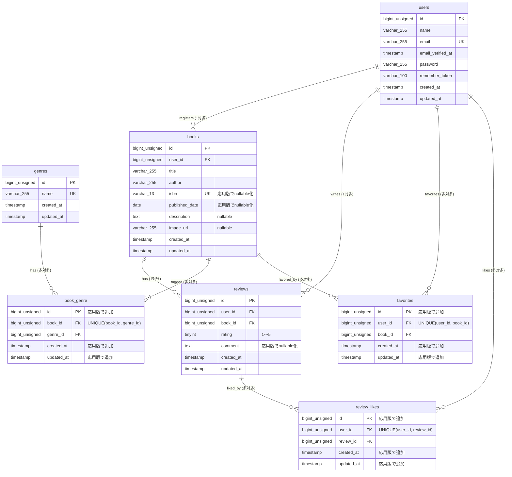

# 模擬案件\_BookShelf\_要件定義\_詳細度100%

## コーチ向けガイド: 受講生ヒアリング対応

受講生には「詳細度50%」の要件定義書が配布されています。
50%版では以下の設計タスクについて詳細が意図的に省略されており、受講生は自ら仮説を立てた上でコーチ（PM役）にヒアリングを行います。
ヒアリングは「〜という設計にしましたが、問題ないですか？」という仮説提案型で行うよう案内しています。
コーチは本書（詳細度100%）の該当箇所を参照し、回答してください。

### 設計タスクと正解の参照先

| 設計タスク | 受講生からのヒアリング例 | 正解の参照先 | 基本/応用 |
|---|---|---|---|
| 画面遷移の設計: リダイレクト先（正常系・異常系） | 「書籍登録成功後は書籍詳細画面にリダイレクトする想定ですが、この遷移先で合っていますか？」<br>「バリデーションエラー時は入力内容を保持したまま元のフォームに戻す設計にしましたが、問題ないですか？」 | 機能要件 — 各画面の「完了条件」列にリダイレクト先を記載 | 基本 |
| フラッシュメッセージの設計: 操作成功時・失敗時の文言 | 「書籍削除成功時のフラッシュメッセージを『書籍を削除しました。』としましたが、この文言で問題ないですか？」 | 機能要件 — 各操作の「完了条件」列にフラッシュメッセージ文言を記載 | 基本 |
| 認可ルールの設計: Policy の方針 | 「他人の書籍を編集しようとした場合は403 Forbiddenを返す設計にしましたが、この方針で合っていますか？」<br>「紐付く書籍があるジャンルはエラーメッセージを表示して削除を拒否する設計にしましたが、問題ないですか？」 | 機能要件 — 書籍編集/削除・レビュー編集/削除・ジャンル削除の行に認可の挙動を記載 | 基本 |
| バリデーションルールの設計: 各フォームの具体的ルール | 「タイトルは必須・最大255文字で設計しましたが、この制約で合っていますか？」<br>「ISBNは13桁固定で一意性チェックも入れる想定ですが、桁数チェックは必要ですか？」<br>「書籍編集時のISBN一意性チェックでは自身のレコードを除外する設計にしましたが、この方針で問題ないですか？」 | バリデーションルール — 全FormRequestの入力項目・ルールを網羅的に記載 | 基本 |
| エラーメッセージの設計: バリデーションエラー時の文言 | 「エラーメッセージを『タイトルは必須です。』のような日本語形式で統一しましたが、この方針で問題ないですか？」 | バリデーションルール — 「バリデーションメッセージ」セクションに全messages()定義を記載 | 基本 |
| テストケースの設計: 各カテゴリの具体的テスト内容 | 「認可エラーのテストでは403ステータスを検証する設計にしましたが、この方針で合っていますか？」<br>「お気に入りのトグル動作は追加→解除→再追加の3ステップで検証する設計にしましたが、このカバーで十分ですか？」<br>「ゲストユーザーのアクセス制限もテスト対象に含めましたが、必要ですか？」 | テスト要件 — 各テストカテゴリの「テスト対象」「実装要件」列に具体的なテストケースを記載 | 基本 |
| テーブル設計: カラム名・型・制約・ER図 | 「中間テーブルは複合主キー構成で設計しましたが、この方針で問題ないですか？」<br>「外部キーにはON DELETE CASCADEを設定する想定ですが、カスケード削除で合っていますか？」<br>「レビューにuser_idとbook_idの一意制約を付けて1ユーザー1書籍1件に制限する設計にしましたが、この制約は必要ですか？」 | テーブル仕様書 — 全テーブルのカラム定義・制約・ER図を記載 | 基本 |
| API詳細設計: リクエスト・レスポンス・ステータスコード | 「APIのページネーションはデフォルト20件/ページで設計しましたが、この件数で問題ないですか？」<br>「書籍が見つからない場合は404とエラーJSONを返す設計にしましたが、レスポンス形式はこれで合っていますか？」<br>「レスポンスにはタイトル・著者・ISBN・ジャンル・平均評価・レビュー件数を含める設計にしましたが、他に必要な項目はありますか？」 | API仕様書 — 各エンドポイントのリクエストパラメータ・レスポンスJSON・ステータスコード・API Resource構造を記載 | 基本 |
| ★ Sanctum認証設計: トークン認証・認可ポリシー | 「未認証時は401 Unauthorizedを返す設計にしましたが、このステータスコードで合っていますか？」<br>「他ユーザーの書籍を更新しようとした場合は403 Forbiddenを返す設計にしましたが、この方針で問題ないですか？」 | API仕様書 — AP06「Sanctum APIトークン認証」セクションに認証方式・導入手順・認可ポリシーを記載 | ★ 応用 |

---

> 本ドキュメントは、模擬案件「BookShelf（書籍レビューアプリ）」の統合要件定義書です。
> 確認テストのスプレッドシートフォーマット（12シート構成）に準拠し、基本機能（Basic）と応用機能（Advanced）を1つのドキュメントに統合しています。
> 各シート内で基本要件と応用要件が1つのテーブルに統合されています。応用要件は「★」マーク付きで記載されており、スプレッドシートへの転記時は赤文字にしてください。
> 各シートの内容はスプレッドシートへのコピペ転記を想定した構造です。
> **対象ブランチ: basic（基本機能）→ advanced（応用機能）**

---

## シート1: ターム内容

本模擬案件における全体概要です。
こちらは模擬案件になりますので、コーチの方は提出時にお間違えの無いように提出してください。

| 項目 | 内容 |
|---|---|
| タイトル | 模擬案件\_書籍レビューアプリ BookShelf |
| 目的 | 模擬案件を通して、実務を想定したWebアプリケーション開発を経験すること |
| 期間 | コーチと相談の上決めてください。 |
| やること | バックエンド開発（DB設計、認証/認可、CRUD実装、公開API実装、テスト作成）<br>※Bladeテンプレートは完成品として提供されるため、フロントエンド実装は不要です<br><br>【2フェーズ構成】<br>本模擬案件は以下の2フェーズに分かれています。<br><br>**フェーズ1: 基本機能の実装**<br>認証、書籍CRUD、レビュー、お気に入り、いいね、ジャンル管理、ランキング機能、公開API（認証なしのCRUD）を実装します。<br>Bladeテンプレートは `coachtech-prepared-file/Preparedblade-mockcase-BookShelf` リポジトリの **Basicブランチ** から取得します。<br><br>**フェーズ2: 応用機能の実装**<br>基本機能の完成後、高度な検索・フィルタ、ISBN検索（Google Books API連携）、マイ読書レポート、公開APIへの Sanctum 認証追加を実装します。<br>Bladeテンプレートは同リポジトリの **Advancedブランチ** から再取得します。<br>また、型宣言の徹底やCollectionメソッド活用など、コーディング品質の向上にも取り組みます。 |
| 作成物 | BookShelf 書籍レビューアプリ<br><br>【システム概要】<br>本システムは、書籍レビューアプリケーション「BookShelf」です。<br>ユーザーは書籍を登録・閲覧し、レビューの投稿やお気に入り登録ができます。<br>ジャンルによる分類やレビューへのいいね機能、平均評価に基づくランキング機能も備えています。<br>外部アプリケーション向けの公開API（JSON）も提供します。<br><br>【応用機能で追加される要素】<br>・キーワード・ジャンル・並び順を組み合わせた高度な検索機能<br>・ISBN-13によるGoogle Books API連携（書籍情報自動取得）<br>・マイ読書レポート（統計ダッシュボード）<br>・公開APIへの Sanctum によるトークン認証追加（書き込み系エンドポイントに認証必須化） |
| ルール | 原則質問チャットサポートの利用は禁止です。<br><br>留意点：<br>1. 教材やブラウザで検索した記事を参考にすることは可能です。<br>2. GitHubでのエラーが解決できず、模擬案件の提出が困難な場合はコーチに相談してください。<br>3. 質問の利用数はCOACHTECH Proの合格基準とさせていただきますので、できるだけ質問対応は利用しないようにしましょう！ |
| 提出方法 | LMSのテスト一覧画面から提出してください。 |
| 注意点 | 教材学習の集大成で、少し難易度が高いです。<br>焦らず、一歩一歩開発を進めていきましょう。<br>また基本機能の開発が終了次第、応用機能の開発に着手してください。 |

---

## シート2: 開発プロセス

こちらは環境構築、コード品質、テスト要件の詳細資料です。
採点において重要な要件やアプリケーション全体を跨ぐ要件が記載していますので、十分に確認してください。
赤字（★マーク）は応用要件になります。基本要件実装後に着手してください。

| 項目 | カテゴリ | 詳細仕様 | 留意点 | 基本/応用 |
|---|---|---|---|---|
| 仕様理解 | アーキテクチャ | 【重要】本プロジェクトのアーキテクチャについて（Traditional Web + 公開API）<br><br>本課題では、Traditional Web（Blade + セッション認証）アーキテクチャを採用します。加えて、外部アプリケーション向けの公開API（JSON）も基本機能として実装します。<br><br>Webブラウザ向け機能（Traditional Web）:<br>Bladeテンプレートを使用し、セッション認証（Cookie）で動作する従来のWebアプリケーション機能。<br>routes/web.php と通常のコントローラー（app/Http/Controllers/）を使用します。<br><br>外部アプリケーション向け公開API（JSON）:<br>routes/api.php と Api\V1 名前空間のコントローラー（app/Http/Controllers/Api/V1/）を使用します。基本機能では認証なしの CRUD として実装し、応用機能で Sanctum によるトークン認証を後付けします。 | | 基本 |
| 環境 | 技術スタック | OS（Dockerが動作する任意のOS）: -<br>PHP: 8.5<br>Laravel: 10.x<br>DB: MySQL 8.4<br>フロントエンド: Vite, Tailwind CSS ^3.4.0, @tailwindcss/forms<br>開発ツール: Docker, Laravel Sail, phpMyAdmin | | 基本 |
| | 構成管理 | ・DockerとDocker Composeを使用して環境をコンテナ化する<br>・COACHTECH側が提示した環境構築手順を遵守する | | 基本 |
| | 初期設定手順 | 「環境構築手順」シートを参考の上初期設定を行うこと | | 基本 |
| README.md 記載必須項目 | プロジェクト名 | 「BookShelf 書籍レビューアプリ」など、内容がわかるタイトル | READMEが不十分で、採点者が環境構築、機能確認ができない場合は再提出、または大きく減点される可能性があるので、十分に気をつけること | 基本 |
| | 概要 | プロジェクトの目的と、実装した機能の概要説明 | | 基本 |
| | ER図 | 自分で設計したER図の画像またはMermaid記法でのテキスト | | 基本 |
| | 環境構築手順 | 上記「初期設定手順」を参考に、誰でも環境構築ができるように詳細に記載 | | 基本 |
| | 使用技術 | Laravel 10, MySQL 8.0, Dockerなど、使用した技術スタック一覧 | | 基本 |
| | 作成者 | 自分の名前 | | 基本 |
| | APIエンドポイント一覧 | 実装したAPIのエンドポイント一覧（メソッド・パス・概要） | | 基本 |
| | 開発環境URL | 開発環境のURL（例: http://localhost ） | | 基本 |
| コード品質担保のための指示 | 命名規則 | ・Laravelの標準命名規則（PSR-12準拠）に従うこと<br> - 変数/メソッド: `camelCase`<br> - クラス: `PascalCase`<br> - DBテーブル: `snake_case`（複数形）<br> - DBカラム: `snake_case`（単数形）<br> - モデル名：アッパーキャメル<br> - コントローラー名：アッパーキャメル<br> - フォームリクエスト名：アッパーキャメル<br> - マイグレーションファイル名：スネークケース<br> - シーディングファイル名：アッパーキャメル<br>・変数名やメソッド名に a, x など意味のない命名をしないこと<br>・ローマ字（例: okyakusama）など英単語ではないもので命名しないこと | | 基本 |
| | コードフォーマット | ・Laravel Pintを使用してコードを自動整形すること<br>・コミット前に `vendor/bin/pint` を実行し、整形されたコードをコミットする<br>・採点基準: sail bin pint --test を実行し「No fixable issues were found」と表示されること | | 基本 |
| | Eloquent ORM | ・DB操作にはEloquentを最大限活用し、クエリビルダや生SQLは原則使用しない<br>・N+1問題を避けるため、`with()`メソッドによるEager Loadingを適切に使用する | | 基本 |
| | コントローラーの責務 | ・コントローラーはリクエストの受付とレスポンスの返却に専念させる<br>・複雑なビジネスロジックはモデルやサービスクラス（任意）に記述する | | 基本 |
| | FormRequest | ・バリデーションロジックは必ずFormRequestクラスに分離する | | 基本 |
| | Policy | ・認可処理（リソースの所有者チェック等）は必ずPolicyクラスで実装する<br>・コントローラーで `$this->authorize()` を使用してPolicyを適用する | | 基本 |
| | 設定のハードコーディング禁止 | ・DB接続情報やAPIキーなどの設定値は、必ず`.env`ファイルで管理する<br>・コード内に直接設定値を書き込まない | | 基本 |
| 要件遵守 | Git運用 | ・コミットメッセージは「何をしたか」が明確にわかるように記述する<br>（例: `feat: 書籍一覧表示を実装`）<br>・機能ごとにブランチを作成し、`main`ブランチにマージする | | 基本 |
| | 開発言語 | 開発言語はCOACHTECの教材内の言語を使用すること | | 基本 |
| | 各種設計 | 開発については、案件シート内の設計に沿って作成すること | - ルーティングは「画面設計」の画面定義に従って作成すること<br>- システムは「機能要件」の要件に従って作成すること | 基本 |
| | 機能要件の使用技術を遵守しているか | 認証やバリデーションなど、指定した技術以外で実装されていないか | | 基本 |
| ★ コード品質担保のための指示 | ★ 型宣言 | ・すべてのコントローラ、モデル、FormRequest、Policyのメソッドに、引数と戻り値の型を明示的に宣言する<br>（例: `public function index(): View`）<br>・モデルのリレーションメソッドには `HasMany`, `BelongsTo`, `BelongsToMany` などの具体的な戻り値型を宣言する | 基本機能では型宣言は不要だが、応用機能の開発時に全メソッドに追加する | ★ 応用 |
| | ★ PHPDoc | ・主要なメソッドには、処理内容、引数、戻り値を説明するPHPDocコメントを記述する | | ★ 応用 |
| | ★ Collectionメソッド活用 | ・`foreach` などの手続き的なループを避け、`map`, `filter`, `groupBy`, `flatMap` などのCollectionメソッドを積極的に活用する<br>・宣言的で可読性の高いコードを記述すること<br>・特にマイ読書レポート機能でこれを徹底する | | ★ 応用 |
| | ★ 外部API連携 | ・外部APIとの通信には、Laravel標準のHTTPクライアント (`Illuminate\Support\Facades\Http`) を使用する | ISBN検索（Google Books API）で使用 | ★ 応用 |
| | ★ Sanctum APIトークン認証 | ・公開API の書き込み系エンドポイント（POST/PUT/DELETE）には Laravel Sanctum によるトークン認証を導入する<br>・`auth:sanctum` ミドルウェアで認証必須化し、API版 BookPolicy で書籍所有者のみ更新・削除できるよう認可する | 基本機能では公開API は読み取り（GET 一覧/詳細）と認証なしの CRUD として実装し、応用機能で Sanctum を後付けして本物のセキュリティ層を追加する | ★ 応用 |
| ★ テストカバレッジ | ★ 目標 | ・応用機能を含むテストカバレッジは **80%** 以上を目標とする<br>・`sail artisan test --coverage` で確認できる | 基本機能のみの場合は60%が目標 | ★ 応用 |

---

## シート3: 環境構築手順

こちらは初期プロジェクトのセッティングにおいて必要な環境構築手順を記載したものです。
詳細な内容は、coachtech-prepared-file/Preparedblade-mockcase-BookShelf リポジトリのREADME.mdを参照して下さい。
採点時の環境はこちらで行いますので、違う手順によって環境構築された場合は採点を致しかねます。ご注意してください。
赤字（★マーク）は応用要件になります。基本要件実装後に着手してください。

| 手順 | カテゴリ | 基本/応用 |
|---|---|---|
| 1. Laravelプロジェクトの作成 (Laravel 10.x) | 注意: `curl -s "https://laravel.build/..."` は最新版のLaravelをインストールするため、今回は使用しません。<br><br>以下のDockerコマンドを実行して、Laravel 10.xを明示的に指定してプロジェクトを作成します。<br><br>`docker run --rm -u "$(id -u):$(id -g)" -v "$(pwd):/var/www/html" -w /var/www/html -e COMPOSER_CACHE_DIR=/tmp/composer_cache laravelsail/php82-composer:latest composer create-project laravel/laravel:^10.0 bookshelf-app` | 基本 |
| 2. Laravel Sailのインストール | プロジェクト作成後、bookshelf-app ディレクトリに移動し、Laravel Sailをインストールします。<br><br># プロジェクトディレクトリに移動<br>`cd bookshelf-app`<br><br># Laravel Sailをインストール<br>`docker run --rm -u "$(id -u):$(id -g)" -v "$(pwd):/var/www/html" -w /var/www/html -e COMPOSER_CACHE_DIR=/tmp/composer_cache laravelsail/php82-composer:latest composer require laravel/sail --dev`<br><br># Sailの設定ファイルをパブリッシュ（MySQLを選択）<br>`docker run --rm -u "$(id -u):$(id -g)" -v "$(pwd):/var/www/html" -w /var/www/html -e COMPOSER_CACHE_DIR=/tmp/composer_cache laravelsail/php82-composer:latest php artisan sail:install --with=mysql`<br><br>※M1/M2/M3 Mac（Apple Silicon）をお使いの方：<br>`sail up -d` 実行時に `no matching manifest for linux/arm64/v8` エラーが発生した場合、compose.yaml の mysql サービスに `platform: 'linux/amd64'` を追加してください。 | 基本 |
| 3. .env ファイルの設定 | .env ファイルを開き、データベース接続情報が以下と一致していることを確認します。<br><br>DB_CONNECTION=mysql<br>DB_HOST=mysql<br>DB_PORT=3306<br>DB_DATABASE=bookshelf<br>DB_USERNAME=sail<br>DB_PASSWORD=password<br><br>重要: DB_HOST は localhost や 127.0.0.1 ではなく、Dockerコンテナ名である mysql を指定します。 | 基本 |
| 4. フロントエンドのセットアップ (Vite & Tailwind CSS) | 本プロジェクトでは、フロントエンドのスタイリングにTailwind CSSを使用します。<br>以下の手順でセットアップを行ってください。<br><br>1. NPM依存パッケージのインストール<br>`sail npm install`<br>※Sailコンテナが起動していることを確認。起動していない場合は `./vendor/bin/sail up -d` を実行<br><br>2. Alpine.jsのインストール<br>`sail npm install alpinejs`<br><br>3. Tailwind CSSと @tailwindcss/forms プラグインのインストール<br>`sail npm install -D tailwindcss@^3.4.0 @tailwindcss/forms postcss autoprefixer`<br>※ `@tailwindcss/forms` はフォーム要素のスタイルをリセットするLaravel標準プラグインです。<br><br>4. 設定ファイルの生成<br>`sail npx tailwindcss init -p`<br><br>5. Tailwind CSSのテンプレートパス設定とforms プラグインの有効化<br>tailwind.config.js を以下の内容で上書きしてください：<br><br>```js<br>import defaultTheme from 'tailwindcss/defaultTheme';<br>import forms from '@tailwindcss/forms';<br><br>/** @type {import('tailwindcss').Config} */<br>export default {<br>&emsp;content: [<br>&emsp;&emsp;'./vendor/laravel/framework/src/Illuminate/Pagination/resources/views/*.blade.php',<br>&emsp;&emsp;'./storage/framework/views/*.php',<br>&emsp;&emsp;'./resources/views/**/*.blade.php',<br>&emsp;],<br>&emsp;theme: {<br>&emsp;&emsp;extend: {<br>&emsp;&emsp;&emsp;fontFamily: {<br>&emsp;&emsp;&emsp;&emsp;sans: ['Figtree', ...defaultTheme.fontFamily.sans],<br>&emsp;&emsp;&emsp;},<br>&emsp;&emsp;},<br>&emsp;},<br>&emsp;plugins: [forms],<br>};<br>```<br><br>6. 本プロジェクトのresourcesファイルを coachtech-prepared-file/Preparedblade-mockcase-BookShelf リポジトリの Basicブランチ のresourcesファイルと入れ替え<br><br>7. Vite開発サーバーの起動<br>`sail npm run dev`<br>注意: 開発中は常にこのコマンドを実行した状態にしておいてください。 | 基本 |
| 5. phpMyAdminの追加 | compose.yaml を開き、mysql サービスの後に以下の設定を追加してください。<br><br>phpmyadmin:<br>&emsp;image: 'phpmyadmin:latest'<br>&emsp;ports:<br>&emsp;&emsp;- '${FORWARD_PHPMYADMIN_PORT:-8080}:80'<br>&emsp;environment:<br>&emsp;&emsp;PMA_HOST: mysql<br>&emsp;&emsp;PMA_USER: '${DB_USERNAME}'<br>&emsp;&emsp;PMA_PASSWORD: '${DB_PASSWORD}'<br>&emsp;networks:<br>&emsp;&emsp;- sail<br>&emsp;depends_on:<br>&emsp;&emsp;- mysql | 基本 |
| 6. Sailの起動とエイリアス設定 | # Sailをバックグラウンドで起動<br>`./vendor/bin/sail up -d`<br><br># エイリアスを設定して 'sail' だけでコマンドを実行できるようにする<br>`echo "alias sail='[ -f sail ] && bash sail \|\| bash vendor/bin/sail'" >> ~/.zshrc`<br><br># シェルを再起動するか、新しいターミナルを開いてエイリアスを有効にする<br>`exec $SHELL` | 基本 |
| 7. アプリケーションキーの生成 | ルートで以下のコマンドを実行する<br>`sail artisan key:generate` | 基本 |
| 8. Laravel Fortify の導入 | 認証機能を実装するため、Laravel Fortify を導入します。<br><br>1. パッケージのインストール<br>`sail composer require laravel/fortify`<br><br>2. Fortify 設定ファイルとプロバイダのパブリッシュ<br>`sail artisan vendor:publish --provider="Laravel\Fortify\FortifyServiceProvider"`<br>（`config/fortify.php`, `app/Actions/Fortify/*`, `app/Providers/FortifyServiceProvider.php`, `database/migrations/2014_10_12_200000_add_two_factor_columns_to_users_table.php` が生成される）<br><br>3. 不要ファイルの削除<br>本プロジェクトでは2要素認証を使用しないため、以下を削除する:<br>・`database/migrations/2014_10_12_200000_add_two_factor_columns_to_users_table.php`<br><br>4. `config/app.php` の providers 配列に追加<br>`App\Providers\FortifyServiceProvider::class,`<br><br>5. `config/fortify.php` の features 配列を以下に変更（登録機能のみ有効化）<br>```php<br>'features' => [<br>&emsp;Features::registration(),<br>],<br>```<br><br>6. `FortifyServiceProvider` のカスタマイズ<br>・Fortify 標準の views を無効化: `config/fortify.php` の `'views' => false`<br>・login / register の view を独自定義: `Fortify::loginView(...)`, `Fortify::registerView(...)`<br>・`Fortify::createUsersUsing(CreateNewUser::class)` で Action を登録<br>・`CreateNewUser::create()` の `Validator::make()` に `messages()` を追加し、シート7 のバリデーションメッセージを日本語で定義<br>・ログアウト後のリダイレクト先を `/login` に変更（カスタム `LogoutResponse` を登録） | 基本 |
| 9. 認証ルートの定義 (`routes/auth.php`) | Fortify の view を無効化したため、`/login`, `/register` の GET ルート、および `/logout` の POST ルートを独自に定義します。<br><br>1. `routes/auth.php` を新規作成し、以下を定義：<br>・GET `/login` → `view('auth.login')`, name: login<br>・GET `/register` → `view('auth.register')`, name: register<br>・POST `/logout` → セッション破棄して `/login` にリダイレクト<br><br>2. `app/Providers/RouteServiceProvider.php` の `boot()` 内で `routes/auth.php` を `web` ミドルウェア下で読み込むよう追加 | 基本 |
| 10. 日本語ロケールの設定 | バリデーションメッセージを日本語化します。<br><br>1. `config/app.php` の `locale` を `'ja'` に変更<br><br>2. `lang/ja/` ディレクトリを作成し、以下ファイルを配置：<br>・`auth.php`: `'failed' => 'ログイン情報が登録されていません。'` 等<br>・`validation.php`: `'required' => ':attributeを入力してください。'`, `'email' => ':attributeはメール形式で入力してください。'`, `'confirmed' => ':attributeと一致しません。'`, `'unique' => 'その:attributeは既に使用されています。'`, `attributes => ['name' => 'お名前', 'email' => 'メールアドレス', 'password' => 'パスワード']` 等<br>・`passwords.php`（reset用、Fortify のデフォルト構成で必要） | 基本 |
| 11. その他設定ファイルの調整 | 以下ファイルを本プロジェクト仕様に調整します。<br><br>1. `resources/js/app.js` — Alpine.js を初期化<br>```js<br>import Alpine from 'alpinejs';<br>window.Alpine = Alpine;<br>Alpine.start();<br>```<br><br>2. `resources/css/app.css` — Tailwind ディレクティブ<br>```css<br>@tailwind base;<br>@tailwind components;<br>@tailwind utilities;<br>```<br><br>3. `vite.config.js` — input を設定<br>```js<br>input: ['resources/css/app.css', 'resources/js/app.js']<br>```<br><br>4. `postcss.config.js` — ES module 形式で<br>```js<br>export default { plugins: { tailwindcss: {}, autoprefixer: {} } };<br>```<br><br>5. `app/Exceptions/Handler.php` — API エンドポイントで以下の例外を日本語の JSON レスポンスに変換するよう `render()` をオーバーライド：<br>　・`ModelNotFoundException` → 404 `{"error": "書籍が見つかりませんでした。"}`<br>　・★ 応用機能で追加: `AuthorizationException` → 403 `{"error": "この操作を実行する権限がありません。"}`<br><br>6. `app/Providers/AuthServiceProvider.php` — `$policies` 配列に `Book::class => BookPolicy::class, Review::class => ReviewPolicy::class` を登録 | 基本 |
| 12. データベースのマイグレーションと初期データ投入 | 以下のコマンドでテーブルを作成し、初期データを投入します。<br>`sail artisan migrate --seed`<br><br>※既存のデータベースをリセットしたい場合は以下を実行してください。<br>`sail artisan migrate:fresh --seed` | 基本 |
| ★ 13. 応用機能用Bladeテンプレートのインポートと環境調整 | 基本機能の実装完了後、応用機能の画面に対応するBladeテンプレートを取得します。<br><br>1. Bladeテンプレートの差し替え<br>coachtech-prepared-file/Preparedblade-mockcase-BookShelf リポジトリの Advancedブランチ からresourcesファイルを再度インポートし、プロジェクトのresourcesディレクトリを置き換えてください。<br><br>2. Sanctum 関連の追加（応用版の公開API 書き込み系を認証必須化するため）<br>・`sail composer require laravel/sanctum`<br>・`sail artisan vendor:publish --provider="Laravel\Sanctum\SanctumServiceProvider"` （`config/sanctum.php`, `personal_access_tokens` migration が生成される）<br>・`User` モデルに `HasApiTokens` トレイト追加<br><br>3. データモデル変更の適用（マイグレーションを書き直し、`sail artisan migrate:fresh --seed` で再構築）。変更点の詳細はシート10・11を参照。<br><br>4. Google Books API キーの設定<br>・`.env` に `GOOGLE_BOOKS_API_KEY=...` を追加<br>・`config/services.php` に `'google' => ['books_api_key' => env('GOOGLE_BOOKS_API_KEY')]` を追加<br>・APIキーの取得手順は README を参照<br><br>5. Sanctum ミドルウェアと Policy の適用<br>・`routes/api.php` の書き込み系ルートを `auth:sanctum` ミドルウェアで保護<br>・`Api\V1\BookController` の `update/destroy` で `$this->authorize(...)` を呼ぶ | ★ 応用 |

---

## シート4: 画面設計

各画面の仕様とUIデザイン要件の詳細資料です。
アプリケーションの実装に入る前に確認し、これらの要件を満たすように実装しましょう。
赤字（★マーク）は応用要件になります。基本要件実装後に着手してください。

### 画面定義

| 画面ID | 画面名称 | HTTPメソッド | パス | 備考 | 基本/応用 |
|---|---|---|---|---|---|
| PG01 | 書籍一覧（トップ） | GET | / または /books | Blade提供済み。<br>公開ページ。全書籍をページネーション（10件/ページ）で最新順に表示。ジャンル情報をEager Loading。<br>routes/web.php<br>app/Http/Controllers/BookController@index<br>resources/views/books/index.blade.php | 基本 |
| PG02 | 書籍詳細 | GET | /books/{book} | Blade提供済み。<br>公開ページ。書籍詳細とレビュー・ジャンル・お気に入り・いいね機能を表示。<br>routes/web.php<br>app/Http/Controllers/BookController@show<br>resources/views/books/show.blade.php | 基本 |
| PG03 | 書籍登録 | GET | /books/create | Blade提供済み。<br>認証必須。全ジャンル一覧をセレクトボックスで表示。<br>routes/web.php<br>app/Http/Controllers/BookController@create<br>resources/views/books/create.blade.php | 基本 |
| PG04 | 書籍編集 | GET | /books/{book}/edit | Blade提供済み。<br>認証+認可（BookPolicy@update）必須。作成者のみ閲覧可。<br>routes/web.php<br>app/Http/Controllers/BookController@edit<br>resources/views/books/edit.blade.php | 基本 |
| PG05 | ジャンル一覧 | GET | /genres | Blade提供済み。<br>認証必須。各ジャンルの書籍数を表示。<br>routes/web.php<br>app/Http/Controllers/GenreController@index<br>resources/views/genres/index.blade.php | 基本 |
| PG06 | ジャンル詳細 | GET | /genres/{genre} | Blade提供済み。<br>認証必須。ジャンルに紐づく書籍をページネーション（10件/ページ）で表示。<br>routes/web.php<br>app/Http/Controllers/GenreController@show<br>resources/views/genres/show.blade.php | 基本 |
| PG07 | ジャンル登録 | GET | /genres/create | Blade提供済み。<br>認証必須。<br>routes/web.php<br>app/Http/Controllers/GenreController@create<br>resources/views/genres/create.blade.php | 基本 |
| PG08 | ジャンル編集 | GET | /genres/{genre}/edit | Blade提供済み。<br>認証必須。<br>routes/web.php<br>app/Http/Controllers/GenreController@edit<br>resources/views/genres/edit.blade.php | 基本 |
| PG09 | レビュー編集 | GET | /reviews/{review}/edit | Blade提供済み。<br>認証+認可（ReviewPolicy@update）必須。投稿者のみ閲覧可。<br>routes/web.php<br>app/Http/Controllers/ReviewController@edit<br>resources/views/reviews/edit.blade.php | 基本 |
| PG10 | お気に入り一覧 | GET | /favorites | Blade提供済み。<br>認証必須。ユーザーのお気に入り書籍をページネーション（10件/ページ）で表示。<br>routes/web.php<br>app/Http/Controllers/FavoriteController@index<br>resources/views/favorites/index.blade.php | 基本 |
| PG11 | ランキング | GET | /ranking | Blade提供済み。<br>公開ページ。レビュー平均評価TOP10を表示。<br>routes/web.php<br>app/Http/Controllers/RankingController@index<br>resources/views/ranking/index.blade.php | 基本 |
| PG12 | ログイン | GET | /login | Blade提供済み。<br>Fortifyが提供するログインビュー。<br>メール・パスワード入力と送信。<br>resources/views/auth/login.blade.php | 基本 |
| PG13 | 会員登録 | GET | /register | Blade提供済み。<br>Fortifyが提供する登録ビュー。<br>氏名・メール・パスワードを登録。<br>resources/views/auth/register.blade.php | 基本 |
| ★ PG01 | ★ 書籍一覧（トップ）<br>【変更】 | GET | / または /books | Blade提供済み（Advancedブランチ）。<br>基本機能に加え、以下を追加：<br>・キーワード検索フォーム（keyword）<br>・ジャンルフィルタ（genre プルダウン）<br>・並び順ソート（sort プルダウン）<br>検索条件はページネーションに引き継がれる。 | ★ 応用 |
| ★ PG03 | ★ 書籍登録<br>【変更】 | GET | /books/create | Blade提供済み（Advancedブランチ）。<br>基本機能に加え、以下を追加：<br>・ISBN検索フォーム（ISBN-13入力 + 検索ボタン）<br>・JavaScriptで `/books/isbn/{isbn}` にリクエストし、取得した書籍情報をフォームに自動入力 | ★ 応用 |
| ★ PG14 | ★ マイ読書レポート<br>【新規】 | GET | /reports | Blade提供済み（Advancedブランチ）。<br>認証必須。ログインユーザーの読書統計を表示。<br>routes/web.php<br>app/Http/Controllers/ReportController@index<br>resources/views/reports/index.blade.php | ★ 応用 |

### Bladeファイルの提供

| 手順 | 詳細 |
|---|---|
| Step 1 | BladeファイルはBasicブランチとAdvancedブランチに分かれて提供されます。<br>まず `coachtech-prepared-file/Preparedblade-mockcase-BookShelf` リポジトリの **Basicブランチ** からresourcesファイルをプロジェクトに移入し、基本機能を実装します。 |
| Step 2 | 基本機能の実装完了後、同リポジトリの **Advancedブランチ** からresourcesファイルを再度インポートし、応用機能の画面に対応するBladeテンプレートを取得します。 |
| Step 3 | 環境構築手順シートを参照しつつフロントエンドの環境構築を行う。 |

---

## シート5: デザインUI

各画面のUI画像を添付してあります。
模擬案件の実装に入る前に内容を確認し、画面要件の理解に役立ててください。
赤字（★マーク）は応用機能で追加・変更される画面です。

#### 書籍管理

| 書籍一覧画面 | 書籍詳細画面 | 書籍登録画面 |
|---|---|---|
| （画像を添付） | （画像を添付） | （画像を添付） |

| 書籍編集画面 | | |
|---|---|---|
| （画像を添付） | | |

#### ジャンル管理

| ジャンル一覧画面 | ジャンル詳細画面 | ジャンル登録画面 |
|---|---|---|
| （画像を添付） | （画像を添付） | （画像を添付） |

| ジャンル編集画面 | | |
|---|---|---|
| （画像を添付） | | |

#### レビュー・お気に入り・ランキング

| レビュー編集画面 | お気に入り一覧画面 | ランキング画面 |
|---|---|---|
| （画像を添付） | （画像を添付） | （画像を添付） |

#### 認証

| 会員登録画面 | ログイン画面 |
|---|---|
| （画像を添付） | （画像を添付） |

#### 応用機能（変更・追加画面）

| ★ 書籍一覧画面（検索・フィルタ・ソート追加） | ★ 書籍登録画面（ISBN検索追加） |
|---|---|
| （画像を添付） | （画像を添付） |

| ★ マイ読書レポート画面 | |
|---|---|
| （画像を添付） | |

---

## シート6: 機能要件（画面フロー起点型）

画面遷移の流れに沿って「どの画面で何をしたらどうなるか」を時系列で整理した形式です。
受講生が画面ごとに「やること」を把握しやすく、実装順序のガイドとしても活用できます。
赤字（★マーク）は応用要件です。基本要件実装後に着手してください。

| 画面名 | 操作 | URL / メソッド | 完了条件 | 使用技術 | 基本/応用 |
|--------|------|---------------|---------|---------|---------|
| **会員登録画面** | ページを表示する | GET /register | 名前・メール・パスワード・パスワード確認の入力フォームが表示される | Fortify, auth.register | 基本 |
| | 情報を入力して「登録」ボタンを押す | POST /register | バリデーション通過時→ユーザーが作成され / にリダイレクト。失敗時→エラーメッセージ表示<br>エラーメッセージ:<br>　a. 名前が未入力の場合：お名前を入力してください<br>　b. メールアドレスが未入力の場合：メールアドレスを入力してください<br>　c. メール形式ではない場合：メールアドレスはメール形式で入力してください<br>　d. パスワードが未入力の場合：パスワードを入力してください<br>　e. パスワードが8文字未満の場合：パスワードは8文字以上で入力してください<br>　f. 確認用パスワードが一致しない場合：パスワードと一致しません | Fortify CreateNewUser, FortifyServiceProvider | 基本 |
| | ヘッダーの「ログイン」ボタンを押す | GET /login | ログイン画面に遷移する | ボタン | 基本 |
| **ログイン画面** | ページを表示する | GET /login | メール・パスワードの入力フォームが表示される | Fortify, auth.login | 基本 |
| | 情報を入力して「ログイン」ボタンを押す | POST /login | バリデーション通過時→ / にリダイレクト。失敗時→エラーメッセージ表示<br>エラーメッセージ:<br>　a. メールアドレスが未入力の場合：メールアドレスを入力してください<br>　b. パスワードが未入力の場合：パスワードを入力してください<br>　c. 入力情報が誤っている場合：ログイン情報が登録されていません | Fortify | 基本 |
| | ヘッダーの「会員登録」ボタンを押す | GET /register | 会員登録画面に遷移する | ボタン | 基本 |
| | 既にログイン済みでアクセスする | GET /login または /register | 書籍一覧（/）にリダイレクトされる | RedirectIfAuthenticated middleware | 基本 |
| **書籍一覧画面（トップ）** | ページを表示する | GET / または GET /books | 書籍一覧が10件/ページでページネーション表示され、各書籍にジャンルが表示される。ゲストもアクセス可能 | BookController@index, Book::with('genres')->latest()->paginate(10), books.index | 基本 |
| | 書籍タイトルを押す | GET /books/{book} | 書籍詳細画面に遷移する | リンク（ルートモデルバインディング） | 基本 |
| | 「書籍を登録」ボタンを押す | GET /books/create | 認証時→書籍登録画面に遷移。未認証時→ /login にリダイレクト | auth middleware | 基本 |
| | ★ キーワード検索フォームに入力して検索する | GET /books?keyword=xxx | キーワードに部分一致する書籍（title または author）のみが表示される | BookController@index, Builder::when(), LIKE '%keyword%' | ★ 応用 |
| | ★ ジャンルフィルタを選択して絞り込む | GET /books?genre=xxx | 選択したジャンルに紐づく書籍のみが表示される | Builder::when(), whereHas('genres', ...) | ★ 応用 |
| | ★ ソート順（latest/oldest/title/rating）を変更する | GET /books?sort=xxx | latest（デフォルト）：登録日が新しい順<br>oldest：登録日が古い順<br>title：タイトル昇順<br>rating：評価が高い順（レビューがない書籍は最後に表示） | sort 値で orderBy 切替、rating は withAvg('reviews', 'rating')->orderByDesc('reviews_avg_rating') | ★ 応用 |
| | ★ ページネーションリンクを押す | GET /books?page=N&keyword=...&genre=...&sort=... | 検索条件を維持したまま指定ページに遷移する | paginate()->appends(request()->query()) | ★ 応用 |
| **書籍詳細画面** | ページを表示する | GET /books/{book} | 書籍タイトル・著者・ISBN・出版日・説明・画像・ジャンル・レビュー一覧・いいね数が表示される。ゲストもアクセス可能 | BookController@show, $book->load(['reviews.user', 'genres']), books.show | 基本 |
| | 「お気に入り」ボタンを押す | POST /books/{book}/favorites | 認証時→お気に入りトグル（追加/解除）後、元のページにリダイレクト。未認証時→ /login にリダイレクト | FavoriteController@toggle, Auth::user()->favoriteBooks()->toggle($book->id) | 基本 |
| | 評価プルダウン選択、レビュー投稿フォームに入力して「投稿する」ボタンを押す | POST /books/{book}/reviews | 認証時→バリデーション通過後にレビューが保存され、書籍詳細画面にリダイレクトし「レビューを投稿しました。」と表示。未認証時→ /login にリダイレクト<br>バリデーション: rating(required/integer/min:1/max:5), comment(nullable/string/max:1000)<br>エラーメッセージ:<br>　a. rating が未入力の場合：評価は必須です<br>　b. comment が1000文字超過の場合：コメントは1000文字以内で入力してください | ReviewController@store, StoreReviewRequest, $book->reviews()->create([...]) | 基本 |
| | レビューの「いいね」ボタンを押す | POST /reviews/{review}/like | 認証時→いいねトグル（追加/解除）後、元のページにリダイレクト。未認証時→ /login にリダイレクト | ReviewLikeController@toggle, Auth::user()->likedReviews()->toggle($review->id) | 基本 |
| | 自分のレビューの「編集」ボタンを押す | GET /reviews/{review}/edit | 認証＋投稿者本人→レビュー編集画面に遷移。他ユーザー→403 Forbidden | ReviewController@edit, ReviewPolicy@update | 基本 |
| | 自分のレビューの「削除」ボタンを押す | DELETE /reviews/{review} | 認証＋投稿者本人→レビュー削除後、書籍詳細画面にリダイレクトし「レビューを削除しました。」と表示。関連いいねは ON DELETE CASCADE で削除。他ユーザーは403エラー（サーバー側で実装されていること）。 | ReviewController@destroy, ReviewPolicy@delete | 基本 |
| | 自分が登録した書籍の「編集」ボタンを押す | GET /books/{book}/edit | 認証＋作成者本人→書籍編集画面に遷移。他ユーザー→403 Forbidden | BookController@edit, BookPolicy@update | 基本 |
| | 自分が登録した書籍の「削除」ボタンを押す | DELETE /books/{book} | 認証＋作成者本人→書籍削除後、書籍一覧にリダイレクトし「書籍を削除しました。」と表示。関連レビュー・お気に入り・ジャンル紐付けは ON DELETE CASCADE で削除。他ユーザーは403エラー（サーバー側で実装されていること）。 | BookController@destroy, BookPolicy@delete | 基本 |
| **書籍登録画面** | ページを表示する | GET /books/create | 認証時→タイトル・著者・ISBN・出版日・説明・画像URLの入力欄と、全ジャンル一覧のチェックボックス（複数選択可）が表示される。未認証時→ /login にリダイレクト | BookController@create, auth middleware, Genre::all(), books.create | 基本 |
| | 全項目を入力して「登録」ボタンを押す | POST /books | バリデーション通過時→書籍がDBに登録され、book_genreテーブルにジャンル紐付けが作成され、書籍詳細画面にリダイレクトし「書籍を登録しました。」と表示。失敗時→フォームに戻りエラー表示<br>バリデーション: title(required/string/max:255), author(required/string/max:255), isbn(required/string/size:13/unique:books), published_date(required/date), description(nullable/string), image_url(nullable/url), genres(required/array), genres.*(exists:genres,id)<br>エラーメッセージ：<br>a. 入力必須項目未入力の場合：詳細はシート7参照<br>b. ISBNが13桁でない場合：ISBNは13桁で入力してください。<br>c. ISBNが重複している場合：そのISBNは既に使用されています。<br>d. 画像URLがURL形式でない場合：画像URLは有効なURL形式で入力してください。 | BookController@store, StoreBookRequest, $request->user()->books()->create($data), $book->genres()->attach($genres) | 基本 |
| | ★ ISBN（13桁）を入力して「ISBN検索」ボタンを押す | GET /books/isbn/{isbn} | 13桁ISBN→Google Books API から書籍情報を取得し、JavaScriptで title/author/published_date/description/image_url 入力欄に自動入力される<br>13桁以外→400「ISBNは13桁で入力してください。」<br>書籍見つからず→404「書籍が見つかりませんでした。」<br>API通信エラー→500「API通信エラーが発生しました。」 | BookController@searchByIsbn, Http::get('https://www.googleapis.com/books/v1/volumes?q=isbn:{isbn}&key={API_KEY}'), config/services.php の google.books_api_key | ★ 応用 |
| **書籍編集画面** | ページを表示する | GET /books/{book}/edit | 認証＋作成者本人→既存データが初期値として表示された編集フォームが表示される。他ユーザー→403 Forbidden | BookController@edit, BookPolicy@update, books.edit | 基本 |
| | 内容を変更して「更新」ボタンを押す | PUT /books/{book} | 認証＋作成者本人＋バリデーション通過→書籍とジャンル紐付けが更新され、書籍詳細画面にリダイレクトし「書籍情報を更新しました。」と表示。他ユーザー→403 Forbidden<br>バリデーション: 書籍登録と同一ルール（ただし isbn の unique 制約は自身のIDを除外）<br>エラーメッセージ：書籍登録と同一メッセージを表示 | BookController@update, UpdateBookRequest, $book->update($data), $book->genres()->sync($genres) | 基本 |
| **レビュー編集画面** | ページを表示する | GET /reviews/{review}/edit | 認証＋投稿者本人→既存のrating/commentが初期値として表示された編集フォームが表示される。他ユーザー→403 Forbidden | ReviewController@edit, ReviewPolicy@update, reviews.edit | 基本 |
| | 内容を変更して「更新」ボタンを押す | PUT /reviews/{review} | 認証＋投稿者本人＋バリデーション通過→レビューが更新され、書籍詳細画面にリダイレクトし「レビューを更新しました。」と表示。他ユーザー→403 Forbidden（サーバー側で実装されていること）。<br>バリデーション: rating(required/integer/min:1/max:5), comment(nullable/string/max:1000) | ReviewController@update, UpdateReviewRequest, $review->update([...]) | 基本 |
| **お気に入り一覧画面** | ページを表示する | GET /favorites | 認証時→ログインユーザーのお気に入り書籍が10件/ページでページネーション表示される。未認証時→ /login にリダイレクト | FavoriteController@index, auth middleware, Auth::user()->favoriteBooks()->paginate(10), favorites.index | 基本 |
| | 書籍タイトルを押す | GET /books/{book} | 書籍詳細画面に遷移する | リンク | 基本 |
| **ジャンル一覧画面** | ページを表示する | GET /genres | 認証時→各ジャンルに紐づく書籍数付きでジャンル一覧が表示される。未認証時→ /login にリダイレクト | GenreController@index, auth middleware, Genre::withCount('books')->get(), genres.index | 基本 |
| | ジャンル名を押す | GET /genres/{genre} | ジャンル詳細画面に遷移する | リンク | 基本 |
| | 「ジャンルを登録」ボタンを押す | GET /genres/create | ジャンル登録画面に遷移する | リンク | 基本 |
| | 各ジャンルの「編集」ボタンを押す | GET /genres/{genre}/edit | ジャンル編集画面に遷移する | リンク | 基本 |
| | 各ジャンルの「削除」ボタンを押す | DELETE /genres/{genre} | 書籍紐付きなし→ジャンル一覧にリダイレクトし「ジャンルを削除しました。」と表示。書籍紐付きあり→「このジャンルには書籍が紐付いているため削除できません。」とエラー表示 | GenreController@destroy, $genre->books()->count() チェック | 基本 |
| **ジャンル詳細画面** | ページを表示する | GET /genres/{genre} | 認証時→ジャンル名と紐づく書籍が10件/ページでページネーション表示される。未認証時→ /login にリダイレクト | GenreController@show, auth middleware, $genre->books()->with('genres')->paginate(10), genres.show | 基本 |
| **ジャンル登録画面** | ページを表示する | GET /genres/create | 認証時→ジャンル名入力フォームが表示される。未認証時→ /login にリダイレクト | GenreController@create, auth middleware, genres.create | 基本 |
| | ジャンル名を入力して「登録」ボタンを押す | POST /genres | バリデーション通過時→ジャンルがDBに登録され、ジャンル一覧にリダイレクトし「ジャンルを作成しました。」と表示。失敗時→フォームに戻りエラー表示<br>バリデーション: name(required/string/max:255/unique:genres,name)<br>エラーメッセージ:<br>　a. 未入力の場合：ジャンル名は必須です<br>　b. 255文字超過の場合：ジャンル名は255文字以内で入力してください<br>　c. 重複している場合：そのジャンル名は既に使用されています | GenreController@store, StoreGenreRequest | 基本 |
| **ジャンル編集画面** | ページを表示する | GET /genres/{genre}/edit | 認証時→現在のジャンル名が初期値として表示された編集フォームが表示される。未認証時→ /login にリダイレクト | GenreController@edit, auth middleware, genres.edit | 基本 |
| | ジャンル名を変更して「更新」ボタンを押す | PUT /genres/{genre} | バリデーション通過時→ジャンル名が更新され、ジャンル一覧にリダイレクトし「ジャンルを更新しました。」と表示。失敗時→フォームに戻りエラー表示<br>バリデーション: ジャンル登録と同一ルール（ただし name の unique 制約は自身のIDを除外）<br>エラーメッセージ：ジャンル登録と同一メッセージを表示 | GenreController@update, UpdateGenreRequest, Rule::unique('genres')->ignore($this->genre) | 基本 |
| **ランキング画面** | ページを表示する | GET /ranking | レビュー平均評価のTOP10書籍が降順で表示される。レビューがない書籍は表示されない。ゲストもアクセス可能 | RankingController@index, Book::withAvg('reviews', 'rating')->has('reviews')->orderByDesc('reviews_avg_rating')->take(10), ranking.index | 基本 |
| **★ マイ読書レポート画面** | ★ ページを表示する | GET /reports | 認証時→4種の統計情報が表示される。未認証時→ /login にリダイレクト<br>1. 基本サマリー: 総レビュー数、読了冊数（ユニーク書籍数）、平均評価点<br>2. 評価分布: 1〜5星ごとの件数を横バーで表示<br>3. 高評価書籍TOP5: 4星以上の書籍を評価の高い順に最大5件表示（書籍詳細リンク付き）<br>4. ジャンル別評価傾向TOP5: ジャンルごとの平均評価と件数を高い順に最大5件表示（ジャンル詳細リンク付き） | ReportController@index, auth middleware, Auth::user()->reviews()->with('book.genres')->get(), Collection メソッド活用必須（map/filter/groupBy/flatMap/sortByDesc/take/pluck/unique/avg/count/values）, reports.index | ★ 応用 |
| **ログアウト** | ヘッダーの「ログアウト」ボタンを押す | POST /logout | セッションが破棄されログイン画面にリダイレクトされる | Fortify | 基本 |
| **公開API** | 書籍一覧を取得する | GET /api/v1/books | JSON形式で data 配列と meta 情報（current_page, last_page, per_page, total）が返される。keyword/genre_id/page/per_page で検索・絞り込み・ページネーション可能（per_page デフォルト20、最大100）<br>※ Basic 段階では認証なし | Api\V1\BookController@index, Api\V1\IndexBookRequest, BookResource, GenreResource, paginate($perPage), BookResource::collection($books)（routes/api.php では `Route::apiResource('books', BookController::class)` で 5 エンドポイントを一括定義） | 基本 |
| | 書籍詳細を取得する | GET /api/v1/books/{book} | JSON形式で書籍詳細（ジャンル・レビュー含む）が data として返される。存在しないIDの場合は404と { "error": "書籍が見つかりませんでした。" }<br>※ Basic 段階では認証なし | Api\V1\BookController@show, $book->load(['genres', 'reviews.user']), $book->loadCount('reviews'), $book->loadAvg('reviews', 'rating'), BookResource（404 は Exception Handler が ModelNotFoundException を api/* で JSON 化） | 基本 |
| | 書籍を新規登録する | POST /api/v1/books | バリデーション通過時→201 Created で作成されたリソースのJSONが返される。失敗時→422 でエラーメッセージが日本語で返される<br>バリデーション: シート7「書籍登録(StoreBookRequest)」と同一ルール（Basic は user_id も必須）<br>※ Basic 段階では認証なし。応用段階では Sanctum 認証必須 | Api\V1\BookController@store, Api\V1\StoreBookRequest, Book::create($validated), $book->genres()->sync($validated['genres']), $book->loadCount/loadAvg, BookResource | 基本 |
| | 書籍を更新する | PUT /api/v1/books/{book} | バリデーション通過時→200 OK で更新後のリソースのJSONが返される。存在しないID→404、バリデーション失敗→422<br>バリデーション: シート7「書籍編集(UpdateBookRequest)」と同一ルール（Basic は user_id も必須）。存在しないIDは Exception Handler が 404 JSON を返す<br>※ Basic 段階では認証・認可なし。応用段階では Sanctum 認証 + BookPolicy@update（書籍所有者のみ） | Api\V1\BookController@update, Api\V1\UpdateBookRequest, $book->update($validated), $book->genres()->sync($validated['genres']), $book->loadCount/loadAvg, BookResource | 基本 |
| | 書籍を削除する | DELETE /api/v1/books/{book} | 削除成功→204 No Content。存在しないID→404<br>関連 reviews / favorites / book_genre は ON DELETE CASCADE で削除される<br>※ Basic 段階では認証・認可なし。応用段階では Sanctum 認証 + BookPolicy@delete（書籍所有者のみ） | Api\V1\BookController@destroy, $book->delete() | 基本 |
| | ★ Sanctum 認証を要求する書き込み系API（POST/PUT/DELETE） | POST/PUT/DELETE /api/v1/books（応用段階） | 未認証時→401 Unauthorized<br>認証済み・所有者→200/201/204<br>認証済み・他ユーザー（update/destroy）→403 Forbidden<br>※ Sanctum 導入手順:<br>　1. `sail composer require laravel/sanctum`<br>　2. `sail artisan vendor:publish --provider="Laravel\Sanctum\SanctumServiceProvider"`<br>　3. `sail artisan migrate`（personal_access_tokens テーブル作成）<br>　4. User モデルに HasApiTokens トレイト追加<br>　5. routes/api.php の書き込み系ルートに `auth:sanctum` ミドルウェア適用<br>　6. Api\V1\BookController で `$this->authorize('update'\|'delete', $book)` を呼び出す | Laravel Sanctum, HasApiTokens, auth:sanctum middleware, BookPolicy（Web版と共通） | ★ 応用 |

---

## シート7: バリデーションルール

本模擬案件で実装する各種バリデーションの詳細仕様です。
赤字（★マーク）は応用要件です。基本要件実装後に着手してください。

| 対象機能 | 入力項目 | ルール | 基本/応用 |
|---|---|---|---|
| 書籍登録<br>(StoreBookRequest) ※ Web版 | title | required / string / max:255 | 基本 |
| | author | required / string / max:255 | 基本 |
| | isbn | required / string / size:13 / unique:books,isbn | 基本 |
| | published_date | required / date | 基本 |
| | description | nullable / string | 基本 |
| | image_url | nullable / url | 基本 |
| | genres | required / array | 基本 |
| | genres.* | exists:genres,id | 基本 |
| 書籍編集<br>(UpdateBookRequest) ※ Web版 | title | required / string / max:255 | 基本 |
| | author | required / string / max:255 | 基本 |
| | isbn | required / string / size:13 / unique:books,isbn<br>（自身を除外: Rule::unique('books')->ignore($this->book)） | 基本 |
| | published_date | required / date | 基本 |
| | description | nullable / string | 基本 |
| | image_url | nullable / url | 基本 |
| | genres | required / array | 基本 |
| | genres.* | exists:genres,id | 基本 |
| 公開API 書籍一覧<br>(Api\V1\IndexBookRequest) | keyword | nullable / string / max:255 | 基本 |
| | genre_id | nullable / integer / exists:genres,id | 基本 |
| | page | nullable / integer / min:1 | 基本 |
| | per_page | nullable / integer / min:1 / max:100 | 基本 |
| 公開API 書籍登録<br>(Api\V1\StoreBookRequest) | user_id | required / integer / exists:users,id（書籍登録者。応用では Sanctum 認証ユーザーから自動付与のため削除） | 基本 |
| | title | required / string / max:255 | 基本 |
| | author | required / string / max:255 | 基本 |
| | isbn | required / string / size:13 / unique:books,isbn | 基本 |
| | published_date | required / date | 基本 |
| | description | nullable / string | 基本 |
| | image_url | nullable / url / max:255 | 基本 |
| | genres | required / array / min:1 | 基本 |
| | genres.* | integer / exists:genres,id | 基本 |
| 公開API 書籍編集<br>(Api\V1\UpdateBookRequest) | user_id | required / integer / exists:users,id（応用では削除） | 基本 |
| | title | required / string / max:255 | 基本 |
| | author | required / string / max:255 | 基本 |
| | isbn | required / string / size:13 / unique:books,isbn<br>（自身を除外: Rule::unique('books')->ignore($this->route('book'))） | 基本 |
| | published_date | required / date | 基本 |
| | description | nullable / string | 基本 |
| | image_url | nullable / url / max:255 | 基本 |
| | genres | required / array / min:1 | 基本 |
| | genres.* | integer / exists:genres,id | 基本 |
| レビュー投稿<br>(StoreReviewRequest) | rating | required / integer / min:1 / max:5 | 基本 |
| | comment | nullable / string / max:1000 | 基本 |
| レビュー編集<br>(UpdateReviewRequest) | rating | required / integer / min:1 / max:5 | 基本 |
| | comment | nullable / string / max:1000 | 基本 |
| ジャンル登録<br>(StoreGenreRequest) | name | required / string / max:255 / unique:genres,name | 基本 |
| ジャンル編集<br>(UpdateGenreRequest) | name | required / string / max:255 / unique:genres,name<br>（自身を除外: Rule::unique('genres')->ignore($this->genre)） | 基本 |
| ユーザー登録 | name | required / string / max:255 | 基本 |
| | email | required / email / max:255 / unique:users,email | 基本 |
| | password | Fortify標準（8文字以上・確認用一致） | 基本 |
| ログイン | email | required / email | 基本 |
| | password | required | 基本 |
| ★ 書籍登録<br>(StoreBookRequest) ※ Web版 | isbn | ★ nullable / string / size:13 / unique:books,isbn（required→nullable変更） | ★ 応用 |
| | published_date | ★ nullable / date（required→nullable変更） | ★ 応用 |
| | image_url | ★ nullable / url / max:255（max:255追加） | ★ 応用 |
| | genres | ★ required / array / min:1（min:1追加） | ★ 応用 |
| ★ 書籍編集<br>(UpdateBookRequest) ※ Web版 | isbn | ★ nullable / string / size:13 / unique:books,isbn<br>（自身を除外: Rule::unique('books')->ignore($this->book)）（required→nullable変更） | ★ 応用 |
| | published_date | ★ nullable / date（required→nullable変更） | ★ 応用 |
| | image_url | ★ nullable / url / max:255（max:255追加） | ★ 応用 |
| | genres | ★ required / array / min:1（min:1追加） | ★ 応用 |
| ★ 公開API 書籍登録<br>(Api\V1\StoreBookRequest) | user_id | ★ ルール削除（Sanctum 認証ユーザーから自動付与） | ★ 応用 |
| ★ 公開API 書籍編集<br>(Api\V1\UpdateBookRequest) | user_id | ★ ルール削除（Sanctum 認証ユーザーから自動付与） | ★ 応用 |

### バリデーションメッセージ（基本）

全FormRequestに `messages()` メソッドを実装し、日本語のバリデーションメッセージを定義します。
※ Basic 段階で実装します（エラーメッセージの日本語表示は基本要件のため）。

| FormRequest | メッセージ定義 |
|---|---|
| StoreBookRequest<br>UpdateBookRequest<br>（Web版） | title.required: タイトルは必須です。<br>title.string: タイトルは文字列で入力してください。<br>title.max: タイトルは255文字以内で入力してください。<br>author.required: 著者名は必須です。<br>author.string: 著者名は文字列で入力してください。<br>author.max: 著者名は255文字以内で入力してください。<br>isbn.required: ISBNは必須です。<br>isbn.string: ISBNは文字列で入力してください。<br>isbn.size: ISBNは13桁で入力してください。<br>isbn.unique: そのISBNは既に使用されています。<br>published_date.required: 出版日は必須です。<br>published_date.date: 出版日は有効な日付形式で入力してください。<br>description.string: 説明は文字列で入力してください。<br>image_url.url: 画像URLは有効なURL形式で入力してください。<br>★ image_url.max: 画像URLは255文字以内で入力してください。<br>genres.required: ジャンルは1つ以上選択してください。<br>genres.array: ジャンルは配列で入力してください。<br>★ genres.min: ジャンルは1つ以上選択してください。<br>genres.*.exists: 選択されたジャンルは存在しません。 |
| Api\V1\StoreBookRequest<br>Api\V1\UpdateBookRequest<br>（API版・Basic 以降） | Web版と同等に加え、以下を定義：<br>image_url.max: 画像URLは255文字以内で入力してください。<br>genres.min: ジャンルは1つ以上選択してください。<br>user_id.required: 登録者IDは必須です。<br>user_id.integer: 登録者IDは整数で入力してください。<br>user_id.exists: 指定された登録者は存在しません。 |
| StoreReviewRequest<br>UpdateReviewRequest | rating.required: 評価は必須です。<br>rating.integer: 評価は整数で入力してください。<br>rating.min: 評価は1〜5の整数で入力してください。<br>rating.max: 評価は1〜5の整数で入力してください。<br>comment.string: コメントは文字列で入力してください。<br>comment.max: コメントは1000文字以内で入力してください。 |
| StoreGenreRequest<br>UpdateGenreRequest | name.required: ジャンル名は必須です。<br>name.string: ジャンル名は文字列で入力してください。<br>name.max: ジャンル名は255文字以内で入力してください。<br>name.unique: そのジャンル名は既に使用されています。 |

---

## シート8: シーディング要件

本模擬案件で実装するシーディングの詳細仕様です。
本要件を忘れてしまいますと、採点において再提出、または、大きく減点される可能性があるのでご注意ください。
赤字（★マーク）は応用要件です。基本要件実装後に着手してください。

| 対象 | 仕様 | 基本/応用 |
|---|---|---|
| UserSeeder | users テーブルに初期ユーザーを5件登録する。<br><br>name: 山田太郎, email: yamada@example.com, password: password<br>name: 鈴木花子, email: suzuki@example.com, password: password<br>name: 田中一郎, email: tanaka@example.com, password: password<br>name: 佐藤美咲, email: sato@example.com, password: password<br>name: 高橋健太, email: takahashi@example.com, password: password<br><br>firstOrCreate を使用し、email の重複を防ぐこと。<br>パスワードは Hash::make() を使用してハッシュ化すること。 | 基本 |
| GenreSeeder | genres テーブルにジャンルを固定で10件投入する。<br><br>内容: 「小説」「ビジネス」「技術書」「自己啓発」「エッセイ」「歴史」「科学」「芸術」「料理」「旅行」<br><br>firstOrCreate を使用し、name の重複を防ぐこと。 | 基本 |
| BookSeeder | books テーブルに書籍データを11件投入する。<br>登録者は User::first()（山田太郎）とする。<br><br>1. 吾輩は猫である / 夏目漱石 / ISBN:9784101010014 / 1905-01-01 / ジャンル: 小説<br>2. 人を動かす / D・カーネギー / ISBN:9784422100524 / 1936-10-01 / ジャンル: ビジネス, 自己啓発<br>3. リーダブルコード / Dustin Boswell / ISBN:9784873115658 / 2012-06-23 / ジャンル: 技術書<br>4. 7つの習慣 / スティーブン・R・コヴィー / ISBN:9784863940246 / 2013-08-30 / ジャンル: ビジネス, 自己啓発<br>5. 坊っちゃん / 夏目漱石 / ISBN:9784101010021 / 1906-04-01 / ジャンル: 小説<br>6. サピエンス全史 / ユヴァル・ノア・ハラリ / ISBN:9784309226712 / 2016-09-08 / ジャンル: 歴史, 科学<br>7. Clean Code / Robert C. Martin / ISBN:9784048930598 / 2017-12-18 / ジャンル: 技術書<br>8. 嫌われる勇気 / 岸見一郎・古賀史健 / ISBN:9784478025819 / 2013-12-13 / ジャンル: 自己啓発<br>9. 火花 / 又吉直樹 / ISBN:9784163902302 / 2015-03-11 / ジャンル: 小説<br>10. FACTFULNESS / ハンス・ロスリング / ISBN:9784822289607 / 2019-01-11 / ジャンル: ビジネス, 科学<br>11. コンテナ物語 / マルク・レビンソン / ISBN:9784822251468 / 2007-01-18 / ジャンル: ビジネス, 歴史<br><br>各書籍に description と image_url を設定すること。<br>image_url は `https://placehold.co/200x300/e2e8f0/475569?text={番号}` 形式で固定（{番号} は 1〜11）。<br>firstOrCreate（ISBN重複防止）と genres()->sync() を使用。 | 基本 |
| ReviewSeeder | reviews テーブルにレビューデータを32件投入する。<br><br>5人のユーザーが11冊の書籍に対してレビューを投稿。<br>rating は 3〜5 の範囲。<br>各書籍に2〜4件のレビューを配分。<br>具体的なコメント内容を設定すること。<br><br>firstOrCreate（book_id + user_id の重複防止）を使用。 | 基本 |
| FavoriteSeeder | favorites テーブルにお気に入りデータを投入する。<br><br>各ユーザーに3〜5冊のお気に入りを設定。<br>syncWithoutDetaching を使用。 | 基本 |
| ReviewLikeSeeder | review_likes テーブルにいいねデータを投入する。<br><br>各レビューに0〜3人のユーザーがいいね（自分のレビューを除く）。<br>syncWithoutDetaching を使用。 | 基本 |
| DatabaseSeeder | 上記 Seeder を DatabaseSeeder の run() で依存関係を考慮した順番に呼び出す。<br><br>実行順:<br>1. UserSeeder<br>2. GenreSeeder<br>3. BookSeeder<br>4. ReviewSeeder<br>5. FavoriteSeeder<br>6. ReviewLikeSeeder<br><br>`sail artisan db:seed` でまとめて投入できるようにする。 | 基本 |
| ★ BookSeeder | ・登録者を `User::first()` → `$users->random()->id` に変更（ランダムユーザー割当。マイ読書レポートで複数ユーザーの所有書籍を表示するため）。 | ★ 応用 |
| ★ ReviewSeeder | ・評価を1〜5の全範囲に拡大（基本の3〜5から変更。マイ読書レポートの評価分布グラフが意味のある分布になるため）。<br>・コメントを評価別日本語テンプレート5段階に変更:<br>  5: 「素晴らしい本でした！」「人生が変わりました。」「何度も読み返しています。」<br>  4: 「とても参考になりました。」「読みやすくておすすめです。」「期待通りの内容でした。」<br>  3: 「普通でした。」「可もなく不可もなく。」「期待したほどではなかった。」<br>  2: 「少し期待外れでした。」「内容が薄い印象。」「もう少し深掘りしてほしかった。」<br>  1: 「残念ながら合いませんでした。」「期待と違いました。」<br>・レビュー件数をランダム化: 各書籍に2〜4件（`rand(2, 4)`）。<br>・投稿者をランダム化: `$users->random($reviewCount)` で選出。 | ★ 応用 |

---

## シート9: テスト要件

このプロジェクトで実装するべきテストの一覧です。
赤字（★マーク）は応用要件です。基本要件実装後に着手してください。

#### 全体要件

- テストが全て通過すること
- `sail artisan test --coverage` コマンドで表示されるテストカバレッジが60%超を目指すこと
  ※実装されたテストケースごとに採点が行われるため、すべてのテストケースを書かなければ点数が入らないということはありません。
- **テストの検証レベル**: 各テストは「要件に対してその機能が動作しているか」を機能レベルで検証すること。
- ★ 応用機能を含むテストカバレッジは **80%** 以上を目指すこと
- ★ 外部APIテストでは `Http::fake()` を使用してモック化し、安定したテストを実現すること

#### テスト要件

| テスト種別 | カテゴリ | テスト対象 | 実装要件 | 基本/応用 |
|---|---|---|---|---|
| 単体テスト<br>(Unit Tests) | モデル | Userモデル関連 | Userモデルのリレーション（books, reviews, favoriteBooks, likedReviews）が正しく定義されていること。 | 基本 |
| | モデル | Bookモデル関連 | Bookモデルのリレーション（user, reviews, genres, favoritedByUsers）が正しく定義されていること。 | 基本 |
| | モデル | Reviewモデル関連 | Reviewモデルのリレーション（user, book, likedByUsers）が正しく定義されていること。 | 基本 |
| 機能テスト<br>(Feature Tests) | 画面アクセス | 書籍一覧 | 書籍一覧ページ（/books）が正常に表示されること（200レスポンス）。 | 基本 |
| | 画面アクセス | 書籍登録フォーム | 認証ユーザーのみが書籍登録フォーム（/books/create）を表示でき、ゲストはログインにリダイレクトされること。 | 基本 |
| | 書籍CRUD | 書籍詳細 | 書籍詳細ページ（/books/{book}）が正常に表示され、書籍タイトルが画面に含まれること。 | 基本 |
| | 書籍CRUD | 書籍登録 | 認証ユーザーが書籍を登録でき、ジャンルがbook_genreテーブルに紐付けられること。バリデーションエラー時は適切にエラーが返されること。 | 基本 |
| | 書籍CRUD | 書籍編集 | 書籍所有者のみが編集でき、ジャンルの同期（sync）が正しく動作すること。他ユーザーがアクセスした場合は403 Forbiddenとなること。 | 基本 |
| | 書籍CRUD | 書籍削除 | 書籍所有者のみが削除でき、削除後に書籍一覧にリダイレクトされること。他ユーザーがアクセスした場合は403 Forbiddenとなること。DBからレコードが削除されること。 | 基本 |
| | レビュー | レビュー投稿 | 認証ユーザーがレビューを投稿でき、reviewsテーブルにレコードが作成されること。ゲストはログインにリダイレクトされること。ratingのバリデーション（1〜5の範囲）が動作すること。 | 基本 |
| | レビュー | レビュー編集 | レビュー投稿者のみが編集フォームを表示・更新でき、他ユーザーは403 Forbiddenとなること。 | 基本 |
| | レビュー | レビュー削除 | レビュー投稿者のみが削除でき、他ユーザーがアクセスした場合は403 Forbiddenとなること。削除後にレビューが消えること。 | 基本 |
| | ジャンル | ジャンル一覧 | ジャンル一覧ページが正常に表示されること。 | 基本 |
| | ジャンル | ジャンル登録 | 認証ユーザーがジャンルを作成でき、genresテーブルにレコードが作成されること。バリデーションエラー時は適切にエラーが返されること。 | 基本 |
| | ジャンル | ジャンル登録フォーム | 認証ユーザーがジャンル登録フォーム（/genres/create）を表示できること。 | 基本 |
| | ジャンル | ジャンル詳細 | ジャンル詳細ページ（/genres/{genre}）でジャンルに紐づく書籍タイトルが表示されること。 | 基本 |
| | ジャンル | ジャンル編集 | 認証ユーザーがジャンル名を更新でき、genresテーブルのレコードが更新されること。編集フォームが表示できること。 | 基本 |
| | ジャンル | ジャンル削除制約 | 書籍が紐付いているジャンルは削除できず、エラーメッセージが表示されること。紐付きがないジャンルは正常に削除できること。 | 基本 |
| | お気に入り | お気に入り追加 | 認証ユーザーがお気に入りを追加でき、favoritesテーブルにレコードが作成されること。 | 基本 |
| | お気に入り | お気に入り解除 | 認証ユーザーがお気に入りを解除でき、favoritesテーブルからレコードが削除されること。 | 基本 |
| | お気に入り | お気に入りトグル | お気に入りのトグル（追加→解除→追加）が正しく動作すること。 | 基本 |
| | お気に入り | お気に入り一覧 | お気に入り一覧ページが正常に表示されること。 | 基本 |
| | お気に入り | ゲスト制限 | ゲストがお気に入り操作を行うとログインにリダイレクトされること。 | 基本 |
| | いいね | いいね追加 | 認証ユーザーがレビューにいいねを追加でき、review_likesテーブルにレコードが作成されること。 | 基本 |
| | いいね | いいね解除 | 認証ユーザーがレビューのいいねを解除でき、review_likesテーブルからレコードが削除されること。 | 基本 |
| | いいね | いいねトグル | いいねのトグル（追加→解除→追加）が正しく動作すること。 | 基本 |
| | いいね | ゲスト制限 | ゲストがいいね操作を行うとログインにリダイレクトされること。 | 基本 |
| | ランキング | ランキング表示 | ランキングページ（/ranking）が正常に表示され、レビューのある書籍タイトルが含まれること。 | 基本 |
| | ランキング | ランキング順序 | 書籍が平均評価の降順で正しく並ぶこと。 | 基本 |
| | 認証 | 認証済みリダイレクト | 認証済みユーザーがログインページにアクセスした場合、ホームにリダイレクトされること。ゲストはアクセス可能であること。 | 基本 |
| | 公開API | 公開API GET（一覧/詳細） | GET /api/v1/books および /api/v1/books/{book} が正しいJSON（data + meta）を返すこと。存在しないIDで404とエラーJSONを返すこと。 | 基本 |
| | 公開API | 公開API POST（作成） | POST /api/v1/books で正常データを送信したとき201が返り、booksテーブルとbook_genreテーブルにレコードが作成されること。バリデーションエラー時に422とエラーメッセージが返ること。 | 基本 |
| | 公開API | 公開API PUT（更新） | PUT /api/v1/books/{book} で正しいデータを送信したとき200が返り、更新内容がDBに反映されること。存在しないIDで404が返ること。 | 基本 |
| | 公開API | 公開API DELETE（削除） | DELETE /api/v1/books/{book} で書籍を削除したとき204が返り、booksテーブルから該当レコードが削除されること。存在しないIDで404が返ること。 | 基本 |
| ★ 機能テスト<br>(Feature Tests) | ★ 検索・フィルタ | ★ キーワード検索 | キーワード検索で該当書籍が表示され、非該当書籍が表示されないこと。assertSee / assertDontSee で検証。 | ★ 応用 |
| | ★ 検索・フィルタ | ★ ジャンルフィルタ | ジャンルフィルタで該当ジャンルの書籍のみが表示されること。 | ★ 応用 |
| | ★ ソート | ★ 書籍一覧ソート | 新着順（デフォルト）と古い順のソートが正しく動作すること（assertSeeInOrder）。タイトル昇順ソート（viewData）。評価順ソート（viewData）。 | ★ 応用 |
| | ★ 書籍CRUD | ★ 書籍編集認可 | BookPolicy による認可テスト。所有者は can('update', $book) が true、他ユーザーは403 Forbidden。コントローラーの edit メソッドを直接呼び出し、View オブジェクトに正しい book と genres が渡されていること。 | ★ 応用 |
| | ★ ISBN検索 | ★ 外部API連携 | Http::fake() で外部APIをモック化し、正常に書籍情報が返ること。13桁以外のISBNで400エラーが返ること。APIが空の結果を返した場合に404エラーが返ること。API通信例外時に500エラーが返ること。 | ★ 応用 |
| | ★ マイ読書レポート | ★ レポート表示 | ゲストがレポートページにアクセスするとログインにリダイレクトされること。認証ユーザーの統計情報（summary, rating_distribution, top_rated_books, genre_ratings）が正しく計算されること。レビューがないユーザーの場合、各統計が0/空として安全に処理されること。 | ★ 応用 |
| | ★ Sanctum 認証 | ★ APIトークン認証 | 公開API の書き込み系（POST/PUT/DELETE）について、未認証時に 401 Unauthorized が返ること、有効なBearerトークンで認証時に 200/201/204 が返ること、他ユーザーが書籍の更新/削除を試みた場合に BookPolicy により 403 Forbidden が返ること。Sanctum::actingAs() でテスト用ユーザー認証を行う。 | ★ 応用 |

---

## シート10: データ要件

このセクションで定義された情報を管理するために、最適なテーブル構造を自分で設計し、ER図を作成してください。
【重要】ER図をコーチに提出し、承認を得てから実装に進んでください。
赤字（★マーク）は応用要件です。基本要件実装後に着手してください。

| No. | データ名 | 説明 | 管理すべき情報 | 備考 | 基本/応用 |
|---|---|---|---|---|---|
| DR01 | 書籍情報 | ユーザーが登録する書籍 | タイトル（<=255）<br>著者（<=255）<br>ISBN（13桁、ユニーク）<br>出版日（date）<br>説明（text、任意）<br>画像URL（任意）<br>作成者ID | books テーブル。<br>app/Models/Book | 基本 |
| DR02 | ジャンルマスタ | 書籍分類 | name（<=255、ユニーク） | genres テーブル。<br>database/seeders/GenreSeeder.php | 基本 |
| DR03 | 書籍×ジャンル | 多対多紐付け | book_id, genre_id（複合主キー） | book_genre テーブル。<br>中間テーブル。 | 基本 |
| DR04 | レビュー | 書籍へのレビュー | user_id<br>book_id<br>rating（1〜5）<br>comment（text） | reviews テーブル。<br>app/Models/Review | 基本 |
| DR05 | お気に入り | ユーザーのお気に入り書籍 | user_id, book_id（複合主キー） | favorites テーブル。<br>中間テーブル。 | 基本 |
| DR06 | いいね | レビューへのいいね | user_id, review_id（複合主キー） | review_likes テーブル。<br>中間テーブル。 | 基本 |
| DR07 | ユーザー | アプリケーション利用者 | name（<=255）<br>email（<=255、ユニーク）<br>password（ハッシュ化）<br>remember_token<br>email_verified_at | users テーブル。<br>database/seeders/UserSeeder.php | 基本 |
| DR08 | 認証補助 | パスワードリセットトークン等 | password_reset_tokens<br>personal_access_tokens<br>failed_jobs | Laravel標準マイグレーション。 | 基本 |
| DR01 | ★ 書籍情報 | 【変更】 | isbn: NOT NULL → nullable に変更<br>published_date: NOT NULL → nullable に変更 | | ★ 応用 |
| DR03 | ★ 書籍×ジャンル | 【変更】 | 複合主キー → id + timestamps 追加、unique制約に変更 | | ★ 応用 |
| DR04 | ★ レビュー | 【変更】 | comment: NOT NULL → nullable に変更 | | ★ 応用 |
| DR05 | ★ お気に入り | 【変更】 | 複合主キー → id + timestamps 追加、unique制約に変更 | | ★ 応用 |
| DR06 | ★ いいね | 【変更】 | 複合主キー → id + timestamps 追加、unique制約に変更 | | ★ 応用 |

---

## シート11: テーブル仕様書

こちらには模擬案件のテーブル仕様書を記載しています。
こちらの仕様書は評価対象になりますので、提出時にアプリケーションと仕様が一致するか必ず確認してください。
また、テーブル仕様書を参考にER図を作成し、右側のER図の箇所に添付してください。ER図はREADMEにも忘れず添付するようにしましょう。

※ 以下は応用機能（Advanced）実装後の最終テーブル定義です。基本機能のみの状態との差分は補足欄に記載しています。

### テーブル仕様

| No. | テーブル名 | カラム名 | 型 | PRIMARY KEY | NOT NULL | FOREIGN KEY | 補足 |
|---|---|---|---|---|---|---|---|
| 1 | usersテーブル | | | | | | |
| | | id | bigint unsigned | ○ | ○ | | $table->id() |
| | | name | varchar(255) | | ○ | | |
| | | email | varchar(255) | | ○ | | UNIQUE |
| | | email_verified_at | timestamp | | | | NULL許可（nullable） |
| | | password | varchar(255) | | ○ | | |
| | | remember_token | varchar(100) | | | | $table->rememberToken()<br>（NULL許可） |
| | | created_at | timestamp | | | | $table->timestamps() |
| | | updated_at | timestamp | | | | $table->timestamps() |
| | | | | | | | ※ 基本機能版ではFortifyの two_factor_secret, two_factor_recovery_codes, two_factor_confirmed_at の3カラムが追加されるが、応用機能版では不要。 |
| 2 | genresテーブル | | | | | | |
| | | id | bigint unsigned | ○ | ○ | | $table->id() |
| | | name | varchar(255) | | ○ | | UNIQUE |
| | | created_at | timestamp | | | | $table->timestamps() |
| | | updated_at | timestamp | | | | $table->timestamps() |
| 3 | booksテーブル | | | | | | |
| | | id | bigint unsigned | ○ | ○ | | $table->id() |
| | | user_id | bigint unsigned | | ○ | users.id | ON DELETE CASCADE<br>書籍の登録者 |
| | | title | varchar(255) | | ○ | | |
| | | author | varchar(255) | | ○ | | |
| | | isbn | varchar(13) | | | | UNIQUE<br>NULL許可（nullable）<br>※ 基本機能版ではNOT NULL |
| | | published_date | date | | | | NULL許可（nullable）<br>※ 基本機能版ではNOT NULL |
| | | description | text | | | | NULL許可（nullable） |
| | | image_url | varchar(255) | | | | NULL許可（nullable） |
| | | created_at | timestamp | | | | $table->timestamps() |
| | | updated_at | timestamp | | | | $table->timestamps() |
| 4 | reviewsテーブル | | | | | | |
| | | id | bigint unsigned | ○ | ○ | | $table->id() |
| | | user_id | bigint unsigned | | ○ | users.id | ON DELETE CASCADE |
| | | book_id | bigint unsigned | | ○ | books.id | ON DELETE CASCADE |
| | | rating | tinyint | | ○ | | 1〜5の評価値<br>$table->tinyInteger('rating') |
| | | comment | text | | | | NULL許可（nullable）<br>※ 基本機能版ではNOT NULL |
| | | created_at | timestamp | | | | $table->timestamps() |
| | | updated_at | timestamp | | | | $table->timestamps() |
| 5 | book_genreテーブル | | | | | | ※ 基本機能版では複合主キー（id/timestampsなし） |
| | | id | bigint unsigned | ○ | ○ | | $table->id()<br>※ 応用機能版で追加 |
| | | book_id | bigint unsigned | | ○ | books.id | ON DELETE CASCADE |
| | | genre_id | bigint unsigned | | ○ | genres.id | ON DELETE CASCADE |
| | | created_at | timestamp | | | | $table->timestamps()<br>※ 応用機能版で追加 |
| | | updated_at | timestamp | | | | $table->timestamps()<br>※ 応用機能版で追加 |
| | | | | | | | UNIQUE制約: (book_id, genre_id) |
| 6 | favoritesテーブル | | | | | | ※ 基本機能版では複合主キー（id/timestampsなし） |
| | | id | bigint unsigned | ○ | ○ | | $table->id()<br>※ 応用機能版で追加 |
| | | user_id | bigint unsigned | | ○ | users.id | ON DELETE CASCADE |
| | | book_id | bigint unsigned | | ○ | books.id | ON DELETE CASCADE |
| | | created_at | timestamp | | | | $table->timestamps()<br>※ 応用機能版で追加 |
| | | updated_at | timestamp | | | | $table->timestamps()<br>※ 応用機能版で追加 |
| | | | | | | | UNIQUE制約: (user_id, book_id) |
| 7 | review_likesテーブル | | | | | | ※ 基本機能版では複合主キー（id/timestampsなし） |
| | | id | bigint unsigned | ○ | ○ | | $table->id()<br>※ 応用機能版で追加 |
| | | user_id | bigint unsigned | | ○ | users.id | ON DELETE CASCADE |
| | | review_id | bigint unsigned | | ○ | reviews.id | ON DELETE CASCADE |
| | | created_at | timestamp | | | | $table->timestamps()<br>※ 応用機能版で追加 |
| | | updated_at | timestamp | | | | $table->timestamps()<br>※ 応用機能版で追加 |
| | | | | | | | UNIQUE制約: (user_id, review_id) |

### ER図



---

## シート12: API仕様書

本模擬案件で実装する公開APIの仕様です。
**Basic 段階では認証なし** で実装します。**応用段階で Sanctum APIトークン認証を追加** し、書き込み系（POST/PUT/DELETE）を認証必須化します（赤字★マーク）。

### エンドポイント一覧

| HTTPメソッド | URI | 説明 | 認証（Basic） | 認証（応用） |
|---|---|---|---|---|
| GET | /api/v1/books | 書籍一覧を取得する | 不要 | 不要 |
| GET | /api/v1/books/{book} | 書籍詳細を取得する | 不要 | 不要 |
| POST | /api/v1/books | 書籍を新規登録する | 不要 | ★ Sanctum 必須 |
| PUT | /api/v1/books/{book} | 書籍を更新する | 不要 | ★ Sanctum + BookPolicy（所有者のみ） |
| DELETE | /api/v1/books/{book} | 書籍を削除する | 不要 | ★ Sanctum + BookPolicy（所有者のみ） |

### AP01: 書籍一覧API

| 項目 | 内容 |
|---|---|
| エンドポイント | /api/v1/books |
| メソッド | GET |
| 認証 | 不要 |
| 認可（ポリシー） | - |
| 説明 | 書籍一覧を取得する。検索・ページネーション対応 |

リクエストパラメータ

| パラメータ名 | 型 | 必須 | 説明 | 例 |
|---|---|---|---|---|
| keyword | string | 任意 | タイトル・著者での部分一致検索 | PHP |
| genre_id | integer | 任意 | ジャンルIDでの絞り込み | 1 |
| page | integer | 任意 | ページ番号（デフォルト: 1） | 2 |
| per_page | integer | 任意 | 1ページあたりの件数（デフォルト: 20、最大: 100） | 20 |

レスポンス

| ステータス | 説明 | レスポンスボディ例 |
|---|---|---|
| 200 OK | 取得成功 | { "data": [{ "id": 1, "title": "パーフェクトPHP", "author": "小川 雄大", "isbn": "9784297124219", "published_date": "2021-10-19", "description": "...", "image_url": "...", "genres": [{"id": 1, "name": "技術書"}], "average_rating": 4.5, "review_count": 10 }], "links": { "first": "...", "last": "...", "prev": null, "next": "..." }, "meta": { "current_page": 1, "from": 1, "last_page": 5, "path": "...", "per_page": 20, "to": 20, "total": 100 } } |

実装方法/補足

| 内容 |
|---|
| Api\V1\BookController@index |
| Api\V1\IndexBookRequest で keyword/genre_id/page/per_page をバリデーション（すべて nullable） |
| Book::with('genres')->withCount('reviews')->withAvg('reviews', 'rating') で集計付きクエリを構築 |
| keyword は title/author を orWhere で部分一致検索 |
| genre_id は whereHas('genres') でフィルタリング |
| latest()->paginate($perPage) でページネーション（デフォルト20件、最大100件 — IndexBookRequest 側で max:100 を強制） |
| BookResource::collection($books) を return（Laravel が自動的に data + links + meta を付与） |
| reviews 関連は eager load しないため、BookResource の whenLoaded('reviews') により一覧レスポンスから自動的に除外される |

### AP02: 書籍詳細API

| 項目 | 内容 |
|---|---|
| エンドポイント | /api/v1/books/{book} |
| メソッド | GET |
| 認証 | 不要 |
| 認可（ポリシー） | - |
| 説明 | 指定IDの書籍詳細（ジャンル・レビュー含む）を取得する |

リクエストパラメータ

| パラメータ名 | 型 | 必須 | 説明 | 例 |
|---|---|---|---|---|
| book | integer (path) | 必須（URL） | 書籍ID | 5 |

レスポンス

| ステータス | 説明 | レスポンスボディ例 |
|---|---|---|
| 200 OK | 取得成功 | { "data": { "id": 1, "title": "パーフェクトPHP", "author": "小川 雄大", "isbn": "9784297124219", "published_date": "2021-10-19", "description": "...", "image_url": "...", "genres": [{"id": 1, "name": "技術書"}], "average_rating": 4.5, "review_count": 10, "reviews": [{"id": 1, "user_name": "山田太郎", "rating": 5, "comment": "とても参考になりました。", "created_at": "2026-01-01T12:00:00.000000Z"}] } } |
| 404 Not Found | IDが存在しない場合 | { "error": "書籍が見つかりませんでした。" } |

実装方法/補足

| 内容 |
|---|
| Api\V1\BookController@show |
| ルートモデルバインディングで Book $book を解決（存在しないIDは Exception Handler が自動で 404 JSON を返す） |
| $book->load(['genres', 'reviews.user']) で詳細表示用に関連を eager load |
| $book->loadCount('reviews') / $book->loadAvg('reviews', 'rating') で集計を付与 |
| BookResource でラップして返却。BookResource は単一クラスで、whenLoaded('reviews') により reviews フィールドが自動的に含まれる |
| description / image_url は一覧API でも常時返却される（出し分けはしない） |

### AP03: 書籍登録API

| 項目 | 内容 |
|---|---|
| エンドポイント | /api/v1/books |
| メソッド | POST |
| 認証 | Basic: 不要 / ★ 応用: Sanctum 必須 |
| 認可（ポリシー） | - |
| 説明 | 書籍を新規登録する |

リクエストボディ（JSON）

| パラメータ名 | 型 | 必須 | 説明 |
|---|---|---|---|
| user_id | integer | Basic: 必須 / ★ 応用: 不要 | 書籍登録者のユーザーID（exists:users,id）。応用では Sanctum の認証ユーザーから自動付与するため、リクエストボディでは送らない |
| title | string | 必須 | タイトル（max:255） |
| author | string | 必須 | 著者（max:255） |
| isbn | string | 必須 | ISBN-13（13桁、unique:books,isbn） |
| published_date | date | 必須 | 出版日 |
| description | string | 任意 | 説明 |
| image_url | string | 任意 | 画像URL（max:255） |
| genres | array | 必須 | ジャンルID配列（min:1, exists:genres,id） |

レスポンス

| ステータス | 説明 | レスポンスボディ例 |
|---|---|---|
| 201 Created | 登録成功 | { "data": { "id": 12, "title": "...", ... } } |
| 422 Unprocessable Entity | バリデーションエラー | { "message": "...", "errors": { "title": ["タイトルは必須です。"] } } |
| ★ 401 Unauthorized | 応用: 未認証時 | { "message": "Unauthenticated." } |

実装方法/補足

| 内容 |
|---|
| Api\V1\BookController@store |
| Api\V1\StoreBookRequest でバリデーション（messages() で日本語エラーメッセージ） |
| Basic: Book::create($validated)（user_id はリクエストボディから取得）→ $book->genres()->sync($validated['genres']) |
| 作成後に $book->load(['genres', 'reviews.user'])->loadCount('reviews')->loadAvg('reviews', 'rating') して BookResource でラップ |
| (new BookResource($book))->response()->setStatusCode(201) で 201 を返す |
| ★ 応用: StoreBookRequest から user_id ルールを削除し、`auth:sanctum` ミドルウェア適用、`$request->user()->books()->create(...)` で所有者紐付け |

### AP04: 書籍更新API

| 項目 | 内容 |
|---|---|
| エンドポイント | /api/v1/books/{book} |
| メソッド | PUT / PATCH |
| 認証 | Basic: 不要 / ★ 応用: Sanctum 必須 |
| 認可（ポリシー） | ★ 応用: BookPolicy@update（書籍所有者のみ） |
| 説明 | 指定IDの書籍を更新する |

リクエストパラメータ・ボディ: 書籍ID（URL）+ AP03 と同一のJSONボディ

レスポンス

| ステータス | 説明 | レスポンスボディ例 |
|---|---|---|
| 200 OK | 更新成功 | { "data": { "id": 1, "title": "...", ... } } |
| 404 Not Found | IDが存在しない場合 | { "error": "書籍が見つかりませんでした。" } |
| 422 Unprocessable Entity | バリデーションエラー | { "message": "...", "errors": {...} } |
| ★ 401 Unauthorized | 応用: 未認証時 | { "message": "Unauthenticated." } |
| ★ 403 Forbidden | 応用: 他ユーザーの書籍を更新試行時 | { "error": "この操作を実行する権限がありません。" } |

実装方法/補足

| 内容 |
|---|
| Api\V1\BookController@update |
| Api\V1\UpdateBookRequest でバリデーション（isbn の unique は自身を除外: Rule::unique('books')->ignore($this->route('book'))） |
| Basic: $book->update($validated)（user_id 含む）→ $book->genres()->sync($validated['genres']) |
| 更新後に $book->load(['genres', 'reviews.user'])->loadCount('reviews')->loadAvg('reviews', 'rating') して BookResource を返す |
| ★ 応用: UpdateBookRequest から user_id ルールを削除し、`$this->authorize('update', $book)` で BookPolicy を呼び出す |

### AP05: 書籍削除API

| 項目 | 内容 |
|---|---|
| エンドポイント | /api/v1/books/{book} |
| メソッド | DELETE |
| 認証 | Basic: 不要 / ★ 応用: Sanctum 必須 |
| 認可（ポリシー） | ★ 応用: BookPolicy@delete（書籍所有者のみ） |
| 説明 | 指定IDの書籍を削除する。関連 reviews / favorites / book_genre は ON DELETE CASCADE で削除される |

レスポンス

| ステータス | 説明 | レスポンスボディ例 |
|---|---|---|
| 204 No Content | 削除成功 | （ボディなし） |
| 404 Not Found | IDが存在しない場合 | { "error": "書籍が見つかりませんでした。" } |
| ★ 401 Unauthorized | 応用: 未認証時 | { "message": "Unauthenticated." } |
| ★ 403 Forbidden | 応用: 他ユーザーの書籍を削除試行時 | { "error": "この操作を実行する権限がありません。" } |

実装方法/補足

| 内容 |
|---|
| Api\V1\BookController@destroy |
| $book->delete() で削除 |
| ★ 応用: `$this->authorize('delete', $book)` で BookPolicy を呼び出す |

### ★ AP06: Sanctum APIトークン認証（応用）

公開API の書き込み系エンドポイント（POST/PUT/DELETE）に Laravel Sanctum を導入し、認証＋認可を行う。

| 項目 | 内容 |
|---|---|
| 認証方式 | Bearer トークン（Authorization ヘッダ） |
| 対象エンドポイント | POST /api/v1/books, PUT /api/v1/books/{book}, DELETE /api/v1/books/{book} |
| 認可ポリシー | BookPolicy（Web版と共通）。update / delete は書籍所有者のみ |

導入手順

| 手順 | コマンド/設定 |
|---|---|
| 1. パッケージ導入 | `sail composer require laravel/sanctum` |
| 2. 設定 publish | `sail artisan vendor:publish --provider="Laravel\Sanctum\SanctumServiceProvider"` |
| 3. マイグレーション | `sail artisan migrate`（personal_access_tokens テーブル作成） |
| 4. User モデル | `HasApiTokens` トレイトを追加 |
| 5. ルート保護 | routes/api.php の POST/PUT/DELETE ルートを `Route::middleware('auth:sanctum')->group(...)` で囲む |
| 6. 認可 | Api\V1\BookController の update/destroy で `$this->authorize('update'\|'delete', $book)` を呼ぶ |
| 7. トークン発行 | テストでは `Sanctum::actingAs($user, ['*'])` を使用 |

### API Resourceの構造

一覧API（index）と詳細API（show）で **同一の BookResource** を共用する。`whenLoaded('reviews')` により、reviews 関連は eager load されたとき（詳細API）のみレスポンスに含まれ、一覧API では自動的に省略される。description / image_url は一覧・詳細とも常時返却する。

| Resource | フィールド | データ元 |
|---|---|---|
| BookResource | id | $this->id |
| | title | $this->title |
| | author | $this->author |
| | isbn | $this->isbn |
| | published_date | $this->published_date |
| | description | $this->description |
| | image_url | $this->image_url |
| | genres | GenreResource::collection($this->whenLoaded('genres')) |
| | average_rating | $this->reviews_avg_rating !== null ? round((float) $this->reviews_avg_rating, 1) : null |
| | review_count | (int) ($this->reviews_count ?? 0) |
| | reviews | ReviewResource::collection($this->whenLoaded('reviews')) ※ 詳細API でのみ実体を返す |
| GenreResource | id | $this->id |
| | name | $this->name |
| ReviewResource | id | $this->id |
| | user_name | $this->user->name |
| | rating | $this->rating |
| | comment | $this->comment |
| | created_at | $this->created_at |
